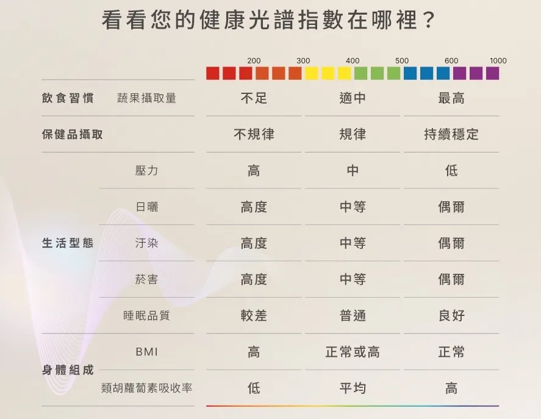

----
title: '【會員限定】Galaxy Watch VS Prysm iO：科學流派大解密＋15 秒實測完整教學'
description: '深入解析兩大科學流派的技術路線差異，以及 Prysm iO 的完整使用教學與健康計畫'
pubDate: 2026-02-24
heroImage: './GalaxyWatchVSPrysmiO大對比.png'
tags: ['抗氧化', '科技', 'Prysm-iO', '會員限定']
memberOnly: true
---

> 👋 歡迎會員！在開始之前，我想先問你一個問題：
>
> **如果你現在馬上去做 Prysm iO 掃描，你覺得你的分數會落在哪個區間？**
>
> 認真想三秒鐘。
>
> 你的直覺，往往比你想像的更準確——也更殘酷。
>
> 讀完這篇，你會知道那個數字對你真正意味著什麼，以及你可以怎麼做。

---

## Galaxy Watch 8 VS Prysm IO 都幾？

在科技穿戴裝置蓬勃發展的今天，三星（Samsung）在 2025 年推出的 **Galaxy Watch 8** 系列中加入了「抗氧化指數（Antioxidant Index）」功能，讓許多人感到驚艷。

這讓很多人好奇：既然手錶就能測，為什麼我還需要 Prysm iO？

---

## 不只是黑科技，更是二十年科學大師們的心血結晶

### 技術深度解析：抗氧化測量的兩大科學流派

很多人好奇，既然市面上如 **Samsung Galaxy Watch** 等智慧穿戴裝置也開始宣稱能偵測「抗氧化指數」，那麼 **Nu Skin Prysm iO** 的核心優勢究竟在哪裡？這要從兩位科學巨擘說起。

#### 二十年的科學盟友：Gellermann 與 Lademann

全球非侵入性類胡蘿蔔素偵測技術的兩大奠基者——美國猶他大學的 **Werner Gellermann 博士** 與德國柏林夏里特醫科大學的 **Jürgen Lademann 教授**，在學術上是超過二十年的長期盟友。

他們共同發表了數十篇論文，確立了「皮膚類胡蘿蔔素」作為人體抗氧化防禦儲存庫的科學地位。

#### 商業應用上的「兩條路線」

儘管兩位大師共享科學基礎，在將技術推向應用市場時，卻依據不同的應用場景，發展出兩條截然不同的技術路徑：

* **【Gellermann 路線：高精度的專業評估】** Gellermann 博士追求的是「醫療級別的準確度」。 Gellermann 博士的研究方向以「醫療級量測準確度」為核心目標。其所開發的**「壓力介導反射光譜法（Pressure-mediated Reflectance Spectroscopy）」**成為 Prysm iO 裝置的技術基礎。  
  * **核心方法：** 藉由施加物理壓力於測量窗口，暫時排空指尖微血管中的血液。  
  * **方法學優勢：** 血液中的血紅蛋白是干擾光譜訊號的主要因素之一。透過壓力排血，可獲得干擾極低的類胡蘿蔔素光譜數據，此亦為 Prysm iO 採用「指尖測量」而非「手腕測量」的方法學依據。  
* **【Lademann 路線：穿戴化的日常監測】** Lademann 教授的研究重點則在於技術的「微型化」與「穿戴整合」，其研究成果後來成為三星開發 BioActive 感應器的理論參考依據。  
  * **核心方法：** 採用**「空間解析（Spatially Resolved）光譜法」結合「多波長數學扣除演算法」**。  
  * **技術取捨：** 穿戴裝置受限於形式，無法施加足夠壓力進行排血，因此須仰賴數學演算法估算並扣除血液與黑色素的干擾訊號。此方式雖提升了使用便利性，但在膚色差異、肢體移動等環境變因下，量測誤差的容許範圍相對較寬。。

#### 為什麼 Prysm iO 更能反映真實數值？

Prysm iO 選擇了 Gellermann 博士的「物理排空路徑」，這意味著它在光學物理層面上就先解決了最大的雜訊來源。再加上 Nu Skin 累積二十年的拉曼光譜資料庫，透過 AI（Spectral Rai）進行校準，讓 Prysm iO 雖然體積輕巧，卻能提供媲美實驗室等級的穩定數據。

**對你來說，這的意思很簡單：Galaxy Watch 給你的是一個「參考方向」，而 Prysm iO 給你的是一個「可以信任的數字」。** 前者適合每天看趨勢，後者適合每月做決策——例如你現在的補充方案到底有沒有效，不用猜，讓數字告訴你。

---

## 技術演化史：從「研究方法學」到「大眾健康工具」的 25 年普及歷程

Nu Skin 在抗氧化監測領域的領先地位，源於 Werner Gellermann 博士長達 25 年的科學堅持。

Gellermann 博士將原本用於天文物理與高階光學實驗室的 **「共振拉曼光譜 (Resonance Raman Spectroscopy，RRS)」** 技術，成功轉化為可商業化應用的偵測儀器。

### **傳奇的起點：RRS 雷射技術與「分子指紋」 (2001 – 2010)**

早期的生物光子掃描儀（Pharmanex BioPhotonic Scanner S1、S2）採用的是**共振拉曼光譜 (Resonance Raman Spectroscopy，RRS)**。

* **技術原理：**  
  * **分子指紋：** 利用特定波長（如 488 nm）的精密**氬離子雷射**照射皮膚。當雷射光與類胡蘿蔔素分子碰撞時，分子的碳鏈（C=C 或 C-C 鍵）會產生振動，使散射光的波長發生偏移（拉曼位移）。  
  * **共振增強：** 由於雷射頻率與分子的電子吸收光譜重疊，其拉曼訊號會被放大 1,000 \~ 100,000 倍，使其能在複雜的組織中被捕捉。

* **局限：** 氬離子雷射器體積龐大、造價高昂且需頻繁維護，這限制了它只能留在專業研究中心。

**（題外話：想當年我們提著 S1、S2 一盒箱子外加一台筆電才能幫別人檢測，過程中機器不能曬到太陽會過熱，開機要等 15 \~ 30 分鐘之後才能開始檢測，中間還要想辦法聊天聊到可以開始，等待過程中最怕踢到電源線，一切重來！）**

那個年代，想知道自己的抗氧化數值，是一件需要「特地安排」的事。而現在你只需要 15 秒。**這 25 年的技術進化，最終都是為了讓你能夠隨時知道自己身體的真實狀態。**

### **關鍵的革命：從雷射到 LED 的 S3 技術優化 (2012 – 2024)**

為了讓檢測走入大眾，Gellermann 博士實現了從「雷射」到「LED」的驚人跨越。

這標誌著 **S3 生物光子掃描儀**（ Pharmanex BioPhotonic Scanner S3 ） 的誕生，也是技術走向商用的重要轉捩點。

* **技術原理 (RS 技術)：**  
  * **吸收特徵：** 類胡蘿蔔素在 450 nm \~ 500 nm（藍光波段）具有強烈吸收特性。RS 技術改用**白光 LED** 當燈源，使用**濾光式 LED** 照射皮膚並測量反射光。反射光越少，代表被吸收掉的胡蘿蔔素越多。

* **壓力介導 (Pressure-mediated)：** 這是 S3 最關鍵的硬體優化。血液中的血紅素會干擾吸收數值，S3 透過專利彈簧結構對指尖施加壓力，暫時將血液擠開，確保感測器能讀取到乾淨的組織數據。

* **演算法進化：** 根據 Gellermann 博士的訪談，S3 的演算法經過 33,000 人以上的大數據校準，實現了「膚色獨立性」。這意味著不論黑色素多寡，系統都能透過反射斜率自動補償，給出一致的精準讀數。

### 現代的巔峰：Prysm iO 與高光譜 AI 時代 (2025 – 2026)

當前的 Prysm iO 代表了技術的第三次大躍進。

它不僅繼承了 RS 的便利，更引入了超越傳統的 **高光譜成像 (Hyperspectral Imaging，HSI)** 與 AI 運算。

* **15 秒高畫質掃描：** 透過專利 **Spectral Rai** 技術，在 15 秒內進行 **234,000 次**數據擷取，這就像是從「單點測量」變成了「全景高清掃描」。  
* **大數據賦能：** 結合了 20 年來累積的 **2,100 萬筆全球測量數據**，利用機器學習進行即時「光譜去卷積」，能精確扣除每一滴剩餘血紅素與黑色素的噪音。

| 特性 (Feature) | RRS (S1/S2 代) | RS / HSI (S3 & Prysm iO) |
| :---- | :---- | :---- |
| **核心光源** | **高精密雷射 (Laser)** | **寬頻/多波長 LED** |
| **物理原理** | 分子振動能階躍遷 (Scattering) | **漫反射與光吸收 (Absorption)** |
| **訊號特徵** | 拉曼指紋峰(1525 cm\-1 與 1160 cm\-1） | 藍光波段 **(**450 nm \~ 500 nm**)**吸收凹陷 |
| **硬體手段** | 高靈敏光譜儀、光柵過濾 | **壓力介導 (Pressure-mediated)** |
| **主要干擾** | 皮膚自發螢光 (Fluorescence) | **血紅素** (血液) 與 **黑色素** (膚色) |
| **演算法核心** | **螢光背景扣除** (多項式擬合) | **光譜去卷積**、AI 黑色素補償 |
| **測量時間** | 較長 (\> 60 秒) | **極速 (15-30 秒)** |
| **設備優勢** | 絕對分子特異性 | **輕量化、耐用、不分膚色皆準** |

  <iframe 
    style="position: absolute; top: 0; left: 0; width: 100%; height: 100%; border-radius: 8px;"
    src="https://www.youtube.com/embed/f0ojI2pCP1Y" 
    title="The Evolution of Prysm iO" 
    frameborder="0" 
    allow="accelerometer; autoplay; clipboard-write; encrypted-media; gyroscope; picture-in-picture" 
    allowfullscreen>
  </iframe>

---

## 當智慧科技遇上精準營養——Prysm iO 與智慧手錶的完美合奏

### 共同的科學語言：經過 RRS 驗證的臨床標準

雖然 Prysm iO 與 Galaxy Watch 的外型不同，但它們共享了嚴謹的科學基礎：

* **同樣經過 RRS 黃金標準驗證：** 值得推崇的是，三星的抗氧化檢測並非虛構數據，它同樣經過了嚴格的臨床實驗。根據相關研究（如 2023 年發表於 *Sensors* 的隨機對照試驗），這類光學檢測技術皆以 **共振拉曼光譜 (RRS)** 作為基準進行比對，且結果顯示兩者之間具有**顯著的正相關**，透過飲食的補充來看胡蘿蔔素濃度變化也可以看見這兩者技術的圖形也是**高度正相關**。

* **相同的生物標記：** 兩者都認同「皮膚類胡蘿蔔素」是衡量體內氧化壓力與飲食攝取最精準、非侵入性的生物標記。  
* **非侵入性測量：** 兩者都告別了傳統扎針抽血的痛苦。

### 技術核心的跨代差異：多光譜 vs. 高光譜

* **Galaxy Watch 的「多光譜 (Multispectral)」技術：** 這就像是使用 3 \~ 5 個特定顏色的濾鏡來拍照，捕捉的是光譜中幾個離散的「點」。  
  * **優點：** 掃描極快（約 5 秒），適合觀察整體的動態趨勢。  
  * **限制：** 在面對不同膚色或血流變化時，較難進行深度的訊號分離。  
* **Prysm iO 的「高光譜 (Hyperspectral)」技術：** 像一台超高畫質的光譜攝影機，將光譜切分成數百個連續的微小波段。  
  * **數據量：** 15 秒內擷取超過 **234,000 個數據點**，數據密度是手錶的數千倍。  
  * **科研級精準：** AI 演算法能精確識別出哪一部分光是被黑色素吸收、哪一部分是被血紅素吸收，最後萃取出純淨的「類胡蘿蔔素」數值。

### 互補之道：如何結合兩者打造最強防線？

* **智慧手錶是你的「日常哨兵」：** 它 24 小時貼合你的脈搏，當你這幾天因為趕報告而熬夜、或是為了應酬而少吃蔬果時，手錶上的抗氧化指數可能會出現微幅波動，這是在提醒你：「嘿！該補充一點彩色食物了。」  
* **Prysm iO 是你的「健康驗證官」：** 當你開始執行一套新的營養計畫或服用補充品時，你需要的是每月或每季的「深度檢測」。Prysm iO 透過與 **Nu Skin Prysm iO™ App** 的深度連結，能提供橫跨 20 年的 2,100 萬筆大數據對標，告訴你這段時間的營養投資是否真的反映在細胞防禦力的提升上。

| 比較項目 | 智慧手錶 (Galaxy Watch 系列) | Nu Skin Prysm iO |
| :---- | :---- | :---- |
| **科學技術來源** | **(Lademann/SNU 路線)** | **(Gellermann 路線)** |
| **角色定位** | 日常趨勢觀察、生活習慣提醒 | **專業營養追蹤、成效驗證** |
| **感應器類型** | 微型化生物感應器 (BioActive Sensor) | **高解析度光譜儀 (Spectrometer)** |
| **數據細膩度** | 簡便型感測器、參考級指標 | **23.4 萬次數據擷取、臨床級對標** |
| **核心技術** | **空間解析 + 多波長演算法** | **連續波段高光譜成像 (HSI) + AI 運算** |
| **處理血液干擾** | **數學抵扣**：透過多波長演算法估算並扣除 | **物理排空**：透過強壓窗口擠出血液 + AI 運算 |
| **校準標準** | 以 **血液 HPLC** 與 **Raman** 綜合驗證 | **以 Raman (RRS) 數據作為訓練金標** |
| **APP 連結** | 綜合健康數據 (心率、睡眠) | **Vera App 精準營養干預建議** |

> **所以你現在該怎麼選？**
> 如果你只想「知道大概趨勢」，手錶夠用。但如果你正在考慮認真投資一套補充方案、想確認它真的有效——你需要的是一個會說實話的數字，不是一個方向感。Prysm iO 就是那個說實話的工具。

---

## 看見健康，從指尖開始——Prysm iO 實測教學與健康計畫

了解了這麼多尖端的光學技術與科學數據後，最重要的一步就是：**親身體驗你的抗氧化分數。**

Nu Skin Prysm iO 的設計初衷就是「去繁為簡」，讓專業的科研數據能在 15 秒內，透過手機 App 直觀地呈現。

### 測量前的準備：給數據一個精準的開場

* **清潔雙手：** 測量前請洗手，並確保指尖沒有汙垢、油脂或防曬油，這些物質可能會干擾光學反射。  
* **穩定環境：** 雖然 Prysm iO 非常輕便，但建議在室內且環境光穩定的地方測量。

### 簡單四步驟，15 秒掌握健康數據

**第一步：開啟並連結 Prysm iO™ App** 打開手機上的 **Nu Skin Prysm iO™** 應用程式，並開啟手機藍牙。按下 Prysm iO 的電源鍵，App 會自動偵測並引導您完成配對。這是一個智慧連動的過程，您的測量紀錄將會永久保存於雲端，方便追蹤長期趨勢。

**第二步：指尖定位與壓力感應** 將大拇指（或指定的測量手指）平穩地放置在 Prysm iO 的掃描窗上。此時，Prysm iO 的**壓力介導技術**會開始運作。請按照 App 上的指示，給予適當的按壓力道。

* *科學提醒：* 當指示燈顯示力道正確時，代表血液中的血紅素已被暫時推開，這是獲得臨床級數據的關鍵。

**第三步：高光譜掃描 (15 秒)** 保持手指不動。此時，內部的 **Spectral Rai** 技術會射出連續光譜，並在 15 秒內完成 234,000 次的數據擷取。

**第四步：獲取分數與建議** 掃描完成後，手機畫面會立即跳出你的「Prysm 分數」。分數會對應紅、橙、黃、綠、藍、紫等六個區間。

* **分數解讀：** 綠色與藍色區間代表你的抗氧化防禦力正處於優質狀態；若落在紅色或橙色，則是身體在發出信號，提醒你該加強蔬果攝取或檢視生活作息。

---

### 你的分數，代表什麼正在發生？

很多人拿到分數後的第一個反應是：「嗯，好像有點低……」然後就放下手機繼續過生活。

這是最可惜的一件事。因為這個數字背後，是你身體正在發生的具體過程。

| Prysm 分數區間 | 防禦狀態 | 你的細胞正在經歷什麼 |
| :---- | :---- | :---- |
| 🔴 **紅色（最低）** | 嚴重不足 | 抗氧化防線幾近瓦解。自由基幾乎無阻礙攻擊膠原蛋白與細胞 DNA，是加速老化最直接的狀態。 |
| 🟠 **橙色（偏低）** | 入不敷出 | 每天消耗大於補充。熬夜、空汙、壓力正在快速榨乾你的防禦存量，卻沒有足夠的補充速度跟上。 |
| 🟡 **黃色（中等）** | 勉強維持 | 防線薄弱但尚未崩潰。這是大多數現代高壓工作者的真實狀態——感覺還好，但數據說你在走下坡。 |
| 🟢 **綠色（良好）** | 防線穩固 | 抗氧化儲備充足。但注意：停止補充後 2–4 週，數值即會明顯下滑，維持比達到更難。 |
| 🔵 **藍/紫色（優秀）** | 高水位防禦 | 細胞層次的老化速度顯著減緩。這是我們用 Prysm iO 追蹤、用產品搭配努力維持的目標區間。 |

> 回想一下你剛才猜的那個區間。
> 你覺得，你現在真的在那裡嗎？

---

### 光靠飲食，速度跟不上消耗

你可能會說：「那我多吃蔬果就好了。」

這是對的方向，但有一個現實問題：**要靠天然飲食把分數從橙色拉到綠色，通常需要 4 到 8 週的持續積累，且每天必須攝取的蔬果量遠超過一般人的實際能力。**

台灣衛福部建議每日攝取 3 份蔬菜 + 2 份水果，但根據國民營養調查，真正達標的成年人不到三成。

這就是為什麼精準補充存在的意義——不是取代飲食，而是在你無法每天做到理想飲食的現實條件下，守住你的防線。

**ageLOC Youthspan** 的設計邏輯正是從這裡出發。

它不是傳統的綜合維他命。它針對的是**細胞層次的基因表現調控**——具體來說，是隨著年齡衰退的 Sirtuin 蛋白酶活性路徑，以及影響細胞能量代謝的 NAD⁺ 前驅物補充。當這些細胞層次的機制被支撐起來，你的抗氧化儲備才能真正有效率地被建立與維持。

Prysm iO 的 **Vera™ App** 在分析你的分數後，會根據你的區間與個人數據，直接推薦對應的補充方案——這不是巧合，而是整個系統本來就被設計成一個閉環：**用數據發現問題，用產品解決問題，再用數據驗證成效。**

---

## 你的分數，值得一個專屬策略

每個人的 Prysm 分數背後，代表的是不同的生活模式、壓力來源、與身體優先順序。

我在健康領域工作超過 15 年，見過太多人拿著一模一樣的分數，卻需要完全不同的解法——因為一個人的低分來自長期睡眠不足，另一個人來自飲食結構問題，還有人是基礎代謝本來就消耗特別快。

這也是為什麼我不相信「一瓶通用」的解法，也不相信看完文章就自己買來吃。

**菁英方案的核心，是你的數據 + 你的生活 + 你的目標，三者加在一起的專屬策略。**

如果你想知道：

- 「我的分數區間，代表我最優先需要補什麼？」
- 「ageLOC Youthspan 搭配我的作息，怎麼安排才最有效率？」
- 「60 天追蹤計畫具體怎麼走，我如何在兩個月後看到真實的數字變化？」

加我 LINE，我們用 15 分鐘把你的狀況說清楚。

不是每個人都需要一樣的方案。但每個人都值得知道自己真正需要什麼。

> 📌 **目前每週諮詢名額有限，優先開放給本篇會員讀者。**

👇 **加 LINE 預約你的專屬健康諮詢**

[立即加入 LINE 諮詢](https://lin.ee/jgugMvX)

---

## 參考資料
  
01. T R Hata et al., 2000. [Non-invasive raman spectroscopic detection of carotenoids in human skin.](https://pubmed.ncbi.nlm.nih.gov/10951281/) *J Invest Dermatol.* 115(3):441-8.  
02. Igor V Ermakov et al., 2004. [Noninvasive selective detection of lycopene and beta-carotene in human skin using Raman spectroscopy.](https://pubmed.ncbi.nlm.nih.gov/15065899/) *J Biomed Opt.* 9(2):332-8.  
03. Igor V Ermakov et al., 2005. [Resonance Raman detection of carotenoid antioxidants in living human tissue.](https://pubmed.ncbi.nlm.nih.gov/16409093/) *J Biomed Opt.* 10(6):064028.  
04. Scott D Bergeson et al., 2008. [Resonance Raman measurements of carotenoids using light-emitting diodes.](https://pubmed.ncbi.nlm.nih.gov/19021353/) *J Biomed Opt.* 13(4):044026.  
05. Maxim E Darvin et al., 2009. [In vivo distribution of carotenoids in different anatomical locations of human skin.](https://pubmed.ncbi.nlm.nih.gov/19650865/) *Exp Dermatol.* 18(12):1060-3.  
06. Igor V Ermakov, Werner Gellermann, 2010. [Validation model for Raman based skin carotenoid detection.](https://pubmed.ncbi.nlm.nih.gov/20678465/) *Arch Biochem Biophys.* 504(1):40-9.  
07. Susan T Mayne et al., 2010. [Noninvasive assessment of dermal carotenoids as a biomarker of fruit and vegetable intake.](https://pubmed.ncbi.nlm.nih.gov/20685953/) *Am J Clin Nutr.* 92(4):794-800.  
08. Igor V Ermakov, Werner Gellermann, 2012. [Dermal carotenoid measurements via pressure mediated reflection spectroscopy.](https://pubmed.ncbi.nlm.nih.gov/22331637/) *J Biophotonics.* 5(7):559-70.  
09. Susan T Mayne et al., 2013. [Resonance Raman spectroscopic evaluation of skin carotenoids as a biomarker of carotenoid status for human studies.](https://pubmed.ncbi.nlm.nih.gov/23823930/) *Arch Biochem Biophys.* 539(2):163-70.  
10. Jeong-Eun Hwang et al., 2023. [Evaluation of a Commercial Device Based on Reflection Spectroscopy as an Alternative to Resonance Raman Spectroscopy in Measuring Skin Carotenoid Levels.](https://pubmed.ncbi.nlm.nih.gov/37688110/) *Sensors (Basel).* 23(17):7654.  
11. Matthew P Madore et al., 2023. [A Narrative Review of Factors Associated with Skin Carotenoid Levels.](https://pubmed.ncbi.nlm.nih.gov/37432294/) *Nutrients.* 15(9):2156.  
12. Seoeun Ahn et al., 2024. [Examination of the utility of skin carotenoid status in estimating dietary intakes of carotenoids and fruits and vegetables.](https://pubmed.ncbi.nlm.nih.gov/38154397/) *Nutrition.* 119:112304.  
13. Akira Obana et al., 2024. [Association between atherosclerotic cardiovascular disease score and skin carotenoid levels.](https://pubmed.ncbi.nlm.nih.gov/38806551/) *Sci Rep.* 14(1):12173.  
14. Helen Knaggs, Edwin Lephart, 2025. [Global Lifetime Non-invasive Spectroscopy-based RRS Quantification of Skin Carotenoids Provides Evidence for Enhancing the Human Healthspan.](https://sciety.org/articles/activity/10.20944/preprints202507.0634.v1) *Adv Prev Med Health Care.* 8(2) 1-35.  
15. Melanie Riggs et al., 2025. [Validation of a New Non-invasive Personalized RS-Skin Carotenoid Scanner (Prysm iO) versus the BioPhotonic Scanner S3 RRS Device for Estimating Carotenoid Levels in Humans.](https://www.gavinpublishers.com/assets/articles_pdf/Validation-of-a-New-Non-invasive-Personalized-RS-Skin-Carotenoid-Scanner-Prysm-iO-versus-the-BioPhotonic-Scanner-S3-RRS-Device-for-Estimating-Carotenoid-Levels-in-Humans.pdf) *Food Nutr J.* 11: (1)1-5.  