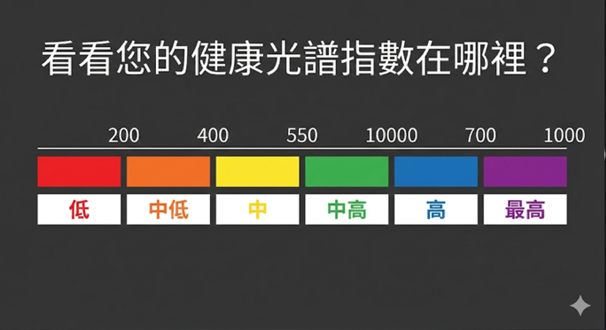

> 這篇是 [《你的抗老保養是在「投資」還是「投機」？Prysm-iO只要15秒揭開身體的抗氧化真相》](/blog/antiaging-health/你的抗老保養是在「投資」還是「投機」？Prysm-iO只要15秒揭開身體的抗氧化真相) 的延伸深度閱讀，如果你想先了解「為什麼要測類胡蘿蔔素」的快速版本，建議先讀。

---

你有沒有想過，在 Prysm iO 出現之前，科學界是怎麼知道一個人的抗氧化狀態的？

答案比你想像的更麻煩——麻煩到讓數十年的研究者都在想：**有沒有更好的辦法？**

這篇文章完整還原這段歷史。不只是技術演化，更是「一個科學問題如何一步一步被解開」的真實過程。

---

## 第一階段：黃金標準，但代價高昂（1980s–1990s）

幾十年來，想要知道身體的抗氧化能力——特別是類胡蘿蔔素的儲存量——科學界只有一條路：

**抽血，然後送進實驗室做 HPLC（高效液相層析法）分析。**

HPLC 是一種精密的化學分離技術，流程是這樣的：

血液被抽出 → 抗凝處理 → 低溫保存 → 離心分離血清 → 以有機溶劑萃取 → 進入層析管柱 → 等待數天後得到報告

整個流程耗時數天，對設備和操作人員的要求極高，費用昂貴，且每個步驟都有出錯的可能。

但更根本的問題是：**血液中的類胡蘿蔔素半衰期極短。**

研究顯示，你昨天吃了一大盤紅蘿蔔，今天血液數值就會明顯升高；但如果你連續三天沒吃蔬果，數值又會迅速下滑。血液記錄的只是「最近 24 小時的飲食快照」，而非你長期健康狀態的真實反映。

想想你這個月的生活：熬夜、外食、趕不完的會議。你有多久沒有真正吃到足夠的蔬果了？血液數值說不定還看起來「還好」——但那只是因為你昨天剛好吃了一頓沙拉。

> **「血液告訴你的，是你昨天吃了什麼；而科學家真正想知道的，是你過去幾週的生活習慣。」**

這讓流行病學家和臨床研究者非常頭痛：大規模人群研究中，很難每次都在相同飲食條件下採血，數據波動大到幾乎無法比較。

---

## 第二階段：皮膚活組織切片——更穩定，但更痛苦（1990s）

為了克服血液數值波動的問題，部分研究者轉向了**皮膚活組織切片（Skin Biopsy）**。

科學家的關鍵發現是：類胡蘿蔔素在代謝後，並不只停留在血液中——它們會透過汗腺與皮脂腺的輸送機制，持續**累積沉積在皮膚的角質層**。

這個累積過程需要數週，因此皮膚中的濃度反映的是「過去 2 到 4 週的長期攝取狀態」，遠比血液穩定。

這是個重大發現。問題是：**要得到這個數據，就必須用手術刀切下一小片皮膚，再做複雜的有機溶劑萃取與 HPLC 分析。**

對受試者來說，這需要局部麻醉、留疤、以及對「為了測個抗氧化數值要切皮膚」的心理準備。

在 2000 年以前，**你根本沒有辦法在不痛苦的情況下知道自己的抗氧化儲備到底夠不夠。** 你只能猜。

---

## 第三階段：歷史性突破——第一道「非侵入性」的光（2000 年）

### 意外的起點：本來只是想救視力

這個故事的開始，跟營養檢測一點關係都沒有。

1990 年代末，美國猶他大學有兩個人在解決一個眼科問題：

**物理學家** Werner Gellermann 博士（專精雷射與光學）
**眼科醫師** Paul S. Bernstein 醫師（視網膜專家）

Bernstein 醫師的畢生研究目標，是對抗一種叫做**老年性黃斑部病變（AMD）**的眼疾。

這種疾病會讓你視野的正中央逐漸變成一團黑影——想像你看書時，每個字的中心都是黑的。

對五十歲以上的人來說，這是一種極度恐怖的視力剝奪。

你的黃斑部（視網膜正中央那塊極小的區域）會主動從血液中抓取兩種特殊的類胡蘿蔔素：**葉黃素（Lutein）與玉米黃素（Zeaxanthin）**。

這兩種黃色色素就像體內太陽眼鏡，會吸收高能量的藍光，保護視網膜細胞不被氧化破壞。

**Bernstein 醫師知道，葉黃素和玉米黃素含量高的人，得 AMD 的機率會大幅降低。**

問題是：怎麼測量？

在 2000 年左右，唯一的方法是等患者死後解剖眼球。

或者只能靠主觀的視力測試——但那時視力已經開始退化了，根本來不及預防。

### 物理學家的解法：共振拉曼光譜

這時候 Gellermann 博士想到了一個點子。

類胡蘿蔔素的化學結構很特別——它是由一長串單雙鍵交替的碳原子組成。如果你把藍光雷射的波長調到剛好 **488 奈米**（這正是類胡蘿蔔素最容易吸收的頻率），就會產生一種叫做「共振」的放大效應。

就像唱歌時找對了玻璃杯的共振頻率，可以把杯子震破。

Gellermann 發現，**共振可以把原本微弱到幾乎察覺不到的拉曼散射訊號，瞬間放大數千倍。**

當 488 奈米的藍光雷射照射到眼底的類胡蘿蔔素時，分子會劇烈震動，並在光譜上發出一個位於 1525 cm⁻¹ 的清晰訊號。

這項技術被命名為 **「共振拉曼光譜法（Resonance Raman Spectroscopy, RRS）」**。

**2002 年**，他們在權威醫學期刊《眼科學》（*Ophthalmology*）發表了突破性研究：第一次成功用雷射光測量活體人類眼睛中的葉黃素濃度。

數據證實，AMD 患者眼中的抗氧化色素水平明顯低於健康人。

這在科學上是巨大的勝利。

### 但有個大問題：眼科測量太痛苦了

要測量眼底，你必須：
- 保持頭部絕對靜止
- 把視線死死盯住一個微小光點
- 如果你有白內障（老年人常見），混濁的水晶體會阻擋雷射光，數據就不準了
- 測量後眼睛會有刺眼殘影，就像被閃光燈閃過
- 有些人甚至需要先點散瞳劑

對視力本來就不好的老年人來說，這整個過程簡直是折磨。

**技術團隊必須找到另一條路。**

### 靈光乍現：類胡蘿蔔素不是只在眼睛裡

猶他大學的研究團隊重新思考了一個基本問題：

**當你吃下一盤菠菜沙拉時，類胡蘿蔔素會去哪裡？**

答案很簡單：它們不會「只」跑到眼睛。

類胡蘿蔔素是脂溶性的（溶於脂肪）。它們會隨著血液被輸送到全身各處，並大量囤積在各個組織中。其中最大的儲存庫，就是**人體最大的器官——皮膚**。

這個簡單的生理學事實，帶來了宛如靈光乍現般的突破：

> **既然拉曼光譜可以測量視網膜裡的類胡蘿蔔素，那它當然也能測量皮膚裡的類胡蘿蔔素！**

而且把測量目標從眼球轉移到皮膚，好處太多了：
- 不需要患者集中視線
- 不會受白內障干擾
- 不需要點散瞳劑
- 皮膚對雷射光的安全承受度遠高於視網膜

**這意味著技術可以從嚴肅的醫院眼科診間，走進每個人的生活。**

### 2000 年：嚴謹的科學驗證

為了驗證這個大膽想法，Gellermann 博士找上了猶他大學皮膚科的 **T.R. Hata 醫師**。

他們設計了一個極度嚴謹的實驗：

**第一步**：取得腹部整形手術切除下來的真實人類皮膚組織
**第二步**：用雷射光學掃描這些皮膚，記錄拉曼光譜數據
**第三步**：把同一塊皮膚搗碎，用昂貴的 HPLC 化學分析測量真實濃度
**第四步**：比對兩者數據

結果發表在 **2000 年**的《皮膚病學研究雜誌》（*Journal of Investigative Dermatology*）：

**非侵入性的光學掃描數據，與破壞組織的化學分析數據，完美吻合。**

這證明了光學掃描是絕對準確的。

接著，研究團隊開始掃描活體人類的五個不同身體部位。

他們發現類胡蘿蔔素濃度會因部位不同而有顯著差異。

**濃度最高、最適合測量的部位，是「手掌心」。**

為什麼？
- 手掌的角質層特別厚，這正是脂溶性類胡蘿蔔素最愛囤積的地方
- 相較於其他部位，手掌較不受黑色素深淺影響，光學讀數更純粹

這也是為什麼後來所有掃描儀都採用「手掌測量」的科學基礎。

### 拉曼光譜不是新技術——它已經在很多領域證明自己了

在講後續發展之前，我想先讓你知道一件事：

**拉曼光譜不是為了賣掃描儀才發明的技術。它在 1920 年代就存在了，而且早就在各種需要極高精準度的領域中成為黃金標準。**

舉幾個例子：

**🎨 藝術品鑑定**
專家用「空間偏移拉曼光譜（SORS）」來鑑定文藝復興時期的名畫。他們把雷射光照在畫作上，透過分析散射光，可以看穿表面的保護漆，精準辨識出幾百年前畫家用的顏料成分——完全不需要刮取任何一丁點珍貴的畫布。

**🍯 食品安全檢測**
面對市場上充斥的假蜂蜜（用廉價玉米糖漿混充），或者在法國被查獲的假年份葡萄酒，檢驗人員可以用光束穿透密封的玻璃瓶，瞬間識別出裡面有沒有不純的添加物。造假者無所遁形。

**🚀 太空探索**
NASA 的火星探測車「毅力號（Perseverance）」上，就搭載了一台叫 SHERLOC 的拉曼雷射儀器。它會掃描火星的岩石與土壤，尋找可能暗示遠古火星曾有微生物生命的碳基有機分子指紋。

> **如果拉曼光譜技術強大到足以在另一個星球上尋找生命跡象，細緻到足以鑑定脆弱的藝術名畫，那麼用來測量人體皮膚中的抗氧化劑，絕對不是問題。**

### 學術界的連鎖反應

2000 年的這篇論文，引發了學術圈的連鎖反應：

**2001 年**，Igor Ermakov 博士在《光學快報》（*Optics Letters*）確認：共振拉曼光譜能在「活體人體組織」中偵測到類胡蘿蔔素。這正式確立了技術在活體應用的可行性。

**2004 年**，同一團隊利用多波長雷射激發，實現了對**茄紅素（Lycopene）與 beta-胡蘿蔔素的選擇性分別識別**，讓量化更加精準。

**2005 年**，Ermakov 與 Gellermann 在《生物醫學光學雜誌》（*Journal of Biomedical Optics*）進一步確立了完整的方法學。

你伸出手指等 15 秒得到的那個數字，背後是二十年、數百篇論文、數萬人的臨床數據在支撐它。

它告訴你的，是你過去幾週真實的生活狀態——不是猜測，是證據。

---

## 第四階段：從「研究室設備」到「人群研究工具」的大考驗（2010 年）

技術上可行了。但能不能應用於大規模人群？

這個問題在 **2010 年** 迎來了最重要的答案。

### 耶魯大學的終極驗證

耶魯大學醫學院的 **Susan T. Mayne 教授**團隊，設計了一項涵蓋 **372 名健康成年人**、橫跨 8 天的嚴格臨床研究。

研究設計非常縝密：每位受試者在同一天同時接受三種測量——
- 拉曼光譜皮膚掃描
- 血液 HPLC 分析
- 皮膚活組織切片 HPLC 分析

三種方法，針對同一個人，同一天測量。

結論發表在《美國臨床營養學雜誌》（*Am J Clin Nutr*），震撼了整個領域：

> **皮膚拉曼光譜所測量的類胡蘿蔔素，其穩定性（組內相關係數 ICC）遠高於血液 HPLC。**

白話來說：「皮膚數值」比「血液數值」更能真實、穩定地代表一個人的長期抗氧化儲備狀態。

同年，Ermakov 與 Gellermann 在《生物化學與生物物理檔案》（*Arch Biochem Biophys*）建立了完整的**拉曼皮膚類胡蘿蔔素偵測驗證模型**。

**2013 年**，Mayne 教授團隊再次發表綜述論文，正式確立：共振拉曼光譜評估皮膚類胡蘿蔔素，是人體研究的可靠生物標記。

學術界的背書完成了。接下來是商業化。

### 技術走出實驗室：Pharmanex 生物光子掃描儀的誕生

當科學家確認這項技術能夠瞬間、無痛、客觀地評估營養狀態時，商業潛力就呼之欲出了。

Gellermann 博士創立了兩家公司（Nutriscan, Inc. 與 Caroderm, Inc.）來推廣這項技術。

這些專利很快就吸引了全球知名保健品牌如新（Nu Skin）旗下的 Pharmanex 部門。

**2002 年與 2004 年**，Nu Skin 逐步收購了這些專利技術，正式開啟了個人化營養檢測的商業時代。

在 Nu Skin 的投資下，原本在大學實驗室裡需要佔據一整張光學桌的龐大雷射儀器，開始經歷工程微縮，最終誕生了**「Pharmanex 生物光子掃描儀（BioPhotonic Scanner）」**。

### 從 S1 到 S3：技術的迭代進化

**S1 與 S2 世代**

早期的 S1 與 S2 雖然體積還是偏大，但它們成功地將以下元件整合進一個桌面機殼：
- 發射 488 奈米波長的固態藍光雷射
- 能偵測極微弱 1525 cm⁻¹ 拉曼位移的超高靈敏度光譜儀

測試過程很直觀：你把手掌輕輕放在掃描儀透鏡前，儀器向皮膚發射藍光，皮膚內的類胡蘿蔔素反射出特定頻率的綠光，感測器捕捉這道綠光的強度，經過運算後，給出一個簡單易懂的數值：**「皮膚類胡蘿蔔素指數（Skin Carotenoid Score, SCS）」**。

（題外話：想當年我們用 S1、S2 幫人檢測，得提著一盒箱子外加一台筆電，機器不能曬太陽會過熱，開機要等 15~30 分鐘，等待過程中還得想辦法聊天。最怕的是踢到電源線，一切重來！）

**S3 世代的顛峰**

技術的真正大爆發，是 **S3 掃描儀**的問世。

工程師們徹底重新設計了內部架構，創造出一款：
- 體積更小（重量不到前代三分之一）
- 可由電池供電的革命性設備
- 配備人體工學雕塑的金屬表面，自然引導使用者把手放在最佳位置
- 捨棄笨重的外接螢幕，改為無線連接 iPad Mini
- 掃描時間縮短至 30 秒

這款產品成功贏得了 **2014 年國際設計傑出獎（IDEA）銅獎**，被評為該年度消費者世界最佳產品。

### 社會影響：從「盲目信仰」到「即時回饋」

生物光子掃描儀的普及，徹底改變了人們消費營養品的方式。

過去幾十年，消費者每年花數百億美元買維他命和抗氧化保健品，但行為背後只基於「盲目信仰」。

你吞下藥丸，只能在心裡祈禱這些營養素真的有被吸收、真的有作用。

**掃描儀打破了這個黑盒子。**

它提供了「即時、客觀的生物回饋」：
- 如果你的飲食充滿加工食品，又經常熬夜抽菸，掃描出來的分數就會慘不忍睹
- 但如果你開始大量攝取色彩鮮豔的蔬果，並服用高品質營養品，幾個月後，你就能親眼看見自己的 SCS 分數顯著攀升

這項技術甚至成為了流行文化的一部分。

**在美國著名的日間醫療脫口秀中，知名心臟外科醫師 Dr. Mehmet Oz 在節目現場直接使用掃描儀檢測觀眾的抗氧化指數。** 

結果的差異之大，讓現場觀眾與電視機前的人都感到震驚，極大提升了大眾對抗氧化健康的認知。

### 但質疑也來了：這會不會只是商業噱頭？

樹大招風。當這項原本純粹的醫學技術被整合進直銷企業的商業模式，用來佐證營養品效用時，自然會引來質疑：

**「這台機器的數值，會不會只是為了推銷維他命而設計的商業噱頭？」**

為了平息疑慮，技術需要完全中立的第三方權威驗證。

最關鍵的背書來自**耶魯大學公共衛生學院**。這支由 Susan T. Mayne 博士、Brenda Cartmel 博士、Stephanie Scarmo 博士領導的團隊，在完全不受商業利益干涉的情況下，進行了嚴謹的臨床對比試驗。

他們對數百名受試者：
- 進行傳統靜脈抽血
- 用黃金標準 HPLC 測量血液中的類胡蘿蔔素濃度
- 同時用生物光子掃描儀測量手掌
- 交叉比對兩者數據

耶魯大學的研究報告發表後，學術界給出斬釘截鐵的結論：

> **共振拉曼光譜（RRS）從皮膚讀取的訊號，是一個極具科學效度、高度可靠的非侵入性生物指標。

> 它不僅能準確反映受試者近期的蔬果攝取量，更代表了人體長期的系統性抗氧化防禦狀態。**

至此，生物光子掃描儀被徹底證明：不是商業噱頭，而是貨真價實的生物光子學革命。

---

## 第五階段：最後一哩路——從實驗室走進你的掌心（2012 年起）

雖然 S3 掃描儀在高端保健市場取得了成功，但故事還沒結束。

有兩個問題需要解決：
1. **公衛研究者的困境**：拉曼雷射設備太貴，無法大規模應用於社區健康研究
2. **個人化需求**：怎麼讓技術真正走進每個人的口袋？

這催生了兩個關鍵突破。

### 突破一：從「雷射」到「LED」——反射式光譜法的誕生（2012）

全球的公衛研究者很焦急。

那些在底層社區對抗「食物沙漠（Food Deserts，難以取得新鮮蔬果的地區）」、研究肥胖問題的學者們，迫切需要一種能在廣大人群中客觀測量蔬果攝取的工具。

長期以來，營養學家只能讓民眾填寫「飲食問卷」——但這種問卷極度不準確。人們總是高估自己吃蔬菜的頻率，低估吃零食的次數。

但基於拉曼雷射的掃描儀製造成本高昂，操作需要維護精密光學元件，研究機構很難大量採購並派發到偏遠社區。

**Gellermann 博士再次出手。**

2004 年，他在猶他大學研究園區創立了 **Longevity Link Corporation**，目標是：**拋棄昂貴的雷射，開發出更小、更便宜、所有人都能負擔得起的平民版掃描儀。**

這一次，他們放下了拉曼散射的「萬中選一」精準度，轉向另一項技術：**反射式光譜法（Reflection Spectroscopy, RS）**。

**什麼是反射式光譜法？**

還記得為什麼葉子看起來是綠色的嗎？

因為當白色陽光照射到葉子上時，葉子裡的葉綠素像海綿一樣吸收了紅光和藍光，只把綠光「反射」回我們眼睛。

反射式光譜法的原理也是如此：
- 用包含所有顏色（400-750 奈米波長）的「寬頻白光」照射皮膚
- 皮膚中的類胡蘿蔔素會「優先吸收」特定波長的藍光與綠光
- 測量反射回來的光譜中「少了哪些顏色」
- 從吸收凹陷的深度與位置，推算類胡蘿蔔素濃度

雖然反射式光譜無法像拉曼光譜那樣提供獨一無二的分子指紋，但它的硬體製造成本極低、構造簡單、操作方便。

**Veggie Meter®（蔬菜儀）：「擠壓」的智慧**

Longevity Link 開發的產品叫 **Veggie Meter®**。

這台儀器不配備 488 奈米雷射，取而代之的是一顆簡單、便宜的「寬頻白光燈泡」。

但把 RS 技術應用在人體皮膚上，遇到了一個致命障礙：

**血液中的血紅素，剛好也會強烈吸收與類胡蘿蔔素相似的光學波長。**

如果直接把白光照在手指上，濃烈的紅色血液會完全淹沒掉微弱的黃色類胡蘿蔔素訊號，數據會一片混亂。

**Gellermann 博士的團隊發明了一個簡單卻極具巧思的解法：按壓式光譜法（Pressure-mediated Spectroscopy）。**

測量時，你不能只把手輕放在鏡頭前。你必須：
- 將食指伸入一個特製的彈簧夾具
- 用力按壓在凸起的玻璃透鏡上

這個按壓動作就像用刮水板刮除玻璃上的水滴，會瞬間將指尖微血管床裡的血液「擠壓」出去，使皮膚暫時呈現蒼白缺血狀態。

**在血液暫時被驅離的幾秒鐘內，白光終於可以不受干擾地與皮膚組織內的類胡蘿蔔素互動。**

接著，儀器內部的演算法會自動微調，扣除每個人皮膚天生黑色素深淺不同的誤差。

這項創新在 **2012 年**發表於《生物光子學雜誌》（*Journal of Biophotonics*）。經過 **33,000 人以上**的大數據校準，實現不論膚色深淺都能精準讀取。

**公衛數據揭開的社會真相**

RS 反射式技術雖然在個體精確度上（誤差率約 0.5%-14%）略遜於拉曼技術（誤差率約 5%），但因為夠便宜、夠堅固，Veggie Meter® 迅速成為全球營養流行病學家的標準配備。

在一項發表於《營養學》（*Nutrients*）的研究中，研究人員將 Veggie Meter 帶入低收入社區，針對近 300 名參與「婦女、嬰兒和兒童特別補充營養計畫（WIC）」的成人檢測。

光學數據揭示了令人深思的現象：

**發現一**：儀器分數與申報的蔬果攝取量高度相關——再次證實準確度
**發現二**：光學分數與 BMI 呈負相關——體重越重，抗氧化儲備越低
**發現三**：在美國出生的受試者，抗氧化分數明顯低於境外出生的拉美裔受試者

這些數據證明了一個殘酷事實：**當移民來到美國並開始適應高度加工食品、速食為主的西方化飲食後，體內的系統性抗氧化防禦力會迅速崩潰。**

Veggie Meter 不只是測量儀器，更成為評估國家公衛政策、追蹤改善食物環境是否真有成效的照妖鏡。

到了 2023 年，Longevity Link 甚至將這套平價 RS 技術授權給 MacuHealth 公司，以「LifeMeter」品牌重新打回眼科市場——技術發展完成了一個完美循環。

### 突破二：從「單點測量」到「高光譜 AI」——Prysm iO 的誕生（2025）

時間推進到 2020 年代中期。

全球健康產業已膨脹為產值九兆美元的超級巨獸。

對四十到五十歲的壯年消費者來說，他們對健康產品的要求已根本改變：

**他們不再滿足於「多吃青菜多運動」這種模糊建議。**

在這個滿街都是智慧手錶、能全天候監測心率與睡眠的「連網健康」時代，人們渴望更深度、更客製化、基於數據的身體內部資訊。

但工程師們面臨一個終極難題：

> **怎麼在使用便宜、無雷射危險的「反射式白光硬體（RS）」的同時，獲得媲美昂貴「拉曼雷射光譜（RRS）」的黃金標準精確度？**

為了解決這個看似不可能的矛盾，Nu Skin 在累積超過二十年研發實力後，於 2025 年發表了震撼業界的次世代智慧健康裝置：

**Prysm iO**

這款設備的誕生，象徵著硬體微縮技術與人工智慧（AI）的完美融合。

**Spectral Rai 技術：從單點觀測到高光譜掃描**

Prysm iO 徹底拋棄了雷射發射器。

取而代之的，是 Nu Skin 研發的「Spectral Rai」專利技術——一種將傳統反射式光譜法推向極限的「高光譜吸收（Hyperspectral Absorption）」測量法。

過去的掃描儀通常只擷取少數幾個數據點來計算平均值。

**但 Prysm iO 的運作方式像一把光學散彈槍。**

當你將食指輕觸在 Prysm iO 迷你掃描鏡頭上時，在短短 **15 秒**內：
- 設備以每秒超過 15,000 次的速度採樣
- 單次掃描捕捉高達 **234,000 個**獨立的高光譜光線吸收數據點

這種高密度採樣，能極度細緻地描繪出白光在穿透表皮、角質層並與血管交錯時，各種波長被吸收與反射的複雜圖形。

**AI 演算法：將雜訊化為真理的煉金術**

但收集到幾十萬個光學數據，只完成了挑戰的一半。

傳統 RS 技術之所以誤差較大，是因為很難用簡單數學公式過濾掉每個人不同的膚色（黑色素）與血管狀態（血紅素）帶來的雜訊。

要解開這個複雜糾纏，必須仰賴現代科技的終極武器：**機器學習與人工智慧。**

**Nu Skin 擁有一個全世界獨一無二的資產。**

在過去二十年間，他們在全球近 50 個國家部署了無數台基於高精準度拉曼雷射（RRS）的 BioPhotonic 掃描儀，透過這些儀器，累積了一個包含超過 1,000 萬人次、總數高達 **2,100 萬筆**的高純度拉曼抗氧化數據庫。

軟體工程師們將這個龐大的黃金標準數據庫，餵給了 Prysm iO 背後的 AI 演算法。

**人工智慧透過深度學習，學會了如何從 Spectral Rai 收集到的混亂、龐雜的高光譜反射數據中，精準剔除雜訊干擾，並將結果「校準」回拉曼技術應有的準確度水平。**

透過這層 AI 校準濾鏡，一台沒有配備昂貴雷射的輕巧裝置，居然能輸出與專業醫療實驗室同等級的精確數值——這個數值被命名為「Prysm 分數」。

**2025 年的終極臨床對決：AI 是真的還是吹牛？**

科學界對任何宣稱「靠軟體就能彌補硬體極限」的說法，向來嚴格懷疑。

為此，在 **2025 年**，一份決定性的臨床驗證報告發表在《食品與營養學期刊》（*Food & Nutrition Journal*）。

這項由 Melanie Riggs 博士、百翰楊大學的 Edwin Lephart 博士、Helen Knaggs 博士、Zoe D. Draelos 博士等重量級學者執行的研究，設計了一場終極對決：

**傳統衛冕者**（使用雷射的 S3 掃描儀）vs **搭載 AI 的挑戰者**（使用 Spectral Rai 的 Prysm iO）

研究團隊招募了 **97 名**健康成年人（28 名男性，69 名女性）。他們：
1. 從每位受試者手臂靜脈抽血
2. 用最頂級的 HPLC 與質譜儀測量血液中類胡蘿蔔素的真實濃度
3. 讓受試者分別用 S3 掃描手掌、用 Prysm iO 掃描手指
4. 比對三者數據

研究人員使用「決定係數（R²）」來判定勝負。R² 代表機器預測結果與抽血真實結果的吻合程度；R² = 1 代表預測完全無誤。

在充滿變數的人體試驗中，R² 達到 0.70 以上就已經是極度強大的相關性。

**結果揭曉：**

- **S3 掃描儀（雷射技術）**：R² = **0.7789**
- **Prysm iO（AI + RS）**：R² = **0.7659**

報告清楚指出：兩台機器的斜率、範圍、數據輪廓幾乎完全相同。

**Prysm iO 成功證明：透過大量高光譜數據捕捉結合 AI，一台小巧、個人化且無雷射危險的 RS 設備，完全可以達到等同於昂貴 RRS 設備的臨床級預測準確度。**

那個年代，想知道自己的抗氧化數值是一件需要「特地安排」的事。

現在你只需要 15 秒。

**這 25 年的技術進化，最終都是為了讓你能隨時知道自己身體的真實狀態。**

---

## 這段歷史對你意味著什麼？

看完這五個階段，有一件事變得很清楚：

**Prysm iO 不是一個新發明，它是二十五年科學積累的終點。**

每一個你看到的「15 秒」、「234,000 次擷取」、「2,100 萬筆數據」背後，都是真實的研究者用真實的受試者、一步一步驗證出來的。

這也是為什麼我對這個工具有信心——不是因為它看起來很科技，而是因為我親眼看過這段歷史。

從鑑定文藝復興名畫的顏料，到在火星上尋找生命跡象，再到 15 秒讀取你的抗氧化儲備——這都是同一個物理原理，同一群科學家，同一份對精準的堅持。

> 想知道你的抗氧化儲備現在在哪個水位？[回到主篇了解 Prysm iO →](/blog/antiaging-health/你的抗老保養是在「投資」還是「投機」？Prysm-iO只要15秒揭開身體的抗氧化真相)

---

## 參考資料

01. Parker RS, 1993. Analysis of carotenoids in human plasma and tissues. *Methods Enzymol.* 214:86–93.
02. T R Hata et al., 2000. [Non-invasive raman spectroscopic detection of carotenoids in human skin.](https://pubmed.ncbi.nlm.nih.gov/10951281/) *J Invest Dermatol.* 115(3):441-8.
03. Igor V Ermakov et al., 2001. Resonance Raman detection of carotenoid antioxidants in living human tissues. *Opt Lett.* 26:1179–1181.
04. Paul S Bernstein et al., 2002. [Resonance Raman measurement of macular carotenoids in normal subjects and in age-related macular degeneration patients.](https://pubmed.ncbi.nlm.nih.gov/12359594/) *Ophthalmology.* 109(10):1780-7.
05. Igor V Ermakov et al., 2004. [Noninvasive selective detection of lycopene and beta-carotene in human skin using Raman spectroscopy.](https://pubmed.ncbi.nlm.nih.gov/15065899/) *J Biomed Opt.* 9(2):332-8.
06. Igor V Ermakov et al., 2005. [Resonance Raman detection of carotenoid antioxidants in living human tissue.](https://pubmed.ncbi.nlm.nih.gov/16409093/) *J Biomed Opt.* 10(6):064028.
07. Susan T Mayne et al., 2010. [Noninvasive assessment of dermal carotenoids as a biomarker of fruit and vegetable intake.](https://pubmed.ncbi.nlm.nih.gov/20685953/) *Am J Clin Nutr.* 92(4):794-800.
08. Igor V Ermakov, Werner Gellermann, 2010. [Validation model for Raman based skin carotenoid detection.](https://pubmed.ncbi.nlm.nih.gov/20678465/) *Arch Biochem Biophys.* 504(1):40-9.
09. Igor V Ermakov, Werner Gellermann, 2012. [Dermal carotenoid measurements via pressure mediated reflection spectroscopy.](https://pubmed.ncbi.nlm.nih.gov/22331637/) *J Biophotonics.* 5(7):559-70.
10. Susan T Mayne et al., 2013. [Resonance Raman spectroscopic evaluation of skin carotenoids as a biomarker of carotenoid status for human studies.](https://pubmed.ncbi.nlm.nih.gov/23823930/) *Arch Biochem Biophys.* 539(2):163-70.
11. Melanie Riggs et al., 2025. [Validation of a New Non-invasive Personalized RS-Skin Carotenoid Scanner (Prysm iO).](https://www.gavinpublishers.com/assets/articles_pdf/Validation-of-a-New-Non-invasive-Personalized-RS-Skin-Carotenoid-Scanner-Prysm-iO-versus-the-BioPhotonic-Scanner-S3-RRS-Device-for-Estimating-Carotenoid-Levels-in-Humans.pdf) *Food Nutr J.* 11:(1)1-5.