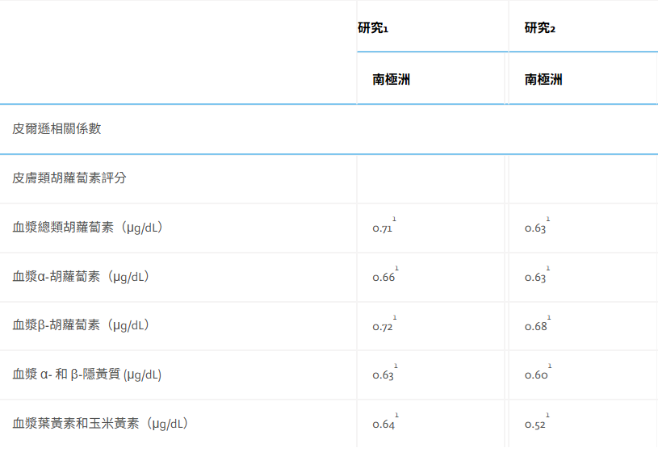

你是否也曾有過這樣的疑惑：

* 「每天吃這麼多維他命、吞蔬果錠，身體真的有吸收嗎？」  
* 「這週天天熬夜、外食，我的健康狀態下滑了嗎？」  
* 「為什麼同樣的保養品，別人用有效，我卻看不出差別？」

在過去，想要了解身體內部的抗氧化狀態，通常需要前往醫院排隊抽血，再等待數天後的檢驗報告；或者，我們只能對著鏡子「看臉色」，憑感覺猜測健康狀況。

但現代人的生活節奏極快，氧化壓力（自由基）隨時隨地都在攻擊我們的細胞，**「感覺」往往跟不上「損害」的速度。**

現在，科技將改變這一切。

> **健康不該「憑感覺」，數據才是硬道理**

Nu Skin 推出的 **Prysm iO 高光譜智慧掃描儀**，將實驗室等級的「光譜分析技術」縮小成掌心大小的智慧儀器。

只要伸出一根手指，短短 15 秒，它就能幫你算出體內的抗氧化防禦力，讓你的健康狀態變成手機上清晰可見的數字。

這不僅是一次科技革新，更是「精準健康管理」進入大眾生活的里程碑。

  <iframe 
    style="position: absolute; top: 0; left: 0; width: 100%; height: 100%; border-radius: 8px;"
    src="https://www.youtube.com/embed/wbT0bLrF-vI" 
    title="Stop Guessing" 
    frameborder="0" 
    allow="accelerometer; autoplay; clipboard-write; encrypted-media; gyroscope; picture-in-picture" 
    allowfullscreen>
  </iframe>

---

## 為什麼要測「類胡蘿蔔素」？——身體的抗氧化溫度計

在眾多抗氧化指標中，為什麼科學界偏偏選中「類胡蘿蔔素（Carotenoids）」作為監測重點？

在回答這個問題之前，我們先來看一段科學界走了將近二十年才走完的探索歷程。

---

## 從「抽血」到「掃描指紋」：二十年的科學突破之路

### 第一階段：黃金標準，但代價高昂（1980s–1990s）

幾十年來，想要知道身體的抗氧化能力、特別是類胡蘿蔔素的儲存量，科學界只有一條路：**抽血，然後送進實驗室做高效液相層析法（HPLC, High-Performance Liquid Chromatography）分析**。

HPLC 是一種精密的化學分離技術。

 血液被抽出後，需要：抗凝處理 → 低溫保存 → 離心分離血清 → 以有機溶劑萃取 → 進入層析管柱分析，最後才能得到 alpha-胡蘿蔔素、beta-胡蘿蔔素、茄紅素、葉黃素等各項數值。

整個流程耗時數天，且對設備和操作人員的要求極高。

更關鍵的缺陷是：**血液中的類胡蘿蔔素半衰期極短。** 

研究顯示，你昨天吃了一大盤紅蘿蔔，今天血液數值就會明顯升高；但如果你連續三天沒吃蔬果，數值又會迅速下滑。

血液記錄的只是「最近 24 小時的飲食快照」，而非你長期健康狀態的真實反映。

這讓流行病學家和臨床研究者非常頭痛：大規模人群研究中，很難每次都在相同飲食條件下採血，數據波動大到幾乎無法比較。

> **「血液告訴你的，是你昨天吃了什麼；而科學家真正想知道的，是你過去幾週的生活習慣。」**

### 第二階段：皮膚活組織切片——更穩定，但更痛苦

為了克服血液數值波動的問題，部分研究者轉向了**皮膚活組織切片（Skin Biopsy）**。

科學家發現，類胡蘿蔔素在代謝後，並不只停留在血液中——它們會透過汗腺與皮脂腺的輸送機制，持續**累積沉積在皮膚的角質層**。

這個累積過程需要數週，因此皮膚中的濃度反映的是「過去 2 到 4 週的長期攝取狀態」，遠比血液穩定。

然而，要得到這個數據，就必須用手術刀切下一小片皮膚，再做複雜的有機溶劑萃取與 HPLC 分析。

**對受試者來說，這需要局部麻醉、留疤、以及對「為了測個抗氧化數值要切皮膚」的心理準備。** 

顯然，這個方法不可能普及到一般大眾。

### 第三階段：歷史性突破——第一道「非侵入性」的光（2000 年）

科學的轉折點發生在 **2000 年**。

美國猶他大學皮膚科的 Hata T.R. 等研究團隊（包括後來奠定整個領域的 Werner Gellermann 博士），在《皮膚病學研究雜誌》(*Journal of Investigative Dermatology*) 發表了一篇劃時代的論文。

他們首次證明：**利用拉曼光譜（Raman Spectroscopy），可以在不切開皮膚、不抽血的情況下，直接偵測並量化活體人類皮膚中的類胡蘿蔔素濃度。**

驗證方式非常嚴謹——他們同時對同一片皮膚進行拉曼光譜掃描與 HPLC 黃金標準分析，證明兩者結果高度吻合。

更重要的是，他們在五個不同身體部位測量後發現：**手掌（Palm）是類胡蘿蔔素濃度最高、訊號最強的測量點**，這也奠定了後來所有掃描儀都採用「指尖測量」的科學基礎。

這篇論文在學術圈引發了連鎖反應。

**2001 年**，Ermakov 等人進一步在《光學快報》(*Optics Letters*) 發表研究，確認共振拉曼光譜能在「活體人體組織」中偵測到類胡蘿蔔素抗氧化物，正式確立了這個技術在活體人體應用的可行性。

**2004 年**，同一研究團隊更進一步，利用多波長雷射激發，實現了對茄紅素（Lycopene）與 beta-胡蘿蔔素的**選擇性分別識別**，讓量化更加精準。

### 第四階段：從「研究室設備」到「人群研究工具」的大考驗（2010 年）

技術上可行，但能不能應用於大規模人群？這個問題在 **2010 年** 迎來了最重要的答案。

耶魯大學醫學院的 Susan T. Mayne 教授團隊，在《美國臨床營養學雜誌》(*Am J Clin Nutr*) 發表了一項涵蓋 **372 名健康成年人**、橫跨 8 天的嚴格臨床驗證研究。

研究設計非常縝密：每位受試者在同一天同時接受三種測量——拉曼光譜皮膚掃描、血液 HPLC 分析，以及皮膚活組織切片 HPLC 分析。

結論震撼了整個領域：

> **皮膚拉曼光譜所測量的類胡蘿蔔素，其個體間的穩定性（組內相關係數 ICC）遠高於血液 HPLC。** 

白話來說，「皮膚數值」比「血液數值」更能真實、穩定地代表一個人的長期抗氧化儲備狀態。

同年，Ermakov 與 Gellermann 博士在《生物化學與生物物理檔案》(*Arch Biochem Biophys*) 進一步建立了完整的**拉曼皮膚類胡蘿蔔素偵測驗證模型**，讓這個方法正式成為科學界認可的抗氧化評估工具。

### 第五階段：科學走向大眾——從雷射到 LED（2012 年起）

然而，這些早期拉曼儀器仍然是「實驗室設備」——造價昂貴、體積笨重、需要高功率雷射光源與受過訓練的操作員。

**怎麼讓這個技術走進每個人的生活？**

這個挑戰，正是促成後來 S3 生物光子掃描儀與最終 Prysm iO 誕生的核心動力，也是整個 25 年技術進化史的靈魂。

---

## 類胡蘿蔔素它是最強大的「抗氧化護衛」：科學研究揭開防禦機制

在生物化學的世界裡，我們的身體每天都在進行一場微觀的戰爭。

氧氣在產生能量的過程中會產生「自由基（Free Radicals）」，而環境中的紫外線、空污、壓力更是自由基的助燃劑。

如果自由基過多，細胞就會遭受「氧化壓力」，進而導致老化、發炎甚至疾病。

**類胡蘿蔔素（Carotenoids）**，正是這場戰爭中最前線的「特種部隊」。

### 科學實證：皮膚表層的抗氧化屏障

多項臨床研究（如 Darvin ME 等人在 *European Journal of Pharmaceutics and Biopharmaceutics* 發表的研究）指出，類胡蘿蔔素具有獨特的分子結構，能高效中和破壞力極強的自由基。

科學家發現，當我們攝取蔬果後，類胡蘿蔔素會透過汗腺與皮脂腺輸送，並集中沈積在皮膚的最外層——**角質層**。

這不是巧合，而是人體的防禦進化：

* **抗紫外線老化（Photo-protection）：** 研究顯示，皮膚中類胡蘿蔔素含量較高的人，對紫外線誘導的紅斑（曬傷）有更強的抵抗力。它就像是「內服的遮陽傘」，從內部阻斷光老化過程。  
* **延緩皮膚粗糙：** 一項著名的皮膚科學研究顯示，皮膚中番茄紅素（Lycopene）與 beta-胡蘿蔔素的濃度，與皮膚的粗糙度（Roughness）成顯著負相關。白話來說：體內類胡蘿蔔素越高的人，皮膚通常越細緻，皺紋也相對較少。  

### 「防禦工事」是否穩固的指標

類胡蘿蔔素在皮膚中的分佈並不均勻，它會優先消耗在受損最嚴重的部位。

因此，皮膚類胡蘿蔔素的數值直接代表了你身體**「抗氧化儲備（Antioxidant Reserve）」**的豐盈程度。

如果測量數值過低，科學研究（如 *Archives of Biochemistry and Biophysics* 中的論述）警示我們：這代表你的防禦工事已經「入不敷出」。

當這道屏障瓦解，自由基就會開始攻擊膠原蛋白（導致皮膚鬆弛）以及細胞 DNA（增加罹患慢性疾病的風險，如心血管疾病、黃斑部病變等）。

因此，測量類胡蘿蔔素不僅是為了愛美，更是為了確保你的「防禦系統」處於高水位狀態。

---

## 比「抽血」更穩定的健康指標：為何「看皮膚」更懂你？

長期以來，血液檢測被視為營養診斷的標準，但在監測「長期防禦水平」時，皮膚檢測表現出更卓越的穩定性。

### 克服「單次飲食」的劇烈波動 (2010, 2013年研究)

根據耶魯大學 Susan Mayne 教授於 2010 年及 2013 年發表於《美國臨床營養學雜誌》(*Am J Clin Nutr*) 與《生物化學與生物物理檔案》(*Arch Biochem Biophys*) 的研究指出：

* **血液的局限：** 血漿中的類胡蘿蔔素半衰期極短，極易受測量前 24 小時內的單次飲食影響。  
* **皮膚的穩定：** 皮膚中的類胡蘿蔔素具有累積性。研究證實，皮膚數值能反映過去 **2 到 4 週** 的持續攝取狀態。它更像是一個「長效健康紀錄儀」，不會因為你測量前的一頓大餐而產生數據偏差。

### 科學發現：皮膚的「外周緩衝功能」 (2009年研究)

由 Blume-Peytavi 等學者於 2009 年在《歐洲藥製學與生物藥製學雜誌》(Eur J Pharm Biopharm) 發表的一項雙盲對照研究揭示了一個關鍵現象：

當受試者停止攝取補充品後，血液中的類胡蘿蔔素濃度會迅速下降，但皮膚中的濃度下降速度則顯著遲緩。

這證明了皮膚具有「外周緩衝功能 (Peripheral Buffer Function)」，它是體內抗氧化劑的戰備倉庫。

當 Prysm iO 讀取你的分數時，它讀取的正是這個倉庫的「總存貨量」，這比波動的血液數值更能代表你的抗氧化實力。

### 臨床驗證：與血液指標的高度相關性 (2024, 2025, 2026年最新研究)

為了確保檢測的科學嚴謹性，科學家不斷進行交叉比對：

**2025 年研究：** Wu 等人的研究顯示，透過反射光譜（RS）測得的皮膚分數，與血液中主要類胡蘿蔔素（如 alpha-、beta-胡蘿蔔素、葉黃素等）的相關係數 **Pearson's r 達到 0.52 至 0.78**，顯示出中高度的正相關。

**2026 年最新驗證：** Riggs 與 Lephart 等學者於 2026 年初發表的最新研究 (*Food Nutr J*)，針對 Prysm iO 進行了專項驗證。

結果證實，Prysm iO 測得的分數與公認的「黃金標準」—— 生物光子掃描儀 S3（RRS 技術）高度一致。

---

## 等等——Galaxy Watch 不是也能測抗氧化了？

三星在 2025 年推出的 **Galaxy Watch 8** 系列中加入了「抗氧化指數」功能，讓很多人開始好奇：

> **「既然手錶就能測，為什麼我還需要 Prysm iO？」**

這兩者測出來的分數一樣嗎？如果不同，誰才是真理？

這個問題問得很好。

背後牽涉到兩位世界級科學大師、超過二十年分道揚鑣的技術路線，以及「數學算掉」vs「物理排除」在精準度上的本質差異。

**第二篇我們將完整拆解：**
- 🔬 Gellermann 與 Lademann 兩大流派的技術路線圖
- ⚙️ Galaxy Watch 與 Prysm iO 硬體、演算法的深度對比
- 📱 Prysm iO 實測四步驟完整教學
- 🗓️ 如何設計你的 60 天抗氧化健康計畫

> 👉 **加入Line會員(https://lin.ee/jgugMvX)，立即解鎖完整的科技深度解析與實測教學**

---

👇👇👇👇

[「菁英 」的高效能恢復配方](https://lin.ee/jgugMvX)

---

## 參考資料

**【測量方法演進史】**

01. Parker RS, 1993. [Analysis of carotenoids in human plasma and tissues.](https://pubmed.ncbi.nlm.nih.gov/8469155/) *Methods Enzymol.* 214:86–93. — HPLC 皮膚活組織切片黃金標準技術說明
02. T R Hata et al., 2000. [Non-invasive raman spectroscopic detection of carotenoids in human skin.](https://pubmed.ncbi.nlm.nih.gov/10951281/) *J Invest Dermatol.* 115(3):441-8. — **首篇確認拉曼光譜可非侵入性偵測人體皮膚類胡蘿蔔素**
03. Igor V Ermakov et al., 2001. [Resonance Raman detection of carotenoid antioxidants in living human tissues.](https://pubmed.ncbi.nlm.nih.gov/16409093/) *Opt Lett.* 26:1179–1181. — **首度確認活體人體組織中的共振拉曼偵測可行性**
04. Igor V Ermakov et al., 2004. [Noninvasive selective detection of lycopene and beta-carotene in human skin using Raman spectroscopy.](https://pubmed.ncbi.nlm.nih.gov/15065899/) *J Biomed Opt.* 9(2):332-8. — 實現茄紅素與 beta-胡蘿蔔素的選擇性分別識別
05. Igor V Ermakov et al., 2005. [Resonance Raman detection of carotenoid antioxidants in living human tissue.](https://pubmed.ncbi.nlm.nih.gov/16409093/) *J Biomed Opt.* 10(6):064028. — 綜合評述 RRS 在活體偵測的應用
06. Susan T Mayne et al., 2010. [Noninvasive assessment of dermal carotenoids as a biomarker of fruit and vegetable intake.](https://pubmed.ncbi.nlm.nih.gov/20685953/) *Am J Clin Nutr.* 92(4):794-800. — **372 人臨床驗證：皮膚數值穩定性優於血液 HPLC**
07. Igor V Ermakov, Werner Gellermann, 2010. [Validation model for Raman based skin carotenoid detection.](https://pubmed.ncbi.nlm.nih.gov/20678465/) *Arch Biochem Biophys.* 504(1):40-9. — 完整建立拉曼皮膚偵測驗證模型
08. Susan T Mayne et al., 2013. [Resonance Raman spectroscopic evaluation of skin carotenoids as a biomarker of carotenoid status for human studies.](https://pubmed.ncbi.nlm.nih.gov/23823930/) *Arch Biochem Biophys.* 539(2):163-70. — RRS 作為人群研究生物標記的全面評估

**【類胡蘿蔔素的抗氧化機制與皮膚防護】**

09. Maxim E Darvin et al., 2009. [In vivo distribution of carotenoids in different anatomical locations of human skin.](https://pubmed.ncbi.nlm.nih.gov/19650865/) *Exp Dermatol.* 18(12):1060-3.
10. Blume-Peytavi U et al., 2009. [Cutaneous lycopene and beta-carotene levels measured by resonance Raman spectroscopy: high reliability and sensitivity to oral lactolycopene deprivation and supplementation.] (https://pubmed.ncbi.nlm.nih.gov/19442725/) *Eur J Pharm Biopharm.* 73(1):187-94. — **雙盲實驗確認皮膚的「外周緩衝功能」**

**【最新 Prysm iO 驗證】**

11. Stephanie B Jilcott Pittset al., 2025. [Two Spectroscopy Devices Can Approximate Fruit and Vegetable Intake in a Racially and Ethnically Diverse Sample.](https://cdn.nutrition.org/article/S2475-2991(25)02943-9/fulltext) *Curr Dev Nutr.* 9(7):107482.
12. Melanie Riggs et al., 2025. [Validation of a New Non-invasive Personalized RS-Skin Carotenoid Scanner (Prysm iO) versus the BioPhotonic Scanner S3 RRS Device for Estimating Carotenoid Levels in Humans.](https://www.gavinpublishers.com/assets/articles_pdf/Validation-of-a-New-Non-invasive-Personalized-RS-Skin-Carotenoid-Scanner-Prysm-iO-versus-the-BioPhotonic-Scanner-S3-RRS-Device-for-Estimating-Carotenoid-Levels-in-Humans.pdf) *Food Nutr J.* 11: (1)1-5.  
