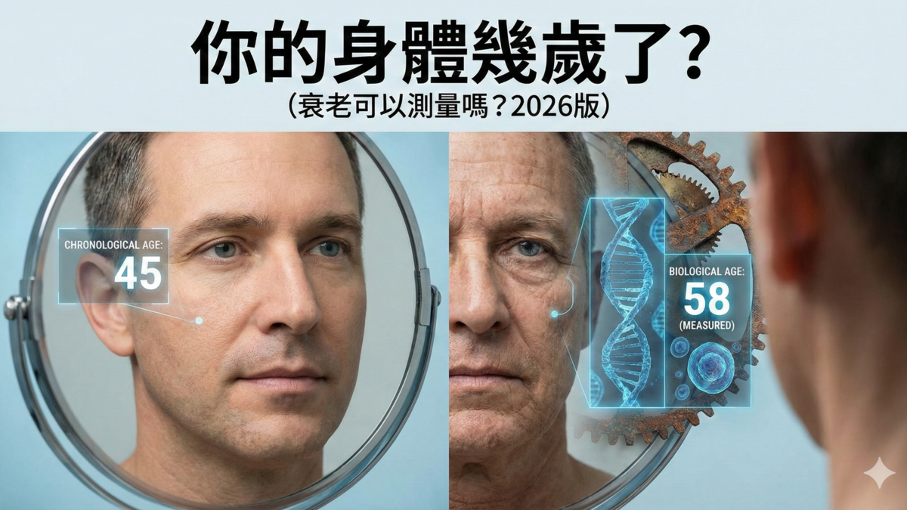

很多人開玩笑說：「過了 40 歲，身體就像零件開始鬆動」，有時候覺得：「我明明才 45 歲，為什麼體力比 50 歲的朋友還差？」

其實，身分證上的年齡只是數字，身體內部的「生物年齡」才是決定你老不老、會不會生病的關鍵。

這不只是心理作用，科學研究證實，老化並不是平穩緩慢發生的。

成大醫院老年醫學科主任張家銘醫師指出，人在 30 歲以後，全身器官每年會以 0.8 ~ 1% 的速度悄悄「生鏽」。

如果你感覺最近皮膚乾巴巴、精神睡不飽、體力大不如前，這就是身體在發出「老化警告」。

現在的醫學已經可以透過 DNA、RNA 和蛋白質這三個層次，像檢查車子零件一樣，精準算出你到底「幾歲」，甚至能預測未來生病的風險。

---

## 老化有兩次「大爆發」——44 歲與 60 歲

史丹佛大學在 2024 年發表了一項震驚醫學界的發現：人體的老化並不是線性前進的，而是在特定年齡會出現「斷崖式」的劇變。

研究人員追蹤了 25 歲到 75 歲的人群，發現身體在 **44 歲**與 **60 歲**左右，體內的分子與微生物會發生劇烈震盪。

### 第一波劇變（約 44 歲）：代謝與心血管

在 40 多歲時，身體處理酒精、咖啡因和脂肪（脂質）的能力會明顯下降。

這解釋了為什麼 40 歲後特別容易長贅肉、血脂升高，且更容易感到肌肉酸痛。

> **關鍵警訊：** 如果你發現最近酒量變差、體重難減，這就是 44 歲老化波浪的反應。

### 第二波劇變（約 60 歲）：免疫與腎功能

到了 60 歲，身體的醣類代謝、免疫系統調節和腎臟功能會出現大轉折。

這時期罹患糖尿病、心血管疾病和失智症的風險會陡然上升。

---

## 從 DNA 層次來看：身體的「原廠手冊」與「哩程表」

**DNA 就像是您出生時拿到的「原廠手冊」**。

那「哩程表」就是隨著年紀增長，這本說明書會被亂塗亂畫（生物學家稱之為「甲基化」），導致細胞讀錯指令。

### 歷史累積的損害（端粒）

端粒是染色體末端的「保護帽」。每當細胞分裂一次，保護帽就短一點。當它短到極限，細胞就「報廢」了。

- **技術升級：** 傳統醫院只測長度，現在尖端的技術可以用螢光掃描，精確抓出那些「快要斷掉」的端帽，這比只看平均長度更能預測器官衰退的風險。
- **你能知道什麼？** 你可以測出自己的細胞還剩下多少分裂次數，知道自己在同年齡群體中的「生存韌性」排在第幾名。

### 現在的老化時速（表觀遺傳鐘）

如果端粒是「總里程數」，那像 **DunedinPACE** 這種第三代時鐘就是「老化時速表」。

它能測出您**現在這一分鐘正以多快的速度老化**。

**精準結果：** 它能算出你現在每一年，身體實際上「消耗」了幾歲。如果數值大於 1，代表你的老化速度比一般人快；如果小於 1，恭喜你正在「贏過時間」。

---

## 從 RNA 層次來看：細胞工廠的「即時派工單」

如果 DNA 是說明書，**RNA 就是工廠裡的「派工單」**。它負責傳達 DNA 的指令來製造蛋白質。

這是目前抗衰老界最熱門的「當下狀態」監測技術。

### 細胞現在忙不忙？

隨著變老，RNA 的指令會開始變亂，有些重要的開關（如 m6A 修飾）會失靈，讓細胞工廠生產出劣質品。

- **BiT age 轉錄組時鐘：** 科學家開發出了一種「開關計算法」，只要看 RNA 哪些機器開著、哪些關著，就能非常準確地知道細胞的真實活力，這比看 DNA 更能反映你「當下」的健康狀態。適合用來測試你最近改吃的補充劑、運動計畫是否真的讓細胞工廠重新恢復效率。

### 好消息是它具有可逆性

最新的研究發現，生物年齡是會浮動的。

例如做完 90 分鐘高強度運動後，你的 RNA 指令會短暫顯示你變老了（因為身體受壓），但經過 24 小時優質休息後，數值會「回撥」變得比之前更年輕。

---

## 蛋白質：工廠排出的「廢料」與「煙霧」

蛋白質是身體的「產品」，也是老化最直接的證據。

如果工廠運作不良，排出的蛋白質廢料（如 GDF15、IL-6）就會引發全身「慢性發炎」（發炎性衰老）。

### 免疫發炎溫度計（GlycanAge）

這是一種看血液中抗體（IgG）上有多少糖分子的技術。發炎越嚴重，你的免疫年齡就越高。

這個指標對生活方式極其敏感，只要你開始改善飲食、減重，幾個月內就能看到數值變年輕。

### 大腦退化警報（NfL 與 p-tau217）

這對於擔心「腦袋不靈光」的 50 歲族群極具價值。

以往測失智症要抽脊髓液或照昂貴的核磁共振，現在抽一管血看血液中的微量蛋白，就能比症狀出現**提前 16 年**預知大腦衰老的危機。

---

## 從精準度到花費，我該測哪一種？

| 檢測維度 | 精準等級 | 代表技術 | 您能知道什麼結果？ | 所需時間 | 參考花費 |
|---|---|---|---|---|---|
| **DNA 尖端** | 非常精準 | 第三代分子時鐘（如 DunedinPACE） | **老化速度表：** 算出您每年衰老多少，預測全死因死亡風險，能算出全身 11 個器官的「真實年齡」 | 3–6 週 | $500–$1,000 USD |
| **RNA 尖端** | 非常精準 | 深度轉錄組時鐘（如 BiT age） | **細胞運作真相：** 看到基因的開關狀態，最適合想知道某種補劑（如 NMN）或生活調整是否對細胞「即時見效」 | 4–6 週 | $1,500–$3,000 USD |
| **DNA 商用** | 精準 | 第二代甲基化鐘（如 GrimAge） | **健康預報：** 預測未來十年內生重病的機率，能看到「抽菸」或「肥胖」在基因上留下了多少傷痕 | 2–4 週 | $250–$500 USD |
| **RNA 商用** | 精準 | 腸道/血液轉錄檢測（如 Viome） | **精準飲食清單：** 了解能量代謝狀況，得到一份「哪些食物對您是超級食物、哪些要避開」的專屬清單 | 2–3 週 | $399 USD |
| **蛋白質/血液** | 醫院檢測 | 免疫年齡（GlycanAge）/ 腦衰指標（NfL） | **發炎與大腦預警：** 測量體內「發炎性衰老」等級，提前 16 年預測失智風險 | 1–7 天 | NT$ 4,800–15,000 |
| **綜合代謝** | 醫院檢測 | 代謝體學疾病風險評估（美塔力） | **環境毒素帳單：** 看到體內累積了多少重金屬、塑化劑，以及肝臟排毒、荷爾蒙平衡能力 | 2–3 週 | NT$ 40,000 |
| **DNA 基礎** | 一般檢測 | 端粒長度（qPCR / TRF） | **細胞壽命排名：** 算出細胞還剩多少分裂次數，在同年齡族群中排名 | 1–2 週 | NT$ 4,100 |
| **大數據分析** | 一般檢測 | Aging.AI 計算器 | **健康概況：** 利用一般的血檢數據，用 AI 算出生理狀態有沒有「超齡」 | 即時 | 血檢費（約 NT$ 1,500）|

---

## 除了抽血，還有什麼簡單的方法？

有些方法不一定要花大錢，在日常生活中也能自我檢測：

1. **握力測試：** 握力是全身肌肉力量的縮影。男人低於 26 公斤、女人低於 16 公斤就是警訊，與壽命縮短有強烈關係。
2. **走路速度：** 走路快的人通常活得久。如果你的步速低於每秒 0.8 公尺，代表神經與肌肉老化嚴重。
3. **AI 面部掃描：** 現在的 AI 透過拍一張 3D 面部照片，就能根據皺紋與熱成像算出你的「面部年齡」，誤差只有 2.8 年。
4. **生物光子掃描儀：** 只要 15 秒，手掌放在機器上，就能測出皮膚裡的類胡蘿蔔素（抗氧化指數）。數值是紅色，代表你的抗衰老防護罩已經破功。

---

## 抗衰老的第一步是「量化」

老化的過程並非不可逆。

研究證明，即便是短暫的高強度壓力，只要透過適當的睡眠、防發炎飲食與精準補充劑，受損的生物標記是可以修復的。

對於 40–50 歲的你，這份報告的重點不在於恐嚇你有多老，而是告訴你：

> **凡是能被測量的，就能被改進。**

建議每半年到一年進行一次核心檢測，看看你的保養是否真的幫身體換來了更多「青春額度」。

記住，年齡只是一個數字，你的生物數據才是生命質量的真實反映。

---

👇👇👇👇

[「菁英 」的高效能恢復配方](https://lin.ee/jgugMvX)

---

## 參考資料

1. Steve Horvath, 2013. [DNA methylation age of human tissues and cell types.](https://pubmed.ncbi.nlm.nih.gov/24138928/) *Genome Biol.* 14(10):R115.
2. Morgan E Levine et al., 2018. [An epigenetic biomarker of aging for lifespan and healthspan.](https://pubmed.ncbi.nlm.nih.gov/29676998/) *Aging (Albany NY)*. 10(4):573–591.
3. Ake T Lu et al., 2019. [DNA methylation GrimAge strongly predicts lifespan and healthspan.](https://pmc.ncbi.nlm.nih.gov/articles/PMC6366976/) *Aging (Albany NY)*. 11(2):303–327.
4. Daniel W Belsky et al., 2022. [DunedinPACE, a DNA methylation biomarker of the pace of aging.](https://pubmed.ncbi.nlm.nih.gov/35029144/) *Elife.* 11:e73420.
5. David H Meyer, Björn Schumacher, 2021. [BiT age: A transcriptome‐based aging clock near the theoretical limit of accuracy.](https://pmc.ncbi.nlm.nih.gov/articles/PMC7963339/) *Aging Cell.* 20(3):e13320.
6. Caio M P F Batalha et al., 2025. [A combination of differential expression and network connectivity analyses identifies a common set of RNA splicing and processing genes altered with age across human tissues.](https://pubmed.ncbi.nlm.nih.gov/41460210/) *Aging (Albany NY)*. 17(12):2916–2949.
7. Zeming Wu et al., 2023. [Deciphering RNA m6A regulation in aging.](https://pmc.ncbi.nlm.nih.gov/articles/PMC10577575/) *Aging Cell.* 22(10):e13972.
8. Jasminka Krištić et al., 2014. [Glycans are a novel biomarker of chronological and biological ages.](https://pubmed.ncbi.nlm.nih.gov/24325898/) *J Gerontol A Biol Sci Med Sci.* 69(7):779–89.
9. Yu Guo et al., 2024. [Plasma proteomic profiles predict future dementia in healthy adults.](https://pubmed.ncbi.nlm.nih.gov/38347190/) *Nat Aging.* 4(2):247–260.
10. Heidi Ledford. [Blood test holds promise for predicting when Alzheimer's symptoms will start.](https://www.nature.com/articles/d41586-026-00531-x) *Nature.*
11. Xiaotao Shen et al., 2024. [Nonlinear dynamics of multi-omics profiles during human aging.](https://www.nature.com/articles/s43587-024-00692-2) *Nature Aging.* 4:1619–1634.
12. Rubén López-Bueno et al., 2022. [Thresholds of handgrip strength for all-cause, cancer, and cardiovascular mortality.](https://pubmed.ncbi.nlm.nih.gov/36332759/) *Ageing Res Rev.* 82:101778.
13. Jesse R Poganik et al., 2023. [Biological age is increased by stress and restored upon recovery.](https://pubmed.ncbi.nlm.nih.gov/37086720/) *Cell Metab.* 35(5):807–820.e5.
14. Jijuan Zhang et al., 2025. [Plasma Proteomics Reveals Biomarkers and Undulating Changes in Metabolic Aging.](https://pubmed.ncbi.nlm.nih.gov/41356597/) *Research (Wash D C).* 8:1004.
15. Runyu Liang et al., 2024. [Epigenetic Clocks: Beyond Biological Age, Using the Past to Predict the Present and Future.](https://pubmed.ncbi.nlm.nih.gov/39751861/) *Aging Dis.* 16(6):3520–3545.
16. Tomasz Wilmanski et al., 2021. [Gut microbiome pattern reflects healthy ageing and predicts survival in humans.](https://pubmed.ncbi.nlm.nih.gov/33619379/) *Nat Metab.* 3(2):274–286.
