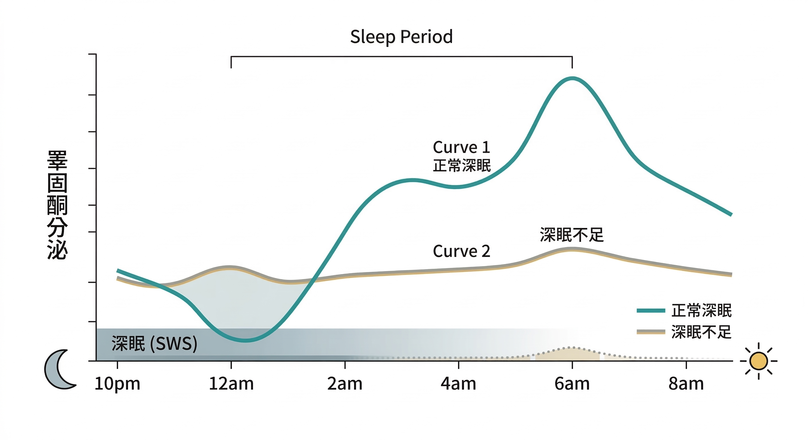

你有沒有這種感覺：

睡了七、八個小時，起床還是累。或者半夜會醒來，看一下手機，再翻個身，睡眠就這樣碎掉了。

你告訴自己：可能是壓力，可能是最近事情太多，或者就是「年紀大了，睡眠本來就淺」。

最後那個解釋最常被接受，因為它讓這件事看起來像是不需要處理的事情。

但它不對。

---

## 睪固酮不是在健身房裡製造的

你體內大部分的睪固酮，是在睡著之後製造的。

具體來說，是在 **慢波睡眠（Slow Wave Sleep，SWS）**期間——也就是俗稱的「深眠」階段，這是一整夜睡眠裡代謝活動最旺盛、荷爾蒙分泌最集中的時段。

睾固酮在入睡後開始上升，在清晨達到當天最高峰，然後在整個白天逐漸下降。

這個製造過程需要一個前提：**至少連續三小時、結構完整的睡眠**。

睡眠被打斷，或者深眠比例太低，睪固酮的夜間分泌節律就會被擾亂。

不是變少一點，是那個節律的高峰直接消失。

---

## 數字說明了什麼

芝加哥大學 Leproult & Van Cauter 於 2011 年發表在《JAMA》的研究，讓10位健康年輕男性連續一週每晚只睡 5 小時。結果：

**白天的睪固酮水平下降了10–15%。**

這個數字相當於自然老化10–15年的荷爾蒙衰退量。

一週，換來了十幾年的老化代價。

2022 年發表於《Reviews in Endocrine and Metabolic Disorders》的綜合分析整合了多項流行病學與介入研究，結論明確：睡眠不足和較短的睡眠時間，與早晨、下午、全天24小時的睪固酮水平降低都有顯著關聯——同時伴隨下午皮質醇的升高。

這兩件事同時發生，問題就倍增了。

---

## 睪固酮和皮質醇是蹺蹺板

睡眠不足對男性荷爾蒙的影響，不只是直接抑制睪固酮的製造，還有另一條路徑：**透過皮質醇間接壓制睾固酮的合成**。

皮質醇有正常的日節律——清晨升高幫你起床，傍晚後逐漸下降。

但睡眠不足會讓皮質醇在不該高的時段維持偏高——尤其是下午。

睾固酮和皮質醇是男性體內最主要的「合成代謝信號」和「分解代謝信號」的代表。

兩者之間的平衡，直接影響肌肉合成、脂肪分佈、免疫功能和情緒穩定。

**睡不好，這個蹺蹺板就一直往皮質醇那側傾。**

這解釋了為什麼睡眠不足的人除了疲倦，還更容易累積腹部脂肪、肌肉流失更快、情緒調節更困難——這些不是獨立的問題，是同一個荷爾蒙失衡造成的不同面向。

---

## 40歲之後，深眠本來就在消失

這裡有一個讓問題更複雜的背景事實：

從大約中年開始，**男性的慢波睡眠（深眠）比例本來就以比女性更快的速度在下降。**

年輕時，一個完整的睡眠週期裡深眠佔相當的比例；40歲之後，深眠時間縮短，第一、二期的淺眠比例增加，夜間醒來的次數增多。

這意味著：**就算你躺在床上的時間沒有變，你真正在深眠的時間已經比二十年前少了。**

而偏偏深眠是睪固酮製造最集中的時段。深眠縮短，睪固酮的夜間製造窗口就跟著縮小。

這不是你「睡眠品質比較差」，這是中年男性睡眠生理的正常變化——但它的下游效應，是睪固酮水位的結構性下滑。

一個研究 65 歲以上健康男性的世代研究發現，睪固酮水平較低的男性，同時有更低的睡眠效率、更多的夜間醒來、更少的慢波睡眠時間，以及更高的睡眠呼吸中止指數——這個關聯在調整了年齡和體重指數之後仍然存在。

---

---

## 這一切的共同節點

把這兩條線拉在一起：

深眠縮短 → 睪固酮夜間製造窗口消失  
睡眠不足 → 皮質醇偏高 → 進一步抑制睪固酮合成  

這不是兩個獨立的問題，而是一個互相強化的迴圈。

而這個迴圈的切入點，比你想像的更具體——**從睡眠品質開始，最能同時影響多個節點。**

如果你想知道怎麼具體切斷這個惡性迴圈，矽谷富豪布萊恩・強生的做法很值得參考：他發現只要控制『睡前心率』，就能大幅改善深眠。
**→ [延伸閱讀：為什麼你睡滿8小時還是累？矽谷富豪的抗老實驗證實：問題出在你的「睡前心率」](/blog/ibody-signals/aging-quantified-bryan-johnson-blueprint/)

---

## 這不只是「睡眠問題」

中年男性的疲勞，從來不是單一問題的結果。

睡眠品質、睪固酮水位、皮質醇節律、鎂的礦物質狀態——這些變數環環相扣，在你不知道的情況下，正在決定你每天早上起床時感受到的狀態。

這篇文章的出發點是睡眠，但它的終點其實是：**你的荷爾蒙環境是否支持你的身體繼續正常運作。**

如果想從睪固酮和男性老化的角度理解更深層的機制：

**→ [40歲的你只剩一張嘴了嗎？——不是「自然老了」是睪丸細胞提前衰老了](/blog/intervention-optimization/testosterone-cell-aging-40/)**（article-testosterone-r2）

---

## 參考資料

01. Leproult R, Van Cauter E, 2011. [Effect of 1 week of sleep restriction on testosterone levels in young healthy men.](https://pubmed.ncbi.nlm.nih.gov/21632481/) *JAMA.* 305(21):2173–2174.
02. Liu PY, Reddy RT, 2022. [Sleep, testosterone and cortisol balance, and ageing men.](https://pmc.ncbi.nlm.nih.gov/articles/PMC9510302/) *Reviews in Endocrine and Metabolic Disorders.* 23:1251–1266.
03. Wittert G, 2014. [The relationship between sleep disorders and testosterone in men.](https://pmc.ncbi.nlm.nih.gov/articles/PMC3955336/) *Asian Journal of Andrology.* 16(2):262–265.
04. Barrett-Connor E et al., 2008. [The association of testosterone levels with overall sleep quality, sleep architecture, and sleep-disordered breathing.](https://pmc.ncbi.nlm.nih.gov/articles/PMC2453053/) *Journal of Clinical Endocrinology & Metabolism.* 93(7):2602–2609.
05. Penev PD, 2007. [Association between sleep and morning testosterone levels in older men.](https://pubmed.ncbi.nlm.nih.gov/17520786/) *Sleep.* 30(4):427–432.
06. Su L et al., 2021. [Effect of partial and total sleep deprivation on serum testosterone in healthy males: a systematic review and meta-analysis.](https://pubmed.ncbi.nlm.nih.gov/34801825/) *Andrologia.* 53(10):e14235.
