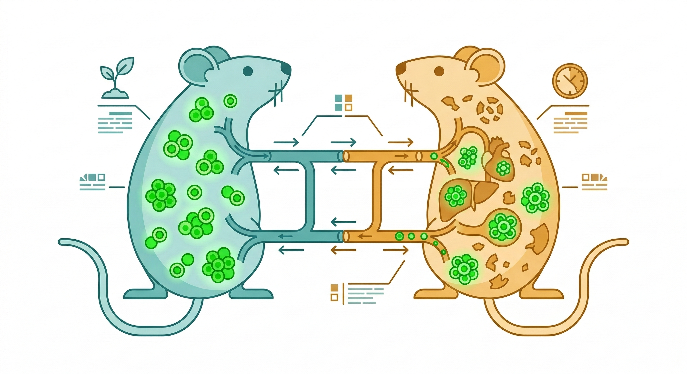
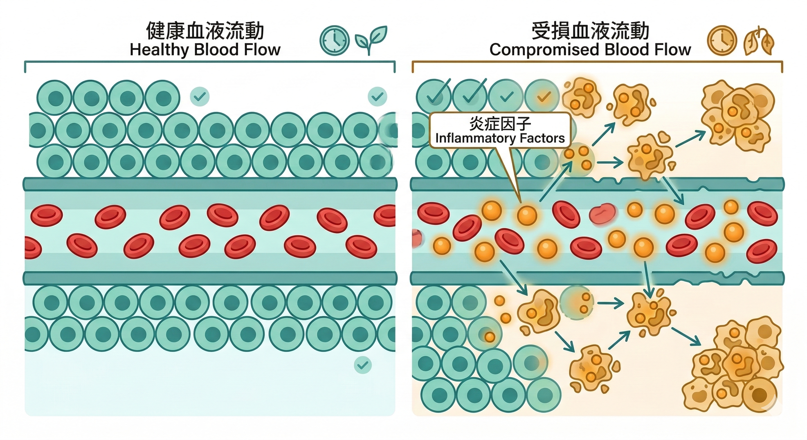

《鬼滅之刃》裡，鬼舞辻無慘生來患有絕症，活不過二十歲。

醫生給他吃了一種藥，病確實好了——但他變成了鬼。不老不死，以人類為食，極度懼怕陽光。

整部作品，他都在找一件事：讓自己能曬太陽的方法。

用更白話的說法就是：他要成為一個完整的、不會繼續老化的人。

這個執念，從來沒有消失過。

---

人類對「換血能抗老」的想象，比鬼滅之刃早了幾百年。

16 世紀的匈牙利貴族巴托里伯爵夫人，據說用少女的鮮血沐浴，相信這樣能保持青春。

1615 年，德國醫生 Andreas Libavius 寫下了人類史上第一篇關於「把年輕人的血輸給老人以延緩衰老」的詳細方案——完整到描述了器具、步驟，以及獻血者事後需要吃什麼食物補充體力。

這些都是直覺。

到了 2005 年，直覺第一次被科學驗證了。

---

## 史丹佛大學的那個實驗

2005 年，Michael Conboy 等人在《自然》期刊發表了一項研究：他們把老年老鼠和年輕老鼠的循環系統縫合在一起，讓兩隻老鼠共用同一套血液系統。

這個技術叫做 **異體共生（Parabiosis）**，最初由法國生理學家 Paul Bert 在 1864 年發展出來，用來研究血液中的生物活性因子。

Conboy 團隊發現了一件非常戲劇性的事：

**老年老鼠的肌肉和肝臟細胞開始以年輕老鼠的速度再生。衰老的幹細胞重新開始分裂，受損的肌肉修復能力幾乎恢復到幼鼠的水準。腦細胞也開始生長。**

換言之——灌入年輕的血，老鼠變年輕了。

年輕血裡有什麼？

最早被討論的候選蛋白是 **GDF11**（生長分化因子 11）——在年輕血液中濃度較高，老年血液中下降。

但 GDF11 的復現研究結果分歧，學界至今仍有爭議。

更近的方向是 2024 年發表於 *Nature Aging* 的研究（Chen et al.）：他們發現年輕血漿中的 **小胞外囊泡（small extracellular vesicles，sEVs，又稱外泌體）** 才是關鍵傳遞介質——這些奈米級的囊泡攜帶了來自年輕細胞的訊號分子，能夠透過改善粒線體能量代謝，逆轉老年器官的功能衰退。

換句話說，年輕血液裡的「活性物質」，可能不是單一蛋白，而是一套複雜的細胞訊號系統。

研究發表後，媒體的標題幾乎一面倒：「換血就能抗老」。

矽谷的科技富豪開始花錢買年輕人的血漿。

Ambrosia 公司一瓶 8,000 美元，專門提供 25 歲以下捐血者的血漿輸注服務。Bryan Johnson 也把這個列入他的長壽實驗項目。

2023 年，杜克大學（Duke University）在 *Nature Aging* 發表了一項長期追蹤研究：他們讓老年老鼠和年輕老鼠共生數週後再分離，測量老年老鼠的 **表觀遺傳時鐘**（生物年齡指標）——發現血液和肝臟組織的生物年齡顯著逆轉，而且 **分離兩個月後效果仍然持續**。

換算成人類尺度，相當於讓一個 50 歲的人與 18 歲的人共享循環系統八年，效果可延長壽命達八年。

但科學家本人，沒有這麼樂觀。

---

## 問題出在另一邊

研究者注意到一件異常的事：

在共生實驗裡，**變年輕的是老年老鼠**。

但共生的年輕老鼠呢？ **牠提前老化了。**

如果「年輕血液含有抗老因子」是唯一的解釋，共生的年輕老鼠應該不受影響才對。

但年輕老鼠連接老年老鼠的循環系統之後，明顯出現了提前衰老的現象——肌肉、腦組織都退化了。

這說明，故事不只有「年輕血的一半」。 **老血裡，有某種主動促進老化的東西。**

---

## 2020 年，Conboy 的後續研究

Irina Conboy——同一個實驗室——在 2020 年的 *Aging* 期刊發表了一項更直接的研究：

他們不輸入年輕血液，只是 **把老年老鼠的血漿用白蛋白生理鹽水稀釋**。

結果呢？ **老年老鼠的肌肉、肝臟和腦部都出現了再生跡象。效果和接受年輕血漿的對照組幾乎相當。**

這個發現徹底改變了問題的方向：

不是「年輕血含有神奇物質」，而是「老年血裡積累了大量有害物質，稀釋掉之後，身體就恢復了自我修復能力」。

---

## 老血裡的有害物質是什麼

這個問題有明確的答案。

老年血液中積累的有害物質，科學界稱為 **SASP**（Senescence-Associated Secretory Phenotype，衰老相關分泌表型）。

簡單說：隨著年齡增加，身體裡的細胞會開始進入「衰老細胞」（senescent cell）狀態——這些細胞不再正常分裂，但也沒有被清除掉。

它們活著，持續向周圍分泌大量的促炎物質，包括：

- **IL-6**（白血球介素 6）
- **TNF-α**（腫瘤壞死因子）
- **MCP-1**（單核球趨化蛋白）
- 以及數十種其他細胞激素和蛋白酶

這些物質進入血液循環，擴散到全身——污染了血液的「環境」，讓附近原本健康的細胞也開始加速衰老，讓幹細胞失去修復的信號，讓組織再生能力下降。

2024 年的研究進一步揭示了更深層的機制：衰老細胞內累積的 DNA 碎片會觸發 **cGAS-STING 訊號通路**，這條通路原本設計來偵測病毒入侵，但在老化過程中被「誤觸發」，持續激活 NF-κB 等促炎轉錄因子，製造更多 SASP——形成一個自我強化的惡性循環。

這就是為什麼年輕老鼠接了老年血之後提前老化：不是缺少年輕因子，而是被 SASP 的促炎物質系統性地「傳染」了老化訊號。

**這個持續低度的全身性發炎狀態，有一個名字：Inflammaging。**

Inflammaging 不是感染，不是急性發炎。它是一種長年慢慢燒的底火——你感覺不到，體檢也照不出來，但它每天都在消耗你的細胞儲備，加速你的生理老化。

---

## 你不需要換血，你需要管理源頭

無慘的邏輯是：找年輕的血，灌進去，就能解決問題。

現在的科學說：這個邏輯找錯了對象。

你的血液是什麼狀態，不是由血液本身決定的——而是由你的身體裡有多少衰老細胞在持續分泌 SASP，取決於你長期的慢性發炎程度。

換句話說：真正需要管理的，是製造那些有害物質的源頭——是讓 SASP 持續累積的慢性發炎環境。

這不是一個可以靠「換一批血」解決的問題。這是你每一天的身體狀態，在每一天默默決定的事。

---

**接下來讀這篇：**

[抗慢性發炎就是在抗老化——這不是廣告詞，這是2000年就確立的科學](/blog/chronic-inflammation/anti-inflammation-anti-aging/) ← Inflammaging 篇（了解 SASP 的完整機制與介入邏輯）

---

還不確定自己的身體目前累積了多少慢性發炎？

加入我們的 LINE，免費領取【身體警報自我檢測清單】，五分鐘找出你身體正在發出的訊號。

[立即領取 →](https://line.me/ti/p/@fer7932k)

---

## 參考資料

01. Conboy IM et al., 2005. [Rejuvenation of aged progenitor cells by exposure to a young systemic environment.](https://pubmed.ncbi.nlm.nih.gov/15716955/) *Nature.* 433(7027):760-764.
02. Villeda SA et al., 2011. [The ageing systemic milieu negatively regulates neurogenesis and cognitive function.](https://pubmed.ncbi.nlm.nih.gov/21886162/) *Nature.* 477(7362):90-94.
03. Villeda SA et al., 2014. [Young blood reverses age-related impairments in cognitive function and synaptic plasticity in mice.](https://pubmed.ncbi.nlm.nih.gov/24912090/) *Nat Med.* 20(6):659-663.
04. Castellano JM et al., 2017. [Human umbilical cord plasma proteins revitalize hippocampal function in aged mice.](https://pubmed.ncbi.nlm.nih.gov/28297716/) *Nature.* 544(7651):488-492.
05. Mehdipour M et al., 2020. [Rejuvenation of three germ layers tissues by exchanging old blood plasma with saline-albumin.](https://pubmed.ncbi.nlm.nih.gov/32867120/) *Aging (Albany NY).* 12(18):18011-18032.
06. Franceschi C, Campisi J, 2014. [Chronic inflammation (inflammaging) and its potential contribution to age-associated diseases.](https://pubmed.ncbi.nlm.nih.gov/24833586/) *J Gerontol A Biol Sci Med Sci.* 69 Suppl 1:S4-9.
07. Campisi J, 2013. [Aging, cellular senescence, and cancer.](https://pubmed.ncbi.nlm.nih.gov/23140366/) *Annu Rev Physiol.* 75:685-705.
08. Chen X et al., 2024. [Small extracellular vesicles from young plasma reverse age-related functional declines by improving mitochondrial energy metabolism.](https://doi.org/10.1038/s43587-024-00612-4) *Nat Aging.*
09. White JP et al., 2023. [Epigenetic reprogramming from heterochronic parabiosis.](https://www.sciencedaily.com/releases/2023/07/230727144010.htm) *Nature Aging* (Duke University).
10. Lagunas-Rangel FA, 2024. [Aging insights from heterochronic parabiosis models.](https://pubmed.ncbi.nlm.nih.gov/39154047/) *npj Aging.* 10(1):38.
11. Gulej R et al., 2024. [Rejuvenation of cerebromicrovascular function in aged mice through heterochronic parabiosis.](https://pubmed.ncbi.nlm.nih.gov/38123890/) *Geroscience.* 46(1):327-347.
