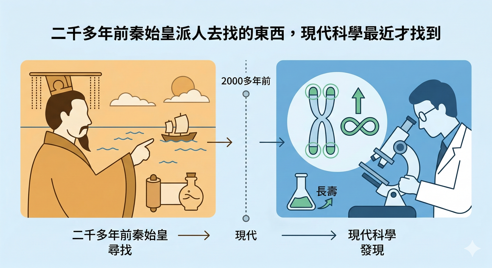
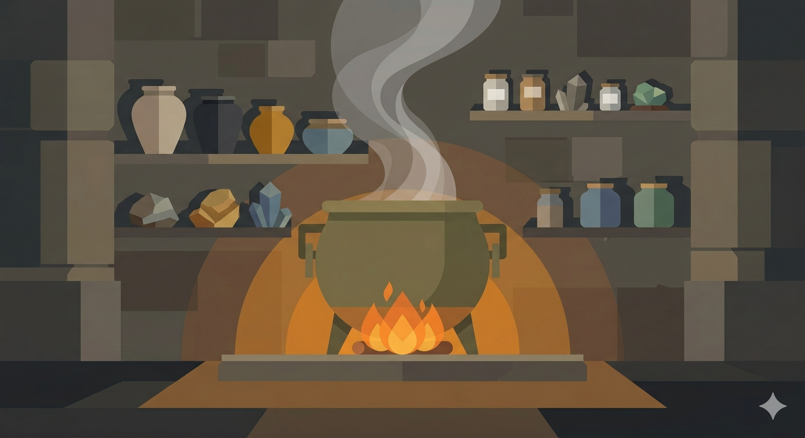
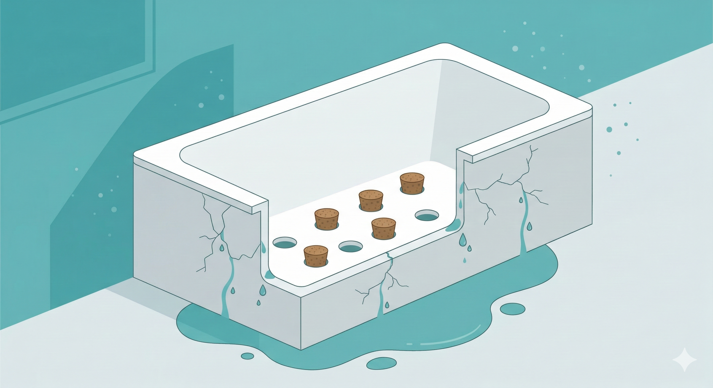

秦始皇統一六國之後，做的第一件大事不是休養生息，是派徐福帶著三千童男童女出海，去找長生不老藥。

然後他從此就沒回來了。

然後秦始皇 49 歲駕崩。

---

這不是個例。

從戰國一路到清朝，幾乎每一個有點野心的皇帝都做了同一件事——找方士煉丹，吃「仙藥」。

邏輯上完全合理：普通人連飯都吃不飽，皇帝是全天下最有資源的人，如果誰能找到長壽的方法，應該是他們才對。

結果呢？

| 皇帝 | 享年 |
|---|---|
| 晉哀帝司馬丕 | 25 歲 |
| 唐太宗李世民 | 51 歲 |
| 唐穆宗李恆 | 30 歲 |
| 唐武宗李炎 | 33 歲 |
| 唐宣宗李忱 | 50 歲 |
| 南唐烈祖李昪 | 56 歲 |
| 明仁宗朱高熾 | 47 歲 |
| 明世宗朱厚璁 | 60 歲 |
| 明光宗朱常洛 | 39 歲 |
| 明熹宗朱由校 | 23 歲 |
| 清世宗愛新覺羅·胤禛 | 58 歲 |

諷刺的是想長壽的，反而死得比普通人還早。

唐朝是煉丹術的全盛期。唐高宗、唐玄宗都曾親自召集方士入宮提煉仙丹，唐朝也因此成了皇帝死亡人數最多的朝代之一。

古代的「仙丹」大多含有砒霜、水銀、鉛等重金屬。吃進去的不是長生，是慢性中毒而死。

幾千年前的人不懂這個，情有可原。

問題是——我們現在懂得多少？

---

## 古代煉丹的邏輯和現代人補保健品的邏輯，其實沒差多少

方士告訴皇帝：把這些礦石加熱、溶化、提煉，就能得到精華。

現代廠商告訴你：把這些植物萃取、濃縮、膠囊化，就是精華。

兩者的核心邏輯都是一樣的：找到一種「神奇物質」，吃進去，就能解決問題。

古代叫仙丹。

現代叫保健品。

這樣說不是要否定保健品的價值——有些成分確實有科學根據。問題是，這個邏輯本身就有個巨大的盲點。

**老化，不是一個可以被「補」走的過程。**

---

## 人為什麼會老？

這個問題，科學家花了超過一百年才開始有比較清楚的答案。

1956年，美國內布拉斯加大學的鄧哈姆·哈曼（Denham Harman）教授提出了第一個被廣泛接受的老化理論——**自由基老化理論**。

簡單說：

人體在製造能量的過程中，粒線體會同時產生「廢棄物」——自由基。

自由基非常不穩定，會去搶奪附近細胞的電子，造成連鎖損傷。

這個損傷隨著時間累積，就是老化的一部分。

這個理論解釋了為什麼吃抗氧化劑有一定的道理——抗氧化物可以「清除」部分自由基，減少損傷。

但問題很快就出現了。

---

## 光靠抗氧化劑，還不夠

把老化想像成一個浴缸，水代表你的精力和細胞功能。

老化就像浴缸底下有孔洞，讓水慢慢流出去。

根據自由基理論，廠商找到各種抗氧化劑，就像找塞子——把洞堵住，水就不會流了。

吃了一陣子，你確實覺得有點效果，因為某些洞被堵住了，水流慢了一些。

但問題是，浴缸底下不只有幾個洞。

還有數不清的裂縫。

就算你把所有洞都堵住，水還是會從裂縫流出去。還是會老。

---

## 科學家真正看到的老化是什麼

從1990年代開始，研究者陸續發現：老化是一個 **多路徑、多層次的基因調控失效過程**，不是單一原因造成的。

跟老化密切相關的主要路徑包括：

- **AMPK**——細胞的能量感測器，當能量不足時啟動修復模式
- **Sirtuin（SIRT1）**——管理細胞生存、代謝與壓力反應的開關
- **mTOR**——控制細胞生長和蛋白質更新，過度活躍時會加速老化
- **Nrf2**——調控抗氧化和抗發炎基因表達的核心轉錄因子
- **NF-κB**——慢性發炎的主控開關，隨年齡逐漸失控

這些路徑彼此交織，相互影響。

任何單一成分，頂多只能影響其中一兩條路徑。

這就是為什麼光靠補充維生素 C 或白藜蘆醇，感覺「有效但不夠有效」——因為你只堵了幾個洞，裂縫還在。

---

## 那什麼方法能同時影響這些路徑？

1934年，康奈爾大學的麥凱（Clive McCay）教授做了一個改變歷史的實驗：

他讓老鼠在獲得足夠營養的前提下，攝取的熱量減少 30% - 40%。

這些老鼠沒有死，反而活得比自由進食的老鼠長 30% - 40%，有些甚至活超過 1200 天（一般老鼠平均 700 天）。

這個發現開啟了整個「**熱量限制法（Calorie Restriction, CR）**」的研究領域。

為什麼限制熱量可以延緩老化？

因為當細胞處於「食物減少」的狀態時，身體會啟動一套深層的修復機制——AMPK活化、SIRT1上調、mTOR抑制、自噬清除老舊蛋白質——幾乎同時影響上面所有老化路徑。

不是靠補充某種物質。而是靠 **啟動細胞本身的修復程式**。

這一條科學脈絡，才是現代抗衰老研究的主線。

---

## 從古代仙丹到現代科學，人類繞了多久

秦始皇派徐福出海，大約西元前219年。

麥凱教授的熱量限制實驗，1934年。

從「想找神奇物質吃進去就長壽」，到「理解老化是基因調控的失效，需要啟動細胞修復機制」——

人類花了大約兩千兩百年。

現在的問題不再是「方向對不對」，而是：

**你知道怎麼做，但你願意長期執行嗎？**

長期熱量限制的問題、科學家如何找到不用挨餓的替代方案，以及這個替代方案的完整科學根據——

繼續讀下去。

👇

[少吃真的能讓你活更久——熱量限制的科學，從1930年代到今天](/blog/chronic-inflammation/少吃真的能讓你活更久——熱量限制的科學，從1930年代到今天/)

---

還不確定自己的身體目前在哪個老化階段？

加入我們的 LINE，免費領取【身體警報自我檢測清單】，五分鐘找出你身體正在發出的訊號。

[立即領取 →](https://line.me/ti/p/@fer7932k)
