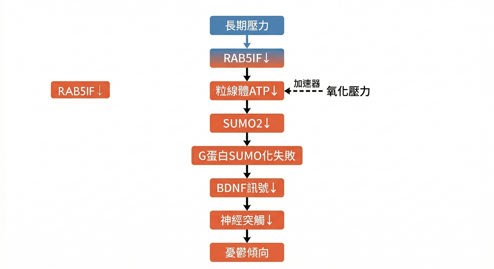
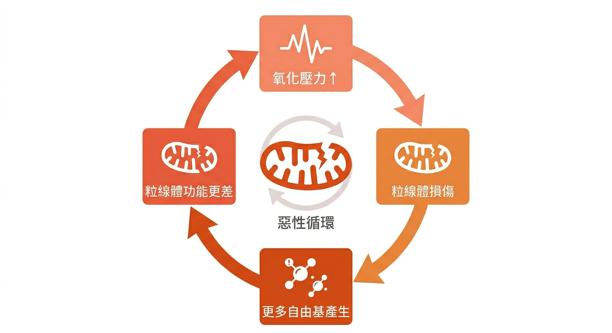
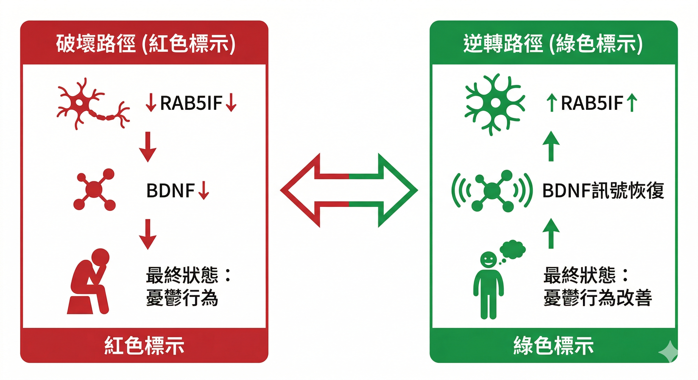

你上週睡滿八小時，醒來還是覺得腦袋沉重。

最近沒什麼特別的事發生，但就是很難真正開心起來。

你跟家人說「我最近壓力很大」，說完也說不清楚壓力從哪裡來。

這不是你太敏感，也不是你意志力不夠。

2026年3月，頂尖科學期刊《Science Signaling》告訴我們：長期壓力，正在從分子層級，一步一步改變你的大腦結構。

---

## 壓力不只是「心情不好」

我們習慣把壓力當成一種心理狀態，緊張、焦慮、不安。

但神經科學的研究方向，早已不在這裡。

過去十年，越來越多證據指出：長期壓力不只是讓你「感覺不好」，它會具體改變大腦內的蛋白質表現、訊號傳遞效率、甚至神經細胞的物理結構。

而這些改變，你不一定感覺得到，直到它累積夠久，以情緒的形式浮現出來。

最新那篇《Science Signaling》研究，用「慢性輕度壓力」的動物實驗模式，刻意設計成模擬日復一日的生活壓力，而不是單一重大創傷，找到了一條具體的分子破壞路徑。

---

## 大腦有一種叫做 BDNF 的「養分」

要理解這條路徑，先認識一個關鍵分子：**腦源性神經滋養因子（Brain-Derived Neurotrophic Factor，BDNF）**。

你可以把它想成「大腦的肥料」，它負責讓神經細胞生長、讓記憶形成、讓情緒保持穩定。

當 BDNF 訊號充足，大腦可以持續修復、學習、維持彈性。

但在慢性壓力或憂鬱症患者身上，BDNF 的訊號會減弱。結果是：

- 神經突觸連結變少
- 海馬迴（與記憶、情緒密切相關的腦區）體積縮小
- 情緒調控能力下降

這不是比喻，這是可以在影像上看到的結構變化。

---

## 壓力如何一步一步破壞 BDNF

這篇研究的突破，在於找到了壓力破壞 BDNF 的具體路徑：

**長期壓力**
↓ RAB5IF 蛋白減少（負責粒線體正常運作）
↓ 粒線體 ATP 產量下降（細胞能量不足）
↓ SUMO2 合成減少（一種蛋白質修飾分子）
↓ G 蛋白無法正常 SUMO 化（訊號轉導關鍵分子失能）
↓ BDNF訊號受阻
↓ 神經突觸連結減少
↓ 出現憂鬱傾向的行為

從「感受到壓力」到「情緒出問題」，中間走了至少五個分子層次。

這不是心情問題，這是生理變化。

RAB5IF（Rab5-interacting factor）蛋白是一種與細胞內運輸與粒線體功能相關的蛋白質。

RAB5IF 減少後，會導致粒線體製造的 ATP 量下降，造成 SUMO2（負責 SUMO 化的重要分子）產生下降（需要ATP）。

---

## 粒線體壞了，大腦就少了燃料

這條路徑裡，有一個容易被忽略的關鍵：**粒線體**。

粒線體是細胞的能量工廠。

對神經細胞來說，粒線體不只是提供 ATP，它還與細胞存活、氧化壓力控制、以及蛋白質修飾機制息息相關。

研究顯示：當粒線體功能受損，ATP 產量下降，連帶影響的不只是能量供應，連「讓蛋白質正常運作的修飾過程」都會失靈。

這正是 SUMO 化修飾（Small Ubiquitin-Related Modifier，又稱小泛素化修飾）失敗的起點。

更值得注意的是：如果同時存在 **氧化壓力**（因為長期發炎、睡眠不足、飲食不良等），粒線體的損傷會進一步加速，形成惡性循環：

氧化壓力 → 粒線體損傷 → 更多自由基 → 更嚴重的粒線體損傷

這讓「壓力→憂鬱」這條路走得更快、更深。

---

## 損傷是可以被扭轉的

研究不只觀察破壞，也做了「逆向實驗」。

研究人員在動物海馬迴中 **增加 RAB5IF 蛋白的表現**，結果：

- BDNF 訊號恢復
- 神經突觸連結改善
- 憂鬱行為明顯減輕

這個發現很重要：它說明這條分子路徑是 **雙向的**。

損傷的過程，也是可以被介入的過程。

---

## 你的身體現在在說什麼？

壓力本身不是問題。

問題是，你有沒有在它悄悄改變大腦之前，就先看見訊號？

如果你最近常有這些狀況：

- 腦霧、思緒轉不動
- 睡醒還是累，沒有清醒感
- 對事情提不起勁
- 情緒起伏變大、容易煩躁
- 頸肩緊繃、下午精力明顯下墜

這些可能不只是「心情不好」，而是身體正在說話。

---

## 延伸閱讀

- [你每晚都有一個清洗大腦的機會——但大多數人都錯過了](/blog/chronic-inflammation/sleep-glymphatic-brain-detox/)
- [同樣80歲，有人記得每個孫子的名字——科學找到了他們大腦的秘密](/blog/chronic-inflammation/super-agers-neurogenesis-healthspan/)

---

## 參考資料

01. Xin Shi et al., 2026. [The protein RAB5IF promotes BDNF signaling by stimulating the SUMOylation of Gαi1/3 to reduce depressive-like behaviors in mice.](https://www.science.org/doi/10.1126/scisignal.aec8898) *Science Signaling* 19(931)
