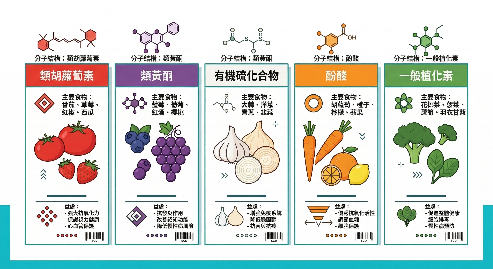
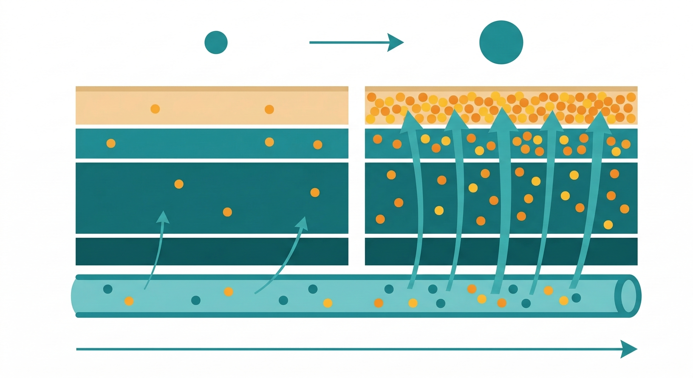

有一個問題，大部分人從來沒有認真想過：

你吃進去的蔬菜水果，裡面的營養素，有多少比例真的進到你的細胞裡？

不是「有沒有吃」的問題。是「吃了之後，細胞拿到多少」的問題。

這兩件事，差距比你想的大。

---

## 台灣人的蔬果缺口，比官方數字更嚴重

衛生福利部國民健康署在 2013–2016 年（第一波）與 2017–2020 年（第二波）兩次「國民營養健康狀況變遷調查」顯示，台灣人每天的蔬菜和水果攝取量和建議量（蔬菜 3–5 份、水果 2–4 份）相比嚴重不足——**且兩波調查之間幾乎沒有改善**。

最新的第二波結果（2022年5月發布）明確指出：各性別、年齡層的蔬菜、水果攝取量仍大幅低於飲食指南建議，所有年齡層的膳食纖維攝取量均未達建議量。

第三波調查（2022–2025年）目前仍在進行中，結果尚未公布。

這還只是「份數」的缺口。

份數沒達標，代表的是植化素——這些藏在蔬果顏色裡的關鍵抗氧化物質——的攝取量同樣嚴重不足。

但問題遠遠不只是吃的量不夠而已，吃足量只是基本。

---

## 植化素是什麼，為什麼它重要

植化素（Phytochemicals）是植物中的天然化學物質，也叫植物營養素（Phytonutrients），有人稱它為「21世紀的維生素」。

它不是維生素，也不是礦物質。它是一個更龐大的家族，目前已知超過 25,000 種，依結構可以分為幾大類：

**類胡蘿蔔素**（Carotenoids）——存在於紅、黃、橙色蔬果中，包含 β-胡蘿蔔素、茄紅素、葉黃素、玉米黃素、蝦青素等。這一類是脂溶性抗氧化物，也是 Prysm iO 掃描儀所量測的類別。

**類黃酮素**（Flavonoids）——存在於各色蔬果、茶、可可中，包含槲皮素、花青素、兒茶素、白藜蘆醇等。這一類的抗氧化和抗發炎作用是目前研究最多的植化素群。

**有機硫化物**（Organosulfur compounds）——存在於蔥蒜類蔬菜，包含蒜素、麩胱甘肽前驅物等。麩胱甘肽是細胞內最重要的抗氧化物之一。

**酚酸類**（Phenolic acids）——存在於咖啡、全穀類、莓果中，包含綠原酸、鞣花酸等。

這些植化素的共同作用，是幫你的細胞做三件事：**清除自由基、抑制慢性發炎、啟動細胞內建的抗氧化酵素系統（Nrf2 通路）。**

這不是保健品廣告語言。這是目前抗老化研究裡，其中一條最確定的機制路徑。

植化素五大類與蔬果顏色對應
---

## 就算你吃夠了，細胞不一定拿得到

這是大部分人不知道的部分。

植化素的吸收，有幾個不容忽視的障礙：

**烹調方式的影響**——許多植化素對熱敏感，水煮會讓大量的水溶性植化素流失到鍋中的水裡。β-胡蘿蔔素是例外，它需要加熱和油脂才能提高吸收率——這也是為什麼生吃胡蘿蔔的β-胡蘿蔔素吸收率很低。

**脂溶性植化素需要搭配油脂**——類胡蘿蔔素是脂溶性的，空腹或低脂飲食時吸收率會大幅下降。沙拉如果不加油醋醬，裡面的類胡蘿蔔素吸收效率可能只有加了油脂之後的 20–30%。

**個人腸道菌相的差異**——部分植化素需要腸道細菌的代謝才能轉換成有活性的形式，例如尿石素（Urolithin A）需要特定菌種才能從石榴鞣花酸轉換而來。菌相不同的人，吸收同樣食物的有效成分量差異可以高達數倍。

**食物基質的影響**——同樣的植化素，在不同的食物基質中，生物利用率可以差異極大。茄紅素在番茄醬裡的吸收率，比新鮮番茄高出數倍——因為加工過程破壞了細胞壁，讓茄紅素更容易釋出。

**慢性發炎狀態本身會消耗植化素儲備**——這是最容易被忽略的一點。當身體處於慢性低度發炎狀態，類胡蘿蔔素等抗氧化物會被優先調度去對抗氧化壓力，皮膚和組織的儲存量加速下降。你吃進去的量，還沒來得及補充儲備，就先被消耗掉了。

---

## 你現在的植化素儲備，在哪個水位？

這個問題，靠感覺是回答不了的。

吃了多少份蔬果，不等於你的細胞實際拿到多少。

目前有一種非侵入性的方式可以直接量測這件事：**皮膚類胡蘿蔔素濃度**。

你吃進去的類胡蘿蔔素（β-胡蘿蔔素、茄紅素、葉黃素等），會在 2- 4 週內慢慢沉積在皮膚的角質層。

這個沉積量，反映的是你這段時間飲食、吸收、消耗的綜合結果——也就是你的抗氧化防禦實際到位了多少。

這個數字和血液中流動的類胡蘿蔔素不同。

血液數值會因為你今天吃了什麼而快速波動。皮膚儲存量，是更穩定的「底線指標」。

---

## 你知道自己現在缺多少嗎

台灣人的蔬果攝取量嚴重不足，這是已知的事。

但就算你相信自己吃的比平均多，也有烹調方式、油脂搭配、腸道菌相、慢性發炎消耗等四道關卡，決定這些植化素實際能進入細胞多少。

這件事，值得有一個具體的數字，而不是繼續靠感覺猜。

---

我整理了一份【身體警報自我檢測清單】，裡面包含了幾個和植化素儲備高度相關的身體訊號——感冒的頻率、皮膚狀態、疲勞恢復速度——幫你先系統化評估你的狀況。

**加我 LINE，我把清單傳給你。**

👉 [加LINE索取【身體警報自我檢測清單】](https://line.me/ti/p/@fer7932k)

---

**延伸閱讀：**
- [你的細胞儲備，正在被一個你感覺不到的過程悄悄耗光](/blog/chronic-inflammation/cell-reserve-chronic-depletion/) ← 第5篇
- [你的身體老化速度，有辦法知道嗎？——三種方法，從專業到居家](/blog/precision-health-tools/aging-speed-measurement-methods/) ← 第7篇
- [Prysm iO 分數偏低的人，第一步先做這件事](/blog/intervention-optimization/lifepak-foundation-nutrition/) ← LifePak 產品篇

---

## 參考資料

01. 衛生福利部國民健康署, 2022. [國民營養健康狀況變遷調查成果報告 2017–2020 年](https://www.hpa.gov.tw/Pages/List.aspx?nodeid=3998)（第二波，2022年5月發布）.
02. 衛生福利部國民健康署, 2016. [國民營養健康狀況變遷調查成果報告 2013–2016 年](https://www.hpa.gov.tw/Pages/Detail.aspx?nodeid=3999&pid=11145)（第一波，2022年5月發布）.
03. Brenda M Roe et al., 2013. [Carotenoid bioavailability is higher from salads ingested with full-fat than with fat-reduced salad dressings.](https://pubmed.ncbi.nlm.nih.gov/15735074/) *Am J Clin Nutr.* 80(2):396-403.
04. Achim Bub et al., 2000. [Moderate intervention with carotenoid-rich vegetable products reduces lipid peroxidation in young, healthy male subjects.](https://pubmed.ncbi.nlm.nih.gov/10648262/) *J Nutr.* 130(9):2200-6.
05. Werner Gellermann et al., 2002. [Noninvasive laser Raman detection of carotenoid skin pigmentation in volunteers.](https://pubmed.ncbi.nlm.nih.gov/12428194/) *J Invest Dermatol.* 119(6):1420-5.
06. Jess D Whittaker et al., 2021. [Urolithin A: a diet-derived metabolite with effects on aging and healthspan.](https://pubmed.ncbi.nlm.nih.gov/34433748/) *Nutrients.* 13(8):2552.
