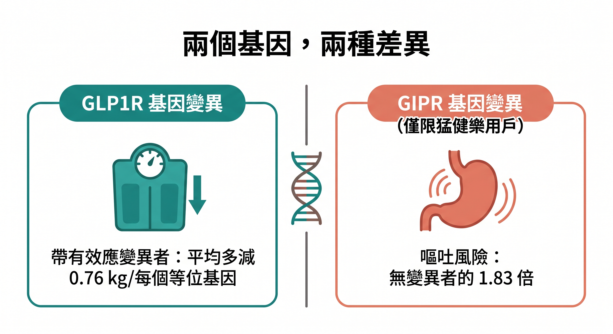
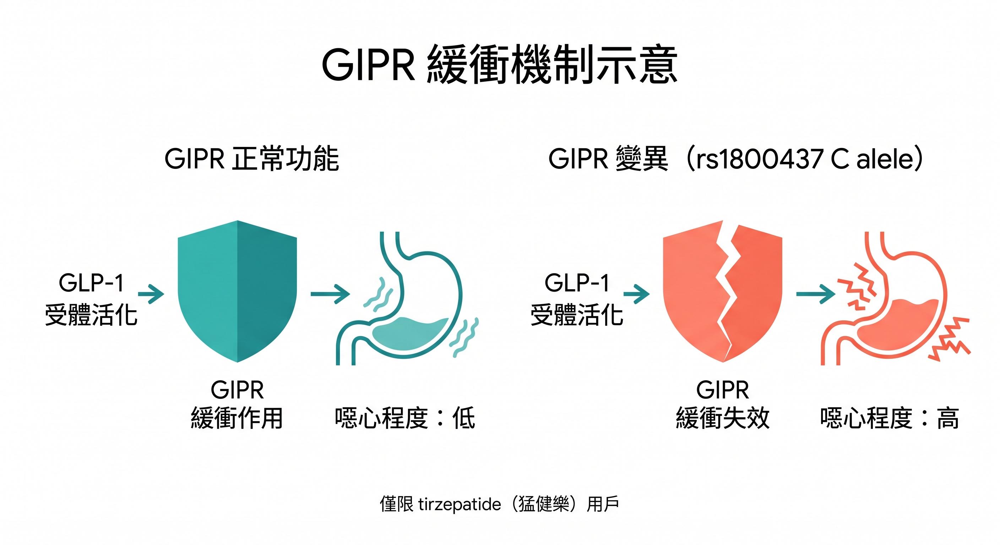

你認識的人裡面，一定有這樣的對比：

同樣打瘦瘦針，有人輕鬆瘦了十幾公斤，有人打了三個月幾乎沒動靜。

有人完全沒什麼不舒服，有人噁心嘔吐到快放棄。

你可能以為是自己「意志力不夠」、「飲食控制沒做好」，或是「體質比較差」。

2026 年 4 月一篇刊登在《Nature》的研究告訴你：**這很可能不是你的問題，而是你的基因。**

---

## 這是第一個找到直接遺傳證據的大型研究

美國 23andMe 研究所對 **27,885 名 GLP-1 藥物使用者**進行了全基因組關聯研究（GWAS）。

這個規模不小——接近三萬人，都是真實使用過 Semaglutide（週纖達/Wegovy/Ozempic）或 Tirzepatide（猛健樂/Mounjaro）的人，自行回報了減重效果與副作用。

研究在兩個基因上找到了清楚的訊號：**GLP1R** 和 **GIPR**。

這兩個基因，正好就是這些藥物作用的受體所在。

找到這裡，在科學上有明確的生物機制支撐——不是統計巧合。

---

## 第一個發現：GLP1R 基因影響你能瘦多少

研究找到一個 GLP1R 基因上的錯義突變（rs10305420）。

帶有這個變異的人，使用 GLP-1 藥物的減重效果更好：**每帶一個效應等位基因，預期平均多減約 0.76 公斤**。帶兩個的，多減約 1.5 公斤。

這個效果量在統計上非常顯著（P = 2.9×10⁻¹⁰），而且在另一個獨立的電子病歷資料庫（All of Us）也得到了驗證。

---

## 要誠實說的一件事

0.76 公斤，聽起來不多。

沒錯，相較於這類藥物動輒 10 – 20% 的整體減重效果，每個等位基因多減不到 1 公斤，在臨床上屬於中等偏小的效果量。

**遺傳因素不是全部。** 飲食控制、運動習慣、用藥劑量、個人的代謝基礎——這些仍然是決定結果的主要因素。

但這個研究的意義不在「基因能預測你瘦多少」，而在於：**它第一次提供了直接的遺傳證據，說明 GLP-1 的受體本身的個體差異，是導致反應不同的生物機制之一。**

這不是玄學，是分子藥理學。

---

## 第二個發現：GIPR 基因影響你會不會嘔吐

這個發現更有臨床意義。

研究在 GIPR 基因上找到另一個變異（rs1800437），與 **噁心、嘔吐的副作用風險** 顯著相關。

關鍵是：**這個效果只出現在使用 Tirzepatide（猛健樂）的族群，Semaglutide（週纖達） 使用者完全看不到這個訊號。**

原因是什麼？

tirzepatide 是雙重受體促效劑，同時作用於 GLP-1R 和 GIPR。

科學家認為，GIP 受體通常扮演一個「緩衝角色」，抵消 GLP-1 激活帶來的噁心感——這也是猛健樂整體而言副作用比週纖達略少的原因之一。

但帶有 rs1800437 變異（C 等位基因）的人，這個緩衝效果可能被削弱，導致嘔吐風險上升。

帶有這個變異的人，使用 Tirzepatide 出現嘔吐的機率是無變異者的 **1.83 倍**。

如果一個人同時帶有 GLP1R 和 GIPR 兩個相關變異，使用 Tirzepatide 的嘔吐風險估計是無變異者的 **15 倍**。

---

## 打了沒效，或副作用很強，你可以怎麼想

這個研究的實際意義，對正在使用或評估 GLP-1 藥物的人來說，有幾個層次：

**如果你打了效果不明顯：**
不一定是飲食做得不夠好。GLP1R 受體的個體差異是真實的生物機制。這不代表你無法從 GLP-1 獲益，但可能提示你的反應本來就在光譜的另一端——需要更長時間、更高劑量、或搭配其他介入才能看到效果。

**如果你用猛健樂副作用特別嚴重：**
GIPR 基因變異是目前最有力的遺傳解釋。如果嘔吐反應在慢慢加量後仍然無法緩解，和醫師討論換用純 GLP-1 藥物（如 Semaglutide）是合理的選項。

**這個研究還不能直接用來做藥物選擇：**
目前的效果量相對保守，尚未達到足以在臨床常規實踐中直接據此選藥的水準。但研究方向已經很清楚：未來精準醫療的框架下，基因篩查很可能成為 GLP-1 處方決策的參考依據之一。

---

## 為什麼這件事和「抗老」有關

你可能注意到，AGELOCKED 討論 GLP-1 的切入點，不只是減重。

GLP-1 藥物之所以在抗老科學界受到重視，是因為它直接作用於 IGF-1 受體、活化 AMPK/PGC-1α 粒線體路徑、全身抑制慢性發炎——這些是老化的核心機制，不只是體重的問題。

但如果你的 GLP1R 基因本來就讓你對這類藥物的反應偏低，這些機制上的獲益也可能相對有限。

**這正是精準介入的核心邏輯：同樣的工具，在不同的生物條件下，效果不同。**

這也是為什麼了解你自己的身體基準狀態，在任何介入之前都是必要的第一步。

---

## 延伸閱讀

- [瘦瘦針不只讓你瘦——它正在改變你體內的老化基因](/blog/chronic-inflammation/glp1-gene-aging-reversal/)
- [抑制 IGF-1 還不夠——壽命的關鍵，藏在你的粒線體 DNA 裡](/blog/chronic-inflammation/igf1-mitochondria-dna-longevity/)
- [表觀遺傳時鐘：你的生物年齡，和身分證上的數字不一樣](/blog/chronic-inflammation/multivitamin-lifepak-slow-aging-clock/)

---

## 參考資料

01. Su QJ et al., 2026. [Genetic predictors of GLP1 receptor agonist weight loss and side effects](https://www.nature.com/articles/s41586-026-10330-z) *Nature*
02. Loos RJF, 2026-04-08, [Genetics reveal why people respond differently to GLP-1 weight-loss drugs](https://www.nature.com/articles/d41586-026-00905-1) *Nature* （News & Views）
03. 23andMe Research Institute, 2026-04-08, [New 23andMe research institute study identifies genetic predictors for GLP-1 weight loss efficacy and side effects](https://mediacenter.23andme.com/press-releases/new-23andme-research-institute-study-identifies-genetic-predictors-for-glp-1-weight-loss-efficacy-and-side-effects/) *23andMe Media Center*
04. Neeland IJ et al., 2024. [Changes in lean body mass with glucagon-like peptide-1-based therapies and mitigation strategies](https://pubmed.ncbi.nlm.nih.gov/38937282/) *Diabetes Obes Metab.* Suppl 4:16-27.
