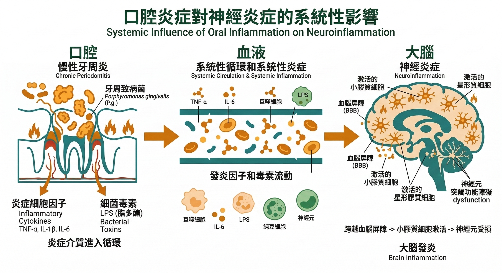

你上一次刷牙，牙齦有沒有出血？

如果有，你大概告訴自己：刷太用力了，或者最近比較累。

然後就沒有然後了。

這是幾乎所有人的反應。牙齦出血太常見，常見到我們認為它不重要。

---

但 2019 年，一篇發表於《Science Advances》的研究讓口腔健康領域的人都沉默了一下。

研究者在 **阿茲海默症患者的大腦切片**裡，找到了牙周病的主要致病菌——**牙齦卟啉單胞菌（Porphyromonas gingivalis）**。

不只找到了細菌，還找到了它分泌的毒素——**牙齦蛋白酶（Gingipain）**——直接沉積在神經組織裡。

牙菌斑裡的東西，跑進了大腦。

---

## 它是怎麼進去的

口腔和大腦，看起來距離很遠。

但 2024-2025 年的研究確認，牙周病菌進入大腦有 **兩條路徑**，不只是一條。

**第一條：血液循環（菌血症）**——當牙周組織反覆發炎，牙齦屏障被破壞，細菌就有機會進入血液循環——這個現象叫做**菌血症（Bacteremia）**，程度輕微時你完全感覺不到，但它每天都可能發生：刷牙、用牙線、甚至咀嚼食物的時候。P. gingivalis 進入血流後，其毒素 **牙齦蛋白酶（Gingipain）**會破壞血腦屏障的通透性，讓細菌和發炎物質得以滲入腦組織。

**第二條：神經路徑（三叉神經 / 嗅神經）**——這是比菌血症更直接的路徑。P. gingivalis 產生的外膜囊泡（OMVs）能沿著三叉神經或嗅神經的軸突，不經過血液直接進入中樞神經系統——就像一輛不走高速公路、走山路直達的車。

這兩條路徑加在一起，解釋了為什麼 100% 有心血管疾病的患者冠狀動脈中都能找到 P. gingivalis——這種菌的全身擴散能力，遠比一般人以為的強。

進入大腦之後，發生了什麼？

P. gingivalis 觸發 **兩個阿茲海默症的核心病理**：

一是促進 **類澱粉蛋白（Aβ）斑塊**沉積——這是阿茲海默症最經典的病理標誌，長期以來是藥物研發的主要靶點。

二是觸發 **tau 蛋白過度磷酸化**，形成神經纖維纏結（neurofibrillary tangles）——這是阿茲海默症的第二個核心病理標誌，與認知衰退的速度直接相關。

同時，大腦裡的免疫細胞 **微膠細胞（Microglia）** 被持續激活，進入慢性過度激活狀態，開始分泌過量的神經毒性物質，神經元開始凋亡。

認知功能，開始下滑。

---

## 數字說明了什麼

研究不只有一篇。這條「口腔-大腦」的發炎路徑，過去二十年累積了越來越清晰的證據。

**牙周病診斷後十年內，失智症風險加倍：** 多項前瞻性研究的綜合分析顯示，牙周病患者在確診後十年內，發展出阿茲海默症的風險是無牙周病者的 **兩倍**。這個數字與吸菸、糖尿病等已確立的失智症危險因子屬同一量級。

**缺牙和失智症的直接關聯：** 2012 年，日本神奈川齒科大學的研究追蹤了 4,425 位 65 歲以上長者四年，結果發現：牙齒少於 20 顆且沒有裝假牙的人，罹患失智症的風險是牙齒健全者的**近 2 倍**。

**阿茲海默症患者的牙齒狀況：** 名古屋大學的研究比較了健康老人與阿茲海默症患者的口腔狀況，發現病患平均只有健康老人 **1/3** 的牙齒，而且比健康老人**早了 20 年**開始掉牙。

**咀嚼能力與認知衰退：** 2020 年《Aging》期刊一份追蹤 22 年、554 位受試者的研究發現：咀嚼能力的下降程度，與智力衰退的速度 **呈正相關**。

這些數字描述的不是「缺牙比較不方便」。

它們描述的是：口腔的健康狀態，影響著大腦老化的速度。

---

## 牙周病為什麼這麼普遍卻這麼被忽略

台灣成人牙周病盛行率超過 90%，但大多數人不知道自己有牙周病。

原因很簡單：牙周病的早期幾乎 **完全沒有疼痛感**。

牙齦出血、輕微腫脹、偶爾口臭——這些「太常見」的症狀，我們習慣了就忽視。

但這就是牙周病在進展的訊號，也是慢性發炎正在擴散的訊號。

牙周病的致病機制很清楚：口腔細菌形成 **牙菌斑**，長期刺激牙齦，引發局部發炎反應。

如果沒有處理，發炎深入牙周韌帶和齒槽骨，破壞支撐牙齒的結構，最終導致牙齒鬆動和脫落。

但在這整個過程中，發炎反應不只停在牙齦。

它同步在血液裡擴散，同步在全身的器官裡製造損傷。

---

## 這和你整體的老化速度有什麼關係

這裡需要引入一個比較大的框架。

老化研究在過去二十年裡建立了一個核心概念：**Inflammaging**——老化本身就是一種慢性低度的全身性發炎狀態。

幾乎所有最常見的老化相關疾病——心血管疾病、第二型糖尿病、阿茲海默症、肌肉流失——背後都有這個共同的發炎底火在燒。

牙周病，在這個框架裡是什麼？

它是 **讓發炎底火持續加料的一個輸入來源**。

每一次刷牙時牙齦出血，每一次咀嚼時細菌入血，都是在讓那個底火再燒旺一點。

這不是今天感覺得到的事，但它在十年、二十年的時間軸上，確實在改變你的生理老化速度。

這就是為什麼口腔健康不只是牙科問題。

---

## 你現在可以做的事

不需要等到缺牙才開始處理，而且現在有臨床數據說明早點處理是有效的。

2025 年紐約大學（NYU）發表於《Neuroepidemiology》的一項 12 年前瞻性世代研究追蹤了 866 位有牙周症狀的老年人。

結果發現：**有接受牙周治療的人，失智症發病率比沒有治療的人低了 38%**，認知功能的年度下降速度也顯著較慢。

這個效果在不同性別、種族和教育程度的受試者中都一致。

另一項德國的研究（Schwahn et al.）對 177 位牙周治療患者進行了長達 7 年以上的腦部影像追蹤，發現接受牙周治療者的阿茲海默症相關腦萎縮程度，相當於從第 50 百分位下降到第 37 百分位——意即牙周治療實際上延緩了大腦老化。

這些數字說的是：定期洗牙和牙周治療，不只是牙科保健，而是有臨床根據的失智症預防策略。

**定期洗牙（每半年一次）** 是目前最有效的牙周病預防手段，可以清除日常刷牙無法去除的牙結石，讓牙齦的慢性發炎來源減少。

**正確刷牙習慣**——巴氏刷牙法、配合牙線或牙間刷——可以顯著降低牙菌斑的累積速度。

但更根本的問題是：口腔的慢性發炎只是全身性 Inflammaging 的一個切面。

如果你的整體發炎狀態沒有被管理，處理口腔只是局部處理，不是解決問題的全部。

---

**接下來讀這篇：**

[抗慢性發炎就是在抗老化——這不是廣告詞，這是2000年就確立的科學](/blog/chronic-inflammation/抗慢性發炎就是在抗老化——這不是廣告詞，這是2000年就確立的科學/) ← Inflammaging 篇（了解全身性慢性發炎的機制與管理邏輯）

---

還不確定自己的身體目前累積了多少慢性發炎？

加入我們的 LINE，免費領取【身體警報自我檢測清單】，五分鐘找出你身體正在發出的訊號。

[立即領取 →](https://line.me/ti/p/@fer7932k)

---

## 參考資料

01. Dominy SS et al., 2019. [Porphyromonas gingivalis in Alzheimer's disease brains: Evidence for disease causation and treatment with small-molecule inhibitors.](https://pubmed.ncbi.nlm.nih.gov/30746447/) *Science Advances.* 5(1):eaau3333.
02. Yamamoto T et al., 2012. [Dental status and incident falls in older Japanese adults: A prospective cohort study.](https://pubmed.ncbi.nlm.nih.gov/22716148/) *Psychosom Med.* 74(4):385-391.
03. Ando Y et al., 2020. [Masticatory function and cognitive decline in the elderly: A 22-year follow-up study.](https://pubmed.ncbi.nlm.nih.gov/32157747/) *Aging (Albany NY).* 12(4):3080-3092.
04. Ide M et al., 2016. [Periodontitis and cognitive decline in Alzheimer's disease.](https://pubmed.ncbi.nlm.nih.gov/26822653/) *PLoS One.* 11(3):e0151081.
05. Franceschi C, Campisi J, 2014. [Chronic inflammation (inflammaging) and its potential contribution to age-associated diseases.](https://pubmed.ncbi.nlm.nih.gov/24833586/) *J Gerontol A Biol Sci Med Sci.* 69 Suppl 1:S4-9.
06. Kamer AR et al., 2008. [Alzheimer's disease and peripheral infections: The possible contribution from periodontal infections, model and hypothesis.](https://pubmed.ncbi.nlm.nih.gov/18325386/) *J Alzheimers Dis.* 13(4):437-449.
07. Qi X et al., 2025. [Association of gum treatment with cognitive decline and dementia risk among older adults with periodontal symptoms: a 12-year prospective cohort study.](https://pubmed.ncbi.nlm.nih.gov/39053434/) *Neuroepidemiology.* 59(4):313-322.
08. Schwahn C et al., 2022. [Effect of periodontal treatment on preclinical Alzheimer's disease.](https://alz-journals.onlinelibrary.wiley.com/doi/10.1002/alz.12378) *Alzheimer's & Dementia.* 18(7):1175-1185.
09. Jiang Y et al., 2025. [Porphyromonas gingivalis-induced periodontitis promotes neuroinflammation and neuronal loss associated with dysfunction of the brain barrier.](https://pubmed.ncbi.nlm.nih.gov/40552124/) *Front Cell Infect Microbiol.* 15:1559182.
10. Liu S et al., 2024. [Porphyromonas gingivalis and the pathogenesis of Alzheimer's disease.](https://pubmed.ncbi.nlm.nih.gov/36597758/) *Crit Rev Microbiol.* 50(2):127-137.
11. Cho HA et al., 2024. [Association of periodontal disease treatment with mortality in patients with dementia: a population-based retrospective cohort study.](https://www.nature.com/articles/s41598-024-55272-6) *Sci Rep.* 14:5243.
