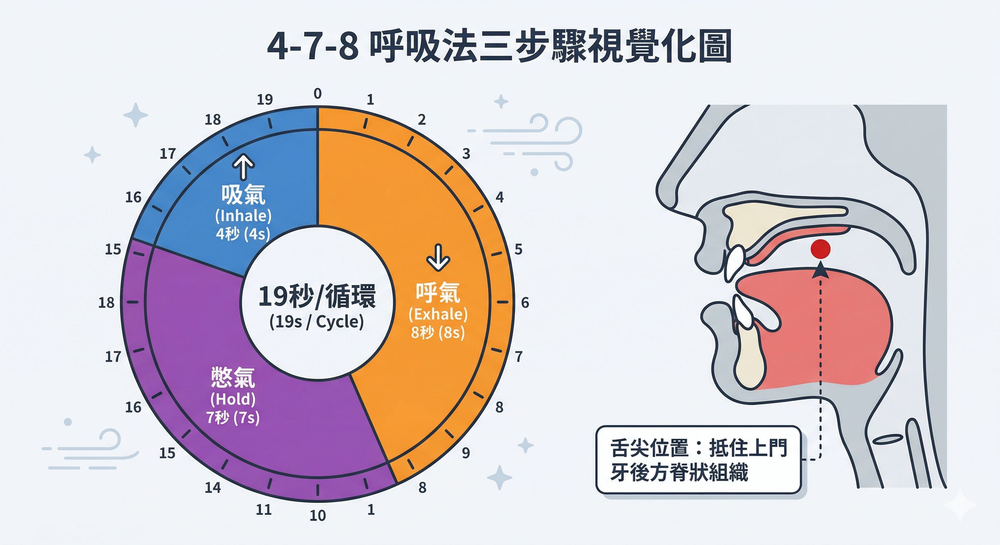
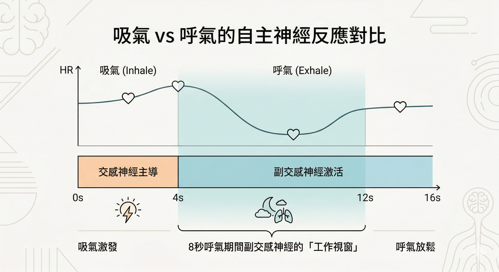
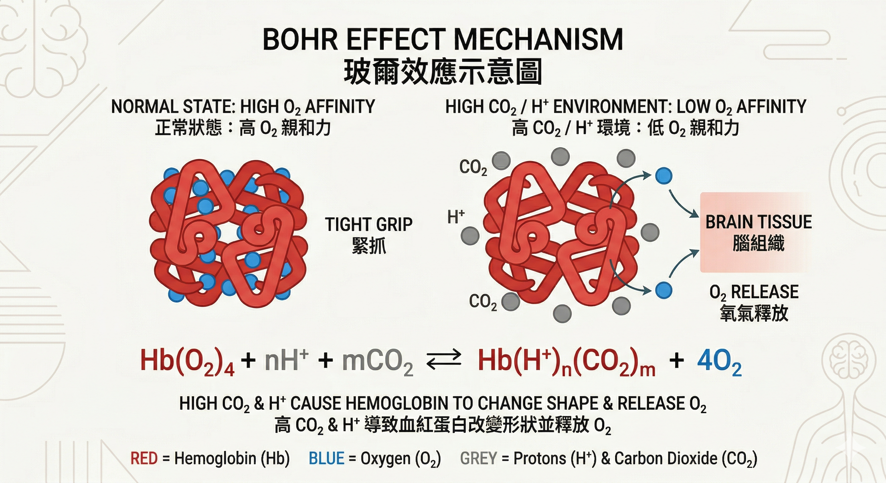

你躺下去了，但腦袋沒有。

今天沒說完的話、明天要處理的事、那個一直懸在心裡的問題，它們不管幾點都還在轉。

你試過數羊。試過聽白噪音。試過把手機放到另一個房間。

有沒有一個方法，可以從生理上，真正切斷這個迴路？

有，而且只需要 19 秒。

---

## 4-7-8 不是玄學，是神經系統的物理開關

4-7-8 呼吸法由哈佛大學醫學院訓練、整合醫學專家 **Andrew Weil博士** 於 2015 年推廣，但它的根源更古老，來自印度瑜伽的「呼吸控制法（Pranayama）」，已有數千年歷史。

方法極其簡單：

**① 吸氣 4 秒**：閉上嘴，用鼻子平靜吸氣，心裡默數到 4。

**② 憋氣 7 秒**：屏住呼吸，數到 7。

**③ 呼氣 8 秒**：用嘴巴完全呼氣，發出「呼，」的聲音，數到 8。

一個循環共 19 秒，重複 4 次為一組。

注意：Weil博士強調，**4:7:8的比例比絕對秒數更重要**。

如果憋氣 7 秒太長，可以按比例縮短（例如 2 - 3. 5 - 4 秒），效果一樣成立。

---

## 為什麼它有效？兩個生理機制

### 機制一：迷走神經的「長呼氣激活」

你的自主神經系統有兩個模式：

**交感神經（備戰）**：心跳加快、思緒快速、肌肉緊繃，這是你躺下來腦袋還在轉的狀態。

**副交感神經（休養）**：心跳放慢、血壓下降、大腦準備休眠。

切換的關鍵在於**迷走神經**。

當你吸氣時，心率微微加快；當你呼氣時，迷走神經被激活，心率下降。

4-7-8法將呼氣時間（8秒）設計為吸氣（4秒）的兩倍，就是為了**最大化副交感神經的工作時間**，讓每一個呼氣都成為迷走神經的刺激機會。

研究顯示，4-7-8 呼吸後，高頻心率變異度（HF-HRV，副交感神經活性指標）顯著上升，心率與收縮壓明顯下降。

   

### 機制二：憋氣 7 秒的玻爾效應（Bohr Effect）

這是 4-7-8 法與普通深呼吸最大的差異，也是最常被誤解的機制。

網路上的說法通常是「CO₂ 升高觸發副交感神經」，這個說法**方向正確，但解釋不完整**。

正確的機制是：

憋氣 7 秒 → 血液中 CO₂ 濃度輕微上升 → 血液 pH 值微降（偏酸性）

根據玻爾效應，這個微酸環境會讓血紅蛋白釋放更多氧分子進入腦組織：

Hb(O₂)ₙ + H⁺ + CO₂ ⇌ Hb(H⁺)(CO₂) + nO₂

同時，CO₂ 是天然的血管擴張劑，輕微的 CO₂ 蓄積讓腦部微血管擴張、腦血流量增加，緩解焦慮引發的腦部血管收縮與低氧狀態。

簡單說：**憋氣 7 秒讓大腦得到更多氧氣，物理性地讓腦部降溫。**

   

---

## 澄清：「美軍秒睡法」說的其實不是這個

中文網路將 4-7-8 冠以「美軍秒睡公式」，這是一個常見的混淆。

真正的 **「美軍睡眠法」** 起源於二戰，由田徑教練 Lloyd Bud Winter 為海軍飛行員開發，核心是 **漸進式肌肉放鬆＋意象誘導**：

從臉部放鬆開始，依序向下放鬆全身肌肉，清空大腦 10 秒，在約 2 分鐘內入睡。

美軍與特種部隊確實廣泛使用呼吸法，但主要使用的是 **方盒呼吸（Box Breathing，4-4-4-4比例）**，用於戰鬥中保持冷靜警覺，目的是「維持清醒專注」，而不是入睡。

| 技術 | 目的 | 比例 | 使用場景 |
|:---|:---|:---|:---|
| 美軍睡眠法（Bud Winter） | 快速入睡 | 肌肉放鬆＋意象 | 戰場疲勞恢復 |
| 方盒呼吸（Box Breathing） | 冷靜警覺 | 4-4-4-4 | 戰鬥/決策前 |
| * *4-7-8 呼吸法** | **入睡/深度放鬆** | ** 4-7-8 ** | **睡前/急性焦慮** |

4-7-8 之所以被掛上「美軍」，主要是網路傳播中「呼吸法」與「軍隊效能」兩個標籤被強行結合，並非來自五角大樓的官方訓練手冊。

---

## 臨床數據怎麼說

這裡是目前最有力的幾組數據：

**大學生 14 天介入研究**
- 對象：60 位有睡眠困擾的大學生
- 方式：每日兩次 4-7-8 呼吸，持續14天
- 結果：匹茲堡睡眠品質指數（PSQI）從 9.5±3.5 降至 5.7±2.9
- 統計顯著性：p<0.001，效應量 Cohen's d=0.95（巨大級）

**COPD患者30天研究**
- 睡眠品質良好比例：從 8.9% 升至 84.4%
- 平均 PSQI：從 13.33 降至 4.93

**心率變異度研究（2022年，泰國）**
- 43位健康成人
- 結果：HRV高頻成分顯著上升，心率與收縮壓顯著下降
- 在未有睡眠剝奪的組別效果更明顯

需要說明的是：目前針對 4-7-8 法本身（而非廣義慢呼吸）的大型隨機對照試驗數量仍然有限，現有研究樣本偏小。

這不代表方法無效，而是代表科學實證的程度仍在累積中。

---

## 「65%成功率」「6–8 週顯著提升」，這些數字可信嗎？

你看到的這類說法，通常沒有可追溯的論文來源。

有研究支持的事實是：連續練習14天以上，睡眠品質有統計顯著改善；而長期練習確實會重塑腦幹化學感受器對 CO₂ 的敏感度，讓靜息呼吸頻率下降，神經系統整體抗壓韌性提升。

但「65%」這個數字，以及「6–8 週大幅縮短入睡潛伏期」的具體說法，目前找不到對應的同行評審研究。這屬於過度渲染。

如果你看到某篇文章引用這類精確數字，但沒有 DOI 或期刊來源，請打折扣。

---

## 怎麼開始練，以及安全提醒

**標準操作：**

1. 背部挺直坐下，或平躺皆可
2. 舌尖抵住上排門牙後方的脊狀組織（全程保持）
3. 先用嘴完全呼氣，發出「呼」聲
4. 閉嘴，鼻子吸氣 4 秒
5. 屏息 7 秒
6. 嘴巴呼氣 8 秒，發出「呼」聲
7. 重複4次為一組

**第一個月：每次不超過 4 個循環。** 之後可增加至 8 個循環。

**初學者可能感到輕微頭暈**，這是血氧與 CO₂ 平衡快速調整的正常反應，不是缺氧。建議坐姿或臥姿練習，避免站立時進行。患有重度哮喘或特定心臟疾病者，建議先諮詢醫師。

---

## 這跟你的睡眠問題有關係嗎？

4-7-8 呼吸法處理的是「神經系統備戰狀態無法關機」這個入口問題。

它能做到的是：在你躺下的那 15 分鐘內，幫神經系統強制踩煞車，讓身體進入適合入睡的生理狀態。

它做不到的是：修復長期睡眠不足造成的類淋巴系統損傷、逆轉已經下降的 BDNF 訊號、或解決慢性發炎對神經新生的抑制。

換句話說：這是一個好用的**入口工具**，但不是全部的解答。

如果你的狀況是「躺下去腦袋停不下來」，從今晚就可以開始。

如果你的狀況是「睡了但沒有睡好、醒來還是累」，你需要處理的是更深層的睡眠結構問題。

👉 想了解大腦在深度睡眠中實際發生什麼？
閱讀：[你每晚都有一個清洗大腦的機會——但大多數人都錯過了](/blog/chronic-inflammation/sleep-glymphatic-brain-detox/)

---

## 延伸閱讀

- [你每晚都有一個清洗大腦的機會——但大多數人都錯過了](/blog/chronic-inflammation/sleep-glymphatic-brain-detox/)
- [壓力正在改變你大腦裡的蛋白質——從粒線體到情緒的分子路徑](/blog/body-signals/stress-mitochondria-bdnf-depression/)
- [MYND360如何在睡前一小時幫大腦強制關機](/blog/intervention-optimization/mynd360-sleep-brain-shutdown/)

---

## 參考資料

01. Vierra J., et al., 2022. [Effects of sleep deprivation and 4-7-8 breathing control on heart rate variability, blood pressure, blood glucose, and endothelial function in healthy young adults.](https://pubmed.ncbi.nlm.nih.gov/35822447/) *Physiological Reports.* 10(13):e15389.
02. Kurt Aktaş G. & İlgin V., 2023. [The Effect of Deep Breathing Exercise and 4-7-8 Breathing Techniques Applied to Patients After Bariatric Surgery on Anxiety and Quality of Life.](https://pubmed.ncbi.nlm.nih.gov/36480101/) *Obesity Surgery.* 33:920–929.
03. Marchant J., 2025. [Comparing the Effects of Square, 4-7-8, and 6 Breaths-per-Minute Breathing Conditions on Heart Rate Variability, CO₂ Levels, and Mood.](https://pubmed.ncbi.nlm.nih.gov/39864026/) *Brigham Young University Thesis.* 50(2):261-276.
04. Weil A., 2015. The 4-7-8 Breathing Exercise. DrWeil.com.
05. Winter L. B., 1981. *Relax and Win: Championship Performance.* A.S. Barnes.
