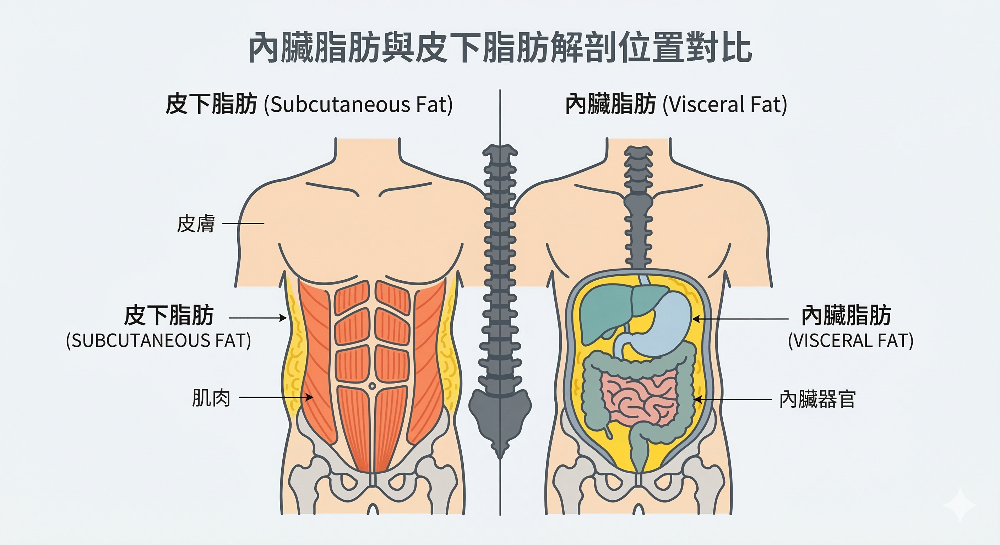

*同樣的 BMI，腰圍才是代謝風險的真正指標*

你明明沒有暴飲暴食，只是聚餐會多吃一點多喝一點卻發現褲子腰圍每隔一兩年就要往上買。

刻意少吃的那段時間，體重短暫下來，很快又回來。

每次脂肪回來，特別喜歡聚集在肚子。

健檢報告上，空腹血糖從 95 爬到 101、三酸甘油酯從 120 變成 158，醫生說「再觀察看看」。

但你知道那條線正在往錯誤的方向移動。

**這不只是意志力的問題，更是訊號的問題。**

---

## 內臟脂肪和皮下脂肪，是完全不同的器官

大多數人對「肚子脂肪」的認知是：吃太多、動太少，所以堆在那裡。

這個理解只說對了一半。

**皮下脂肪**（Subcutaneous Fat）是被動的能量倉庫，相對惰性，捏得到的那層。

**內臟脂肪**（Visceral Adipose Tissue，VAT）則是一個高度活躍的內分泌器官——它持續分泌細胞激素、干擾荷爾蒙訊號、製造慢性低度發炎。

它包圍著肝臟、胰臟、腸道，任何它釋放的物質都可以直接進入 **門靜脈循環**，繞過周邊過濾機制，對器官功能產生直接影響。

*內臟脂肪位於腹腔深層，直接包圍肝臟與消化器官*

這就是為什麼腰圍比 BMI 更能預測代謝疾病風險。

**台灣衛生署標準：男性腰圍 ≥ 90 cm、女性 ≥ 80 cm，即達代謝症候群腰圍警戒值。**

---

## 代謝症候群：五個指標，三個中就要注意

| 指標 | 警戒值 |
|------|--------|
| 腰圍 | 男 ≥ 90 cm，女 ≥ 80 cm |
| 血壓 | 收縮壓 ≥ 130 或舒張壓 ≥ 85 mmHg |
| 空腹血糖 | ≥ 100 mg/dL |
| 三酸甘油酯 | ≥ 150 mg/dL |
| HDL 好膽固醇 | 男 < 40，女 < 50 mg/dL |

五項中符合三項以上，即為代謝症候群（Metabolic Syndrome）。

但真正值得警惕的是：**這五個指標並不是平行的獨立風險，它們互相驅動。**

腰圍增加 → 胰島素阻抗惡化 → 血糖、血脂同步偏移 → 血壓隨之上升。

這不是巧合，是同一個惡性循環的不同切面。

---

## 20 歲和 60 歲的代謝率，其實幾乎一樣

2021 年發表於《Science》的大型研究（29 個國家、6,400 名受試者，年齡橫跨 8 天至 95 歲）給了一個讓人意外的結論：**人類從 20 歲到 60 歲，基礎代謝率幾乎沒有顯著變化。** 60 歲之後才以每年 0.7% 的速度緩慢下降。¹

那中年之後的脂肪囤積，究竟是怎麼來的？

答案是：**胰島素敏感性下降、荷爾蒙訊號失調、以及已經形成的內臟脂肪開始主動干擾代謝。**

你對抗的不是熱量本身，而是一個已經建立偏好的訊號系統。

---

## 為什麼這件事比你想的更急迫

內臟脂肪不是靜態的。它每天都在分泌：

- **IL-6、TNF-α**——促炎細胞激素，引發全身慢性發炎
- **Leptin 偏高／Adiponectin 偏低**——飽足感訊號鈍化，食慾調節失準
- **游離脂肪酸（FFAs）**——直接流入肝臟，加重胰島素阻抗

這些訊號不只影響體重，還影響認知功能、心血管健康、甚至睡眠品質。

**內臟脂肪是慢性發炎的地面部隊。它不等你老，它現在就開始工作。**

---

## 下一步：惡性循環怎麼形成，又怎麼打斷？

腰圍增加的背後，是三個互相強化的代謝迴路——胰島素阻抗循環、皮質醇循環、睪固酮循環。

理解這三個循環，才能知道為什麼「少吃」在中年之後越來越難奏效，以及真正需要干預的是什麼。

→ **系列第二篇**：[三個讓你越減越肥的荷爾蒙迴路——胰島素 × 皮質醇 × 睪固酮](/blog/chronic-inflammation/visceral-fat-three-cycles/)

---

想先評估自己目前的代謝風險在哪個水位？

**→ [加入 LINE 諮詢，取得【代謝症候群自我評估清單】](https://line.me/ti/p/@fer7932k)**

---

## 參考資料

01. Pontzer H, et al. (2021). [Daily energy expenditure through the human life course.](https://pmc.ncbi.nlm.nih.gov/articles/PMC8370708/) *Science*, 373(6556), 808–812.
02. Tchernof A, Despres JP. (2013). [Pathophysiology of human visceral obesity: an update.](https://pubmed.ncbi.nlm.nih.gov/23303913/) *Physiol Rev*, 93(1), 359–404.
03. Hotamisligil GS. (2017). [Inflammation, metaflammation and immunometabolic disorders.](https://pubmed.ncbi.nlm.nih.gov/28179656/) *Nature*, 542(7640), 177–185.
