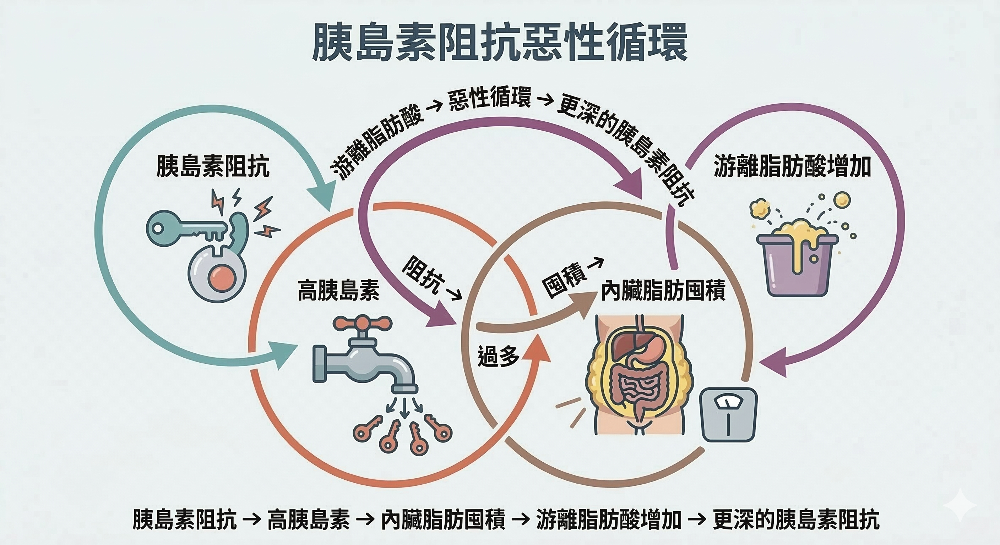
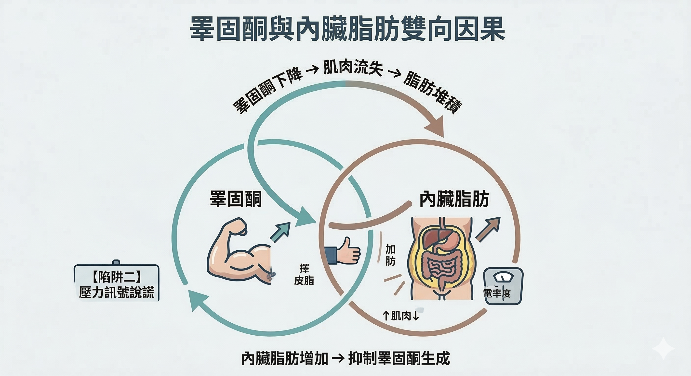

*胰島素阻抗、皮質醇偏高、睪固酮下滑——三個迴路不是獨立的，而是互相驅動*

在第一篇，我們確認了內臟脂肪是一個主動干擾代謝的內分泌器官，而不是被動的能量倉庫。

這篇要解釋：**它是怎麼讓你越努力越難瘦的。**

答案是三個互相強化的荷爾蒙迴路。每一個都能單獨造成內臟脂肪囤積，但它們真正的威力來自彼此之間的連結——一個迴路惡化，會直接拉動另外兩個。

---

## 第一環：胰島素阻抗迴路

### 什麼是胰島素阻抗？

正常狀態下，你吃東西、血糖上升，胰臟分泌胰島素，細胞接收胰島素訊號、把葡萄糖收進去利用。這個過程很順暢。

**胰島素阻抗（Insulin Resistance）**是指細胞對胰島素的訊號「聽不清楚」了——胰島素受體的敏感性下降，同樣的血糖需要更多胰島素才能被清除。胰臟的補償機制是：分泌更多。

結果就是 **高胰島素血症（Hyperinsulinemia）**——血液中長期維持偏高的胰島素濃度。

### 高胰島素如何把脂肪鎖進腹部？

胰島素有一個清楚的代謝效應：**強力抑制脂肪分解（Lipolysis）**，同時促進脂肪合成。

而內臟脂肪區域的脂肪細胞，對這個效應特別敏感——它們的胰島素受體密度比皮下脂肪高，在高胰島素環境下，脂肪合成速度更快，分解速度更慢。

更麻煩的是：囤積的內臟脂肪會釋放大量游離脂肪酸（Free Fatty Acids，FFAs）進入門靜脈，直達肝臟，干擾肝臟的胰島素訊號處理——**進一步加深胰島素阻抗。**

迴路閉合：**胰島素阻抗 → 高胰島素 → 內臟脂肪囤積 → 更多 FFAs → 更深的胰島素阻抗。**

---

## 第二環：皮質醇迴路

### 壓力、睡眠與腹部脂肪的直接連線

**皮質醇（Cortisol）**是腎上腺分泌的壓力荷爾蒙，短期內有必要的生存功能；但長期偏高則是代謝的破壞者。

造成皮質醇長期偏高的原因：
- 慢性工作壓力、睡眠不足（7 小時以下顯著影響 HPA 軸）
- 長期低度發炎本身就是皮質醇升高的刺激源
- 40 歲後 HPA 軸（下視丘-腦垂體-腎上腺軸）的負回饋調節效率下降

### 皮質醇為什麼偏偏讓脂肪堆在腹部？

這個問題有一個非常具體的解剖學答案。

內臟脂肪細胞含有比其他部位 **更高密度的糖皮質激素受體（Glucocorticoid Receptor，GR）**——大約是皮下脂肪的 2–4 倍。

當皮質醇偏高，它和這些受體結合，會：
1. 上調脂蛋白脂酶（Lipoprotein Lipase，LPL）活性——把血液中的脂質優先截留到腹部
2. 抑制生長激素（GH）和 IGF-1——降低全身的脂肪動員能力
3. 提升食慾，特別是對高糖、高脂食物的渴望（Ghrelin 上升、Leptin 敏感性下降）

**迴路閉合：壓力/睡眠不足 → 皮質醇偏高 → 內臟脂肪囤積 → 內臟脂肪的 IL-6 訊號進一步活化 HPA 軸 → 皮質醇更難降下來。**

---

## 第三環：睪固酮迴路

### 男性 35 歲後的靜默流失

男性的睪固酮（Testosterone）在 35 歲之後，平均每年以 1–2% 的速度下降。

這個過程很緩慢，幾乎沒有明顯症狀——直到累積效應夠大，才以疲勞、體力下降、腹部脂肪增加的形式浮現。

**睪固酮與內臟脂肪是雙向因果。**

睪固酮下滑 →
- 肌肉合成訊號減弱，靜態代謝率（RMR）下降
- 腹部脂肪的 LPL（脂蛋白脂酶）活性上升，截留血脂能力增強
- 脂肪囤積加速

而內臟脂肪 →
- 含有大量 **芳香酶（Aromatase，CYP19A1）**
- 芳香酶把睪固酮轉換成 **雌激素（Estradiol，E2）**
- 內臟脂肪越多，睪固酮被消耗的速度越快

更深的連結：睪固酮下滑本身也是 HPA 軸功能下降的下游表現之一，和第二環（皮質醇迴路）形成交叉。

**迴路閉合：睪固酮↓ → 肌肉量↓ / 腹部 LPL↑ → 內臟脂肪↑ → 芳香酶↑ → 睪固酮↓。**

越胖的人 GG 越小而且很容易不舉是真的，更重要的是不容易使另外一半懷孕。

---

## 三個迴路的交叉節點

這三個迴路不是平行運作的，它們有明確的交叉點：

| 交叉點 | 涉及迴路 | 效應 |
|--------|----------|------|
| 內臟脂肪本身 | 全部三環 | 分泌 IL-6/TNF-α，同時惡化胰島素阻抗、皮質醇調節、睪固酮轉化 |
| 睡眠不足 | 迴路二＋三 | 皮質醇升高 + 睪固酮分泌窗口（REM 睡眠）縮短 |
| 慢性發炎（SASP） | 迴路一＋二 | IL-6 同時加深胰島素阻抗、活化 HPA 軸 |
| 肌肉量下降 | 迴路一＋三 | 胰島素敏感性依賴肌肉量；肌肉少，胰島素阻抗加重 |

這解釋了一件讓很多人沮喪的事：**為什麼刻意少吃一段時間之後，效果越來越差。**

因為節食會讓皮質醇上升（熱量限制是身體的壓力訊號）、加速肌肉分解（蛋白質被當成能量使用）、進一步降低睪固酮（卡路里不足影響性腺功能）。

節食在短期打開了一個缺口，但同時強化了讓脂肪囤積的底層架構。

---

## 打斷迴路，需要在訊號層面干預

三個迴路的共同交叉點是 **細胞層面的代謝健康**——粒線體功能、抗氧化防禦、慢性發炎程度。

在這三條路徑上，植物多酚（特別是花青素與 Oligonol®）有最直接的 RCT 數據支持——從腸道菌相重塑、內臟脂肪直接縮減、到脂肪動員訊號延長。

→ **系列第三篇**：[你的內臟脂肪需要的不是節食，是這三種多酚](/blog/precision-health/visceral-fat-polyphenol-mechanism/)
→ **系列第一篇**：[腰圍每年多三公分，不是你吃太多——是你的代謝訊號正在說謊](/blog/body-signals/visceral-fat-metabolic-signal/)

---

如果你對自己目前的代謝迴路狀態有疑問，歡迎諮詢。

---

## 參考資料

01. Tchernof A, Despres JP. (2013). [Pathophysiology of human visceral obesity: an update.](https://pubmed.ncbi.nlm.nih.gov/23303913/) *Physiol Rev*, 93(1), 359–404.
02. Bjorntorp P. (2001). [Do stress reactions cause abdominal obesity and comorbidities?](https://pubmed.ncbi.nlm.nih.gov/12119665/) *Obes Rev*, 2(2), 73–86.
03. Vermeulen A, et al. (2002). [Testosterone, body composition and aging.](https://pubmed.ncbi.nlm.nih.gov/10442580/) *J Endocrinol Invest*, 22(5 Suppl), 110–116.
04. Hotamisligil GS. (2017). [Inflammation, metaflammation and immunometabolic disorders.](https://pubmed.ncbi.nlm.nih.gov/28179656/) *Nature*, 542(7640), 177–185.
05. Cildir G, et al. (2013). [Chronic adipose tissue inflammation: all immune cells on the stage.](https://pubmed.ncbi.nlm.nih.gov/23746697/) *Trends Mol Med*, 19(8), 487–500.
06. Mohamad NV, et al. (2016). [The relationship between circulating testosterone and inflammatory cytokines in men.](https://pubmed.ncbi.nlm.nih.gov/29925283/) *Aging Male*, 19(4), 251–257.
