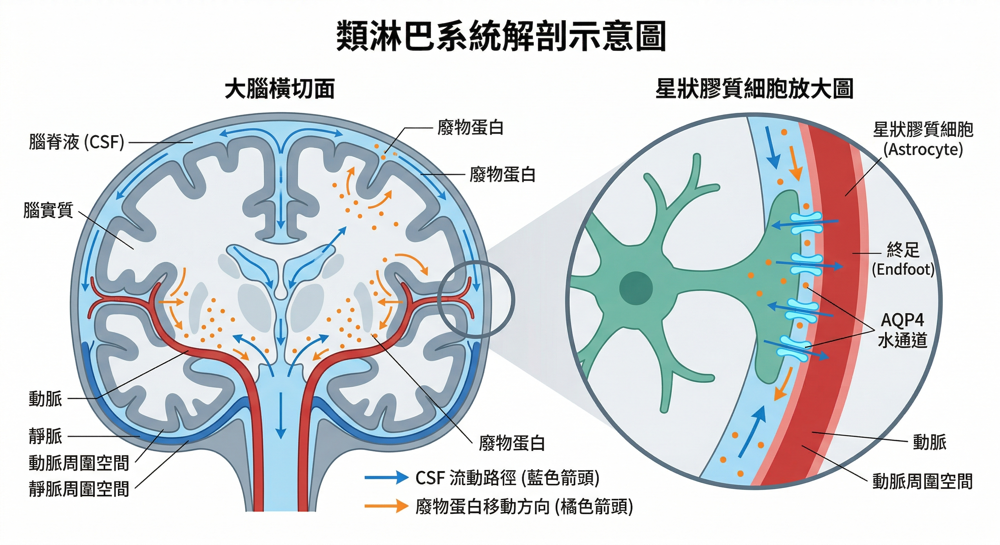
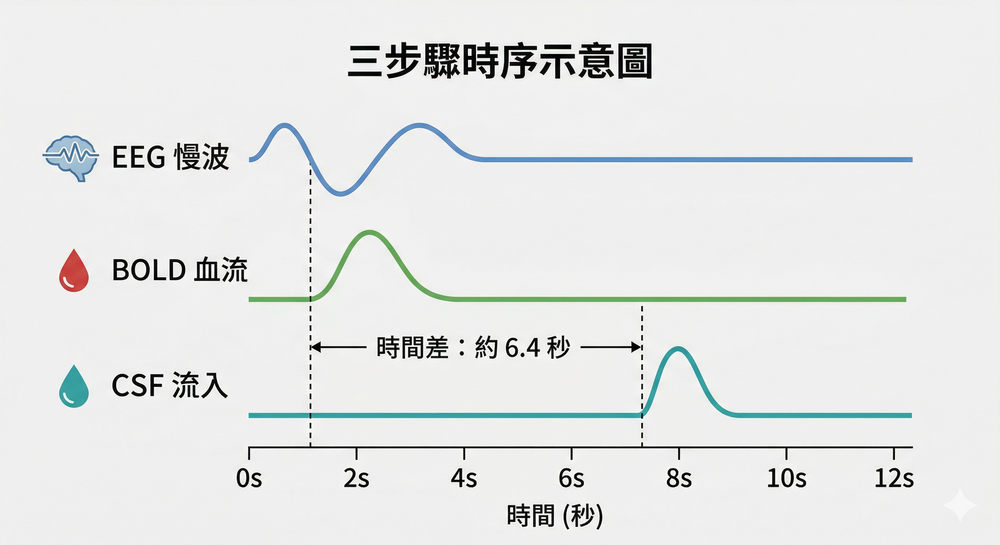
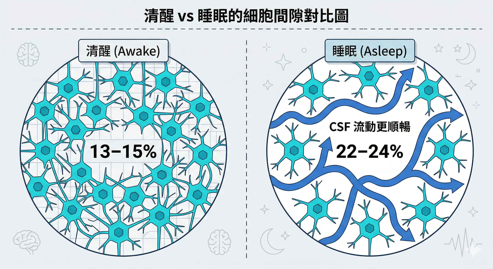
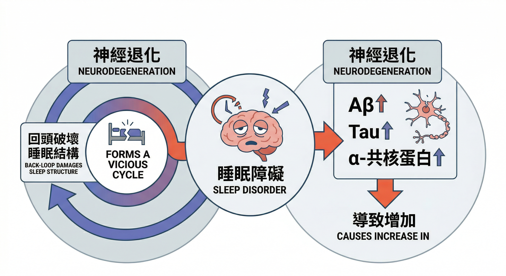
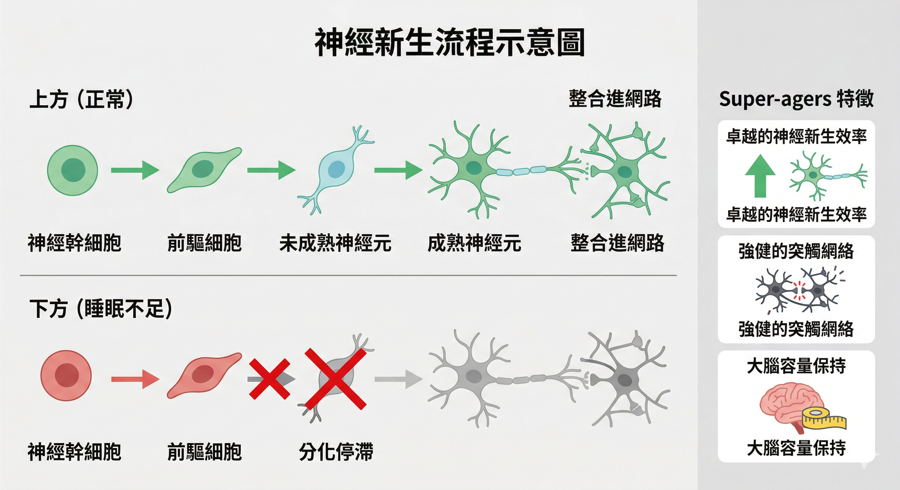
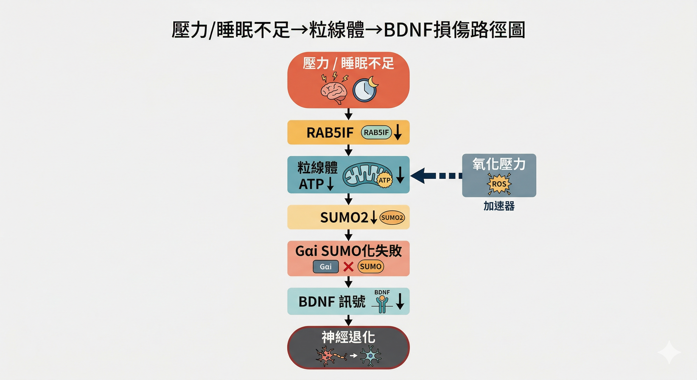
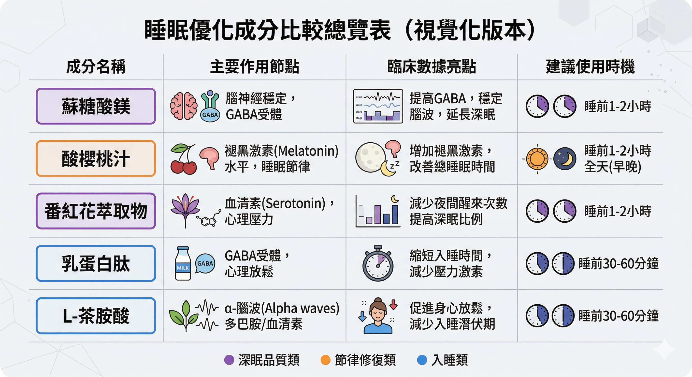

你每天晚上，都有一個清洗大腦的機會。

大多數人都錯過了。

不是因為沒有時間睡覺，而是因為睡了，但沒有真正進入大腦需要的那種睡眠。

大腦是人體唯一有「專屬清洗系統」的器官。

這套系統只在深度睡眠期間全速運作，負責沖走白天代謝產生的廢物蛋白，維護神經網路的正常運作。

如果這套系統長期無法好好工作，後果不只是「隔天精神差」那麼簡單——它與記憶退化、情緒失調、甚至阿茲海默症的早期病理都有直接關聯。

2019年，波士頓大學在《Science》期刊透過腦部影像，首次在人類身上看見這個過程：腦脊髓液像海浪一樣，在深度睡眠期間有節奏地沖洗整個大腦。

這篇研究讓「睡眠等於大腦清洗」從假說變成了可以被影像看見的事實。

以下，我們從運作機制、疾病關聯、到實際介入策略，完整解析這套夜間清洗系統。

---

## 類淋巴系統與神經流體動力學的生物物理基礎

大腦是人體代謝最旺盛的器官，雖然僅佔體重的 2%，卻消耗了約 20% 的能量。

這種高度的代謝活動必然產生大量的副產品，如β-澱粉樣蛋白（Amyloid-beta, Aβ）和 Tau 蛋白。

在身體其他部位，這些代謝廢物由淋巴系統回收；然而長期以來科學界一直找不到腦內代謝廢物是怎麼被清除的。

直到類淋巴系統的發現，才填補了這一學術空白。

### 類淋巴系統的運作架構

類淋巴系統是一個功能性的廢物清除路徑，其依賴於星狀膠質細胞及其末端足突上的水通道蛋白4（Aquaporin-4, AQP4）。

該系統的流動遵循特定的解剖路徑：腦脊髓液從蛛網膜下腔進入動脈周圍間隙（Perivascular Spaces，PVS），在 AQP4 的介導下，穿過組織間隙與組織間液（ISF）進行交換，最後將溶解的廢物帶向靜脈周圍間隙並排出腦外。

| 路徑組分 | 功能描述 | 生物物理關鍵因素 |
|:---|:---|:---|
| 入口：動脈周圍間隙 (PVS) | CSF進入大腦實質的通道 | 動脈搏動產生的泵送動力 |
| 交換區：實質間隙 (Interstitial Space) | CSF與ISF的對流與擴散 | 間隙體積分數（α）與迂迴度（λ） |
| 出口：靜脈周圍間隙 | 廢物與流體離開大腦的路徑 | 匯流至頸部淋巴結進行體循環處理 |

> 

### 2019年《Science》論文的核心發現：巨觀波動的同步性

Fultz等人（2019）的研究展示了大腦清洗並非隨機的滲透，而是一場由神經活動引導的節奏性「海嘯」。

在非快速動眼期（Non-Rapid Eye Movements，NREM）睡眠中，大腦會出現頻率約為 0.05 Hz 的巨觀震盪。

這場「流體交響樂」的發生次序如下：

1. **神經慢波出現**：EEG紀錄到低頻、高振幅的慢波活動，代表大量神經元同步進入沉默狀態（Down states）。
2. **血液體積縮減**：由於神經活動減少，大腦對氧氣和葡萄糖的需求下降，導致大腦血流和血容量（BOLD訊號）減少。
3. **CSF脈衝流入**：根據Monro-Kellie原理，大腦內部體積必須恆定。當血液體積退出時，壓力梯度驅動大量腦脊髓液湧入填補空間。

數據顯示，這種神經波領先於 CSF 波約 **6.4秒**。

這種精密的時序耦合確保了大腦在神經元休息的瞬間，獲得最大程度的物理清洗效率。

---

## 睡眠誘導的組織擴大與代謝清除效率

類淋巴系統最引人注目的特徵之一是它的「睡眠依賴性」。

研究表明，該系統在清醒狀態下幾乎處於關閉狀態，而在進入深度睡眠後，其清除效率可提高 **十倍以上**。

### 「60% 規則」：細胞間隙的動態擴張

Xie等人（2013）在小鼠模型中發現，睡眠或麻醉會導致大腦細胞間隙的體積分數（α）增加約 60%。

在清醒狀態下，間隙空間僅佔大腦體積的13–15%；而在睡眠中，這一數值上升至 22–24%。

這種間隙擴張極大地降低了流體流動的阻力，使腦脊髓液能夠像「動力洗車」一樣沖刷神經元之間的空隙。

>

### 去甲腎上腺素（Norepinephrine）的開關作用

調節這種間隙變化的分子開關是去甲腎上腺素。在清醒時，高水平的去甲腎上腺素會使神經元和膠質細胞體積保持膨脹。

當進入深眠後，腦幹中藍斑核（Locus Coeruleus）的放電頻率降至最低，去甲腎上腺素水平隨之下降，細胞收縮釋放出空間，成為類淋巴流動的高速公路。

### 睡眠剝奪的「複利損傷」效應

理解了類淋巴系統的運作機制之後，有一件事變得很清楚：**睡眠不足的損害不是線性的，而是複利的。**

每一個深眠不足的夜晚，廢物蛋白的清除效率下降，積累量增加。

第二天，起點就比昨天更髒一點。長期下來，這不只是疲勞問題，而是神經環境的持續惡化。

更關鍵的是：這種損傷並不只停留在「代謝廢物積累」這個層次。

最新研究顯示，睡眠不足會同時破壞大腦的 **神經新生機制**——也就是新神經元的生成能力——以及神經訊號傳遞所依賴的 **分子修飾系統**。

---

## 睡眠障礙與神經退化性疾病的惡性循環

長期睡眠不足是阿茲海默症與帕金森氏症的關鍵驅動因素，兩者具有顯著的雙向關係。

###  蛋白質病理積累

**Aβ 的快速反應**：僅一晚的睡眠剝奪就會導致人類大腦中 Aβ 水平升高約 25 – 30%。

**Tau 蛋白的擴散**：慢性睡眠不足會加速 Tau 蛋白在神經網絡中的傳播，積累與深度睡眠（Slow-Wave Sleep，SWS）的減少高度相關。

###  帕金森氏症與α-共核蛋白

類淋巴系統功能障礙導致α-共核蛋白無法有效清除，引發多巴胺神經元死亡。REM 睡眠行為障礙（Rapid Eye Movement (REM) Sleep Behavior Disorder，RBD）常被視為此類病變的前驅指標，可能早於運動症狀 **11年** 出現。

###  神經新生：睡眠不足正在關閉大腦的「自我更新」能力

阿茲海默症的神經退化，過去我們以為主要來自蛋白質積累（Aβ、Tau）。

2026年2月，《Nature》期刊一項分析 355,997 個人類大腦細胞核的研究，揭示了另一條更早開始的損傷路線：**神經新生（Neurogenesis）的失調**。

研究發現，在臨床前期阿茲海默症患者身上——也就是還沒有明顯失智症狀的人——海馬迴的神經幹細胞基因調控狀態就已經開始異常。

換句話說：大腦停止製造新神經元，**早於記憶退化出現**。

這對睡眠的意義是什麼？神經新生高度依賴睡眠品質：

睡眠不足
↓ 皮質醇（壓力荷爾蒙）持續偏高
↓ 海馬迴神經幹細胞受抑制
↓ BDNF（神經滋養因子）活性下降
↓ 新神經元生成減少、存活率下降
↓ 海馬迴結構逐漸萎縮
↓ 記憶與情緒調控功能衰退

同一項《Nature》研究也發現，80 歲以上但認知能力媲美 50 歲的「超級老年人（Super-agers）」，他們的共同特徵是：神經幹細胞活性接近年輕人，神經分化相關基因持續活躍，染色質維持開放狀態——大腦在分子層級保住了一個年輕的環境。而這套機制的維持，與睡眠品質密不可分。

###  BDNF 訊號：壓力與睡眠不足如何從分子層級破壞大腦

神經新生需要一個關鍵分子來驅動：**腦源性神經滋養因子（Brain-Derived Neurotrophic Factor，BDNF）**，也就是「大腦的養分」——它驅動神經幹細胞分化、維持突觸連結、保護神經元不退化。

2026年3月《Science Signaling》期刊揭示了慢性壓力破壞 BDNF 的具體分子路徑：

長期壓力 / 睡眠不足
↓ RAB5IF 蛋白減少（粒線體調控蛋白）
↓ 粒線體 ATP 產量下降
↓ SUMO2 合成不足（蛋白質修飾分子）
↓ G 蛋白 SUMO 化失敗（訊號轉導關鍵分子）
↓ BDNF-TrkB 訊號受阻
↓ 神經突觸連結減少、神經新生下降
↓ 情緒調控能力下降、出現憂鬱傾向

這條路徑有一個重要的起點：**粒線體功能受損**。

當睡眠不足導致氧化壓力增加、粒線體損傷加劇，整個路徑的每一個環節都同步惡化，形成惡性循環：

睡眠不足 → 氧化壓力↑ → 粒線體損傷 → ATP↓ → BDNF 訊號↓ → 神經退化↑ → 睡眠品質更差

也就是說：**睡眠不足不只是讓大腦「沒洗乾淨」，它還在分子層級削弱大腦自我修復和更新的能力。**

---

## 神經病變年輕化趨勢與現代生活方式的衝擊

根據 2021 年全球疾病負擔（Global Burden of Disease，GBD）研究，早發型帕金森氏症（Early-Onset Parkinson's Disease，EOPD）的全球發病率在過去三十年中增加了近 **三倍**。

現代年輕人晚間過度暴露於電子設備產生的短波藍光（460–480 nm），強烈抑制褪黑素分泌，進而壓縮深度睡眠比例。

這不只是「睡眠衛生」的問題。

藍光、晚間飲酒、不規律作息、慢性壓力——這四個因素都會從不同角度削減深眠比例，而深眠比例的下降，正是上述所有損傷路徑的共同起點。

---

## 營養學與植物營養素優化策略

特定的營養素已被證實能優化睡眠結構並提升大腦清洗效率：

###  蘇糖酸鎂與酸櫻桃汁

**蘇糖酸鎂（Magnesium L-Threonate）**：能有效穿越血腦屏障，增加腦電電壓約 4.7 μV，縮短認知反應延遲。

**酸櫻桃汁（Tart Cherry Juice）**：富含天然褪黑素與花青素。臨床數據顯示每日兩杯可使失眠者增加約84分鐘的總睡眠時間。

###  番紅花（Saffron）萃取物

**機制**：番紅花成分（crocin, crocetin）能調節GABA系統，顯著改善入睡延遲並增加深度睡眠。番紅花同時能抑制色胺酸往壓力路徑的分流，讓更多原料用於褪黑激素合成，幫助身體「恢復自然節律」而非從外部強制補充訊號。

**臨床**：每日攝取 20–30 mg 提取物可有效降低失眠指數（AIS），且其保護認知的能力在某些研究中展現出與藥物相當的潛力。

###  乳蛋白肽（α-casozepine）與L-茶胺酸

**乳蛋白肽**：如 Lactium®，能與 GABA_A 受體結合，模擬自然鎮靜效果，幫助增加深度睡眠時長（約+37分鐘）。

**L-茶胺酸**：茶葉中的核心成分，能增加腦部α波，促進放鬆並優化睡眠維持度。不會讓人昏昏欲睡，而是讓大腦從「高速運轉」過渡到「放鬆清醒」，這個過渡是進入自然睡眠的必要條件。

###  超越「讓你睡著」：神經新生與 BDNF 的支持策略

前面所說的成分，主要針對「讓你更容易進入深眠」這個目標。

如果你關心的不只是當下的睡眠品質，而是**長期的認知健康與大腦可塑性**，還需要同時支持神經新生機制和 BDNF 訊號的正常運作。

目前有研究支持的策略：

**有氧運動（最強的 BDNF 促進因子）**：規律有氧運動是目前已知最有效的 BDNF 提升方式，也是促進海馬迴神經新生的最強介入。每週 150 分鐘中等強度有氧，效果在多項研究中被一致確認。

**睡眠規律（不只是睡眠時長）**：神經新生的品質高度依賴睡眠時序的穩定性，而不只是睡了幾個小時。固定的就寢和起床時間，比週末補眠更能維持海馬迴的神經幹細胞活性。

**慢性發炎控制**：發炎環境會把海馬迴的神經新生從「生長模式」切換到「凋零模式」。 Omega-3、抗氧化植化素、以及避免長期高升糖飲食，都是降低神經發炎的實際手段。

**慢性壓力的早期偵測**：皮質醇持續偏高是神經新生最直接的抑制因子。這不只是「壓力管理」的問題——它是一個有具體分子路徑的生理問題，需要具體的介入，而不只是放鬆心情。

---

## 從今晚開始的選擇

睡眠不是被動的休息，它是大腦最主動的修復時段。

類淋巴系統的清洗、神經新生的維持、BDNF 訊號的正常運作——這些都在你閉上眼睛的那幾個小時裡發生。

而這些能不能順利進行，取決於兩件事：你是否真正進入深度睡眠，以及你的神經系統在睡前是否有足夠的靜默條件。

幾件可以從今晚開始做的事：

**睡眠環境**：溫度維持在 18–20°C，入睡前 1 小時減少藍光暴露，避免睡前飲酒。

**睡眠規律**：固定的就寢和起床時間，比任何補眠策略都更重要。

**神經系統平靜**：如果你的腦袋在睡前停不下來，這是神經系統還沒有退出「備戰狀態」的生理訊號，不是意志力問題。這個節點，是可以被具體介入的。

**長期策略**：規律有氧運動、慢性發炎控制、壓力累積的早期偵測。這些不只影響睡眠品質，它們直接決定你的大腦在 30 年後的狀態。

👉 想了解如何用針對性的配方幫助神經系統在睡前真正靜下來？
閱讀下一篇：[MYND360如何在睡前一小時幫大腦強制關機](/blog/intervention-optimization/mynd360-sleep-brain-shutdown/)

---

## 延伸閱讀

- [壓力正在改變你大腦裡的蛋白質——從粒線體到情緒的分子路徑](/blog/body-signals/stress-mitochondria-bdnf-depression/)
- [同樣80歲，有人記得每個孫子的名字——Super-agers的大腦秘密](/blog/chronic-inflammation/super-agers-neurogenesis-healthspan/)
- [MYND360如何在睡前一小時幫大腦強制關機](/blog/intervention-optimization/mynd360-sleep-brain-shutdown/)

---

## 參考資料

01. Fultz, N. E et al., 2019. [Coupled electrophysiological, hemodynamic, and cerebrospinal fluid oscillations in human sleep.](https://pubmed.ncbi.nlm.nih.gov/31672896/) *Science* 366(6465):628-631.
02. Xie, L et al., 2013. [Sleep drives metabolite clearance from the adult brain.](https://pubmed.ncbi.nlm.nih.gov/24136970/) *Science* 342(6156):373-7.
03. Chanung Wang, David M Holtzman, 2020. [Bidirectional relationship between sleep and Alzheimer's disease: role of amyloid, tau, and other factors.](https://pubmed.ncbi.nlm.nih.gov/31408876/) *Neuropsychopharmacology* 45(1):104-120.
04. Sarah M Rothman, Mark P Mattson, 2012. [Sleep disturbances in Alzheimer's and Parkinson's diseases.](https://pubmed.ncbi.nlm.nih.gov/22552887/) *Neuromolecular Med*
 14(3):194-204.
05. Emily Simmonds et al., 2025. [Sleep disturbances as risk factors for neurodegeneration later in life.](https://www.nature.com/articles/s44400-025-00008-0) *NPJ Dementia* 1(6):1-10.  
06. Qiwei Ji et al., 2025. [Global burden of early-onset Parkinson's disease, 1990-2021: results from the Global Burden of Disease Study 2021.](https://pubmed.ncbi.nlm.nih.gov/40967886/) *J Neurol Neurosurg Psychiatry.* 97(1):33-43.
07. Federica Conti, 2025. [Dietary Protocols to Promote and Improve Restful Sleep: A Narrative Review.](https://academic.oup.com/nutritionreviews/advance-article/doi/10.1093/nutrit/nuaf062/8149210) *Nutrition Reviews* 00(00):1–19.   
08. Fateme Barforoush et al., 2025. [The Effect of Tart Cherry on Sleep Quality and Sleep Disorders: A Systematic Review.](https://pubmed.ncbi.nlm.nih.gov/40964149/) *Food Sci Nutr.* 13(9):e70923.
09. Daniel Bricker, Jake Pates, 2025. [The Combined Effects of Tart Cherry Powder and Magnesium L-Threonate Supplementation on Cognitive Function and Sleep Architecture: A Pilot Study in Healthy Adults.](chrome-extension://efaidnbmnnnibpcajpcglclefindmkaj/https://juniperpublishers.com/jcmah/pdf/JCMAH.MS.ID.555859.pdf) *JCMAH* 13(2).
10. Schuster, J et al., 2025. [Effect of a saffron extract on sleep quality in adults with moderate insomnia.](https://pubmed.ncbi.nlm.nih.gov/40698027/) *Sleep Med X* 10:100147.
11. Norouzi, A et al., 2025. [Saffron’s promise: a systematic review of its role in Alzheimer's treatment.](https://link.springer.com/article/10.1186/s41983-025-00950-z) *Egypt J Neurol* 61(21), 
12. Cotter, J et al.,2026. [Examining the effect of L-theanine on sleep: a systematic review.](https://pubmed.ncbi.nlm.nih.gov/41176609/) *Nutr Neurosci* 29(2):224-238.
13. Lim, S. E et al., 2024. [Dietary supplementation with Lactium and L-theanine alleviates sleep disturbance in adults: a double-blind, randomized, placebo-controlled clinical study.](https://pubmed.ncbi.nlm.nih.gov/38953043/) *Front Nutr* 11:1419978.
14. Dagum, P et al., 2025. [A wireless device for continuous measurement of brain parenchymal resistance tracks glymphatic function in humans.](https://pubmed.ncbi.nlm.nih.gov/40425804/) *Nat Biomed Eng.* 9(10):1656-1676.
15. Disouky A et al., 2026. [Human hippocampal neurogenesis in adulthood, ageing and Alzheimer's disease.](https://pubmed.ncbi.nlm.nih.gov/41741649/) *Nature* 10.1038/s41586-026-10169-4.
16. Xin Shi et al., 2026. [The protein RAB5IF promotes BDNF signaling by stimulating the SUMOylation of Gαi1/3 to reduce depressive-like behaviors in mice.](https://www.science.org/doi/10.1126/scisignal.aec8898) *Science Signaling* 19(931)
