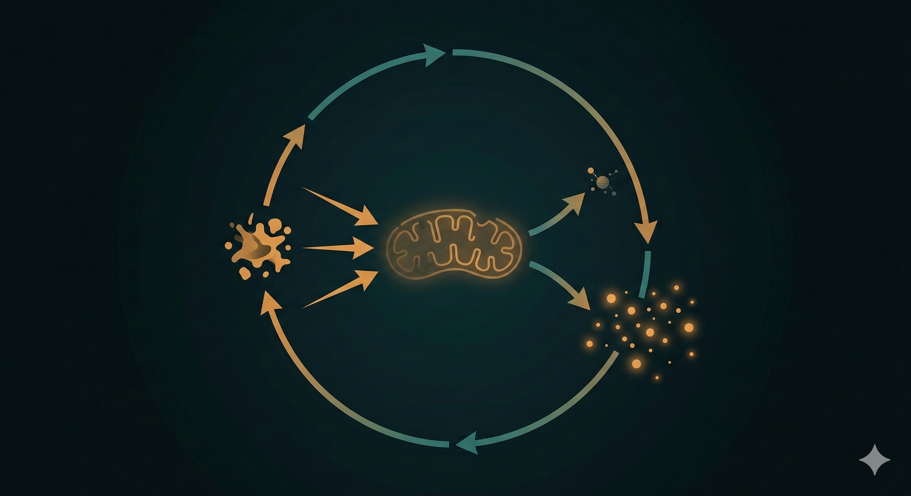
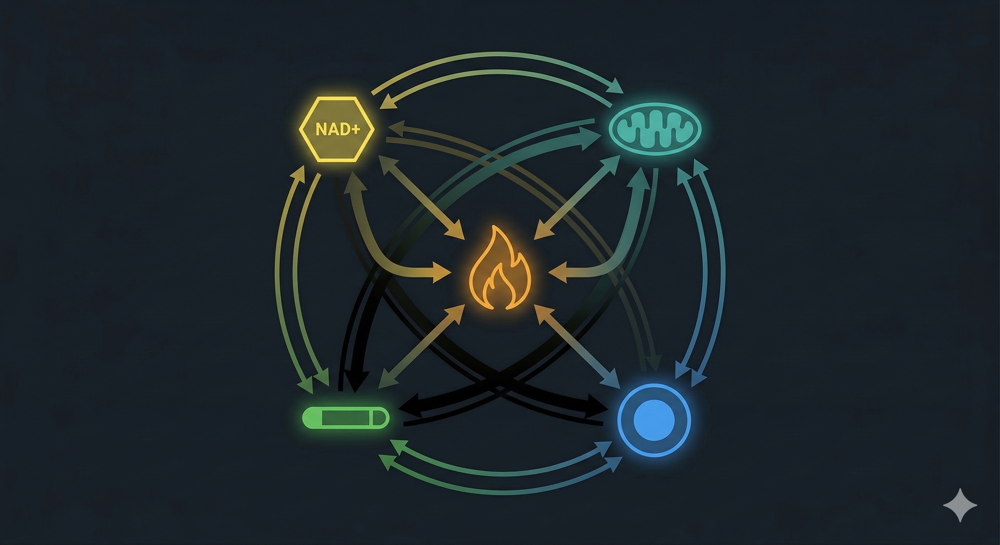

上一篇說到，Inflammaging——慢性低度發炎——是幾乎所有老化相關疾病的共同土壤。

但「慢性發炎讓你老化加速」這句話，說的太抽象了。

它具體在做什麼？

答案是：它在同時消耗四個讓你的細胞能夠正常運作和自我修復的關鍵儲備。

這四個儲備，你的身體從出生就在積累，年輕的時候消耗得慢、補充得快，所以你感覺不到它們的存在。

但從 30 歲開始，消耗開始超過補充——而慢性發炎，讓這個消耗速度大幅加快。

---

## 儲備一：NAD+

**NAD+（菸鹼醯胺腺嘌呤二核苷酸）** 是細胞內幾乎所有能量代謝反應都需要的輔酶，同時也是激活 Sirtuins（長壽蛋白）和 PARP（DNA修復酶）的關鍵分子。

簡單說：沒有充足的 NAD+，細胞的能量工廠效率下降，DNA損傷無法有效修復，長壽蛋白失去工作能力。

問題是，NAD+ 的濃度從 40 歲開始加速下滑。到了 60 歲，細胞內的 NAD+ 水平可能只剩下年輕時的一半不到。

**慢性發炎怎麼加速這個消耗？**

當 NF-κB 持續活化、SASP 持續分泌促發炎訊號，細胞需要不斷調動 PARP 來修復由發炎引發的 DNA 損傷——而 PARP 是 NAD+ 的大量消耗者。發炎越旺盛，DNA損傷越多，PARP 消耗 NAD+ 越快，NAD+ 的儲備就越快被榨乾。

這形成一個惡性循環：NAD+ 下降 → Sirtuins 活性降低 → 發炎調控能力下降 → 發炎加重 → NAD+ 消耗更快。

---

## 儲備二：粒線體功能

粒線體是細胞的能量工廠，負責把葡萄糖和脂肪轉化成細胞可以直接使用的能量貨幣——ATP。

年輕、健康的細胞裡，粒線體持續進行一個叫做 **粒線體自噬（Mitophagy）**的過程：清除老化損壞的粒線體、保留健康的、讓整個粒線體網絡維持高效運作。

慢性發炎對粒線體的傷害是雙向的：

一方面，促發炎細胞因子（特別是 TNF-α）會直接抑制粒線體的電子傳遞鏈效率，讓每個粒線體產出的 ATP 減少，同時增加氧化副產物（自由基）的生成。

另一方面，發炎環境會抑制粒線體自噬的效率——受損的粒線體無法被及時清除，繼續留在細胞內，既佔用資源、又持續製造自由基，形成惡性循環。

結果是：你的細胞能量輸出下降，疲勞感增加，但細胞內積累的損傷卻在持續增加。

---

## 儲備三：幹細胞池

你的身體有能力持續修復組織——肌肉損傷、腸道黏膜更新、血液細胞補充——這個能力來自分布在各個組織裡的 **成體幹細胞（Adult Stem Cells）**。

幹細胞池是有限的。每次動員幹細胞去修復損傷，都在消耗這個池子裡的存量。

年輕時消耗後補充快，感覺不到差異。年紀增長後，補充速度下降，存量開始減少。

**慢性發炎怎麼加速幹細胞的耗損？**

SASP 的促發炎訊號會直接影響幹細胞的功能——它讓幹細胞更早進入靜止狀態（無法動員修復）、或者更快進入自身的衰老狀態（變成新的衰老細胞，繼續分泌更多 SASP）。

更重要的是，慢性發炎造成的低層次組織損傷（不夠嚴重到你感覺疼痛，但足以觸發修復反應），會持續、頻繁地動員幹細胞，把幹細胞池過早耗盡。

幹細胞池的消耗是不可逆的——你無法靠補充某種營養素讓它恢復到年輕時的水平。

你能做的，是減少不必要的動員、減慢耗損速度。

---

## 儲備四：端粒長度

端粒（Telomere）是染色體末端的保護結構，像是鞋帶末端的塑膠套。每次細胞分裂，端粒就會縮短一點。縮短到臨界點，細胞就無法再正常分裂，進入衰老狀態或凋亡。

端粒長度是細胞「還能分裂幾次」的計時器，也是目前最直觀的生物年齡指標之一。

**慢性發炎讓端粒縮短得更快：**

促發炎環境下產生的活性氧（自由基）會直接攻擊端粒 DNA——端粒區域對氧化傷害特別敏感，因為它缺乏有效的 DNA 修復機制。

同時，慢性發炎也會下調 **端粒酶（Telomerase）** 的活性——端粒酶是唯一能夠「補回」端粒長度的酵素，在發炎環境中它的功能被持續壓制。

結果：端粒縮短的速度加快，細胞更早進入衰老狀態，SASP 的來源更多，發炎更嚴重——又一個惡性循環。

---

## 為什麼損耗會加速：複利效應

把這四個儲備放在一起，你會看到一個讓人不安的圖像。

這四個儲備不是獨立消耗的——它們彼此連動，任何一個下降，都會加速其他幾個的消耗：

NAD+ 下降 → Sirtuins 失活 → 端粒修復能力下降 → 端粒縮短加快 → 更多衰老細胞 → 更多 SASP → 更多 NAD+ 消耗。

粒線體損傷 → 更多自由基 → 更多 DNA 損傷 → 更多幹細胞動員修復 → 幹細胞池加速耗損 → 修復能力下降 → 粒線體損傷累積更快。

這是一個**複利式的加速過程**。

30幾歲的時候，這個過程很慢，你感覺不到。

40歲開始，如果慢性發炎持續存在，各個儲備的消耗開始超過補充，你開始感覺到一些「說不清楚的不對勁」——疲勞、修復慢、腦袋鈍。

50歲之後，當儲備下降到一定程度，臨床症狀才開始出現。體檢開始紅字。醫生說你「進入慢性病的前期」。

但問題是——到了這個時候，你已經消耗了十幾年的儲備了。

---

## 為什麼這個過程是「看不見」的

有一個問題值得正面回答：既然這個過程從 30 幾歲就開始了，為什麼大部分人完全沒有感覺？

有兩個原因。

第一，**儲備是有緩衝的**。NAD+ 下降50%，你不會立刻失去一半的能量——你的身體會適應，用各種代償機制維持表面上的正常運作。你感覺到的「有點累」，是在儲備已經消耗了很多之後才出現的訊號。

第二，**標準健康檢查量的不是儲備**。血壓、血糖、膽固醇——這些量的是系統是否已經損壞，不是損壞累積到哪個程度了。NAD+ 濃度、粒線體功能指標、幹細胞動員能力、端粒長度——這些都不在標準檢查項目裡。

所以你會一直處在一個奇怪的狀態：感覺某些東西不太對，但找不到紙面上的證據。

這不是心理問題。是量測工具的問題。

---

## 儲備消耗是可以測量的

好消息是，這件事不是完全看不見的。

目前已有幾種方式可以間接評估細胞儲備的狀態：抗氧化指標（類胡蘿蔔素濃度）、高敏感度 CRP（hs-CRP）反映慢性發炎程度、NAD+ 相關代謝物的血液檢測，以及整合多項指標的生物年齡評估。

其中最直接、也最容易在日常生活裡追蹤的，是 **抗氧化儲備的即時測量**——因為抗氧化能力和 NAD+、粒線體功能、發炎程度都高度相關，是細胞整體健康狀態的一個可量化視窗。

如果你想知道你現在的細胞儲備水位在哪裡，這是下一步。

---

你的細胞儲備，現在還剩多少？

這件事不需要靠感覺猜測，也不需要等到體檢紅字才知道答案。

**加我 LINE，我們聊聊你目前的狀況，看看從哪裡開始評估最有意義。**

👉 [加LINE諮詢](https://line.me/ti/p/@fer7932k)

---

**延伸閱讀：**
- [抗慢性發炎就是在抗老化——這不是廣告詞，這是2000年就確立的科學](/blog/chronic-inflammation/抗慢性發炎就是在抗老化——這不是廣告詞，這是2000年就確立的科學/) ← Inflammaging篇
- [你的身體老化速度，有辦法知道嗎？——三種方法，從專業到居家](/blog/precision-health-tools/你的身體老化速度，有辦法知道嗎？——三種方法，從專業到居家/) ← 第6篇（生物年齡量測工具）
- [不節食也能啟動修護基因？CRM的概念和DNA微陣列技術](/blog/chronic-inflammation/不節食，也能啟動修護基因——科學家找到的「熱量限制模擬物」是什麼？/) ← C篇

---

## 參考資料

01. David Sinclair, Matthew LaPlante, 2019. *Lifespan: Why We Age—and Why We Don't Have To.* Atria Books. *(NAD+ depletion and aging overview)*
02. Ana P Gomes et al., 2013. [Declining NAD+ Induces a Pseudohypoxic State Disrupting Nuclear-Mitochondrial Communication during Aging.](https://pubmed.ncbi.nlm.nih.gov/24360282/) *Cell.* 155(7):1624-38.
03. Evandro F Fang et al., 2017. [NAD+ Replenishment Improves Lifespan and Healthspan in Ataxia Telangiectasia Models via Mitophagy and DNA Repair.](https://pubmed.ncbi.nlm.nih.gov/28738407/) *Cell Metab.* 26(6):856-858.
04. Ji-Hye Paik et al., 2021. [Mitochondrial dysfunction and Parkinson's disease: new mechanistic insights from iPSC-based disease models.](https://pubmed.ncbi.nlm.nih.gov/25802991/) *EMBO Rep.* 16(2):98-108.
05. Thomas A Rando, Howard Y Chang, 2012. [Aging, rejuvenation, and epigenetic reprogramming: resetting the aging clock.](https://pubmed.ncbi.nlm.nih.gov/22245968/) *Cell.* 148(1-2):46-57.
06. Richard M Cawthon et al., 2003. [Association between telomere length in blood and mortality in people aged 60 years or older.](https://pubmed.ncbi.nlm.nih.gov/12559262/) *Lancet.* 361(9355):393-5.
07. Luigi Ferrucci, Elisa Fabbri, 2018. [Inflammageing: chronic inflammation in ageing, cardiovascular disease, and frailty.](https://pubmed.ncbi.nlm.nih.gov/30228304/) *Nat Rev Cardiol.* 15(9):505-522.
08. Vera Gorbunova et al., 2021. [The role of retrotransposable elements in ageing and age-associated diseases.](https://pubmed.ncbi.nlm.nih.gov/34290424/) *Nature.* 596(7870):43-53.
