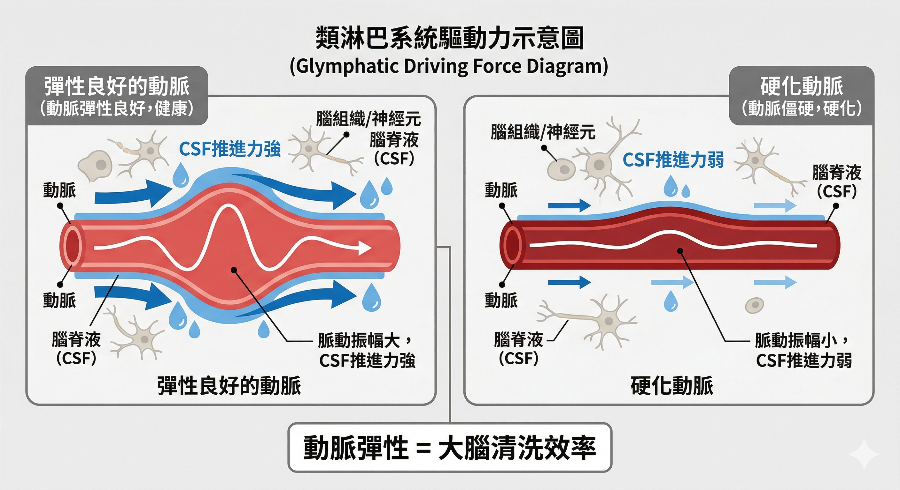
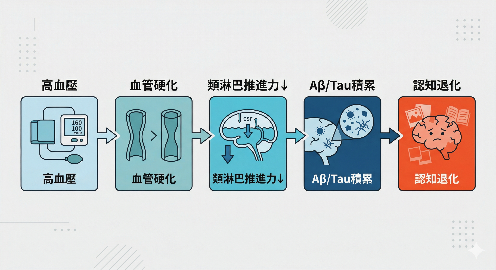
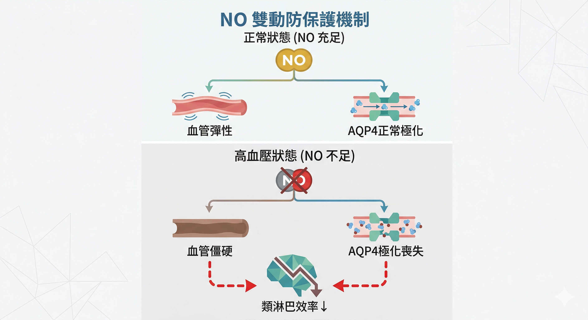
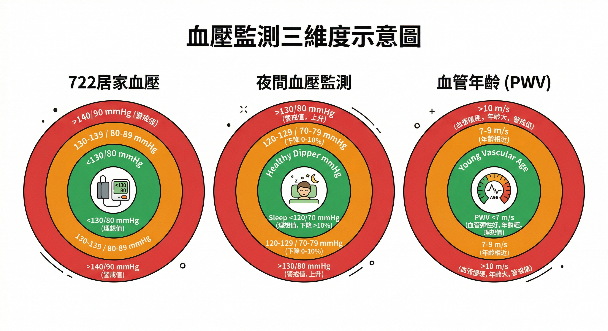
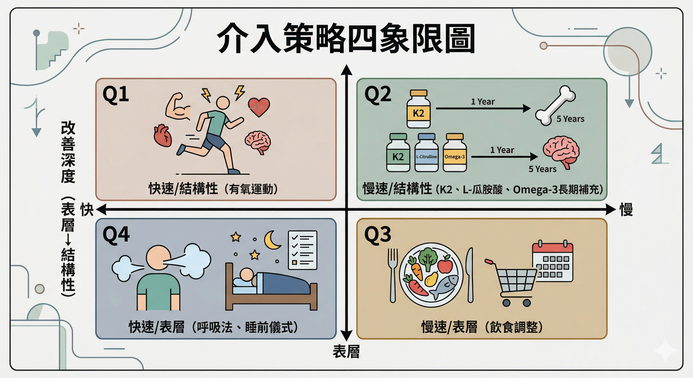
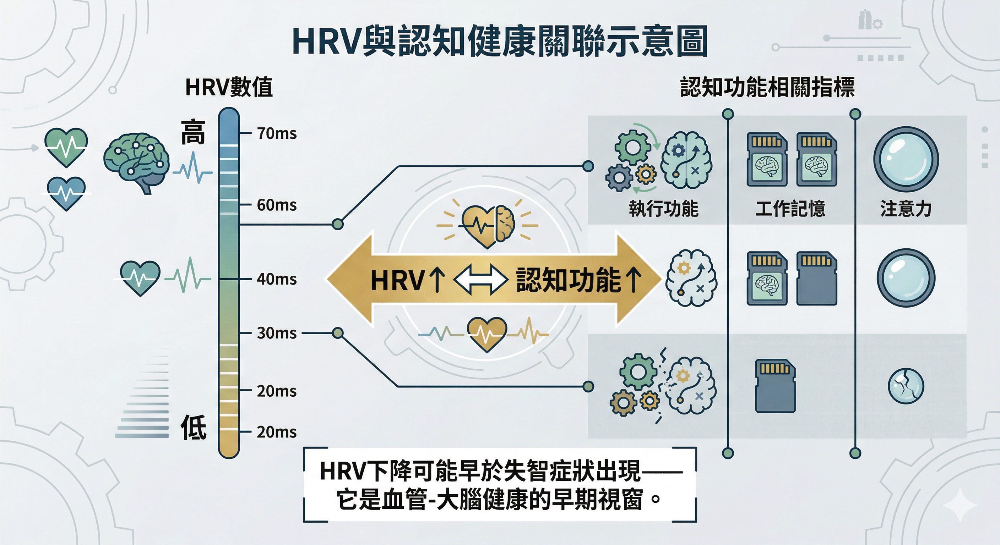

你有量血壓的習慣嗎？

大多數人量血壓，是為了確認自己沒有中風的風險。

但神經科學的最新研究告訴我們：在你的血壓高到引發中風之前，它早就在做另一件事——**悄悄關掉你大腦每晚的清洗系統。**

這個清洗系統，叫做類淋巴系統（Glymphatic System）。

它在你睡覺的時候運作，負責沖走大腦白天產生的代謝廢物，包括與阿茲海默症直接相關的β-澱粉樣蛋白（Aβ）和 Tau 蛋白。

如果這套系統長期無法好好運作，這些蛋白質就會在神經組織裡一點一點積累。

不是等到老了才開始，而是從你 40 歲、50 歲、血壓開始偏高的那個時候，就已經在累積了。

---

## 大腦的夜間清洗，需要一個物理條件

要理解高血壓怎麼傷大腦，先理解類淋巴系統的運作方式。

2019年，波士頓大學在《Science》期刊首次在人類身上看見了這個過程：在深度睡眠期間，腦脊髓液像海浪一樣，有節奏地沖洗整個大腦。

這套清洗的物理驅動力，來自**動脈的脈動**。

每一次心跳，動脈壁彈性收縮與舒張，產生「蠕動泵」效應，把腦脊髓液沿血管周圍間隙向前推進。這個推力，是類淋巴系統的主要引擎。

這裡有一個關鍵：**引擎的效率，取決於血管壁的彈性。**

     

---

## 高血壓如何一步一步關掉清洗系統

當血壓長期偏高，動脈壁承受過度的機械壓力，逐漸發生結構重塑：平滑肌肥厚、膠原蛋白增生、血管壁逐漸變硬。

這不是突然發生的。這是一個以年為單位的緩慢過程。

但結果很確定：**血管失去彈性，脈動振幅縮小，推進腦脊髓液的力道隨之減弱。**

研究已在動物模型中證實：誘導高血壓後，腦脊髓液流速顯著減慢。

大腦的清洗效率，直接受到血管彈性的制約。

這條路徑展開如下：

長期高血壓
↓ 動脈硬化、脈動振幅下降
↓ 類淋巴系統推進力不足
↓ Aβ、Tau蛋白清除效率下降
↓ 神經毒性蛋白持續積累
↓ 認知功能逐漸退化

         

---

## 還有一條更細的破壞路線：一氧化氮

高血壓對大腦的傷害，不只是物理性的脈動減弱。它還透過一個分子層面的機制，進一步惡化清洗效率。

這個分子叫做 **一氧化氮（NO）**。

NO 是由血管內皮細胞持續產生的分子，負責讓血管平滑肌放鬆、維持血管彈性、保護內皮完整性。

對類淋巴系統來說，NO 還有另一個角色：它參與調控 **AQP4 水通道蛋白** 的排列。

AQP4 是星狀膠質細胞上的水通道，是讓腦脊髓液滲入腦組織的「滲透閘門」。在健康狀態下，AQP4 高度極化地排列在血管接觸面，讓流體交換效率最大化。

當高血壓引發慢性內皮損傷，NO 產量下降，這個精密的 AQP4 排列會出現混亂——閘門失序，流體交換效率大幅下降，廢物蛋白的清除更加困難。

兩條破壞路線疊加：**脈動推力不足＋閘門失序**，類淋巴系統的清洗效率雙重惡化。

      

---

## 這不只是「血管性失智症」

傳統上，高血壓與失智的關聯被解釋為「血管性失智症」——腦血管梗塞或出血導致的認知損傷。

但類淋巴系統的研究揭示了一條更隱蔽、更早開始的路線：**即使沒有發生任何梗塞或出血，只要類淋巴系統長期清洗不足，Aβ 和 Tau 蛋白就會持續積累，形成阿茲海默症的早期病理。**

這解釋了一個長期被忽略的臨床觀察：長期高血壓的人，即使從未中風，認知功能仍然更容易提前退化。

損傷，不需要「大事件」。它只需要時間和沒被控制的血壓。

2026年《Nature》那項分析 355,997 個人類大腦細胞核的研究，也提醒我們：阿茲海默症的神經新生失調，在臨床症狀出現之前就已經開始。

高血壓透過類淋巴系統損傷，可能正是這個「提前開始」的機制之一。

---

## 你的血壓現在在哪裡？

台灣心臟學會與高血壓學會已將高血壓定義下調至 **130/80 mmHg**。

這個標準不是用來嚇人的。它是在提醒我們：**血壓控制的目標，不只是不中風，而是讓大腦的清洗系統能夠持續運作。**

有幾件事是你現在可以確認的：

** 722 原則（政府官方推廣）**：連續測量 7 天、早晚各 2 次、每次量 2 遍取平均值。

這能排除「白袍高血壓」的干擾，真實反映你的血壓狀態。

**夜間血壓的重要性**：研究發現，夜間血壓未下降（Non-dipping）的人，類淋巴系統的清洗效率指標（DTI-ALPS指數）通常更低——也就是說，睡眠期間大腦洗得更不乾淨。夜間血壓，只有持續監測才能發現。

**血管年齡 vs 生理年齡**：脈搏波傳導速度（PWV）是衡量血管彈性的金標準。現代穿戴式裝置已可將其轉換為「血管年齡」——如果你的血管年齡顯著高於生理年齡，這是類淋巴系統效率正在下降的早期警訊。

    

---

## 從血壓到大腦：你可以做什麼

**飲食**：限鹽（每日<6g）、增加蔬果攝取、減少精製糖。高鹽飲食會損傷血管內皮，直接降低NO合成。地中海飲食與DASH飲食都已被證實能提升血管彈性。

**運動**：規律有氧運動是目前最強的血管彈性改善介入。每週150分鐘中等強度有氧，能顯著增加腦部脈動振幅，提升類淋巴清除效率。

**睡眠品質**：這裡形成一個雙向關係——高血壓損害睡眠期間的類淋巴清洗，而睡眠不足又會讓血壓更難控制。改善睡眠品質，本身就是血壓管理的一部分。

**營養介入（有研究支持）**：
- **維生素K2（MK-7形式）**：激活基質Gla蛋白，將鈣從血管壁引導至骨骼，減少血管鈣化，改善血管順應性
- **L-瓜胺酸**：提升血漿精胺酸濃度，促進NO生成，改善內皮依賴性血管舒張
- **Omega-3（EPA/DHA）**：連續12週每日4g，可有效降低中心動脈僵硬度
- **碧容健（法國海岸松樹皮萃取，Pycnogenol）**：上調eNOS活性，提升NO，改善微循環

          

---

## HRV：你現在就可以看到的指標

心率變異度（HRV）是自主神經系統功能的非侵入性指標，也是 **認知健康的早期預警訊號**。

高HRV代表迷走神經張力強，前額葉對心血管的調控能力好，與更佳的執行功能、工作記憶、注意力正相關。

研究已確認：HRV的下降，可能早於臨床失智症狀的出現。

現代穿戴式裝置（Apple Watch、Garmin、Oura Ring等）都可以長期追蹤HRV趨勢。

如果你的 HRV 在持續下降，這不只是「壓力大」的訊號，也可能是血管健康正在惡化的早期指標。

        

---

## 40歲，是這件事的黃金介入期

台灣衛生福利部的失智症研究指出：40 歲起是預防失智症的黃金期，「三高」是中年時期最需關注的風險因子。

這不是在說 40 歲就要開始擔心失智症。

這是在說：**40歲的血壓狀態，直接影響60歲的血管彈性，進而決定 80 歲的類淋巴系統效率，最終反映在認知功能的保存程度上。**

這條因果鏈，不需要等到老了才感受到。但介入，也不需要等到症狀出現才開始。

你今天對血壓的態度，是你明天大腦清洗效率的起點。

---

## 延伸閱讀

- [你每晚都有一個清洗大腦的機會——但大多數人都錯過了](/blog/chronic-inflammation/sleep-glymphatic-brain-detox/)
- [同樣80歲，有人記得每個孫子的名字——Super-agers的大腦秘密](/blog/chronic-inflammation/super-agers-neurogenesis-healthspan/)
- [壓力正在改變你大腦裡的蛋白質——從粒線體到情緒的分子路徑](/blog/body-signals/stress-mitochondria-bdnf-depression/)

---

## 參考資料

01. Fultz, N. E., et al., 2019. [Coupled electrophysiological, hemodynamic, and cerebrospinal fluid oscillations in human sleep.](https://pubmed.ncbi.nlm.nih.gov/31672896/) *Science* 366(6465):628-631. 
02. Mestre, H., et al., 2018. [Flow of cerebrospinal fluid is driven by arterial pulsations and is reduced in hypertension.](https://pubmed.ncbi.nlm.nih.gov/30451853/) *Nat Commun* 9(1):4878. 
03. Mortensen, K. N., et al., 2019. [Impaired Glymphatic Transport in Spontaneously Hypertensive Rats.](https://pubmed.ncbi.nlm.nih.gov/31209176/) *J Neurosci* 39(32):6365-6377.
04. Disouky, A., et al., 2026. [Human hippocampal neurogenesis in adulthood, ageing and Alzheimer's disease.](https://pubmed.ncbi.nlm.nih.gov/41741649/) *Nature* 10.1038/s41586-026-10169-4.
05. Gao, Y., et al., 2023. [Glymphatic system: an emerging therapeutic approach for neurological disorders.](https://pubmed.ncbi.nlm.nih.gov/37485040/) *Front Mol Neurosci* 16:1138769.
06. Saito, Y., et al., 2023. [Glymphatic system impairment in sleep disruption: diffusion tensor image analysis along the perivascular space (DTI-ALPS).](https://pubmed.ncbi.nlm.nih.gov/37368182/) *Jpn J Radiol.* 41(12):1335-1343.
07. Forte, G., et al., 2022. [Heart Rate Variability and Cognitive Function: A Systematic Review.](https://pubmed.ncbi.nlm.nih.gov/31354419/) *Front Neurosci.* 13:710.
08. Zhenyu Chu, et al., 2021. [Clinical effectiveness of fish oil on arterial stiffness: A systematic review and meta-analysis of randomized controlled trials.](https://pubmed.ncbi.nlm.nih.gov/33741211/) *Nutr Metab Cardiovasc Dis.*31(5):1339-1348.
09. Knapen, M. H., et al., 2015. [Menaquinone-7 supplementation improves arterial stiffness in healthy postmenopausal women. A double-blind randomised clinical trial.](https://pubmed.ncbi.nlm.nih.gov/25694037/) Thromb Haemost* 113(5):1135-44.
10. Tzung-Dau Wang., et al., 2022. [2022 Guidelines of the Taiwan Society of Cardiology and the Taiwan Hypertension Society for the Management of Hypertension.](https://pubmed.ncbi.nlm.nih.gov/35673334/) *Acta Cardiol Sin* 38(3):225-325.
