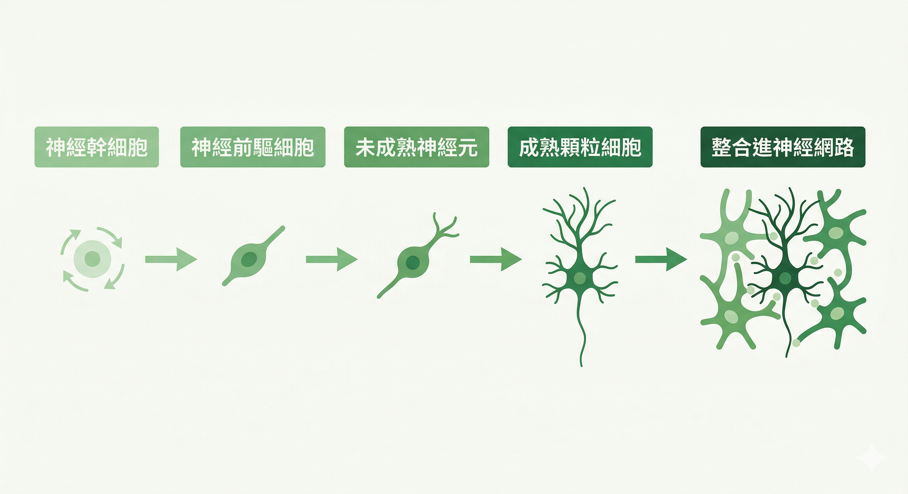
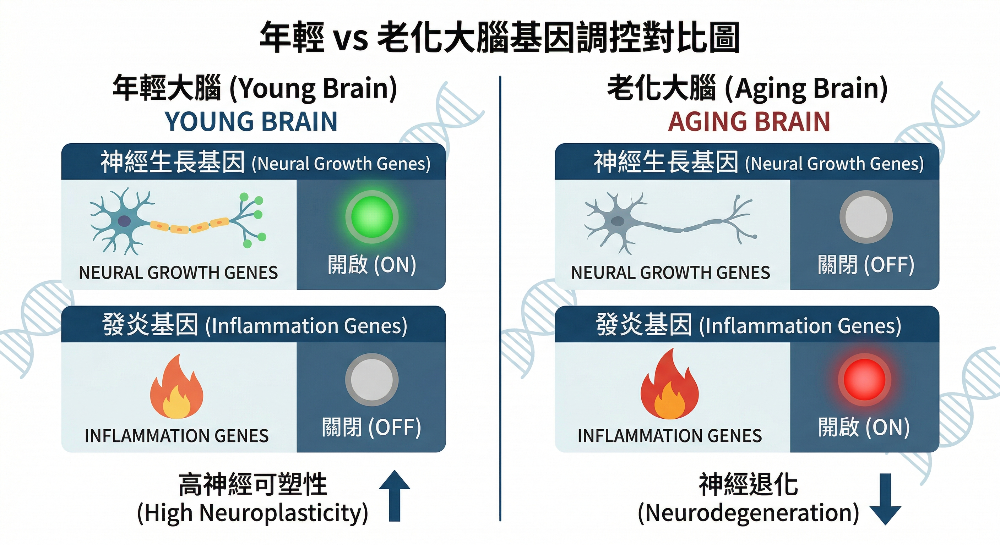
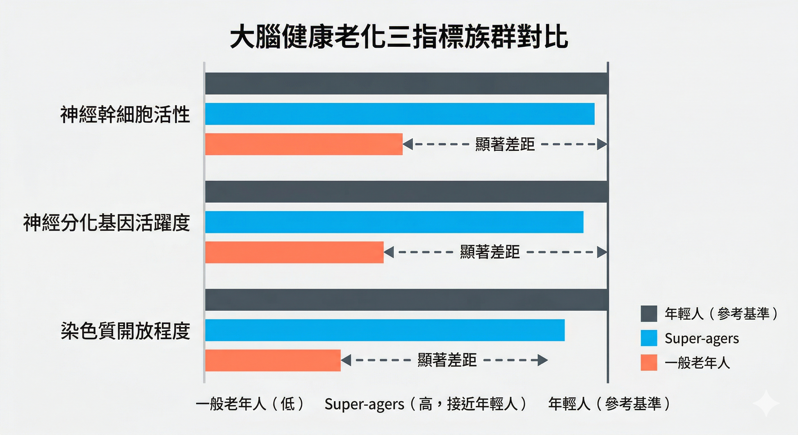
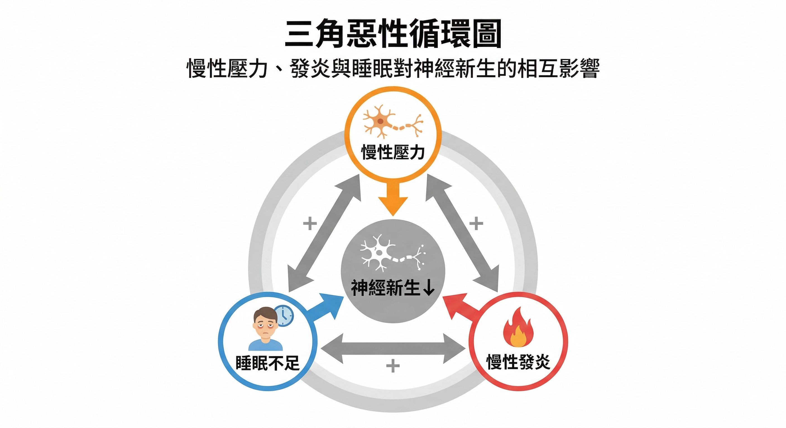

你身邊有沒有這樣的人？

85 歲還在讀書、計劃旅行、記得十年前說過的話，腦袋清晰得讓五十幾歲的你有點自嘆不如。

神經科學把這樣的人叫做 **Super-agers，超級老年人**。

他們不是特別幸運，也不是基因特別好。

2026年2月，《Nature》期刊一篇史上最大規模的人類大腦研究，找到了他們的秘密——而且這個秘密，從你現在這個年齡就開始決定。

---

## 這項研究有多大

美國伊利諾大學芝加哥分校的研究團隊，分析了**355,997個人類大腦細胞核**。

研究對象涵蓋五個族群：
- 記憶正常的健康年輕人
- 沒有失智的健康老年人
- 80歲以上但記憶力媲美50歲的**超級老年人**
- 臨床前期阿茲海默症患者（有病理變化但尚未出現明顯症狀）
- 已確診阿茲海默症患者

他們不是只看幾個蛋白標記，而是全面解析每一顆細胞的**基因表現與調控狀態**，使用的技術包括單核 RNA 定序、染色質開放性分析，以及基因調控網路分析。

這使得結果比過去任何研究都更具說服力。

---

## 壽命夠長，不等於活得好

在進入研究發現之前，先想一個問題。

我們常說「活得久」，但很少認真問自己：**活得久之後，那個「我」還在嗎？**

70 歲時，你還認得出老朋友的聲音嗎？

80 歲時，你還記得哪一年做了那個讓你驕傲的決定嗎？

**壽命（Lifespan）和健康壽命（Healthspan）之間，往往有一段沉默的落差。**

那段時間，人還活著，但記憶、情緒、自我感——正在一點一點離開。

而這篇研究讓我們看到：這個差距，並非無法縮短。

---

## 四個關鍵發現

### ① 成年人的大腦仍然在製造新神經元

過去科學界長期認為：成年後，大腦就停止製造新的神經細胞。

這個觀念，被這篇研究正式推翻。

研究確認：成年人海馬迴中存在 **神經幹細胞**，也存在正在發育中的未成熟神經元，而且有完整的分化軌跡可以追蹤：

神經幹細胞 → 神經前驅細胞 → 未成熟神經元 → 成熟顆粒細胞

**神經新生（Neurogenesis），在成年後並沒有完全停止。**

> 📸 **【圖1】** 神經新生四階段流程圖：神經幹細胞 → 神經前驅細胞 → 未成熟神經元 → 成熟顆粒細胞 → 整合進神經網路，每個階段配小圖示顯示細胞形態變化，箭頭連接。顏色建議：綠色系（代表生長與可塑性）。圖說：「這是一條連續可被追蹤的發育路徑，成年人海馬迴中確實存在。」

---

### ② 老化改變的不只是細胞數量，而是整個基因調控網路

隨著年齡增加：

- 與神經生長相關的基因逐漸**關閉**
- 與發炎相關的基因逐漸**打開**
- 神經幹細胞數量下降
- 染色質結構改變（決定哪些基因能被讀取的「包裝結構」）

老化，是整個基因表現程式被重新改寫的過程。不是細胞變少而已——是大腦的分子語言，從「生長與修復」切換到「發炎與凋零」。

> 
---

### ③ 阿茲海默症的影響，在你察覺之前就已經開始

這是這篇研究最值得警醒的發現。

在「臨床前期」患者身上——也就是還沒有明顯失智症狀，但病理變化已經悄悄開始——神經新生細胞的 **基因調控狀態就已經異常了**。

**損傷，早在症狀出現之前就在發生。**

等到記憶力出問題才開始擔心，可能已經錯過了最關鍵的介入時機。

---

### ④ Super-agers有一個共同的分子特徵

那些 80 歲還有 50 歲記憶力的人，他們的大腦有什麼不同？

研究發現：

- **神經幹細胞活性接近年輕人**
- **神經分化相關基因持續活躍**
- **染色質維持開放狀態**（也就是說，讓大腦保持可塑性的基因「開關」還開著）

他們的大腦，保住了一個 **年輕的分子環境**。

這提示一件重要的事：認知好壞不只是年齡問題，而是大腦是否維持健康的神經新生機制。

> 📸 **【圖3】** 三族群橫向條形對比圖。縱列三項指標：神經幹細胞活性 / 神經分化基因活躍度 / 染色質開放程度。橫欄三個族群：一般老年人（低）/ Super-agers（高，接近年輕人）/ 年輕人（參考基準）。Super-agers與一般老年人的差距用顏色明顯區隔。圖說：「Super-agers的大腦在三項關鍵分子指標上，全部接近年輕人——不是基因特別好，而是這套機制被維持住了。」

---

## 神經新生的敵人，就在你的日常裡

這項研究同時也提醒我們：有哪些因素會加速神經新生的衰退？

**慢性壓力** — 壓力荷爾蒙 Cortisol 直接抑制海馬迴神經幹細胞分裂，同時降低 BDNF（神經細胞的關鍵滋養分子）活性。

**慢性發炎** — 大腦中的免疫細胞（小膠質細胞）在長期發炎環境下持續釋放發炎因子，把「可塑的大腦」推向「僵化的大腦」。

**睡眠不足** — 深度睡眠期間是大腦清除代謝廢物的關鍵時窗，睡眠品質差會加速神經退化相關蛋白的積累。

這三者會形成惡性循環：壓力導致發炎，發炎影響睡眠，睡眠不足又加重壓力反應——同時從三個方向壓制神經新生。

> 📸 **【圖4】** 三角惡性循環圖：三個頂點分別是「慢性壓力」「慢性發炎」「睡眠不足」，三條雙向箭頭互相連結，中央匯流到「神經新生↓」。每個頂點用不同顏色標示（橘/紅/藍），中央用灰色表示受抑制狀態。圖說：「壓力、發炎、睡眠三者形成惡性循環，從三個方向同時壓制神經新生。」

---

## 你現在幾歲？

神經科學告訴我們：**40–50 歲，是神經新生機制的關鍵轉折期。**

你現在怎麼睡、怎麼動、怎麼面對每天的壓力——都在決定30年後那個「你」的大腦狀態。

Healthspan，從現在就開始計算。

這不是危言聳聽，而是細胞層級的現實：**你今天的選擇，就是你明天的大腦。**

---

## 延伸閱讀

- [你以為只是「壓力大」——但科學發現，它正在改變你大腦裡的蛋白質](/blog/body-signals/stress-mitochondria-bdnf-depression/)
- [你每晚都有一個清洗大腦的機會——但大多數人都錯過了](/blog/chronic-inflammation/sleep-glymphatic-brain-detox/)

---

## 參考資料

01. Disouky A et al., 2026. [Human hippocampal neurogenesis in adulthood, ageing and Alzheimer's disease.](https://pubmed.ncbi.nlm.nih.gov/41741649/) *Nature* 10.1038/s41586-026-10169-4.
