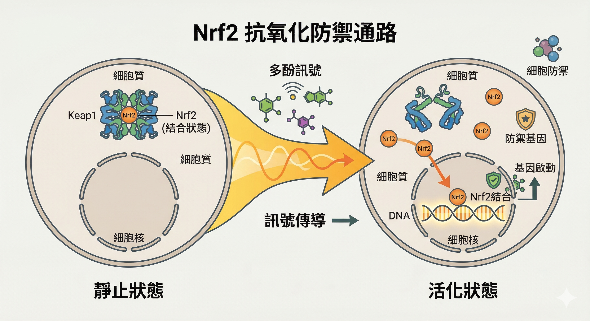

「多吃蔬果，因為裡面的抗氧化物能清除自由基。」

這句話大家都聽過。對很多平常忙到把健康排在最後、累了才想靠高劑量保健品撐住的人來說，這種說法也很有安慰感：只要補進去一些「抗氧化成分」，好像就能把損耗補回來。

但放到人體裡，事情可能沒有這麼單純。

現有研究愈來愈傾向認為：**多酚真正厲害的地方，未必是自己下場「清除自由基」，而是透過低劑量的氧化還原訊號，啟動細胞原本就有的防禦系統。**

換句話說，它更像是在 **訓練你的細胞**，而不是代替細胞工作。

---

## 迷思：吃下去的多酚，真的夠拿來「清自由基」嗎？

蔬果裡的多酚（polyphenols）種類非常多，例如紅酒裡的白藜蘆醇、洋蔥裡的槲皮素、綠茶裡的兒茶素。

在實驗室的試管裡，這些分子確實能直接和自由基反應。

這個畫面很直觀，也很容易讓人產生一種印象：多酚進入身體後，應該就是幫我們把自由基一個一個清掉。

問題是，人體不是試管。

多酚普遍有一個現實限制： **生體可用率不高**。

很多多酚在腸道、肝臟與微生物代謝後，真正以有效形式進入血液的量並不多，大多數化合物的血中濃度只落在低微莫耳（μM）量級。

相較之下，身體本來就有的抗氧化系統，例如谷胱甘肽（GSH），濃度往往高出好幾個數量級。

在這種差距下，靠吃下去的那一點點多酚去「直接清除」全身自由基，機率其實很低。

這也是為什麼近年很多研究者開始認為：**多酚在人體裡更重要的角色，可能不是直接當清道夫，是當訊號啟動者。**

---

## 真相：多酚更像是在對細胞「發出微量警報」

較符合現有證據的說法是：**多酚在人體內更可能不是靠大量直接清除自由基，是透過低劑量氧化還原訊號，促使細胞啟動適應性防禦。**

以色列希伯來大學等學者提出，多酚在特定條件下可能促成極微量的過氧化氫（H₂O₂）形成。

平常提到 H₂O₂，大家想到的往往是氧化壓力與破壞；但在非常低的濃度下，它也可以是一種 **訊號分子**。

這裡的重點不是「氧化越多越好」，是：**低劑量、可控制的氧化還原刺激，有時反而能提醒細胞把防禦系統打開。**

也就是說，多酚的價值，可能不在於它幫你把所有壓力都消掉，而在於它讓細胞收到一個訊號：

> 「環境有變化了，該升級防禦了。」

（自由基到底是壞蛋還是訊號分子？這篇有更完整的說明：[壞蛋還是信差？自由基的兩張臉](/blog/chronic-inflammation/free-radical-two-faces/)）

---

## Nrf2 開關：讓細胞自己製造抗氧化主力

如果要理解這整件事，**Nrf2** 是最值得認識的關鍵字之一。

平常情況下，Nrf2 會被一個叫 **Keap1** 的蛋白質壓住，維持在低活性狀態。

當細胞感受到氧化還原環境的改變，Keap1 這個感測系統就可能鬆手，讓 Nrf2 進入細胞核，啟動一整批和防禦、修復、解毒有關的基因。

接著，細胞會開始提升真正有戰力的防禦系統，包括谷胱甘肽（GSH）、協助處理活性氧的超氧化物歧化酶（SOD）、與抗氧化和抗發炎反應有關的血紅素加氧酶-1（HO-1），以及其他與解毒、修復、壓力適應相關的保護機制。

所以，從這個角度看，多酚不是自己上場打仗。

它比較像是 **吹哨的人**，讓身體的防禦部隊自己動起來。

---

## 這個邏輯，跟「重訓增肌」其實很像

在生理學上，這種現象常被放進 **hormesis（激效作用）** 的框架裡理解。

肌肉不是憑空長出來的。重訓造成的微小刺激與微損傷，會迫使身體啟動修復與適應，最後讓肌肉更強壯。

沒有刺激，不會進步；刺激過頭，反而受傷。

多酚在細胞層面做的事，也很像這個邏輯：

- **刺激太少** → 細胞沒感覺，防禦系統不會特別升級
- **刺激剛好** → 細胞收到低劑量訊號，啟動適應與保護
- **刺激過強** → 壓力超過可承受範圍，反而造成損傷

所以，多酚不是在替你把所有問題都解決掉；它比較像是在安排一場 **可恢復、可適應的細胞訓練**。

---

## 為什麼高劑量補充，不一定比天然食物更好？

理解這一點之後，一個很常見的直覺就要被修正：

**既然多酚有幫助，那濃度越高，效果不是應該越好嗎？**

不一定。

如果多酚的重要作用之一，真的是透過低劑量訊號來促進細胞適應，那麼它的效果就很可能不是線性的。

也就是說，從天然食物中攝取到的範圍，可能剛好落在「能提供訊號、又不至於造成負擔」的區間；但高劑量、單一成分、濃縮型補充，未必還在同一個甜蜜點。

這也是為什麼你不能把「吃食物的效果」直接等比例放大成「吞更高劑量補充劑的效果」。

天然食物是複合基質、低到中等劑量、長期暴露；高劑量補充品則常常是集中、單一、快速提高暴露量。這兩者在生理上的意義，不是同一件事。

---

## 為什麼太累的時候，狂吞高劑量保健品，未必是好策略？

理解了 hormesis 的概念，你就比較容易看懂一個長期被討論的現象：

**為什麼部分高劑量抗氧化補充劑，在某些隨機試驗與系統性回顧中沒有帶來預期好處，甚至出現風險訊號？**

2007 年發表於 *JAMA*、之後也被 Cochrane 更新納入的系統性回顧指出，某些抗氧化補充劑，特別是 β-胡蘿蔔素、維生素 E，以及較高劑量的維生素 A，在特定試驗條件下，和全因死亡風險上升有關。

但這段不能被簡化成一句「所有抗氧化補充劑都有害」。

更精確的說法是：

- 不是所有補充劑都顯示相同風險
- 風險可能和 **劑量、形式、族群、疾病狀態、抽菸與否、合併用藥** 有關
- 高劑量補充，不等於高劑量保護

所以真正值得記住的，不是恐嚇，是這句話：

> **「機制與劑量」往往比「成分名稱」更重要。**

---

## 這個機制跟你的疲勞、恢復力，可能有什麼關係？

這套以 Nrf2、氧化還原訊號、細胞適應為核心的邏輯，和一個人每天的恢復狀態，其實是連得上的。

當一個人長期壓力大、睡眠差、飲食失衡、活動量不足，身體不一定只是「缺某個保健品」而已；更常見的問題是，**整體修復與調節系統已經不在好的工作狀態。**

這也是為什麼，很多人在很累的時候去買最高劑量的單一成分，最後感受到的未必是明顯改善。真正需要先確認的，常常不是「缺哪一顆」，是：

- 你的身體現在到底有多疲勞？
- 修復能力是不是已經往下掉？
- 發炎與壓力訊號是不是長期偏高？
- 目前的補法，究竟是在幫忙，還是在增加負擔？

---

## 延伸閱讀

- [**壞蛋還是信差？自由基的兩張臉——「消滅」的邏輯，早就被推翻了**](/blog/chronic-inflammation/free-radical-two-faces/)
  讀這篇才能理解多酚機制的前提：自由基本身有兩面性，這篇說清楚它在什麼條件下是壞蛋、什麼條件下是訊號。

- [**抗慢性發炎就是在抗老化——這不是廣告詞，這是2000年就確立的科學**](/blog/chronic-inflammation/anti-inflammation-anti-aging/)
  Nrf2 是發炎調控的上游開關之一。這篇說明它和慢性發炎、老化的長期關係。

- [**你每天有夠吃蔬菜嗎？你的細胞拿到的可能比你以為的少很多**](/blog/body-signals/carotenoid-cell-absorption/)
  多酚和類胡蘿蔔素的吸收問題是同一個邏輯：吃進去不等於細胞拿到了。

- [**那些讓你點頭的保健品話術，你聽過哪些？**](/blog/precision-health-tools/supplement-myths-debunked/)
  知道機制之後，才能看懂哪些話術在哪裡打漏洞。

---

## 如果只用一句話總結這篇文章：

多酚不是在替細胞清戰場，它更像是在安排一場低劑量、可恢復、能讓防禦系統升級的訓練。

這也是為什麼，「多酚 = 抗氧化 = 清自由基」這句話雖然好懂，卻可能把真正重要的地方講小了。

> **它真正有意思的地方，不是它自己多會打，而是它怎麼讓你的細胞，重新學會更好地面對壓力。**

---

## 別再靠感覺吞保健品，先看懂你現在的「身體水位」

如果你最近有這些狀況：

- 下午特別容易累
- 睡醒還是像沒恢復
- 小狀況很多，身體總覺得卡卡的
- 明明有補，狀態卻沒有比較穩

那你現在最需要的，可能不是再多買一瓶，是先把自己的狀態看清楚。

---

## 參考資料

01. Kanner J, 2020. [Polyphenols by Generating H₂O₂, Affect Cell Redox Signaling, Inhibit PTPs and Activate Nrf2 Axis for Adaptation and Cell Surviving: In Vitro, In Vivo and Human Health.](https://pubmed.ncbi.nlm.nih.gov/32867057/) *Antioxidants*, 9(9):797.
02. Bjelakovic G et al., 2007. [Mortality in randomized trials of antioxidant supplements for primary and secondary prevention: systematic review and meta-analysis.](https://pubmed.ncbi.nlm.nih.gov/17327526/) *JAMA*, 297(8):842–857. 
03. Bjelakovic G et al., 2012. [Antioxidant supplements for prevention of mortality in healthy participants and patients with various diseases.](https://pubmed.ncbi.nlm.nih.gov/22419320/) *Cochrane Database of Systematic Reviews*, (3):CD007176. 
04. Forman HJ et al., 2014. [How do nutritional antioxidants really work: nucleophilic tone and para-hormesis versus free radical scavenging in vivo.](https://pmc.ncbi.nlm.nih.gov/articles/PMC3852196/) *Free Radical Biology and Medicine*, 66:24–35.
05. Di Lorenzo C et al., 2021. [Polyphenols and Human Health: The Role of Bioavailability.](https://pubmed.ncbi.nlm.nih.gov/33477894/) *Nutrients*, 13(1):273.
---
