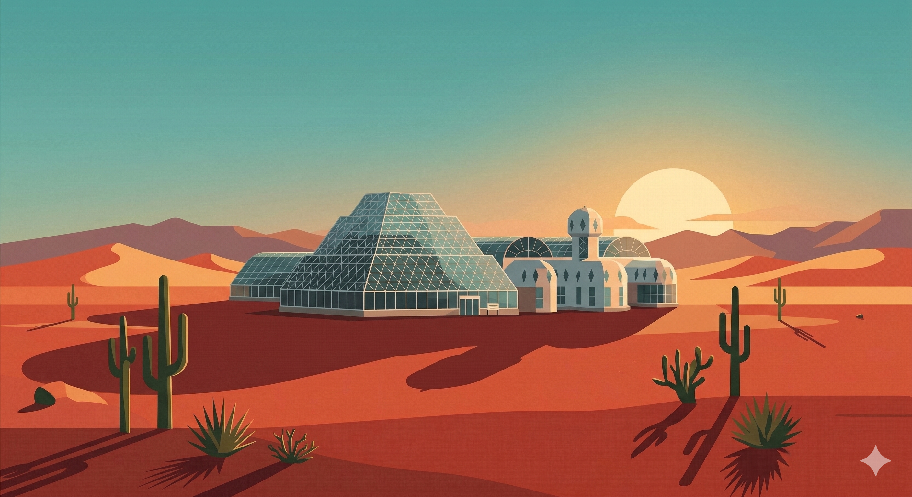
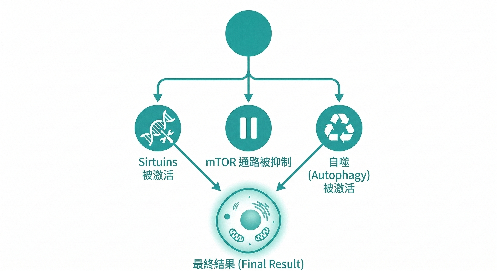

如果有一種方式，被從酵母菌、線蟲、果蠅、大鼠、小鼠，一路驗證到靈長類，都顯示出延長健康壽命的效果——你會不會想知道它是什麼？

這個方式不是藥，不是保健品，不是任何需要花錢的東西。

它叫做 **熱量限制（Caloric Restriction，CR）**。

---

## 這個發現，從 90 年前就開始了

1935年，美國康奈爾大學的克萊夫．麥凱（Clive McCay）博士做了一個當時看起來很奇怪的實驗：

他把大鼠分成兩組，一組正常飲食，一組在確保營養充足的前提下，把熱量攝取減少30%。

結果讓他自己都感到驚訝—— **限制熱量的那組大鼠，壽命延長了將近一倍。**

不是延長了幾個月，是將近一倍。

這個發現在當時引起了科學界的高度關注，但同時也帶來了一個疑問：這只是大鼠的特殊現象嗎？還是一個更普遍的生物原理？

---

## 跨物種的驗證：從最簡單的生命到靈長類

接下來的幾十年，科學家在各種生物身上重複了麥凱的實驗。

**酵母菌、線蟲（C. elegans）：** 限制熱量後，壽命顯著延長，與熱量受限相關的長壽基因路徑（如Sirtuins）被激活。

**果蠅（Drosophila）：** 同樣的效果。而且發現不只是壽命延長，在老年期的活動力和繁殖能力也維持得更好。

**大鼠和小鼠：** 麥凱的發現在多個實驗室被反覆確認。限制 20% - 30% 的熱量攝取，壽命延長幅度從 30% - 50% 不等，同時慢性病的發生率顯著降低。

然後到了靈長類——

**2017年，《Nature Communications》發表了一項追蹤恆河猴長達 27 年的研究。**

恆河猴的基因組成和代謝方式與人類高度相似。這項研究是目前靈長類熱量限制研究中追蹤時間最長的。

結果確認：熱量限制組的恆河猴不只活得更久，而且在老年期的代謝健康、認知功能、肌肉維持和免疫狀態都顯著優於正常飲食組。

---

## 人類第一次「被迫做」的熱量限制實驗

在 CALERIE-II 之前，還有一個更戲劇性的故事。

1988 年，美國亞利桑那州沙漠裡蓋了一個玻璃圓頂密封空間，耗資 1.5 億美金，占地 12,700 平方公尺，由 80,000 根鋼樑和 6,000 塊玻璃組成——這是 **生物圈二號（Biosphere 2）**，原本的任務是模擬地球生態系統，為人類移居火星做準備。

1991 年，八位「生物圈人」進入這個封閉空間，預計在裡面自給自足生活兩年。

其中有一位實驗者身分為醫生，當時年紀已經 67 歲，叫做 **羅伊·華福德（Roy Walford）**。

他是熱量限制研究的先驅，師承最早做恆河猴 CR 研究的團隊。

進入生物圈之前，他已經自己執行熱量限制飲食超過十年——每天只攝取 1,600 大卡，比正常人少了三分之一以上。

生物圈二號內的農作物產量不如預期，糧食開始短缺，組員們開始恐慌。

但華福德暗自欣喜——他說服組員不用擔心，這正是他一直等待的機會：真正在人體上驗證熱量限制的效果。

六個月後，每位組員的體重平均下降了 7 - 8 公斤。

但他們的健康指標呢？

**血壓下降、空腹血糖下降、血脂改善、代謝年齡各項指標全面向好。**

這是人類史上第一次，在真實環境中對健康成人執行熱量限制的完整紀錄。

唯一的問題是：後來糧食恢復供應之後，所有人幾乎立刻恢復了正常的飲食量。飢餓感太難忍受。

這個結果很重要——它同時證明了熱量限制對人體有效，也預告了它最大的實踐障礙。

---

## 人類怎麼樣？CALERIE-II 研究

動物實驗再強，都有人會問：「但人類呢？」

美國國家衛生院（NIH）資助了一項名為 **CALERIE-II** 的大型臨床研究，全名是「限制能量攝取對抗衰老長期影響之綜合評估」。

研究設計：218 名健康的中年受試者，在兩年內減少15%的熱量攝取（沒有讓他們挨餓，只是適度減少）。

**結果：**

- 氧化壓力顯著降低
- 基礎代謝率優化（代謝效率提升，而非下降）
- 空腹胰島素水平下降（與長壽高度相關）
- 體溫微幅下降（這是熱量限制的典型生理標誌之一）
- 免疫老化指標改善

2022年，更新的分析進一步顯示，熱量限制組的免疫代謝調節出現了與長壽高度相關的正向改變。

這是目前人類層級最有說服力的熱量限制臨床數據。

---

## 為什麼「少吃」的效果，跟「多補充抗氧化劑」完全不同？

在解釋機制之前，先破解一個常見的誤解。

很多人以為抗衰老就是「補充抗氧化劑對抗自由基」。這個邏輯有一定的根據，但有一個根本性的盲點。

把身體想像成一個浴缸，水是你的細胞功能和精力。老化就像浴缸底下有孔洞和裂縫，水慢慢流出去。

抗氧化劑的邏輯是找塞子——把洞堵住，水就不會流了。吃了一段時間確實感覺有點效，因為某幾個洞被堵住了。

但浴缸底下不只有幾個洞，還有數不清的裂縫。

就算把所有洞都堵住，水還是會從裂縫流出去。老化的路徑太多，靠單一方向的補充，永遠是被動應付。

熱量限制做的事完全不同—— **它不是去堵洞，它是讓細胞主動啟動修復程式，把裂縫從內部修復。**

這就是為什麼 CR 的效果在跨物種實驗中如此一致：它不是針對某一個老化路徑，它觸動的是細胞最底層的能量感測和修復系統。

背後的分子機制有三個核心。

---

## 為什麼「少吃」能讓細胞更健康？三個核心機制

這裡是這件事真正有趣的地方——科學家不只是觀察到「少吃能活更久」，還找到了背後的分子機制。

---

### 機制一：Sirtuins 被激活

Sirtuins 是一個蛋白質家族，因為與壽命調控密切相關，有時被稱為「長壽蛋白」。

它們的工作包括：修復 DNA 損傷、穩定端粒（染色體末端的保護結構）、調節細胞代謝、以及促進粒線體的新生。

Sirtuins 的活性依賴 NAD+（菸鹼醯胺腺嘌呤二核苷酸）。

當熱量受限時，細胞內的 NAD+ 水平上升，Sirtuins 被激活，開始執行上面那些修復和維護工作。

簡單說：**熱量限制相當於給細胞按下了「維護保養模式」的開關。**

---

### 機制二：mTOR 通路被抑制

mTOR（哺乳動物雷帕黴素靶蛋白）是細胞的「生長感應器」——當能量充足時，mTOR 活躍，細胞盲目擴張和增殖；當能量受限時，mTOR 被抑制。

mTOR 被抑制有什麼好處？

細胞停止盲目擴張，轉而進入「生存修復模式」。它開始專注於清除內部的損壞元件，而不是繼續製造新的細胞。

這個轉換，就是細胞層級的「斷捨離」。

---

### 機制三：自噬（Autophagy）被激活

自噬是細胞的「垃圾回收機制」。

受損的蛋白質、功能失常的細胞器、老化的粒線體——這些「細胞垃圾」如果堆積起來，會干擾正常的細胞功能，也是慢性發炎的來源之一。

透過抑制 mTOR，自噬被激活，細胞開始清理這些垃圾，達成細胞層級的「翻新」。

2016 年日本科學家大隅良典因為發現自噬機制，獲得了諾貝爾生理學或醫學獎。

這不是邊緣科學，這是主流生物學裡非常嚴肅的研究領域。

---

## 所以，熱量限制在做的是這件事

把三個機制放在一起，你會看到一個清晰的圖像：

熱量限制讓細胞從 **「盲目生長模式」切換到「精準修復模式」。**

在這個模式下，DNA 損傷被修復、受損的細胞器被清除、發炎訊號被抑制、能量代謝變得更有效率。

這不是讓你的細胞「凍齡」，而是讓你的細胞 **把有限的資源用在對的地方**——修復，而不是擴張。

---

## 但你不可能長期少吃 20%

這裡是這個故事的現實轉折，熱量限制的效果在科學上幾乎無庸置疑。

但對現代人來說，長期維持 20% - 30% 的熱量限制幾乎是不可能完成的任務。

飢餓感、低血糖帶來的情緒波動、長期維持的意志力消耗、社交場合的困難——這些讓熱量限制停留在「有效但無法實踐」的困境裡。

更重要的是：長期極端的熱量限制，可能帶來骨密度降低、肌肉流失、免疫力下降等代價。

這催生了一個關鍵問題：

**如果我們理解了熱量限制為什麼有效，能不能找到一種方式，在不挨餓的情況下，啟動同樣的細胞機制？**

這個問題，就是下一篇要談的內容。

---

你感覺到的疲勞、修復慢、免疫力下降，可能正是你的細胞長期停留在「盲目消耗模式」的訊號——修復不足、清除不足、能量利用效率在下降。

如果你想先了解自己的身體訊號現在在哪個程度，我整理了一份【身體警報自我檢測清單】可以幫你系統化看這件事。

---

**延伸閱讀：**
- [老化，已經可以被量化管理了](/blog/precision-health-tools/biological-age-measurement/) ← A篇
- [不節食也能啟動長壽基因？CRM 的概念和 DNA 微陣列技術](/blog/chronic-inflammation/caloric-restriction-mimetics-science/) 
- [抗慢性發炎就是在抗老化——這不是廣告詞，這是2000年就確立的科學](/blog/chronic-inflammation/anti-inflammation-anti-aging/) 

---

## 參考資料

01. Clive M McCay, Mary F Crowell, Lewis A Maynard, 1935. [The effect of retarded growth upon the length of life span and upon the ultimate body size.](https://pubmed.ncbi.nlm.nih.gov/13925718/) *J Nutr.* 10(1):63-79.
02. Julie A Mattison et al., 2017. [Caloric restriction improves health and survival of rhesus monkeys.](https://pubmed.ncbi.nlm.nih.gov/28094793/) *Nat Commun.* 8:14063.
03. O Spadaro et al., 2022. [Caloric restriction in humans reveals immunometabolic regulators of health span.](https://pubmed.ncbi.nlm.nih.gov/35084972/) *Science.* 375(6581):671-677.
04. Yaru Liang et al., 2018. [Calorie restriction is the most reasonable anti-ageing intervention: a meta-analysis of survival curves.](https://pubmed.ncbi.nlm.nih.gov/29695755/) *Sci Rep.* 8(1):5779.
05. Frank Madeo et al., 2019. [Caloric Restriction Mimetics against Age-Associated Disease: Targets, Mechanisms, and Therapeutic Potential.](https://pubmed.ncbi.nlm.nih.gov/30849361/) *Cell Metab.* 29(3):592-610.
06. Ki Wung Chung, Hae Young Chung, 2019. [The Effects of Calorie Restriction on Autophagy: Role on Aging Intervention.](https://pubmed.ncbi.nlm.nih.gov/31817038/) *Nutrients.* 11(12):2923.
