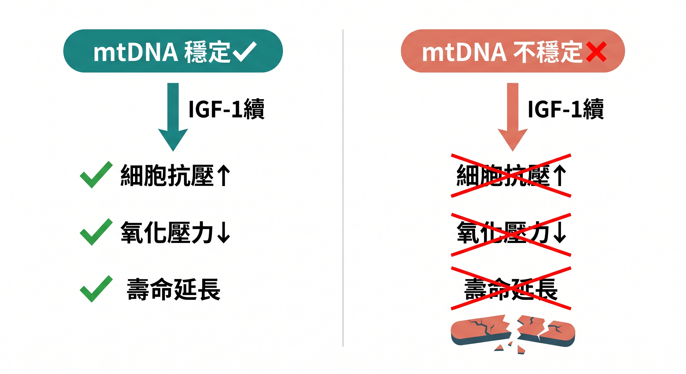
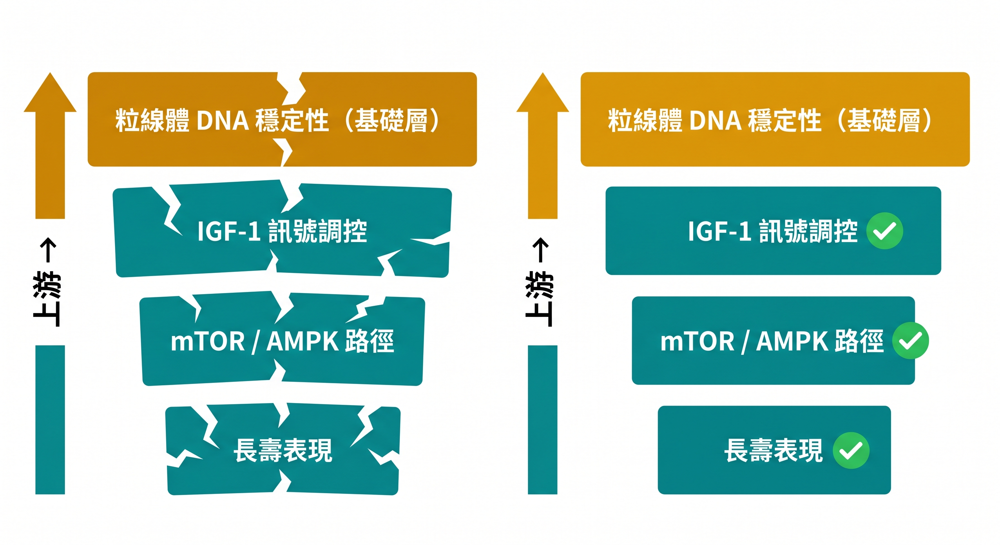

你聽過「少吃就能長壽」這個說法嗎？

背後的科學邏輯其中一條，就是**熱量限制會壓低 IGF-1（類胰島素生長因子-1）的訊號強度**，進而啟動長壽機制。

這條路徑被研究了數十年，一度被視為抗老的核心開關。

但 2026 年 4 月《Science Advances》刊出一篇來自南加州大學的研究，讓這個「開關」的地位出現了根本性的動搖。

---

## IGF-1 是什麼？為什麼抗老研究這麼在意它？

IGF-1 主要由肝臟分泌，受 **生長激素（Growth Hormone）** 調控。

它的工作是促進細胞生長、代謝與存活。

問題在於：IGF-1 太強的時候，細胞會一直處於「生長模式」，而不是「修復模式」。

更麻煩的是，IGF-1 過度活化與 **慢性低度發炎（Chronic Low-grade Inflammation）** 之間存在雙向關係。

IGF-1 訊號過強時，會促進 NF-κB 路徑活化，推高促炎細胞激素（IL-6、TNF-α）的濃度；而長期慢性發炎反過來又會擾亂 IGF-1 的正常調控，形成惡性循環。

這也是為什麼高壓、高糖飲食、睡眠不足的中年族群，同時面對老化加速與發炎指數偏高兩個問題。

多個動物實驗顯示，**降低 IGF-1 訊號**可以：

- 提升細胞的抗壓能力
- 減少氧化壓力（Oxidative Stress）
- 延緩細胞老化（Cellular Senescence）
- 延長壽命

這讓 IGF-1 成為抗老研究裡最熱門的靶點之一，甚至有研究者形容它是「壽命開關」。

---

## 問題來了：並不是每隻小鼠都長壽了

南加州大學的研究團隊用了一批 **粒線體突變小鼠** 做實驗。

這些小鼠有一個特點：**粒線體 DNA（mtDNA）複製容易出錯**，突變快速累積，導致明顯的早衰現象。

研究人員對這些小鼠抑制 IGF-1 訊號，照理說，這應該能啟動長壽機制。

結果出人意料：

> **壽命沒有延長。長壽相關的下游機制，也明顯減弱甚至消失。**

同樣的介入在粒線體 DNA 正常的小鼠身上有效，但在 mtDNA 不穩定的小鼠身上卻完全失靈。

這裡有一個關鍵的惡性循環值得注意：

mtDNA 突變累積 → 粒線體功能下降 → 細胞能量不足 → **氧化壓力升高、SASP（衰老相關分泌表現型）啟動** → 促炎細胞激素大量釋放 → 慢性發炎進一步損傷 mtDNA。

換句話說在粒線體 DNA 不穩定的個體，其體內的慢性發炎狀態本身就是長壽機制無法啟動的原因之一。

---

## 這代表什麼？粒線體比 IGF-1 更上游

這個發現指向一個重要的**生物層級概念（hierarchy）**：

粒線體 DNA 的完整性，位於 IGF-1、mTOR、AMPK 這些「經典長壽路徑」的**上游**。

可以這樣理解：

- IGF-1 是「控制面板上的按鈕」
- 粒線體 DNA 是「支撐整個控制面板的電力系統」

**電力不穩時，你按再多按鈕也沒用。**

這解釋了一個困擾研究者多年的現象：為什麼相同的抗老策略，在不同人身上效果差這麼大？

因為每個人的粒線體基礎狀態本來就不同。

---

## 對你的抗老策略意味著什麼？

這項研究是對幾個常見思路的直接挑戰：

**熱量限制**、**間歇性斷食**、**藥物調控 IGF-1**：這些方法過去被視為普遍有效的延壽手段。

但研究指出它們的有效性，高度依賴你 **粒線體 DNA 的穩定程度**。

換句話說：

> 如果你的粒線體 DNA 已經開始累積損傷，光靠調整飲食或單一訊號路徑，可能遠遠不夠。

更全面的策略應該包含：

1. **降低 mtDNA 損傷的來源**：氧化壓力與**慢性發炎是最主要的兩個源頭**。NF-κB 驅動的持續低度發炎會直接攻擊粒線體膜與 DNA，這也是為什麼抗發炎介入（Omega-3、多酚類、AMPK 活化劑）在抗老研究中反覆出現
2. **支援粒線體的複製與修復能力**：CoQ10、NAD⁺ 前驅物（NMN/NR）、α-硫辛酸等有文獻支持的成分，主要作用點都在粒線體層
3. **在多個層次同時介入**，而不是只針對 IGF-1 或 mTOR，發炎控制是基礎，mtDNA 穩定是前提，訊號路徑調控才是加速器

---

## 抗老不是單一開關，是整個系統的維護

這項研究最重要的貢獻，是把「老化」從單一路徑調控，拉回到了 **系統性生物學** 的視野。

粒線體 DNA 穩定性，將成為未來長壽研究的核心指標之一。

值得一提的是，目前臨床上少數能同時觸及多個長壽路徑的介入之一，是 **GLP-1 受體促效劑（即俗稱的「瘦瘦針」）**。

它透過改善胰島素阻抗、間接壓低 IGF-1 訊號強度，同時活化 AMPK，在抗老研究社群引發高度關注。

然而這篇研究的邏輯同樣適用：如果個體的粒線體 DNA 穩定性已經受損，GLP-1 對長壽路徑的調節效果，可能同樣會打折扣。

關於 GLP-1 如何影響基因老化模式，可以參考：[GLP-1 確認了一件事：逆轉基因老化模式](/blog/chronic-inflammation/glp1-gene-aging-reversal/)。

而對現在的你來說，最實際的問題是：**你的粒線體基礎狀態怎麼樣？**

這不是一個靠感覺能回答的問題。

慢性疲勞、下午注意力渙散、睡眠品質差，這些訊號，可能比你想的更早出現。

想知道你的身體目前處於哪個狀態？

---

## 延伸閱讀

- [你以為只是「壓力大」——但科學發現，它正在改變你大腦裡的蛋白質](/blog/body-signals/stress-mitochondria-bdnf-depression/)
- [睡眠與大腦清除系統：glymphatic 機制如何影響你的老化速度](/blog/chronic-inflammation/sleep-glymphatic-brain-detox/)
- [表觀遺傳時鐘：你的生物年齡，和身分證上的數字不一樣](/blog/chronic-inflammation/multivitamin-lifepak-slow-aging-clock/)

---

**參考資料**

01. Jimenez-Hidalgo et al., 2026. [he longevity effects of reduced IGF-1 signaling depend on the stability of the mitochondrial genome.](https://pubmed.ncbi.nlm.nih.gov/41931604/)  *Sci Adv* 12(14):eaea4279.
