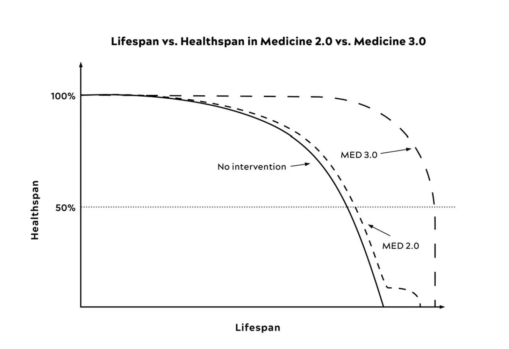

你有沒有這樣的經驗：

去看醫生，說自己最近很容易疲勞、感冒好得比以前慢、下午腦袋開始鈍掉。

醫生做了一些基本檢查，告訴你數值都在正常範圍，可能是壓力太大，建議你多休息。

你點頭，走出診間，繼續一樣的生活。

但那些症狀沒有消失。

---

我想告訴你一件事： **那些症狀，可能不只是壓力的問題。它們可能是你的身體正在老化的方式。**

不是在嚇你。這是有名字的科學概念，有超過二十年的研究在支撐它。

這個概念叫做 **Inflammaging**。

---

## Inflammaging 是什麼？

西元 2000 年義大利波隆那大學的免疫學家 Claudio Franceschi 教授，在分析了大量百歲人瑞的生理數據之後，提出了一個觀察：

**老化，本質上是一種持續的慢性低度發炎狀態。**

他把這個現象命名為「Inflammaging」——由「Inflammation（發炎）」和「Aging（老化）」兩個字合成。

這個概念在當時有點顛覆性。

過去科學家把老化和發炎看成兩件事：老化是細胞自然凋亡的過程，發炎是免疫系統的防禦反應。

Franceschi 的研究指出，這兩件事不是平行發生的，它們是同一個過程的兩個面向。

二十多年後，這個概念已經是老化研究的核心框架之一。

---

## 為什麼老化會跟發炎綁在一起？

先理解正常的發炎是什麼。

當你受傷或感染，免疫系統會啟動急性發炎反應：召集免疫細胞、釋放發炎因子、攻擊入侵者、修復受損組織。

任務完成之後，發炎反應平息，一切恢復正常。

這是健康的發炎——有啟動，有結束。

慢性發炎（Inflammaging）不一樣。

它的免疫系統啟動了，但沒有完全平息。

為什麼？因為隨著細胞老化，有幾件事同時在發生：

**衰老細胞不斷釋放發炎訊號**

細胞分裂到一定次數之後會進入「衰老狀態」，停止分裂，但不會消失。

這些衰老細胞會持續釋放一種叫做「衰老相關分泌表型」（Senescence-Associated Secretory Phenotype，SASP）的發炎物質，像一個持續漏氣的氣球，一直在給周圍的細胞製造低度的發炎環境。

**免疫系統越來越難清除威脅**

免疫細胞本身也會老化。

老化的免疫細胞識別威脅的能力下降、清除衰老細胞的效率降低——於是衰老細胞越積越多，發炎訊號越來越強。

**這個循環會自我強化**

慢性發炎加速免疫細胞老化，免疫細胞老化讓慢性發炎更難被控制——形成一個惡性循環。

發炎加速老化，老化加劇發炎。

這就是為什麼在西元 2023 年發表在《Signal Transduction and Targeted Therapy》的綜合回顧指出：**發炎已被確認為老化的內在因素，而不只是老化的伴隨現象。**

---

## 這跟你的症狀有什麼關係？

回到那些症狀。

**感冒好得比以前慢：**

不是病毒特別強。

是你的免疫系統在 Inflammaging 的狀態下，有一部分的資源被慢性發炎持續佔用，真正遇到病毒入侵時，可調動的兵力已經打了折扣。

**睡滿八小時還是累：**

細胞修復需要在睡眠期間進行。

但在慢性發炎的環境裡，粒線體（細胞的發電廠）的工作效率下降，能量產出跟不上修復的需求。你睡了足夠的時間，但修復工作沒有做完。

**下午腦霧、反應變慢：**

神經細胞對慢性發炎特別敏感。

持續偏高的發炎因子（如 IL-6、TNF-α）會干擾神經突觸的傳導，讓思維清晰度下降——這在臨床上與阿茲海默症和帕金森氏症的早期機制是相同的路徑，只是程度輕得多。

這些症狀不是獨立的問題，也不只是壓力的反應。

它們是同一個底層機制——Inflammaging——在不同地方的出口。

---

## Inflammaging 從幾歲開始？

這是很多人沒有想到的部分。

Inflammaging 不是65歲以後才發生的事。

研究顯示，慢性低度發炎的累積，**從30幾歲就開始了**。

只是在30到40歲的時候，你的修復能力還能大致跟上——症狀輕微，容易被解釋成「壓力」或「睡眠不足」。

到了40幾歲，修復速度開始跟不上損耗速度，症狀開始變得明顯。感冒越來越難好，疲勞越來越難恢復，體檢數值開始出現黃燈。

到了50幾歲，如果沒有介入，Inflammaging 的累積效應開始轉化成可診斷的慢性病——心血管疾病、代謝問題、神經退化的早期訊號。

這個時間軸很重要，因為它說明了一件事：

**等你「感覺老了」才開始處理，不是預防，是追趕。**

---

## 抗慢性發炎，就是在主動控制老化速度

這裡回到本文的標題。

「抗慢性發炎就是抗老化」，這句話不是保健品廣告的誇大說法。

它是從 Inflammaging 這個科學框架直接導出的邏輯：

如果老化的核心機制之一是慢性發炎的持續累積，那麼控制慢性發炎的程度，就是在直接影響老化的速度。

不是讓你長生不老。

不是讓你的細胞不再分裂。

而是**讓你的免疫系統不要提前進入那個惡性循環，讓你的修復能力維持在能夠跟上損耗的水位，讓那些症狀——感冒難好、睡滿還累、下午腦霧——不要在40幾歲就開始佔據你的生活。**

這就是 Healthspan 和 Lifespan 的差距從哪裡來的。

---

## 第一步：知道你的發炎狀態在哪裡

Inflammaging 的麻煩之處，是它感覺不到。

它不像急性發炎會讓你紅腫熱痛，它只是讓你漸漸比以前更容易累、更難恢復、更多小狀況。

你的體檢數值可能還在正常範圍，但細胞環境已經開始偏向慢性發炎的方向了。

所以第一步先搞清楚你現在的狀況在哪裡。

睡一睡就好了恐怕沒那麼容易。

你的症狀組合——感冒頻率、疲勞程度、睡眠品質、修復速度——這些加在一起，能告訴你一個大概的方向。

我整理了一份【身體警報自我檢測清單】，幫你把這些訊號系統化整理，看看你現在的狀態符不符合 Inflammaging 的早期模式。

**加我 LINE，我把清單傳給你。**

知道問題在哪裡，才能從對的地方開始。

👉 [加LINE索取【身體警報自我檢測清單】](https://line.me/ti/p/@fer7932k)

---

**延伸閱讀：**
- [感冒拖三週、睡滿還是累、傷口好得比以前慢——這三件事同時出現，不是巧合](#) ← 第1篇
- [壽命55%是基因決定的——那你現在用什麼速度在耗損另外45%？](#) ← 第3篇
- [活到85歲，但有20年是在診所和藥罐子裡——你要哪一種晚年？](#) ← 第4篇

---

## 參考資料

01. Claudio Franceschi et al., 2000. [Inflamm-aging. An evolutionary perspective on immunosenescence.](https://pubmed.ncbi.nlm.nih.gov/10911963/) *Ann N Y Acad Sci.* 908:244–54.
02. Luigi Ferrucci, Elisa Fabbri, 2018. [Inflammageing: chronic inflammation in ageing, cardiovascular disease, and frailty.](https://pubmed.ncbi.nlm.nih.gov/30065258/) *Nat Rev Cardiol.* 15:505–22.
03. Nan Li et al., 2023. [Inflammation and aging: signaling pathways and intervention therapies.](https://www.nature.com/articles/s41392-023-01502-8) *Signal Transduct Target Ther.* 8:239.
04. Brian J Andonian et al., 2025. [Inflammation and aging-related disease: A transdisciplinary inflammaging framework.](https://pubmed.ncbi.nlm.nih.gov/39352664/) *GeroScience.* 47(1):515–542.
