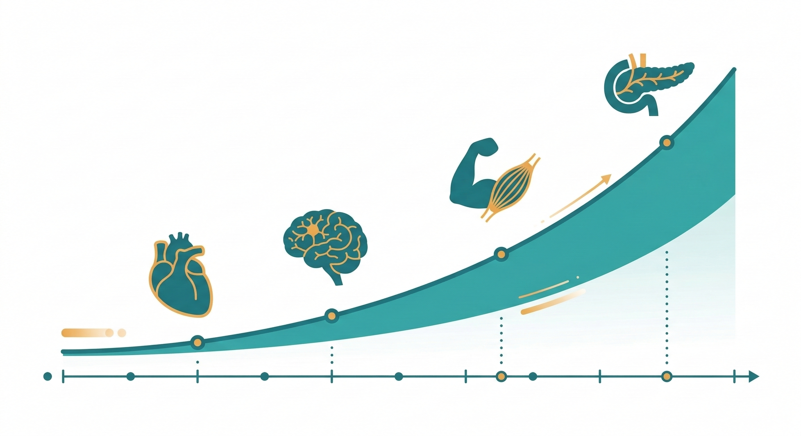
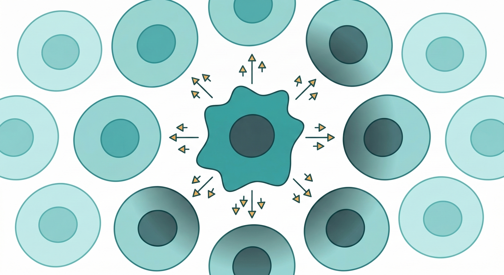

你有沒有想過，為什麼老化和慢性病幾乎總是一起出現？

心血管疾病、第二型糖尿病、阿茲海默症、肌肉流失、癌症，這些在中老年最常見的疾病，表面上看起來完全不相關。不同器官、不同症狀、不同的治療方式。

但它們有一個共同的底層訊號：

**慢性低度發炎。**

這不是保健品廣告的說法。這是2000年就已經在頂級期刊發表、二十年來持續被驗證的老化生物學核心概念。

---

## Inflammaging：一個改變老化研究的概念

2000年義大利波隆那大學老年醫學家 Claudio Franceschi 在《Annals of the New York Academy of Sciences》發表了一篇論文，提出「**Inflammaging**」這個詞。

它是「Inflammation（發炎）」和「Aging（老化）」的合成字。

Franceschi 的核心主張是： **老化本身就是一種慢性低度的促發炎狀態**，而這個狀態是幾乎所有老化相關疾病的共同土壤。

這篇論文現在的引用次數超過 6,000 次，在生命科學研究領域中這是極高的數字。

它改變的不只是學術界對老化的理解，也改變了「為什麼抗發炎和抗老化是同一件事」這個問題的答案。

---

## 「發炎」不只是紅腫熱痛

先釐清一個概念。

大多數人對「發炎」的印象是：感冒、扭傷、傷口感染，紅、腫、熱、痛。

這是 **急性發炎**，是免疫系統對明確威脅的快速反應，威脅消除後就會停下來。

Inflammaging 說的不是這個。

它說的是一種 **慢性低度發炎（Chronic Low-grade Inflammation）**，炎症反應的強度很低，低到你完全感覺不到，但它持續存在，從不完全關閉。

這個「背景雜訊」級別的發炎，就像一個一直沒關掉的小火，緩慢但持續地消耗資源、損傷組織、干擾細胞的正常運作。

---

## 為什麼身體會進入這個狀態？

要理解 Inflammaging，需要知道一個關鍵的細胞機制：**細胞衰老（Cellular Senescence）**。

當細胞受到足夠的損傷，氧化傷害、DNA斷裂、端粒侵蝕，它有兩個選擇：啟動自我摧毀（凋亡），或進入「衰老狀態」，停止分裂但繼續存活。

理論上，衰老細胞是一種保護機制，防止受損細胞變成癌細胞。

但問題在於，衰老細胞不是安靜地待在那裡。

它們會持續分泌一批促發炎的化學訊號，包括：

- **IL-6（白介素-6）**
- **TNF-α（腫瘤壞死因子-α）**
- **IL-1β（白介素-1β）**
- **MMP（基質金屬蛋白酶）**

這個分泌組合有個名字，叫做 **SASP（衰老相關分泌表現型，Senescence-Associated Secretory Phenotype）**。

SASP 的問題是：它會感染鄰近細胞，誘導周圍健康細胞也進入衰老狀態，像骨牌一樣擴散。

隨著年齡增長，體內的衰老細胞數量增加，SASP 的發炎訊號持續累積，最終讓整個身體環境進入一種低度但全面的慢性發炎狀態。

這就是 Inflammaging 的細胞機制。

---

## NF-κB：慢性發炎的主控開關

在 Inflammaging 的分子層面，有一個轉錄因子幾乎出現在所有相關研究裡：

**NF-κB（核因子κB）**

NF-κB 是細胞內的「發炎總指揮」。

當它被活化時，它會啟動一大批促發炎基因的表達，包括 IL-6、TNF-α、IL-1β 等等。

正常情況下，NF-κB 的活化是短暫的，威脅出現時啟動，威脅消除後關閉。

但隨著年齡增長，NF-κB 的基礎活化水準持續升高，它的「關閉機制」逐漸失效。

結果是：即使沒有明顯的感染或傷害，NF-κB 也維持在一個慢性低度活化的狀態，持續生產促發炎訊號。

**這是老化細胞和年輕細胞最重要的基因表達差異之一。**

2004年，Aggarwal 等人在《Journal of Molecular Medicine》的綜述確認了 NF-κB 的慢性活化與幾乎所有老化相關疾病的關聯。

之後的二十年，數以千計的研究在不同疾病、不同物種、不同組織中反覆驗證了這個連結。

---

## Inflammaging 如何造成你感覺到的症狀

從機制回到你的身體。

**慢性疲勞**：慢性發炎持續消耗粒線體的能量生產效率。粒線體在處理發炎訊號的同時，輸出給細胞的 ATP 就少了。能量不足，疲勞感增加。

**睡眠品質差**：IL-6 和 TNF-α 會干擾睡眠的深層結構，特別是影響慢波睡眠（深層修復期）。睡眠時間夠，但修復不夠，醒來依然疲倦。

**認知鈍化**：慢性發炎會破壞血腦屏障的完整性，使促發炎細胞因子進入大腦，干擾神經突觸的可塑性，影響記憶形成和專注力。這是老年認知退化研究裡目前最被重視的機制方向之一。

**修復速度變慢**：發炎環境會抑制組織修復的訊號路徑，干擾幹細胞的動員和分化效率。傷口、肌肉損傷的修復變慢，是 Inflammaging 的典型表現。

**荷爾蒙分泌下降**：以男性為例，慢性發炎會直接干擾 Leydig 細胞（睾丸中負責合成睾酮的細胞）的功能，加速睾酮濃度的下降速度，超過正常老化應有的幅度。

這些症狀看起來彼此獨立，但在細胞層級，它們指向同一個上游原因。

---

## 為什麼一般健康檢查抓不到它

Inflammaging 有一個讓人沮喪的特點：它不會讓你的健康檢查報告亮紅燈。

CRP（C反應蛋白）是最常用的發炎指標，但一般健康檢查的 CRP 是針對急性發炎設計的，正常範圍設在 10 mg/L 以下。

Inflammaging 對應的是**高敏感度 CRP（hs-CRP）**，真正的低風險值應低於 1 mg/L，介於 1–3 mg/L 就已經是低度慢性發炎的警戒範圍。大多數一般健康檢查不包含這個項目。

IL-6、TNF-α 等細胞因子的血液濃度也不在標準健康檢查的範圍內。

所以你會遇到的情況是：報告正常、醫生說沒問題，但你就是感覺不對，這不是心理作用，是量測工具的精度問題。

---

## 抗發炎就是在抗老化，機制是這樣的

如果 Inflammaging 是老化加速和老化相關疾病的共同土壤，那麼任何能有效抑制慢性低度發炎的介入方式，都同時在做「抗老化」的工作。

這是機制上的直接連結，不是隱喻：

- 抑制 NF-κB 的持續活化 → 降低促發炎基因表達 → 減少 SASP 的擴散效應。
- 清除積累的衰老細胞 → 減少 SASP 的來源頭。
- 恢復粒線體效率 → 減少氧化傷害 → 降低新的衰老細胞生成速度。
- 激活 Nrf2 通路 → 上調體內抗氧化酵素 → 進一步減少氧化壓力和發炎訊號。

這四個方向，正是目前 CRM（熱量限制模擬物）研究裡最核心的介入目標。熱量限制能延長壽命，很大程度上是因為它同時壓制了這幾條路徑。

這也是為什麼「抗慢性發炎」這件事，不能只靠吃一顆魚油或薑黃素就結案，它需要的是能夠同時影響多條訊號路徑的系統性介入。

---

## 這是一個可以主動影響的過程

Inflammaging 是真實的，但它不是命定的。

Franceschi 自己在後續研究中強調：老化的速度因人而異，個體差異的很大一部分來自「抗發炎能力」的差異，這包括基因，但也包括飲食、睡眠、壓力管理和細胞層級的維護策略。

所謂的「健康老化」，很大程度上就是：維持足夠的抗發炎能力，讓 Inflammaging 的推進速度慢下來。

這件事是可以做的。

---

你目前的慢性發炎狀態在哪個程度？

你的症狀模式，疲勞、睡眠、修復速度、認知，是分散的小問題，還是已經有一個清楚的集中方向？

我整理了一份【身體警報自我檢測清單】，可以幫你系統化看這件事。

---

**延伸閱讀：**
- [大多數男人沒有意識到——40歲之後的疲勞，和20歲的疲勞不一樣](/blog/body-signals/male-fatigue-after-40/)
- [少吃真的能讓你活更久——熱量限制的科學，從1930年代到今天](/blog/chronic-inflammation/caloric-restriction-longevity-science/) 
- [不節食也能啟動長壽基因？CRM的概念和DNA微陣列技術](/blog/chronic-inflammation/caloric-restriction-mimetics-science/)

---

## 參考資料

01. Claudio Franceschi et al., 2000. [Inflamm-aging. An evolutionary perspective on immunosenescence.](https://pubmed.ncbi.nlm.nih.gov/11193541/) *Ann N Y Acad Sci.* 908:244-54.
02. Claudio Franceschi, Judith Campisi, 2014. [Chronic inflammation (inflammaging) and its potential contribution to age-associated diseases.](https://pubmed.ncbi.nlm.nih.gov/24833586/) *J Gerontol A Biol Sci Med Sci.* 69 Suppl 1:S4-9.
03. Judith Campisi et al., 2019. [From discoveries in ageing research to therapeutics for healthy ageing.](https://pubmed.ncbi.nlm.nih.gov/31371892/) *Nature.* 571(7764):183-192.
04. Bharat B Aggarwal et al., 2004. [Nuclear factor-κB: its role in health and disease.](https://pubmed.ncbi.nlm.nih.gov/15226807/) *J Mol Med.* 82(7):434-48.
05. Luigi Ferrucci, Elisa Fabbri, 2018. [Inflammageing: chronic inflammation in ageing, cardiovascular disease, and frailty.](https://pubmed.ncbi.nlm.nih.gov/30228304/) *Nat Rev Cardiol.* 15(9):505-522.
06. Jan M van Deursen, 2014. [The role of senescent cells in ageing.](https://pubmed.ncbi.nlm.nih.gov/24940187/) *Nature.* 509(7501):439-46.
07. Tamara Tchkonia et al., 2013. [Cellular senescence and the senescent secretory phenotype: therapeutic opportunities.](https://pubmed.ncbi.nlm.nih.gov/23863708/) *J Clin Invest.* 123(3):966-72.
