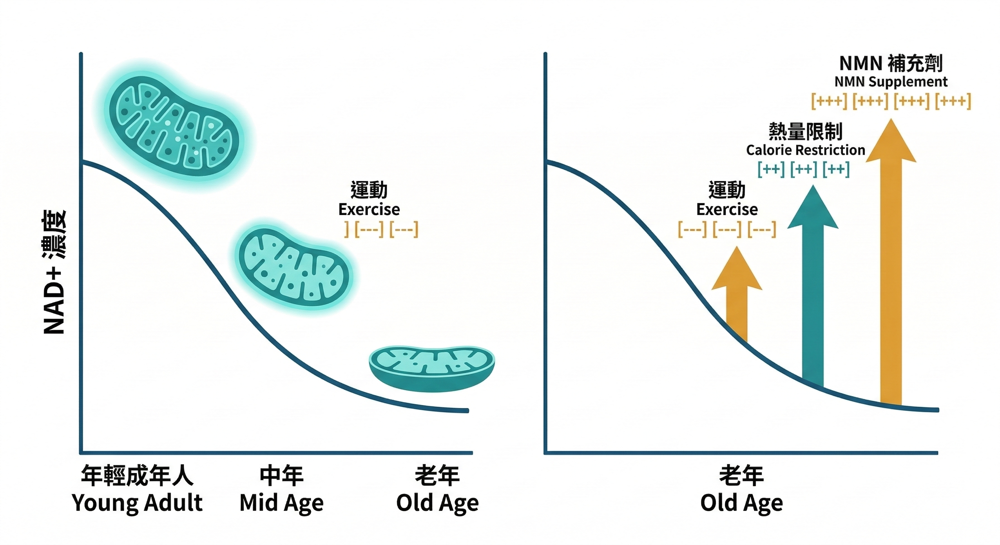
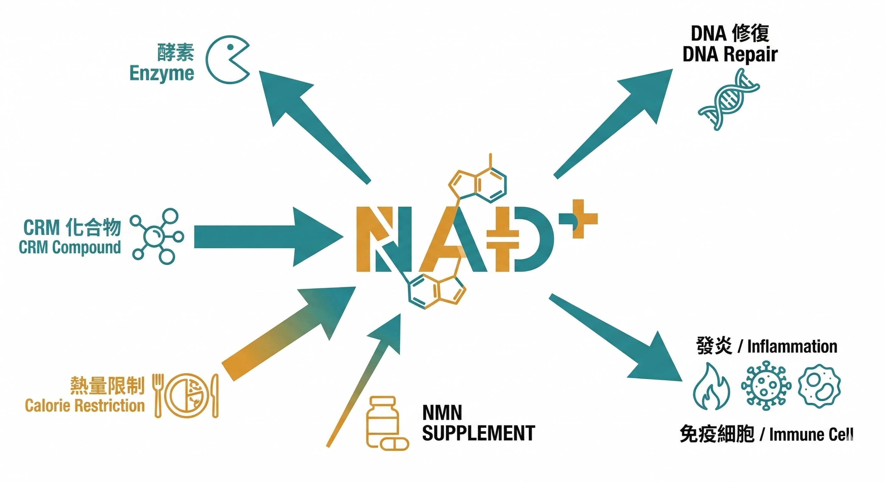

NMN 被稱為「不老藥」，這個稱號不是無中生有的。

它背後有 2009 年諾貝爾獎得主相關的研究脈絡，有大量動物實驗的正面結果，有哈佛醫學院教授 David Sinclair 的公開背書，還有近年來持續累積的人體臨床試驗數據。

這些都是真實的。

但如果你想靠補充 NMN 達到 **全身性抗衰老**的效果，目前的科學數據會告訴你：這個目標，現在還做不到。

這篇說清楚為什麼——以及更重要的，問題的根源在哪裡。

---

## 先搞清楚 NMN 和 NAD+ 的關係

NMN（菸醯胺單核苷酸）是 NAD+ 的前驅物。要理解 NMN 的作用，要先理解 NAD+ 為什麼重要。

**NAD+**（菸鹼醯胺腺嘌呤二核苷酸）是細胞內最核心的輔酶之一，廣泛參與：

**粒線體能量代謝**——三羧酸循環（TCA cycle）和脂肪 β 氧化的關鍵角色，決定了細胞從葡萄糖和脂肪酸製造 ATP 的效率。

**Sirtuin（SIRT）通路**——SIRT1 到 SIRT7 這個蛋白家族，需要消耗 NAD+ 才能執行 DNA 修復、延長細胞壽命、調節代謝。

這條通路和熱量限制、長壽基因的研究高度重疊。

**DNA 損傷修復**——PARP 蛋白在偵測到 DNA 損傷時啟動修復，同樣需要消耗 NAD+。

問題是：NAD+ 濃度隨著年齡顯著下降。動物實驗和人體研究都確認了這個趨勢。

NAD+ 不足，上面這些機制的效率全部下降——這是細胞老化加速的核心原因之一。

NMN 進入細胞後，會轉化為 NAD+，理論上補充了消耗掉的部分。

這個邏輯是合理的。問題在於： **「理論合理」和「補充有效」之間，還有一段距離。**

---

## 三個國家的臨床試驗，說了什麼

動物實驗的結果令人興奮——NMN 補充延長了小鼠壽命，改善了粒線體功能，逆轉了多項老化指標。

但動物實驗的結果，不能直接等同於人體效果。我們來看人體臨床數據。

**美國試驗（華盛頓大學，*Science*）**

13 名中年停經女性，每天 250 mg NMN，持續 10 週，安慰劑對照雙盲設計。

結果：骨骼肌的胰島素敏感性提升了 25%，308 種基因表達被改變。

但——體重、體脂率、血壓、血糖、胰島素、糖化血紅蛋白、粒線體功能，全部**沒有顯著變化**。

肌肉力量、耐力、疲勞恢復也沒有改善。

**日本試驗（兩組，結果方向一致但有新發現）**

2022 年東京大學研究：20 位 65 歲以上健康老年男性，250 mg/天，6–12 週，安慰劑對照雙盲設計。

結果：步態速度和握力顯著提升，聽覺測試改善。

但內臟脂肪分布 **沒有變化**，胰島素阻抗、脂聯素、IL-6 等代謝指標在服用前後幾乎 **沒有差異**。

2024 年新增一項針對健康老年人（65–75 歲，250 mg/天，12 週）的雙盲隨機對照試驗，除了步態速度改善之外，NMN 組的 **睡眠品質顯著優於安慰劑組**——Pittsburgh 睡眠量表的白天功能障礙和整體分數均有改善。

這是 NMN 臨床試驗中首次出現明確睡眠信號，值得注意；但研究者同時指出，NAD+ 代謝物的個體間差異非常大，可能與每個人腸道菌相的組成有關（後文說明）。

**中國試驗（跑者族群）**

48 名中年跑者，300/600/1200 mg/天，6 週，有氧訓練配合。

結果：換氣閾值和骨骼肌氧氣利用能力大幅提升，運動耐力改善明顯。

---

三個試驗放在一起看，有一個清楚的模式：

**NMN 對骨骼肌功能有效——胰島素敏感性、肌肉力量、運動耐力，都有程度不等的改善。**

**但對全身性的代謝老化指標，效果非常有限。**

這個結論在 2024 年有了更強的統計支撐：一項涵蓋 8 項 RCT、342 名受試者（劑量 250–2000 mg/天，14 天至 12 週）的統合分析（Kwok et al., *Eur J Nutr*, 2025）確認：NMN 補充對空腹血糖、空腹胰島素、糖化血紅素、胰島素阻抗、總膽固醇、三酸甘油酯、LDL，全部 **無顯著改善**。

這不是「效果不明顯」，而是「範圍比大家以為的小很多」。

---

## 為什麼會這樣？2021 年的關鍵發現

這個問題在 2021 年有了一個重要的線索。

發表於 *Cell Metabolism* 的研究，利用同位素標記技術追蹤了老鼠體內 NAD+ 的合成和消耗速率。

結果出乎意料：**老化並沒有顯著干擾 NAD+ 的合成速度。**

NAD+ 濃度下降的主要原因，是 **消耗速率隨年齡大幅增加**——而不是「原料不夠」。

研究還發現，NAD+ 前驅物（除 NMN 外）的濃度在老化過程中並未明顯下降——原料是夠的，但消耗端出了問題。

這個發現改變了整個問題的框架：

**如果 NAD+ 不足的根本原因是消耗太快，那補充 NMN 只是在加速往一個漏水的水桶裡加水。桶底的洞沒補，加再多水的效果都有限。**

是什麼在加速消耗？研究指出，隨老化增加活性的 NAD+ 消耗酶——CD38、PARP——在發炎和 DNA 損傷的環境下會大量激活，持續耗用 NAD+。

**具體的分子機制是這樣的：**

NAD+ 的合成有一個關鍵的限速酶——**NAMPT**（菸醯胺磷酸核糖基轉移酶）。

熱量限制透過調節 NAMPT 的活性，同時抑制 CD38 和 PARP 這兩個主要的 NAD+ 消耗酶，讓有限的 NAD+ 能優先被 SIRT 蛋白家族使用——而 SIRT 正是執行 DNA 修復、延緩細胞老化的關鍵通路。

換句話說：**慢性發炎和持續的 DNA 損傷，才是讓 NAD+ 加速流失的主要推手。**

---

## 2025 年的關鍵更新：NMN 根本不是直接轉化為 NAD+

2021 年的研究回答了「消耗太快」的問題。

2025 年的研究，又更新了另一個我們以為已經理解的問題：**NMN 在體內是怎麼轉化成 NAD+ 的？**

過去的教科書版本是這樣的：NMN 口服進入小腸 → 透過 Slc12a8 轉運蛋白進入細胞 → 在細胞內轉化為 NAD+（salvage pathway，補救合成途徑）。

但 2025 年 1 月，Nestlé Research 在 *Nature Metabolism* 發表了一項直接比較三種 NAD+ 前驅物（NMN、NR、NAM）的人體隨機對照試驗——65 名健康成人，14 天。結果發現了一件讓人意外的事：

**NMN 和 NR 補充後，血液中升高的不是 NMN 或 NR 本身，而是菸鹼酸（nicotinic acid，NA）的代謝物。**

機制是這樣的：NMN 和 NR 進入腸道後，大部分會被腸道菌（透過 pncC 等酶）去醯胺化（deamidation），先轉化為 NA，再透過 Preiss-Handler 途徑升高 NAD+——**不是直接在細胞內被轉化，而是繞了一圈，靠腸道菌中轉。**

相比之下，NAM（菸醯胺，第三種前驅物）直接進入血液，急性大幅升高 NAD+，但 14 天後這個效果就消失了，無法持續。

這個發現有兩個重要含義：

**第一，腸道菌相的組成，直接決定了 NMN 補充的效果。** 

菌相不佳或因抗生素受損的人，NMN 轉化效率可能大幅降低——這解釋了為什麼不同人吃同樣劑量的 NMN，NAD+ 上升幅度差距這麼大。

**第二，繞過腸道的劑型（例如脂質體 NMN）可能有實質優勢。** 

2025 年 2 月的日本試驗也確認：脂質體 NMN 提升血液 NAD+ 的效果，顯著高於一般 NMN——因為脂質體可以保護 NMN 不被腸道菌提早分解，讓更多 NMN 直接進入血液循環。

換句話說：**你吃的是 NMN，但你的身體最終用到的，可能主要是你的腸道菌幫你生產的 NA。**

同一篇研究也給出了答案：**熱量限制**。

終生熱量限制的老鼠，NAD+ 的消耗速率顯著降低，體內 NAD+ 濃度維持在較高水準——不是靠補充，而是靠減少消耗。

這個結果和 30 年來熱量限制研究的方向一致：熱量限制啟動 AMPK，抑制 mTOR 和慢性發炎訊號，降低氧化壓力和 DNA 損傷，間接減少了 PARP 和 CD38 的無效消耗，讓 NAD+ 能被 SIRT 更有效地使用。

**補 NMN 是「開源」——增加供給。熱量限制是「節流」——降低消耗。**

目前的臨床數據顯示，節流的效果比開源更系統性、更全面。

但熱量限制有一個現實問題：長期嚴格執行，對大多數人來說非常困難。

這就是為什麼 **熱量限制模擬物（CRM）**是目前抗衰老科學最活躍的研究方向——用特定的分子成分，模擬熱量限制對細胞的效果，而不需要真的挨餓。

---

## 關於市場上的 NMN 產品，還有一件事要知道

就算你確定要補充 NMN，還有一個品質問題要面對。

ChromaDex 公司對 Amazon 上銷量最高的 22 個 NMN 品牌進行成分檢測（截至 2021 年年中）：

- 僅 **14%** 的產品 NMN 含量符合或超過標籤標示
- **23%** 的產品含量略低於標示（標示量的 88–99%）
- **64%** 的產品 NMN 含量低於檢測下限——也就是幾乎不含 NMN

你花的錢，有很高的機率買到的是裝了 NMN 名字的空膠囊。

這不是 NMN 這個成分的問題。這是保健品市場品管標準參差不齊的問題——而這個問題，在每一種熱門成分上都反覆出現。

---

## NMN 的定位，放在正確的位置

NMN 不是「不老藥」，但也不是無效的。

**對骨骼肌的維持和抗衰老，是目前證據最充分的效果範圍。** 對於肌少症高風險族群（40 歲以上、活動量低、蛋白質攝取不足），這是一個有意義的補充選項。

但如果你的目標是全身性的抗老化——代謝、發炎、細胞修復、生物年齡——光靠 NMN 的「開源」策略，目前的科學數據不支持這個預期。

解決 NAD+ 消耗過快的根本問題，需要從降低慢性發炎、減少無效的 DNA 損傷、啟動細胞的自我調節機制下手——這正是熱量限制和 CRM 研究的核心方向。

---

**延伸閱讀：**
- [抗慢性發炎就是在抗老化——這不是廣告詞，這是2000年就確立的科學](/blog/chronic-inflammation/anti-inflammation-anti-aging/) 
- [不節食也能啟動長壽基因？CRM 的概念和 DNA 微陣列技術](/blog/chronic-inflammation/caloric-restriction-mimetics-science/) 
- [ageLOC Youthspan：可以不節食讓細胞以為你在挨餓，啟動修復基因功能](/blog/intervention-optimization/ageloc-youthspan-longevity-genes/) 
- [那些讓你點頭的保健品話術，你聽過哪些？](/blog/precision-health-tools/supplement-marketing-tactics/) 

---

## 參考資料

01. Jun Yoshino et al., 2021. [Nicotinamide mononucleotide increases muscle insulin sensitivity in prediabetic women.](https://pubmed.ncbi.nlm.nih.gov/34157774/) *Science.* 372(6547):1224-1229.
02. Toshimasa Yamauchi et al., 2022. [Nicotinamide mononucleotide (NMN) supplementation in the elderly: a randomized, double blind, placebo controlled study.](https://pubmed.ncbi.nlm.nih.gov/35916870/) *Nature Aging.* 2:512-521.
03. Weihao Li et al., 2021. [Effect of oral NMN supplementation on aerobic capacity in amateur runners.](https://pubmed.ncbi.nlm.nih.gov/34238898/) *J Int Soc Sports Nutr.* 18(1):54.
04. Melanie R McReynolds et al., 2021. [NAD+ flux is maintained in aged mice despite lower tissue concentrations.](https://pubmed.ncbi.nlm.nih.gov/34559043/) *Cell Systems.* S2405-4712(21)00338-0.
05. Anthony J Covarrubias et al., 2021. [NAD+ metabolism and its roles in cellular processes during ageing.](https://pubmed.ncbi.nlm.nih.gov/33353981/) *Nat Rev Mol Cell Biol.* 22(2):119-141.
06. Michael B Schultz, David A Sinclair, 2016. [Why NAD(+) Declines during Aging: It's Destroyed.](https://pubmed.ncbi.nlm.nih.gov/27304501/) *Cell Metab.* 23(6):965-966.
07. Ling Liu et al., 2018. [Quantitative Analysis of NAD Synthesis-Breakdown Fluxes.](https://pubmed.ncbi.nlm.nih.gov/29703237/) *Cell Metab.* 27(5):1067-1080.
08. Na Xie et al., 2020. [NAD+ metabolism: pathophysiologic mechanisms and therapeutic potential.](https://pubmed.ncbi.nlm.nih.gov/32958815/) *Signal Transduct Target Ther.* 5(1):227.
09. Jie Song et al., 2014. [Nicotinamide phosphoribosyltransferase is required for the calorie restriction-mediated improvements in oxidative stress, mitochondrial biogenesis, and metabolic adaptation.](https://pubmed.ncbi.nlm.nih.gov/23416867/) *J Gerontol A Biol Sci Med Sci.* 69(1):44-57.
10. Gomes AP et al., 2013. [Declining NAD+ Induces a Pseudohypoxic State Disrupting Nuclear-Mitochondrial Communication during Aging.](https://pubmed.ncbi.nlm.nih.gov/24360282/) *Cell.* 155(7):1624-38.
11. Julie A Mattison et al., 2017. [Caloric restriction improves health and survival of rhesus monkeys.](https://pubmed.ncbi.nlm.nih.gov/28094793/) *Nat Commun.* 8:14063.
12. Angelika Chalkiadaki, Leonard Guarente, 2012. [Sirtuins mediate mammalian metabolic responses to nutrient availability.](https://pubmed.ncbi.nlm.nih.gov/22473372/) *Nat Rev Endocrinol.* 8(5):287-96.
13. ChromaDex, 2021. Independent testing of NMN products sold on Amazon. Internal analysis report.
14. Christen A et al. (Nestlé Research), 2025. [The differential impact of three different NAD+ boosters on circulatory NAD and microbial metabolism in humans.](https://www.nature.com/articles/s42255-025-01421-8) *Nature Metabolism.* Published January 2026.
15. Kwok CYT et al., 2025. [Efficacy of oral nicotinamide mononucleotide supplementation on glucose and lipid metabolism for adults: a systematic review with meta-analysis on randomized controlled trials.](https://www.tandfonline.com/doi/full/10.1080/10408398.2024.2387324) *Crit Rev Food Sci Nutr.*
16. Igarashi M et al., 2024. [Ingestion of β-nicotinamide mononucleotide increased blood NAD levels, maintained walking speed, and improved sleep quality in older adults.](https://pubmed.ncbi.nlm.nih.gov/) *npj Aging.* (12 weeks, 250 mg/day, 65–75 years).
17. Yaku K et al., 2025. [Nicotinamide riboside and nicotinamide mononucleotide facilitate NAD+ synthesis via enterohepatic circulation.](https://www.science.org/doi/10.1126/sciadv.adr1538) *Science Advances.* 11, eadr1538.
