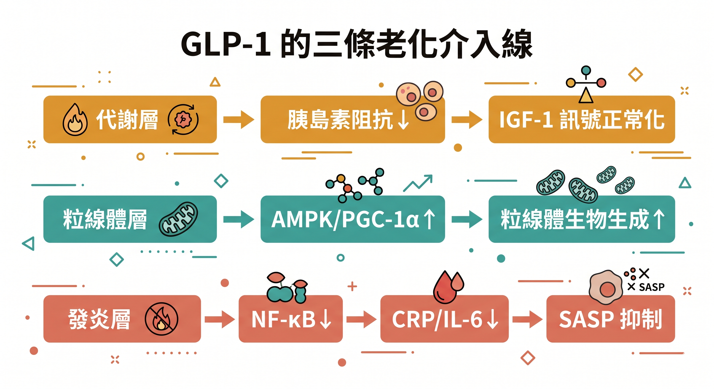
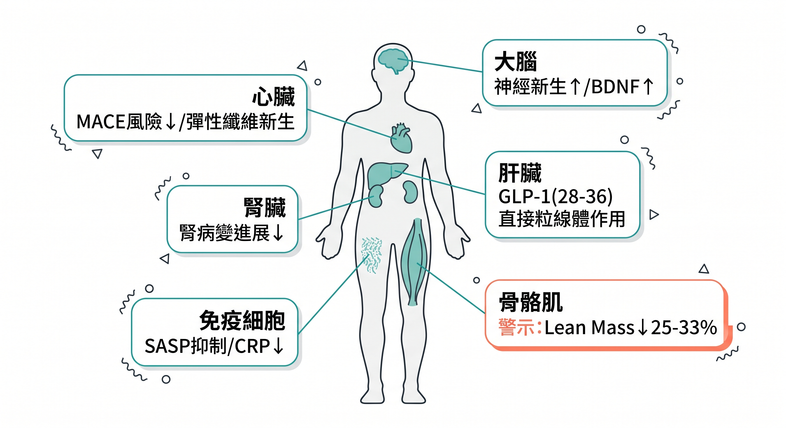
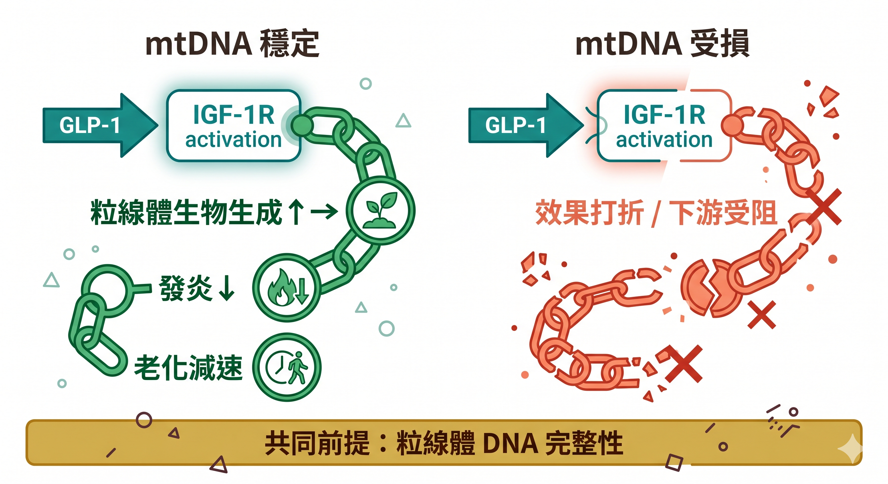

你身邊一定有人打過瘦瘦針。

可能瘦了，可能沒有，可能復胖了。

但你可能不知道的是：研究人員現在更在意的，不是它讓你瘦多少——而是 **它對你細胞老化速度的影響**。

---

## 一個讓科學界重新看待這類藥物的發現

2023 年底，《Science》雜誌將 GLP-1 藥物評選為年度突破性藥物。

理由不只是減重效果驚人。

更關鍵的是：**越來越多研究顯示，GLP-1 受體促效劑在全身幾乎所有地方都展現出抗發炎與細胞保護效果。**

多倫多大學內分泌學家 Daniel Drucker 這樣描述：「我們從動物實驗和人類研究中得知，GLP-1 似乎能在幾乎所有地方減少炎症。」

這句話，對抗老科學的意義很大。

因為**慢性低度發炎（Inflammaging）**，正是目前被研究最深的老化加速機制之一。

---

## GLP-1 和 IGF-1 的關係，比你以為的更直接

很多人以為 GLP-1 藥物的作用是「間接壓低 IGF-1」——透過改善胰島素阻抗，讓過度活躍的 IGF-1 訊號降下來。

這個說法沒錯，但只說了一半。

2015 年發表於《Endocrinology》的研究發現了一個出人意料的現象：在 **心臟纖維母細胞**這種幾乎沒有 GLP-1 受體的組織裡，GLP-1 依然引發了深遠的細胞反應。

免疫沉澱實驗證實，**GLP-1 胜肽能直接在物理上與 IGF-1 受體結合，並選擇性地使 IGF-1R 磷酸化活化**。

換句話說：GLP-1 在某些組織裡，實際上是以「IGF-1 模擬物」的身分運作——直接借用 IGF-1 受體系統來執行保護功能。

更進一步：GLP-1 還會刺激胰臟細胞自行分泌 IGF-2，建立自分泌迴路。

GLP-1 的部分抗凋亡效果，正是透過這個「自己召喚出來的 IGF 系統」來執行的。

**這不只是間接調節，GLP-1 本身就是 IGF-1 路徑的一個激活者。**

---

## GLP-1 的代謝產物，直接進入粒線體

GLP-1 進入身體後，很快會被 DPP-4 酶分解。但這個「被分解」的過程，不是終點，而是另一個機制的開始。

分解後產生的九胜肽片段——**GLP-1(28-36)amide**——被研究發現具有不依賴受體的直接粒線體作用。

這個代謝產物進入細胞後會：

- 直接靶向粒線體，活化 **Nrf2** 抗氧化路徑
- 抑制 ROS（活性氧物質）的生成
- 恢復受損細胞的 ATP 儲備池
- 防止粒線體膜通透性轉換孔（mPTP）異常開啟，阻斷細胞凋亡訊號

更特別的是，它在**幾乎沒有 GLP-1R 的肝臟細胞**同樣有效。

這意味著 GLP-1 藥物對粒線體的保護效果，有一部分完全繞過受體層面，直接在細胞器層次發生。

---

## 它在全身做的事，比你想的多

除了上述機制，GLP-1 藥物的臨床效果已在多個系統得到確認：

**粒線體生物生成**：研究顯示，長期使用 GLP-1 類似物後，細胞內粒線體質量增加約 20%，關鍵驅動因子是 **PGC-1α** 的強烈上調——PGC-1α 正是粒線體生物生成的主控轉錄因子，也是運動和熱量限制共同激活的標的。這條 AMPK → SIRT1 → PGC-1α 路徑，和你靠「少吃」或「運動」觸發的抗老機制高度重疊。

**全身抗發炎**：2025 年統合分析（37 項 RCT）確認 GLP-1 受體促效劑能系統性降低 CRP 和 IL-6。同時，GLP-1 會抑制 JNK 路徑，防止 IGF-1 受體在慢性發炎環境下被「關掉」。

**衰老細胞清除**：新興證據顯示 GLP-1 藥物具有「衰老調節」效果，能抑制衰老細胞持續釋放的 SASP 毒性分泌物——這正是「發炎性老化」的核心驅動源之一。

**心血管**：SOUL study（*Diabetes Care* 2025）確認顯著降低主要心血管不良事件風險。

**腎臟**：FLOW 試驗（*NEJM* 2024）顯示 Semaglutide 能減緩腎病變進展。

---

## 一個值得注意的配套問題：肌肉保護

使用 GLP-1 藥物期間，伴隨減重會有一定程度的瘦肌肉（Lean Mass）流失，這在各臨床試驗中的結果差異頗大。

對多數 40–50 歲、肌肉基礎尚可的族群而言，影響相對有限；但對 **原本肌肉量就偏低、或年齡較大** 的使用者，肌少症風險確實需要主動管理。

背後的機制是：大量熱量赤字會活化 AMPK，AMPK 雖然有益粒線體，但同時壓制 mTORC1——而 mTORC1 是驅動 **肌肉蛋白質合成**的核心引擎。

這不是放棄使用 GLP-1 的理由，而是提醒你：**阻力訓練和足夠蛋白質攝取是必要配套，不是可選項。** 

肌肉微環境的局部 IGF-1 訊號，在低熱量狀態下仍能維持一定的合成代謝保護——而阻力訓練正是激活這個訊號最有效的方式。

---

## 但有一個更基礎的前提

2026 年 4 月《Science Advances》的研究把這個討論推到了更根本的層次。

研究發現：IGF-1 訊號的長壽效果，**取決於粒線體 DNA（mtDNA）的穩定性**。

粒線體基因體不穩定的個體，即使調節了 IGF-1，長壽機制仍然無法啟動。

這個結論同樣適用於 GLP-1。

GLP-1 能直接活化 IGF-1R、能促進粒線體生物生成、能抑制發炎——但如果個體的 mtDNA 已大量累積損傷，這些上游訊號雖然成立，下游的執行效果仍然會打折扣。

**GLP-1 是強大的工具，但它需要一個夠健康的粒線體環境才能充分發揮。**

---

## 補充：口服版本現在也有了

如果你對 GLP-1 藥物有興趣、但不想打針，目前口服選項已有實質進展：

**瑞倍適（Rybelsus）**是口服 Semaglutide，台灣已核准，但主適應症是第二型糖尿病，且服藥後 30 分鐘內禁食禁水，使用較繁瑣。

**Wegovy pill** 同樣是 Semaglutide 口服版（25 mg），2025 年 12 月 FDA 核准用於減重，OASIS 4 試驗 64 週平均減重 16.6%，效果接近注射版。服藥仍需空腹等 30 分鐘。

**Foundayo（orforglipron）** 是禮來 2026 年 4 月 FDA 核准的小分子非胜肽口服藥，最大優勢是**完全不限進食時間**，ATTAIN-1 試驗 72 週平均減重 12.4%。

這三個選項的詳細比較——包括副作用、費用、停藥後復胖——在這篇有完整說明：[2026 年 GLP-1 藥物完整臨床指南](/blog/intervention-optimization/glp1-clinical-guide-tirzepatide/)

---

## 科學誠實的一面：臨床試驗的落差

GLP-1 藥物在神經退化性疾病上的三期臨床試驗，結果比預期保守——值得正視。

EVOKE 三期試驗（Semaglutide vs 阿茲海默症）主要認知終點失敗，但生物標記顯著改善：hsCRP 下降、腦部發炎指標改善、FDG-PET 顯示代謝趨勢保留。Exenatide 的帕金森症三期試驗同樣未達運動症狀主要終點。

研究者的解讀是：代謝修正確實發生了，但要逆轉**已建立的神經結構損傷**，已超出粒線體修復所能提供的範圍。

這凸顯了一個重要原則：**抗老介入需要在損傷不可逆之前盡早開始，不是等症狀出現才行動。**

這正是 AGELOCKED 一直在說的事：身體訊號出現的時間，比你感覺到的早得多。

---

## 抗老的邏輯：不是找到一個開關，是同時維護多個系統

GLP-1 藥物是目前少數能同時觸及代謝、IGF-1 軸、粒線體生物生成、發炎抑制、細胞衰老調控多個維度的臨床介入工具。但它的效果，受限於更基本的細胞條件。

你現在的粒線體基礎狀態怎麼樣？

慢性疲勞、下午注意力渙散、睡眠品質差——這些訊號，可能比你想的更早出現。

---

## 延伸閱讀

- [抑制 IGF-1 還不夠——壽命的關鍵，藏在你的粒線體 DNA 裡](/blog/chronic-inflammation/igf1-mitochondria-dna-longevity/)
- [粒線體與慢性疲勞：壓力正在改變你大腦裡的蛋白質](/blog/body-signals/stress-mitochondria-bdnf-depression/)
- [表觀遺傳時鐘：你的生物年齡，和身分證上的數字不一樣](/blog/chronic-inflammation/multivitamin-lifepak-slow-aging-clock/)

---

## 參考資料

01. Kang et al., 2015, [Glucagon-Like Peptide-1 Increases Mitochondrial Biogenesis and Function in INS-1 Rat Insulinoma Cells](https://pubmed.ncbi.nlm.nih.gov/26194081/) *Endocrinol Metab (Seoul).* 30(2):216-20.
02. Qa'aty N et al., 2015, [The antidiabetic hormone glucagon-like peptide-1 induces formation of new elastic fibers in human cardiac fibroblasts after cross-activation of IGF-IR](https://pubmed.ncbi.nlm.nih.gov/25353182/) *Endocrinology* 156(1):90-102.
03. Sarah Riis et al., 2020, [IGF-1 signalling regulates mitochondria dynamics and turnover through a conserved GSK-3β-Nrf2-BNIP3 pathway](https://pubmed.ncbi.nlm.nih.gov/31936236/) *Cells* 9(1):147.
04. Tomas E et al., 2011, [GLP-1-derived nonapeptide GLP-1(28-36)amide targets to mitochondria and suppresses glucose production and oxidative stress in isolated mouse hepatocytes](https://pubmed.ncbi.nlm.nih.gov/21256872/) *Regul Pept* 167(2-3):177-84.
05. Angelo Cignarelli et al., 2022, [Mini review: Effect of GLP-1 receptor agonists and SGLT-2 inhibitors on the growth hormone/IGF axis](https://pubmed.ncbi.nlm.nih.gov/35265043/) *Frontiers Endocrinol (Lausanne)* 13:846903.
06. Xu Y et al., 2024, [AMPK/SIRT1/PGC-1alpha Signaling Pathway: Molecular Mechanisms and Targeted Strategies From Energy Homeostasis Regulation to Disease Therapy.](https://pubmed.ncbi.nlm.nih.gov/41268687/) *CNS Neurosci Ther.* 31(11):e70657.
07. Wong CK et al., 2024, [Central glucagon-like peptide 1 receptor activation inhibits Toll-like receptor agonist-induced inflammation](https://pubmed.ncbi.nlm.nih.gov/38113888/) *Cell Metab.* 36(1):130-143.e5.
08. Ren Y et al., 2025, [The effect of GLP-1 receptor agonists on circulating inflammatory markers in type 2 diabetes patients: a systematic review and meta-analysis](https://pubmed.ncbi.nlm.nih.gov/40230207/) *Diabetes Obes Metab.* 27(7):3607-3626.
09. EMJ Reviews, 2025, [Glucagon-Like Peptide-1 Receptor Agonists Protect Against Hepatocyte Senescence Driving Metabolic Dysfunction-Associated Steatotic Liver Disease/Metabolic Dysfunction-Associated Steatohepatitis](https://www.emjreviews.com/diabetes/abstract/glucagon-like-peptide-1-receptor-agonists-protect-against-hepatocyte-senescence-driving-metabolic-dysfunction-associated-steatotic-liver-disease-metabolic-dysfunction-associated-steatohepatitis-j04012/) *EMJ Reviews*
10. Lee MM et al., 2025, [Cardiovascular and Kidney Outcomes and Mortality With Long-Acting Injectable and Oral Glucagon-Like Peptide 1 Receptor Agonists in Individuals With Type 2 Diabetes: A Systematic Review and Meta-analysis of Randomized Trials](https://pubmed.ncbi.nlm.nih.gov/40156846/) *Diabetes Care* 48(5):846-859.
11. Perkovic V et al., 2024, [Effects of Semaglutide on Chronic Kidney Disease in Patients with Type 2 Diabetes](https://pubmed.ncbi.nlm.nih.gov/38785209/) *N Engl J Med* 391(2):109-121.
12. Neeland IJ., 2024, [Changes in lean body mass with glucagon-like peptide-1-based therapies and mitigation strategies](https://pubmed.ncbi.nlm.nih.gov/38937282/) *Diabetes, Obes Metab.* 26 Suppl 4:16-27.
13. Philip Scheltens et al., 2025, [Baseline characteristics from evoke and evoke+: Two phase 3 randomized placebo‐controlled trials of semaglutide in participants with early‐stage symptomatic Alzheimer's disease](https://pmc.ncbi.nlm.nih.gov/articles/PMC12789876/) *Alzheimers Dement (NY)* 12(1):e70200.
14. Sarah J Shemtov et al., 2026, [The longevity effects of reduced IGF-1 signaling depend on the stability of the mitochondrial genome](https://pubmed.ncbi.nlm.nih.gov/41931604/) *Sci Adv* 12(14):eaea4279.
15. Couzin-Frankel J., 2023, [Breakthrough of the year: obesity meets its match](https://pubmed.ncbi.nlm.nih.gov/38096291/) *Science* 382(6676):1226-1227.
16. Novo Nordisk, 2025-12-22, [Wegovy pill approved in the US as first oral GLP-1 for weight management](https://www.novonordisk.com/content/nncorp/global/en/news-and-media/news-and-ir-materials/news-details.html?id=916472) *Novo Nordisk Press Release*
17. Eli Lilly, 2026-04-01, [FDA approves Lilly's Foundayo (orforglipron), the only GLP-1 pill for weight loss that can be taken any time of day without food or water restrictions](https://investor.lilly.com/news-releases/news-release-details/fda-approves-lillys-foundayotm-orforglipron-only-glp-1-pill) *Eli Lilly Press Release*

