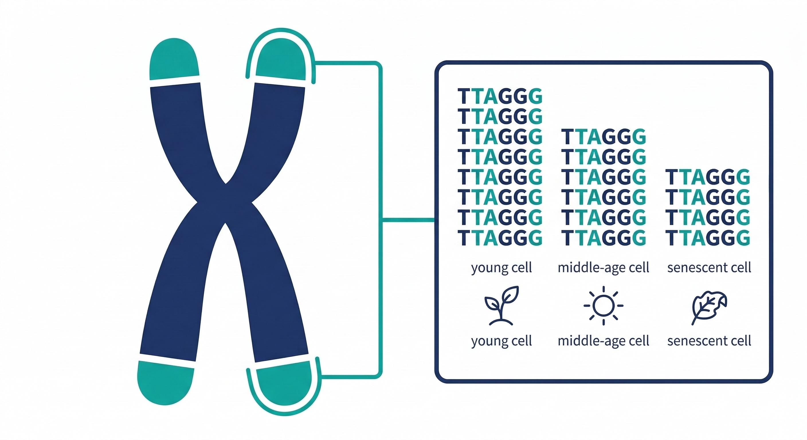

你的每一個細胞裡，有一個正在倒數的計時器。

它不是比喻。它是一段真實存在的 DNA 序列，位於染色體的末端——叫做**端粒**（Telomere）。

每次細胞分裂，這段序列就縮短一點。縮短到臨界長度，細胞就停止分裂，走向老化或凋亡。

這個機制，在1980年代被 Elizabeth Blackburn 和 Carol Greider 確認，並在2009年為她們帶來諾貝爾生理醫學獎。

但這個故事真正重要的部分，不是「端粒會縮短」——而是**縮短的速度，你有一定程度的控制權**。

---

## 端粒是什麼

染色體是細胞核裡存放遺傳訊息的結構。每條染色體的兩端，都有一段由重複序列組成的保護帽——這就是端粒。

人類的端粒重複序列是 **TTAGGG**，正常成年人的端粒長度約在 8,000–10,000 個鹼基對之間。

它的作用是：讓染色體在複製時，重要的遺傳訊息不會因為末端的磨損而遺失。每次細胞分裂，端粒犧牲自己的 25–200 個鹼基，保護了染色體上真正重要的內容。

---

## 端粒縮短，和老化有什麼關係

當端粒短到一個臨界長度，細胞會啟動一個叫做 **細胞衰老**（Cellular Senescence）的程序——它不再分裂，但也不會立刻死亡。

這些衰老細胞會留在組織裡，持續分泌一組叫做 **SASP**（衰老相關分泌表型）的促發炎物質——細胞激素、蛋白酶、趨化因子。

這個訊號會做兩件事：

**第一，招募免疫細胞**——告訴身體「這裡有問題，需要處理」。這在正常情況下是好事，讓免疫系統清除受損細胞。

**第二，擴散給鄰近細胞**——SASP 的發炎訊號會讓周圍健康的細胞提前進入衰老狀態。一個衰老細胞，可以觸發周圍細胞的連鎖反應。

這就是端粒縮短和 Inflammaging（慢性低度發炎）的直接連結： **短端粒產生衰老細胞，衰老細胞分泌 SASP，SASP 製造更多慢性發炎，慢性發炎又加速端粒縮短。**

這是一個自我強化的惡性循環。

---

## 什麼在加速端粒縮短

細胞分裂本身的磨損是不可避免的，但端粒縮短有快有慢——有些人 50 歲的端粒長度，相當於別人 70 歲的水準，反之亦然。

加速縮短的因素，目前研究最確定的有四個：

**氧化壓力**——自由基直接攻擊 DNA，而端粒富含鳥嘌呤（G），是氧化損傷最敏感的序列。氧化壓力高，端粒縮短速度顯著加快。這是慢性發炎和端粒之間最直接的攻擊路徑。

**心理壓力**——Elissa Epel 在2004年的研究（PNAS）中發現，長期照護病童的母親，端粒長度比同齡對照組短了相當於9–17年的老化量——壓力荷爾蒙皮質醇的長期升高，直接對端粒產生損傷。

**睡眠不足**——睡眠是細胞修復的主要時間窗口，慢性睡眠不足讓氧化損傷累積速度超過修復速度，端粒加速消耗。

**慢性發炎（Inflammaging）**——NF-κB 的持續活化增加 ROS（活性氧化物）產生，直接攻擊端粒序列。這形成了一個雙向的惡化循環：端粒縮短→更多 SASP→更多發炎→更多端粒損傷。

---

## 端粒長度，是目前最可量化的細胞老化指標之一

Richard Cawthon 在2003年的 *Lancet* 研究中，追蹤了143名60歲以上的受試者，發現端粒較短的組，死亡率是端粒較長組的 **3.18倍**，其中心血管疾病死亡率高出 **2.8倍**，感染性疾病死亡率高出 **8倍**。

這是為什麼端粒長度被視為「生物年齡」的重要指標——它比日曆年齡更能反映你的細胞實際老化了多少。

但這裡有一個重要的區分要說清楚：

**端粒長度和壽命之間，沒有簡單的線性關係。**

老鼠的端粒長度是人類的5–15倍，但壽命只有2–3年。靈長類的端粒長度比人類短，但壽命可以到50歲。端粒長度的**縮短速度**，比絕對長度更能預測老化速度。

這個縮短的速度，才是你應該關心的指標。

---

## 你能做什麼：減慢這個倒數

這裡要說清楚一件事：**目前沒有任何口服補充品被嚴格科學驗證能有效延長端粒。**

端粒酶促進劑的爭議、風險，以及消化系統這一關的根本限制，在另一篇說清楚了（→[「以形補形」這個邏輯，在生物學上行不通](/blog/precision-health-tools/supplement-myths-debunked/)。

但減慢端粒縮短速度，有幾個方向是有可靠研究支持的：

**降低氧化壓力**——這是最直接的路徑。增加抗氧化物的攝取，特別是能進入細胞的脂溶性抗氧化物（類胡蘿蔔素、維生素E、CoQ10），減少自由基對端粒的直接攻擊。這也是 Prysm iO 皮膚類胡蘿蔔素掃描有意義的原因之一——它量測的，是你的抗氧化防禦水位，也就是你保護端粒的能力。

**抑制慢性發炎（Inflammaging）**——打斷端粒損傷和 SASP 的惡性循環，是同時保護端粒和減緩老化的核心策略。NF-κB 的抑制、Nrf2 的激活，都指向這個方向。

**有氧運動**——Denham 在2016年的統合分析（*Sports Medicine*）確認，規律有氧運動與端粒長度正相關。運動降低氧化壓力、提高粒線體效率、改善慢性發炎——三個路徑同時保護端粒。

**睡眠品質**——深層睡眠是細胞修復最集中的時間窗口，端粒的氧化損傷修復也在這裡發生。

**壓力管理**——皮質醇的長期升高對端粒的直接傷害，在研究中已有充分記錄。

---

## 這個倒數，你不能停止——但你可以減慢

端粒縮短是細胞生命的基本機制，沒辦法被「逆轉」。

但縮短的速度，取決於你的細胞環境——氧化壓力有多高、慢性發炎有多嚴重、修復機制是否正常運作。

這些都不是基因決定的，是你每天的細胞狀態在決定的。

---

**延伸閱讀：**
- [你的細胞儲備，正在被一個你感覺不到的過程悄悄耗光](/blog/chronic-inflammation/你的細胞儲備，正在被一個你感覺不到的過程悄悄耗光) ← 第5篇（端粒是四個儲備之一/）
- [抗慢性發炎就是在抗老化——這不是廣告詞，這是2000年就確立的科學](/blog/chronic-inflammation/cell-reserve-chronic-depletion/) ← Inflammaging篇
- [打爆保健品神話，以形補形為什麼不行？](/blog/precision-health-tools/supplement-myths-debunked/) ← 消化系統篇
- [同樣的成分，有人吸收80%，有人吸收5%——差在哪裡](/blog/precision-health-tools/supplement-bioavailability-gap/) ← 吸收率篇（口服端粒酶為什麼進不了細胞，這篇說機制）
- [你的身體老化速度，有辦法知道嗎？——三種方法，從專業到居家](/blog/precision-health-tools/aging-speed-measurement-methods/) ← 第7篇（端粒長度檢測是方法一）

---

## 參考資料

01. Carol W Greider, Elizabeth H Blackburn, 1985. [Identification of a specific telomere terminal transferase activity in tetrahymena extracts.](https://www.cell.com/fulltext/0092-8674%2885%2990170-9) *Cell.* 43(2):405-413.
02. Richard M Cawthon et al., 2003. [Association between telomere length in blood and mortality in people aged 60 years or older.](https://pubmed.ncbi.nlm.nih.gov/12573379/) *Lancet.* 361(9355):393-5.
03. Elissa S Epel et al., 2004. [Accelerated telomere shortening in response to life stress.](https://pubmed.ncbi.nlm.nih.gov/15574496/) *Proc Natl Acad Sci USA.* 101(49):17312-5.
04. Joshua Denham et al., 2016. [Telomere Length Maintenance and Cardio-Metabolic Disease Prevention Through Exercise Training.](https://pubmed.ncbi.nlm.nih.gov/26914269/) *Sports Med.* 46(9):1213-1237.
05. Judith Campisi, 2013. [Aging, cellular senescence, and cancer.](https://pubmed.ncbi.nlm.nih.gov/23140366/) *Annu Rev Physiol.* 75:685-705.
06. Vera Gorbunova et al., 2021. [The role of retrotransposable elements in ageing and age-associated diseases.](https://pubmed.ncbi.nlm.nih.gov/34290424/) *Nature.* 596(7870):43-53.
07. Kathryn Demanelis et al., 2020. [Determinants of telomere length across human tissues.](https://pubmed.ncbi.nlm.nih.gov/32913074/) *Science.* 369(6509):eaaz6876.
