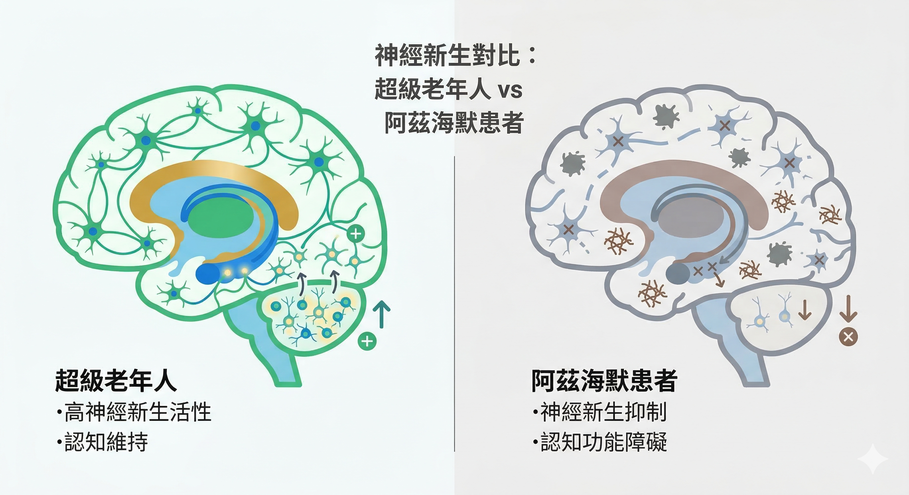

---

title: "肚子變大、容易累？《Nature》最新研究：其實連你的大腦也一起在退化"
description: "你以為肚子變大只是代謝變差？2026 年《Nature》研究分析 355,997 個細胞核，確認成年人海馬迴仍有神經新生，但慢性發炎與皮質醇偏高正同步破壞你的大腦。透過 Prysm iO 掃描與健檢數據，找出保護大腦的關鍵介入點。"
heroImage: "./慢性發炎抑制海馬迴神經新生.png"
pubDate: 2026-03-18
tags: ["神經新生", "失智症", "阿茲海默", "慢性發炎", "葉黃素", "類胡蘿蔔素", "BDNF", "超級老年人"]
category: "慢性發炎科學"
slug: "neurogenesis-inflammaging-cognitive-resilience"

---

你看著日漸變大的肚子，以為只是代謝變差了。

下午總是提不起勁，以為只是最近工作太忙。

但其實，這些身體的變化，正與你的大腦退化同步發生。

多數人把「變胖」、「疲勞」、「專注力變差」當成獨立的毛病。但在生理層面，它們來自同一條軸線：**慢性發炎 × 壓力荷爾蒙（皮質醇）× 神經新生下降**。

也就是說，當你的身體開始出現代謝問題時，大腦通常已經同步在受到影響。

---

## 《Nature》研究：破壞從你沒感覺時就開始了

你可能以為失智是 70 歲以後的事。

但 2026 年 2 月 25 日發表於《Nature》的頂尖研究，由美國伊利諾大學芝加哥分校 Orly Lazarov 團隊主導，分析了來自五類人群共 **355,997 個細胞核**的基因表現與調控狀態，使用包括單核 RNA 定序（snRNA-seq）、染色質可及性分析（snATAC-seq）在內的多體學方法。

研究對象涵蓋：健康年輕人、無失智的正常老年人、認知媲美 50 歲的**超級老年人（Super-agers，80 歲以上）**、前臨床期阿茲海默患者（尚無症狀但已有病理變化）、以及已確診的阿茲海默患者。

研究確認了一件關鍵事實：成年人的海馬迴確實持續有神經新生，但這種大腦更新能力的破壞，**在沒有任何失智症狀的「前臨床期」就已經開始了**。

這代表，你現在的身體狀態，不只是決定現在的你，更正在決定 10 - 20 年後的大腦健康。

**四個重大發現：**

**① 成年人確實持續有神經新生。** 各年齡層的人類海馬迴中，均確認了神經幹細胞、未成熟神經元，以及完整的分化發育軌跡。

**② 老化改變神經新生的基因調控網路。** 神經分化相關基因「關閉」，發炎相關基因「打開」，這不只是細胞變少，而是整個分子調控網路被重寫。

**③ 破壞從前臨床期就開始。** 阿茲海默患者在尚未出現明顯症狀時，神經幹細胞的染色質結構就已出現改變。神經新生功能下降，是疾病起始機制的一部分，而非後果。

**④ 超級老年人有特殊的「認知韌性」分子特徵。** 他們的神經幹細胞活性接近年輕人，分化基因保持活躍。維持神經新生的能力，是「老而不退」的核心機制。

---

## 為什麼肚子變大、容易累，會影響大腦？

這背後有三個互相連動的機制，正在同步改寫你的身體與大腦：

### 1. 慢性發炎：讓大腦變「僵化」

當內臟脂肪增加或身體處於慢性發炎時，血液中會長期循環發炎訊號（IL-6、TNF-α、CRP）。這些訊號會活化大腦中的 **小膠質細胞（Microglia）**，進而：

- 抑制神經幹細胞增殖
- 改變神經前驅細胞的分化方向
- 增加新生神經元的凋亡率
- 破壞突觸整合，讓新生神經元無法真正「接入」神經網路

一句話：慢性發炎把「可塑性的大腦」推向「僵化的大腦」。

### 2. 皮質醇偏高：讓大腦進入「壓力模式」

海馬迴是大腦中 **糖皮質激素受體密度最高** 的區域之一，對皮質醇極度敏感。

長期壓力、睡眠不足或慢性發炎，都會讓 HPA 軸過度活化，皮質醇持續偏高。結果是：

- 抑制神經幹細胞分裂
- 降低 BDNF（腦源性神經營養因子）活性
- 讓新生神經元存活率下降

同一個機制，也正是讓脂肪更容易堆積在腹部的原因，在內臟脂肪系列文章裡，你看到皮質醇如何讓腹部脂肪持續囤積；現在你知道，它同時也在破壞你的大腦。

### 3. BDNF 下降：關掉大腦的「肥料」開關

**BDNF（腦源性神經營養因子）** 是促進神經新生最重要的因子，幫助新生神經元生長、發展、存活。

慢性發炎與高皮質醇聯手壓低 BDNF 時，神經細胞難以生成，大腦的彈性與學習記憶能力也隨之變差。

---

## 兩種人，走在同一條路的不同方向

超級老年人的分子特徵顯示：**發炎程度低、神經新生活性高，分化基因保持活躍**。

對比阿茲海默患者，神經新生早已大幅下降，且發炎相關基因被打開。

這中間的差別不是運氣，是長期累積的生理環境，而這個環境，正是由慢性發炎程度和抗氧化防護儲備共同決定的。

---

## 類胡蘿蔔素：從眼睛掃描到大腦保護

**葉黃素（Lutein）和玉米黃素（Zeaxanthin）** 是目前唯二確認能穿越血腦屏障並在大腦組織大量累積的類胡蘿蔔素。

它們在海馬迴、小腦、額葉皮層的濃度，佔全腦類胡蘿蔔素總量的 **66–77%**。

### 對神經新生的直接支持

2024 年系統性研究確認，葉黃素透過以下機制保護神經新生：

- **阻斷 NF-κB 核轉位**，降低小膠質細胞的促炎活化，這正是慢性發炎破壞神經新生的主要入口
- 活化 Nrf2/ERK/AKT 路徑，強化細胞內源性抗氧化防禦
- 提升 **GAP-43、NCAM、BDNF 的表達水準**，支援神經幹細胞分化與新生神經元存活

### RCT 數據：補充葉黃素顯著提升 BDNF

2024 年雙盲安慰劑對照試驗（60 名受試者，180 天）：葉黃素 + 玉米黃素補充組的 BDNF 血清濃度在第 180 天顯著高於安慰劑組，認知功能（專注力、情節記憶、視覺工作記憶）也顯著改善。⁶

2024 年阿茲海默動物模型研究：葉黃素和玉米黃素補充後，海馬迴 TNF-α 和 IL-1β 顯著下降，BDNF 和 CNTF 表達顯著上升，記憶損傷改善效果甚至優於陽性對照組（白藜蘆醇）。

### 你的 Prysm iO 掃描數字代表什麼

多項研究確認，視網膜黃斑色素光密度（MPOD）與大腦類胡蘿蔔素濃度高度相關，兩者都反映全身的類胡蘿蔔素儲備狀態。

2013 年愛爾蘭老化縱貫研究（n=4,453 名 50 歲以上成年人）：MPOD 偏低者，在整體認知、前瞻性記憶、反應速度、執行功能表現均顯著較差。

2014 年研究（n=108 名老年人）：MPOD 水準與整體認知、語文學習、回憶、處理速度、知覺速度均顯著正相關。

**你的 Prysm iO 掃描分數，不只是皮膚抗氧化指數，它是你大腦長期神經保護儲備的間接窗口。**

---

## 你現在能做的三件事

這不是 70 歲才要煩惱的問題。你現在的腰圍、疲勞程度和睡眠品質，正在把你推向超級老年人或阿茲海默其中一側。

**① 確認並降低慢性發炎（最優先）**

透過健檢數字，腰圍、TG/HDL 比值、hs-CRP，評估身體製造了多少系統性發炎訊號。

這些不僅是心血管風險指標，更是大腦環境的警報器。

**② 有氧運動提升 BDNF（最有效的單一介入）**

有氧運動是目前最強的 BDNF 促進因子。每週 3 次以上 Zone 2 有氧（維持對話不喘的強度）是少數可以直接促進神經新生的行為介入。

而葉黃素補充能放大這個效果，2021 年研究確認，運動 + 葉黃素組的大腦皮層 BDNF、突觸素均高於單獨介入組。

補充品是運動效果的放大器，不是替代品。

**③ 用 Prysm iO 掃描確認類胡蘿蔔素儲備**

掃描本身 15 秒，但搭配你的健檢數字一起解讀，才能告訴你：抗神經發炎的那層保護，你現在的儲備是充足還是已在耗損。

這是「你現在的大腦風險程度」最直接的量化方式之一。

---

最重要的一句話：**你現在的身體狀態，不只是體態問題，是你的大腦，正在同步改變的過程。**

如果你已經有腹部脂肪明顯增加、容易疲勞、睡眠品質下降的狀況，建議從血液數據著手，而不是等到感覺「腦袋不對了」才行動。

---

## 參考資料

01. Lazarov O, et al. (2026). [Human hippocampal neurogenesis in adulthood, ageing and Alzheimer's disease.](https://pubmed.ncbi.nlm.nih.gov/41741649/) *Nature*, Published 25 February 2026.
02. Iqbal Z, et al. (2025). [Phytonutrients and their neuroprotective role in brain disorders.](https://pmc.ncbi.nlm.nih.gov/articles/PMC12436116/) *Frontiers in Molecular Biosciences*, 12, 1607330.
03. McEwen BS. (2008). [Central effects of stress hormones in health and disease.](https://pubmed.ncbi.nlm.nih.gov/18282566/) *Eur J Pharmacol*, 583(2-3), 174–185. 
04. Johnson EJ, et al. (2013). [Inorganic nitrate and beetroot juice supplementation reduces blood pressure in adults: a systematic review and meta-analysis.](https://pubmed.ncbi.nlm.nih.gov/23596162/) *J Nutr*, 143(6), 916–921.
05. Kamath SD, et al. (2024). [Lutein, a versatile carotenoid: Insight on neuroprotective potential and recent advances.](https://pubmed.ncbi.nlm.nih.gov/39531935/) *PharmaNutrition*, 30.
06. Parekh R, Hammond BR Jr, Chandradhara D. (2024). [Lutein and Zeaxanthin Supplementation Improves Dynamic Visual and Cognitive Performance in Children: A Randomized, Double-Blind, Parallel, Placebo-Controlled Study.](https://pubmed.ncbi.nlm.nih.gov/38363462/)) *Adv Ther*, 41(4), 1496–1511.
07. Kim DS, et al. (2024). [Zeaxanthin and Lutein Ameliorate Alzheimer's Disease-like Pathology: Modulation of Insulin Resistance, Neuroinflammation, and Acetylcholinesterase Activity in an Amyloid-β Rat Model.](https://pubmed.ncbi.nlm.nih.gov/39337316/) *Int J Mol Sci*, 25(18), 9828. 
08. Vishwanathan R, Schalch W, Johnson EJ. (2016). [Macular pigment carotenoids in the retina and occipital cortex are related in humans.](https://pubmed.ncbi.nlm.nih.gov/25752849/) *Nutr Neurosci*, 19, 95–101.
09. Feeney J, et al. (2013). [Low macular pigment optical density is associated with lower cognitive performance in a large, population-based sample of older adults.](https://pubmed.ncbi.nlm.nih.gov/23769396/) *Neurobiol Aging*, 34(11), 2449–2456.
10. Vishwanathan R, Iannaccone A, Scott TM, et al. (2014). [Macular pigment optical density is related to cognitive function in older people.](https://pmc.ncbi.nlm.nih.gov/articles/PMC3927776/) *Age Ageing*, 43(2), 271–275.
11. Karabulut AB, et al. (2021). [Lutein/zeaxanthin isomers regulate neurotrophic factors and synaptic plasticity in trained rats.](https://pmc.ncbi.nlm.nih.gov/articles/PMC8573940/) *BMC Neurosci*, 22, 73.
