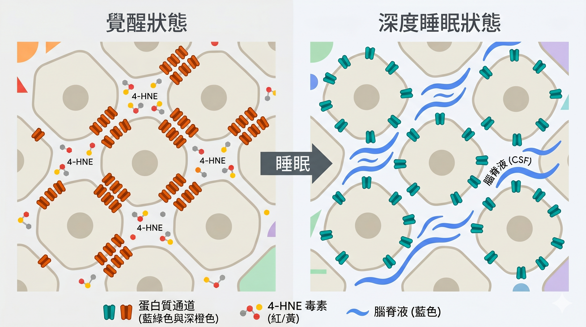
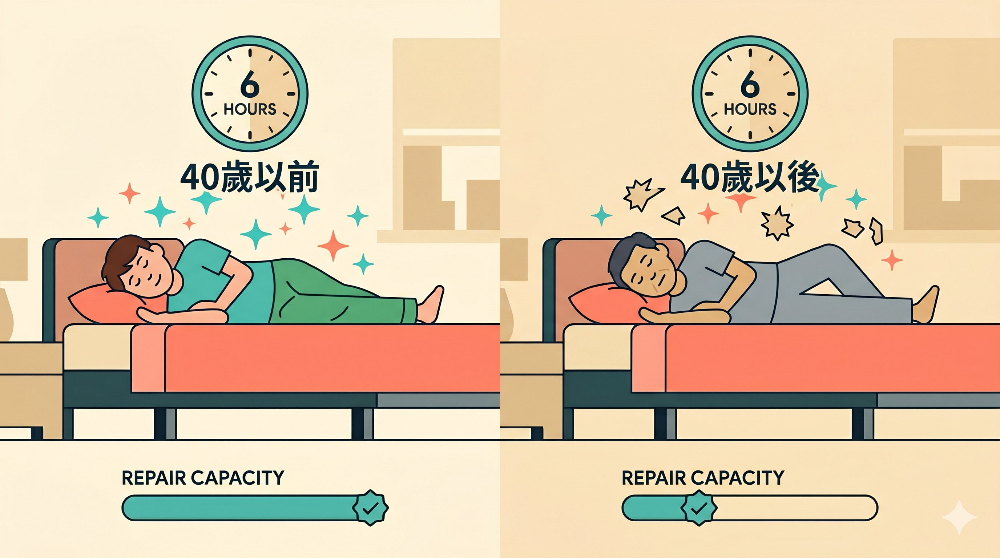

看看手錶，還記得你上一次睡超過七個小時是什麼時候的事？

如果你想了很久才想起來——這篇文章是寫給你的。

---

大多數人對睡眠的態度大概是這樣：知道重要，但覺得可以之後再補。

工作的事先處理完，小孩的事先顧好，自己的事排最後。

問題是身體根本不會按照你的優先順序運作。

睡眠不足累積的代價不是疲勞，而是老化速度。

這件事現在有了史上最大規模的研究數據可以說清楚。

---

## 50萬人、23種衰老時鐘

前幾天頂尖科學期刊《自然》（Nature）發表了一篇研究，樣本來自英國生物樣本庫（UK Biobank），共約 50 萬人，年齡介於 37 -_84 歲之間。

研究團隊把每個人的睡眠時數跟 23 種[生物衰老時鐘](/SLUG-生物年齡衰老時鐘文章)做比對。

這些時鐘不是單看一個指標，而是涵蓋大腦、心臟、肝臟、胰臟、脂肪等多個器官，分別用三種方式量：核磁共振影像（MRI）、血液中的蛋白質、血液中的代謝物。

這是一張全身性的衰老地圖，而不是只看睡眠對腦的影響。

結論很清楚：**身體老化速度最慢的睡眠時長，落在每天 6.4 - 7.8 小時之間。**

用死亡風險的數字來看更直接：

- 每天睡不到六小時的人，全因死亡率比一般人高 **50%**
- 每天睡超過八小時的人，全因死亡率高 **40%**

圖形呈現一個 U 字型，底部最低點就落在那個區間裡，睡太多睡太少的兩端都不好。

![睡眠時數與器官老化速度的 U 型關係.png]./(睡眠時數與器官老化速度的 U 型關係.png)

不同器官的最佳值有些差異。

大腦在分子層次（蛋白質體時鐘，也就是透過血液蛋白質來測量的衰老指標）的修復，最佳睡眠約落在 7.7 小時；但用核磁共振看大腦結構，最佳值反而落在 6.5 小時。

研究人員推測分子層次的修復需要較長睡眠，結構性的變化反應較慢，所以兩種測量方式抓到的最佳值會有落差。

另外性別也有區分，**女性** 所需的最佳睡眠時間整體上比男性略長（所以女生需要美容覺是對的，但是變成睡美人可就不一樣囉。）

---

## 「睡眠債」不是比喻，是真實的細胞狀態

數字說清楚了「睡多久」的問題。

但更根本的問題是：這個「睡眠債」，身體裡到底發生了什麼？

去年《自然》發表的另一篇研究，在果蠅的神經元裡找到了答案。

你清醒著的每一個小時，大腦的神經細胞都在忙碌運作。

運作就有代謝消耗，代謝消耗就會產生廢物——一種叫做活性氧自由基的物質，也就是俗稱的「氧化壓力」。

這些廢物攻擊細胞膜上的脂肪，產生一種叫做 4-HNE 的有毒副產物。

4-HNE 會直接作用在神經元細胞膜上一種叫做 Kv2.1 的蛋白質通道——也就是控制鉀離子進出、調節神經放電的閘門。

正常狀態下，這些通道在細胞膜上自由散布、各自獨立運作。

但當 4-HNE 累積，通道開始相互黏聚，在細胞膜特定區域形成一團一團緊密的「團簇（Clustering）」結構。

這不只是外觀改變。

團簇化的通道會讓神經元在放電後產生更強的抑制電流，神經元連續放電的能力因此急劇下降。

大腦皮質中越來越多的神經元陷入低興奮狀態，腦波頻率從清醒的高頻向低頻滑落——這就是你感受到的疲倦感與睡意，是神經元真實的生化狀態，不是主觀的感覺。

那還債呢？

睡著後，大腦進入深度睡眠的慢波狀態，皮質神經元產生大規模同步的電壓震盪。

這種特定的電生理模式就像一把鑰匙，解開了通道的黏聚狀態：團簇解體，通道重新散布於細胞膜，神經元恢復正常的放電潛力。

睡眠，是大腦唯一能執行這套清除程序的時間。不睡，就無法清。

這個「清除」不只是比喻。

大腦在深度睡眠期間會啟動一套叫做膠淋巴系統（glymphatic system）的廢物沖洗機制。

進入深度慢波睡眠時，神經細胞之間的縫隙會瞬間擴張超過 60%，腦脊髓液大量湧入腦組織，把代謝廢物強力沖走。

其中包括一種叫做 β-類澱粉蛋白（β-amyloid）的毒性蛋白——它正是阿茲海默症患者大腦裡大量堆積的東西。

這套沖洗機制在清醒時幾乎停擺，只有睡著、且進入足夠深度的睡眠，才會全力運作。

這也解釋了為什麼短睡眠者的問題如此廣泛——氧化廢物的累積不只影響神經元，它本身就是促進全身慢性發炎的來源之一。

每少睡一個小時，都是讓這個清除視窗縮短一個小時。

---

## 睡太少跟睡太多，是完全不同的問題

這是這篇研究最值得停下來想一想的地方。

**睡太少的人**，影響範圍非常廣——心臟病、糖尿病、肥胖、高血脂、[慢性發炎](/SLUG-慢性發炎核心文章)、憂鬱、焦慮，幾乎全身都中。

背後的機制是：睡眠剝奪會觸發急性生理反應，包括[交感神經持續亢進](/SLUG-交感神經壓力訊號文章)、全身發炎反應升高、壓力荷爾蒙系統（HPA 軸，也就是下視丘—腦垂體—腎上腺軸）過度活化。這些反應會直接衝擊你的情緒調節、代謝功能與免疫系統。睡眠不足對身體是「直接動手」。

**睡太多的人**，問題則比較集中在腦部相關疾患，特別是憂鬱症。但這裡有一個關鍵的區別：長時間睡眠本身未必是病因，它更像是身體某個地方已經在悄悄退化的訊號。研究發現，長睡眠與憂鬱的關聯，是透過大腦、脂肪、肝臟的衰老程度來中介的——器官先開始退化，你才開始睡得更長，然後情緒跟著出問題。

這個區別，對判斷自己的狀況有實際的意義：

**睡不夠的人**，問題通常在壓力系統長期過度激活。先從睡眠著手，是有意義的第一步。

**睡很多但還是累的人**，要找的問題往往已經不在睡眠這一層，背後可能是[慢性發炎、代謝疲勞或荷爾蒙失衡](/SLUG-慢性發炎核心文章)，需要往更深的地方追。

---

## 40歲以後，同樣的睡眠債，代價更大

這項研究鎖定 37 - 84 歲的族群，其實有它的道理。

40 歲之後，身體的修復能力開始走下坡——細胞受損後的修復速度變慢，神經可塑性（也就是大腦重組與學習的能力）的潛能逐漸下滑，睡眠失衡帶來的傷害也會被放大。

20 歲時少睡兩小時，隔天補回來大致沒問題。

45 歲時長期少睡，堆積的氧化損傷、發炎標記、毒性蛋白，不會因為週末多睡幾小時就清乾淨。

這也是為什麼「把睡眠排在最後」這件事，在中年之後會開始真正有代價。

---

所以下次有人問「我該睡幾個小時？」，我會先反問一句：你是睡不夠，還是睡很久還是累？

這兩個問題，要追的方向完全不一樣。

而更深一層的問題是：你的睡眠，有沒有真正完成大腦的清除工作？

睡眠時數是起點，但夠不夠深、有沒有進入慢波睡眠、醒來後大腦有沒有真正歸零——這才是決定「這段睡眠有沒有還到債」的關鍵。

睡眠是身體狀態的一扇窗，它的長短與品質，同時是原因，也是結果。

你有戴智慧型手錶紀錄睡眠的習慣嗎？

觀察紀錄是第一步。

如果你不確定自己的狀況屬於哪一種，我整理了一份【身體警報訊號自我評估清單】，涵蓋睡眠、壓力、發炎、代謝四個面向，可以幫你先做一個初步的定位。

👉 加入 LINE，免費索取：https://line.me/ti/p/@fer7932k

---

**參考文獻**

1. The MULTI Consortium., O'Toole, C.K., Song, Z. et al. Sleep chart of biological ageing clocks in middle and late life. *Nature* (2026).
2. Rorsman HO, Muller MA, Liu PZ, et al. Sleep pressure accumulates in a voltage-gated lipid peroxidation memory. *Nature* 2025;641(8061):232–239.

---

**編輯備注（上稿前刪除）**

---

### 內部連結對照表（填入實際 slug 後刪除）

| 位置 | 佔位符 | 連結目標 | 漏斗方向 |
|------|--------|----------|----------|
| 「23種生物衰老時鐘」 | `/SLUG-生物年齡衰老時鐘文章` | 生物年齡/DNA甲基化衰老時鐘相關文章 | ②→③ 導流 |
| 「慢性發炎」（睡太少段） | `/SLUG-慢性發炎核心文章` | ②漏斗核心慢性發炎文章 | ②內橫向 |
| 「交感神經持續亢進」 | `/SLUG-交感神經壓力訊號文章` | ①身體訊號解讀：交感神經/壓力相關 | ②→① 回流（抓新讀者） |
| 「慢性發炎、代謝疲勞或荷爾蒙失衡」 | `/SLUG-慢性發炎核心文章` | 同上慢性發炎文章 | ②內橫向 |

---

