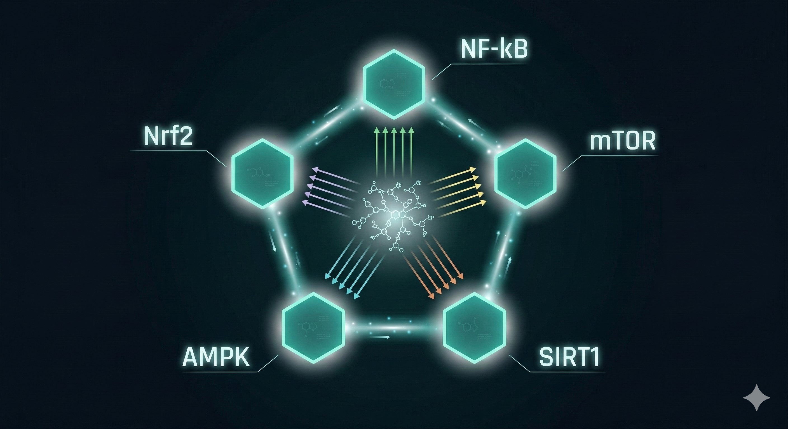

如果你認真研究過抗老化科學，你遲早會遇到這三個名字：

**雷帕黴素（Rapamycin）、二甲雙胍（Metformin）、GLP-1受體促效劑。**

這不是保健品圈在炒話題。這三種藥物背後的分子機制，是目前抗老化研究裡最被認真對待的科學方向之一——有動物實驗、有人體臨床數據、有頂級期刊背書。

但它們都是 **處方藥**。

這篇的目的：搞清楚它們為什麼有效、限制在哪裡、以及如果你現在沒有在用藥，你的選項是什麼。

---

## 雷帕黴素：最接近「抗老化藥」的東西

雷帕黴素（Rapamycin）是一種免疫抑制劑，本來用於器官移植後的排斥反應控制。

它之所以在抗老化圈引起高度關注，原因只有一個：

**它是目前已知最有效的 mTOR 抑制劑。**

我們在前幾篇說過，mTOR 是細胞的「生長感應器」——能量充足時活躍，推動細胞不斷增殖；mTOR 被抑制時，細胞切換到修復模式，啟動自噬，清除受損蛋白質和老化粒線體。

熱量限制的抗老化效果，很大一部分就是透過抑制 mTOR 來實現的。

雷帕黴素做的事情是：直接抑制 mTOR，繞過「需要少吃」這個步驟。

動物實驗的結果令人印象深刻。

2009年，美國國家老化研究所資助的三個獨立實驗室同時宣布：雷帕黴素可以將小鼠的壽命延長 12%——而且對那些看起來已經嚴重老化的小鼠也有效，平均存活率提高了三分之一。

這三個實驗室各自獨立得出相同的結論，發表在《Nature》。

2022年，德國研究團隊在《Nature》子刊發現了一個更驚人的結果：在年輕果蠅和小鼠身上，**只要早期短暫服用**雷帕黴素，就能獲得與 **長期終身服用**幾乎相同的延長壽命效果。

窗口期用藥的概念，開始進入研究視野。

同年另一篇《Nature》子刊顯示：熱量限制搭配雷帕黴素，能更有效地減緩老年小鼠的肌肉衰退——單獨用任何一種的效果都不如兩者並用。

人體試驗方面，2018 年諾華生醫研究所用雷帕黴素的衍生物做了一項試驗：264 名 65 歲以上受試者連續 6 週服用低劑量，結果未來一年的感冒次數只有安慰劑組的一半，接種後一個月血液抗體濃度提升了20%。

**限制在哪裡？**

雷帕黴素的問題不是它沒效，而是它有效的代價：長期使用會壓制免疫系統、影響傷口癒合、干擾血糖代謝、可能增加感染風險。

這些副作用在器官移植患者身上是可接受的代價，因為排斥反應的風險更高。但對一個健康的人來說，用一個會壓制免疫系統的藥物來抗老化——這個風險收益的計算非常複雜。

目前全球有幾個正在進行的人體試驗在評估低劑量、間歇性使用的安全性，但結論還沒有出來。

---

## 二甲雙胍：糖尿病藥變成長壽候選者

二甲雙胍（Metformin）是全球使用最廣泛的第二型糖尿病藥物之一，便宜、安全紀錄長達數十年。

它的抗老化潛力來自一個觀察：2014年，一份針對近10萬名糖尿病患者的分析報告發現，長期服用二甲雙胍的病人不但健康狀況明顯更好，而且平均壽命竟然超過了沒有糖尿病的一般人。

這個結果非常不尋常——理論上糖尿病患者的壽命應該更短，結果卻反了過來。

這個觀察催生了一個大型臨床試驗：**TAME（Targeting Aging with Metformin）**。

由美國國家老化研究所和老化研究聯盟的 Nir Barzilai 博士主導，研究費用高達 7,500 萬美金，計劃針對 3,000 名 65 - 79 歲的成年人進行六年追蹤——這也是 **史上第一個**以「延緩老化」為主要臨床終點的人體試驗。

動物實驗的支持也持續增加。2023 年，中國同濟大學研究團隊發現，二甲雙胍能透過腸道益菌 AKK 菌，減少促發炎細胞因子 IL-6 的分泌，改善老年小鼠的認知功能。

同年《Nature》子刊整理了從線蟲、果蠅到哺乳類動物的大量研究，結論一致：二甲雙胍能延長中位壽命和最高壽命。

2017 年一項針對 4.1 萬名男性二甲雙胍使用者的研究也顯示，長期使用可以顯著降低癡呆症、癌症和心血管疾病的發生風險。

二甲雙胍的主要機制之一是 **激活 AMPK**——這正是熱量限制和斷食啟動修復模式的關鍵能量感應路徑。它同時對 mTOR 有間接的抑制效果。

**限制在哪裡？**

二甲雙胍是處方藥，適應症是第二型糖尿病。

健康的人自行服用，在台灣不合法規，也缺乏足夠的長期安全數據支持用於非糖尿病族群。

另外有研究顯示，二甲雙胍可能干擾運動訓練帶來的粒線體適應效益——也就是說，如果你同時在認真運動，它可能會抵消部分訓練效果。

---

## GLP-1受體促效劑（Glucagon-Like Peptide-1 Receptor Agonists，GLP-1 RA）：從減重藥到抗老化候選者

GLP-1 受體促效劑最近很夯因為減重的效果很驚人；

如：Semaglutide，商品名 Ozempic；Tirzepatide，商品名 Mounjaro 這類本來是糖尿病和肥胖的治療藥物。

2025年12月，香港中文大學研究團隊在《Cell Metabolism》發表的研究，把它帶進了抗老化的討論——這項研究在衰老小鼠身上使用低劑量 GLP-1 藥物，在不影響體重的情況下，觀察到跨多個組織器官的基因表達逆轉，效果與 mTOR 抑制高度相似。

關鍵機制發現：效果依賴大腦下丘腦的 GLP-1 受體——是「大腦指揮全身抗衰老」的中樞協調機制，而不只是代謝的改變。

**限制在哪裡？**

GLP-1藥物是處方藥，目前的適應症是糖尿病和肥胖，抗老化用途仍在研究階段，尚無完整的人體長期數據。

常見副作用包括噁心、嘔吐、腸胃不適；中老年人使用會有肌肉流失的風險也是目前討論中的議題。

---

## 三種藥物的共同邏輯

把這三個放在一起，你會發現它們作用的路徑不同，但指向同一個方向：

**雷帕黴素** → 直接抑制 mTOR → 強制啟動修復模式

**二甲雙胍** → 激活 AMPK → 模擬能量不足的訊號 → 間接抑制 mTOR

**GLP-1** → 作用於下丘腦 → 大腦協調全身 → 模擬類似 mTOR 抑制的基因效應

它們都在做同一件事的不同版本： **讓細胞停止盲目消耗、切換到精準修復模式。**

這個機制方向，正是熱量限制、模擬斷食飲食、以及熱量限制模擬物（CRM）一直在做的事。

藥物只是達到這個目的的一條路——而且是需要處方、需要醫師監控、需要承擔副作用的那條路。

---

## 為什麼「單一成分」永遠不夠——CRM組合物的邏輯

回到一個根本問題：如果白藜蘆醇、NMN、雷帕黴素、二甲雙胍都有效，能不能把它們全部一起用？

問題在於，單一成分影響的路徑太廣，也不可能面面俱到，而且在不同的訊息傳遞機制之間很可能相互干擾。

白藜蘆醇和某些藥物組合可能產生衝突；NMN 在某些情況下可能同時刺激到我們不希望活躍的 mTOR 路徑；雷帕黴素在壓制 mTOR 的同時也壓制了免疫反應。

科學家開始嘗試另一個方向：**用「配方」而不是「單品」來處理老化的多條路徑。**

2020年發表的一項研究，從超過50種具有熱量限制效果的天然物中，篩選出 15 種混成營養素混合物，給老鼠食用。

結果：對大腦皮質、心臟和肌肉的改善效果，比單純做熱量限制還要好。在線蟲實驗中，這個配方同時增加了活動力和壽命。

在少量的人體雙盲試驗中，確認可以提升大腦中的穀胱甘肽濃度，並改善認知功能表現。

這個方向的邏輯很清楚：老化是多條路徑同時失效的結果，單一成分只能堵住幾個洞，有配方思維的 CRM 組合物才能同時影響 AMPK、Sirtuin、mTOR、Nrf2、NF-κB這幾條核心路徑。

這也是為什麼在這個領域，真正嚴肅的研究方向不是「找到一個神奇成分」，而是「設計出一個能影響多條老化路徑的精準配方」。

---

## 如果你現在沒有在用這些藥，你的選項是什麼？

這不是要你放棄藥物的科學，而是要說清楚一件事：

**這些藥物在做的事，在機制層面是可以被非處方方式部分模擬的。**

AMPK 的激活，可以透過特定天然成分（如 α-硫辛酸、槲皮素）達到部分效果。

mTOR 的抑制，可以透過間歇性的熱量限制、模擬斷食飲食、或特定多酚類成分來模擬。

Nrf2 通路的激活，可以透過蘿蔔硫素等植化素達到。

衰老細胞的清除（Senolytic 效果），槲皮素在這個方向有最多的天然成分研究支持。

這些不是「藥物的廉價替代品」——它們是獨立的研究方向，只是作用強度和精準度與藥物不同。

藥物是高強度、高風險的工具。天然成分的 CRM 策略是低強度、持續維護的工具。

它們可以並存，也可以在不同階段各自扮演不同的角色。

---

你現在最想搞清楚的，是你的細胞目前的狀態在哪裡。

在決定任何介入方式之前，先知道你的基準值是什麼。

**加我 LINE，我們聊聊你目前的狀況，看看從哪裡開始最有意義。**

👉 [加LINE諮詢](https://line.me/ti/p/@fer7932k)

---

**延伸閱讀：**
- [不節食也能啟動長壽基因？CRM的概念和DNA微陣列技術](/blog/chronic-inflammation/不節食，也能啟動修護基因——科學家找到的「熱量限制模擬物」是什麼？/) ← C篇（本篇前傳）
- [GLP-1 確認了一件事：逆轉基因老化模式，真的可以讓全身器官變年輕](/blog/intervention-optimization/GLP-1確認了一件事：逆轉基因老化模式，真的可以讓全身器官變年輕/) ← GLP-1佐證篇
- [ageLOC Youthspan：不節食，也能啟動長壽基因](/blog/intervention-optimization/ageLOC Youthspan：可以不節食讓細胞以為你在挨餓，啟動修復基因功能/) ← Youthspan 產品篇

---

## 參考資料

01. David E Harrison et al., 2009. [Rapamycin fed late in life extends lifespan in genetically heterogeneous mice.](https://pubmed.ncbi.nlm.nih.gov/19587680/) *Nature.* 460(7253):392-5.
02. Nir Barzilai et al., 2016. [Metformin as a Tool to Target Aging.](https://pubmed.ncbi.nlm.nih.gov/27304501/) *Cell Metab.* 23(6):1060-1065.
03. Junzhe Huang et al., 2025. [Body-wide multi-omic counteraction of aging with GLP-1R agonism.](https://pubmed.ncbi.nlm.nih.gov/39719089/) *Cell Metab.* 37(12):2362-2380.e8.
04. Frank Madeo et al., 2019. [Caloric Restriction Mimetics against Age-Associated Disease.](https://pubmed.ncbi.nlm.nih.gov/30849361/) *Cell Metab.* 29(3):592-610.
05. Sebastian Brandhorst et al., 2024. [Fasting-mimicking diet causes hepatic and blood markers changes indicating reduced biological age and disease risk.](https://pubmed.ncbi.nlm.nih.gov/38383456/) *Nat Commun.* 15(1):1309.
