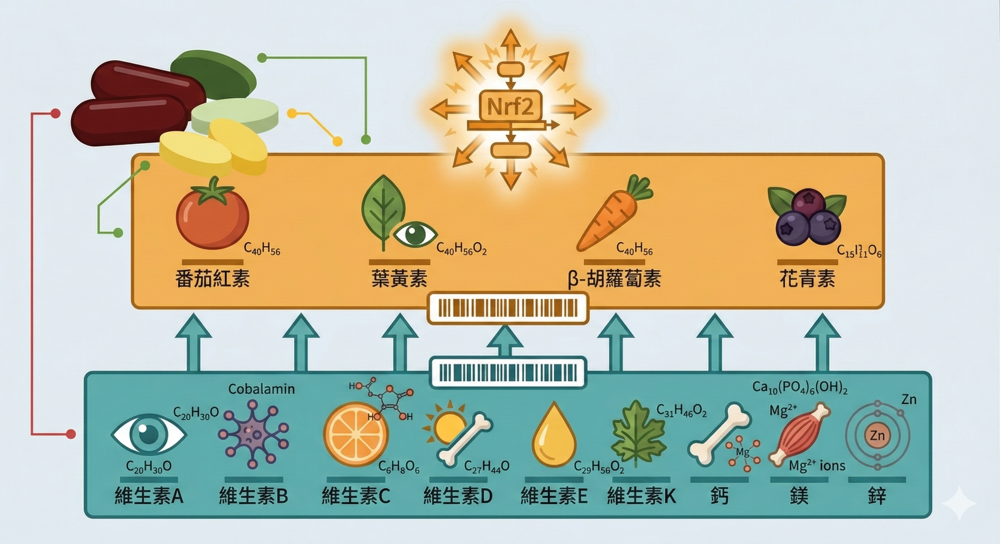
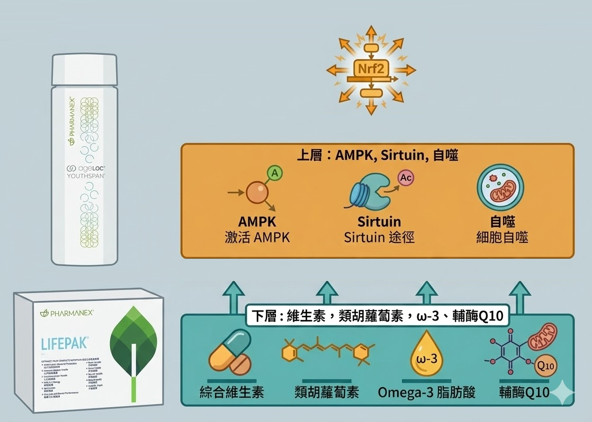

如果你已經做過 Prysm iO 掃描，你手上有一個數字。

這個數字告訴你，你的皮膚類胡蘿蔔素濃度，也就是你的細胞抗氧化防禦水位，現在在哪裡。

很多人掃完之後問我同一個問題：「那我要吃 Youthspan 嗎？」

答案是：要，但順序很重要。

**在你啟動修護基因之前，你需要先把地基補起來。**

---

## 一個蓋房子的比喻

Youthspan 的作用是什麼？它透過 CRM（熱量限制模擬）激活 AMPK、SIRT1、Nrf2 等長壽通路，讓細胞的修復機制重新高效運作。

這是「啟動」的工作。

但啟動之後，細胞要執行修復，需要原物料，維生素、礦物質、植化素、抗氧化輔酶。

如果這些原物料不夠，修復機制就算啟動了，也是空轉。

蓋房子的比喻是這樣的：Youthspan 是讓工人準時到場、工作效率翻倍的管理系統。LifePak 是確保倉庫裡有足夠磚頭、鋼筋、水泥的後勤。

管理系統再好，倉庫是空的，房子蓋不起來。

---

## 為什麼光靠飲食，補不回來

這是大部分人不願意接受但需要面對的問題。

**台灣人的蔬果攝取缺口太大。** 

國健署調查顯示，絕大多數台灣人每天的水果攝取不到 2 份，蔬菜也低於建議量。

植化素攝取不足是結構性問題，不是「努力一點多吃蔬菜」就能解決的。

**吸收率的問題。** 

類胡蘿蔔素等脂溶性植化素在沒有足夠油脂搭配的情況下，吸收率會大幅下降，沒有淋油醋醬的沙拉，裡面的類胡蘿蔔素吸收效率可能只有加了油脂之後的 20–30%。

烹調方式、腸道菌相、胃酸濃度，每個環節都在決定最終進入細胞的量。

**慢性發炎狀態本身在持續消耗。** 

當身體處於 Inflammaging 狀態，抗氧化物質被優先調度對抗氧化壓力。

你補進去的速度，趕不上消耗的速度。這不是飲食問題，是細胞環境的問題。

**現代食物的植化素含量在下降。** 

農業土壤退化和品種改良優先考慮產量，同樣份量的蔬果，現在的植化素含量和 50 年前相比可能下降了 5–40%，視品種和產地而異。

這四個原因疊加，讓「多吃蔬菜」的效果，遠不如大多數人以為的那麼直接。

---

## LifePak 補的，不只是你知道的那幾種

標準的綜合維他命補維生素 A、B群、C、D、E、K，加礦物質。

這是地基的第一層，必要的。

但 LifePak 補的還有第二層，大多數綜合維他命做不到的：

**植化素（Phytochemicals）**

植化素是蔬果的天然保護化合物，超過 25,000 種已知。

它們對細胞的作用包括：激活 Nrf2 抗氧化通路、抑制 NF-κB 發炎訊號、清除自由基、支持粒線體功能。

這些通路，就是 Youthspan 要工作的那個環境。

LifePak 的植化素配方來自多種濃縮蔬果萃取物，涵蓋茄紅素、葉黃素、β-胡蘿蔔素、蝦青素、花青素等主要抗氧化家族，對應蔬果「彩虹飲食」裡的五個顏色帶，是現代飲食最難靠日常攝取補足的那一層。

---

## LifePak 和一般綜合維他命，差在哪裡

這是最常被問到的問題。

**一般綜合維他命**的設計邏輯是把所有必需維生素礦物質放進一顆錠，用「一顆搞定」作為訴求。問題在於：成分之間的吸收競爭（鈣和鐵同時服用互相抑制）、劑量稀釋（十幾種成分塞進兩顆膠囊，每種的實際劑量可能低於有效量），以及完全不涵蓋植化素，現代人最缺乏的那一層。

**LifePak 的三個設計差異：** 特別增加 **植化素**來覆蓋抗氧化網路，這是最根本的差別。

絕大多數綜合維他命不含植化素，因為這類成分複雜、不穩定、成本高，所以這個別家廠商都是拆開另外單獨賣。

LifePak 的植化素複合配方是它和一般綜合維他命最大的分水嶺。

**配方協同邏輯**：Omega-3 作為脂溶性成分的吸收載體不是偶然的，是設計好的協同。

α-硫辛酸和 CoQ10 的組合，是支持粒線體效率的標準雙件組。（Prime 以上才有）

成分之間的達峰時間和吸收競爭，在配方設計階段就已經被考慮進去。

**製藥等級的品管標準**：Pharmanex LifePak 是全球第一個同時通過 NSF、ConsumerLab 及 BSCG 三項認證的綜合維生素產品，這個標準高於一般保健品法規的要求。

---

## 植化素和 Prysm iO 的直接關係

類胡蘿蔔素是植化素裡的重要家族，它直接沉積在皮膚，是 Prysm iO 量測的那個指標。

當你的 LifePak 攝取持續、吸收狀況良好，皮膚類胡蘿蔔素濃度會在 4 到 8 週內出現可量測的上升。

這代表什麼？

**你可以用 Prysm iO 追蹤 LifePak 是否真的在被你的身體使用。**

數字往上走，代表植化素攝取進來了、吸收了、儲備在累積。

數字沒動，代表吸收環節可能有問題，劑型、服用時機、腸道狀況都可能是原因，需要調整策略。

這讓「有吃保健品」這件事，第一次有了可以追蹤的客觀指標。

---

## 使用順序：地基先，啟動後

根據這個邏輯，建議的使用順序是：

**第一個月**：單獨使用 LifePak，每天按時服用，同時調整飲食品質。四週後做一次 Prysm iO 掃描，確認抗氧化水位是否在上升。

**使用三個月水位上升之後**：加入 Youthspan。這時候細胞環境的基礎已經補好，Nrf2 通路有足夠的植化素支撐，Youthspan 激活的修復機制才有完整的原物料可以工作。

**持續追蹤**：每三個月一次 Prysm iO 掃描，用數字確認整體策略是否有效，而不是靠感覺猜。

這個順序不是硬規則，但它讓介入更有效、更可追蹤。

---

## 不同族群，LifePak 有三個版本

LifePak 針對不同的生理需求分為三個配方：

**LifePak（20歲以上男性）**：完整的微量營養素和植化素基礎配方，支持整體代謝和抗氧化功能。

**LifePak Women（20歲以上女性）**，在基礎配方上增加鐵質（補充月經流失）、葉酸（支持細胞分裂）、額外的鈣質、維他命 D（骨密度維護）和肌醇，還特別加入當歸濃縮物、月見草油、琉璃苣萃取物，對於平衡女性生理機能（經前症候群）有卓越功效。

**LifePak Prime（40歲以上）**：針對細胞老化加速階段調整劑量，增加輔酶 Q10（粒線體能量支持）、α-硫辛酸（跨水脂兩相的抗氧化），並提高幾個關鍵植化素的濃度。

40 歲以後，細胞儲備的消耗速度加快，LifePak Prime 的配方設計對應的就是這個階段的需求。

---

## 你的地基，現在補了幾成？

掃描給你一個數字，但數字的意義要放在脈絡裡才有用。

如果你的 Prysm iO 分數偏低，這是訊號：你的抗氧化儲備入不敷出，地基需要補。

如果你的分數在正常範圍但沒有在改善，這可能是吸收效率的問題，需要調整策略。

如果你的分數在持續上升，你現在做的事是有效的，可以考慮加入下一層的介入。

每個人的起點不一樣，介入的策略也不應該一樣。

---

**延伸閱讀：**
- [你每天有夠吃蔬菜嗎？——你的細胞拿到的可能比你以為的少很多](/blog/body-signals/carotenoid-cell-absorption/) 
- [你的身體老化速度，有辦法知道嗎？——三種方法，從專業到居家](/blog/precision-health-tools/aging-speed-measurement-methods/) 
- [ageLOC Youthspan：可以不節食讓細胞以為你在挨餓，啟動修復基因功能](/blog/intervention-optimization/ageloc-youthspan-longevity-genes/)
- [你的細胞儲備，正在被一個你感覺不到的過程悄悄耗光](/blog/chronic-inflammation/cell-reserve-chronic-depletion/)

---

## 參考資料

01. Bernhard Watzl, 2008. [Anti-inflammatory effects of plant-based foods and of their constituents.](https://pubmed.ncbi.nlm.nih.gov/18845701/) *Int J Vitam Nutr Res.* 78(6):293-8.
02. Bharat B Aggarwal, Shishir Shishodia, 2006. [Molecular targets of dietary agents for prevention and therapy of cancer.](https://pubmed.ncbi.nlm.nih.gov/16563357/) *Biochem Pharmacol.* 71(10):1397-421.
03. Tissa R Hata et al., 2000. [Non-Invasive Raman Spectroscopic Detection of Carotenoids in Human Skin.](https://pubmed.ncbi.nlm.nih.gov/10951274/) *J Invest Dermatol.* 115(3):441-448.
04. Bettina Molin Johansen et al., 2017. [Skin carotenoids reflect antioxidant status and an antioxidant-rich diet.](https://pubmed.ncbi.nlm.nih.gov/28606264/) *J Dermatol Sci.* 86(3):207-213.
05. Brenda M Roe et al., 2000. [Carotenoid bioavailability is higher from salads ingested with full-fat than with fat-reduced salad dressings.](https://pubmed.ncbi.nlm.nih.gov/15735074/) *Am J Clin Nutr.* 80(2):396-403.
06. Wen-Harn Pan et al., 2018. [Vegetable, fruit, and phytonutrient consumption patterns in Taiwan.](https://www.ncbi.nlm.nih.gov/pmc/articles/PMC9332634/) *J Food Drug Anal.* 26(1):145-153.
07. David Sinclair, Matthew LaPlante, 2019. [*Lifespan: Why We Age—and Why We Don't Have To.*](https://www.books.com.tw/products/F014444886?srsltid=AfmBOor_W4q70G6WIdwS2a9lNmlc6KuAC-WKgFO6Lr6uYlrWCTA04a3r) Atria Books.
08. Pharmanex Quality Standards. Nu Skin Enterprises. 6S Quality Process overview. *(NSF/ConsumerLab/BSCG triple certification)*
