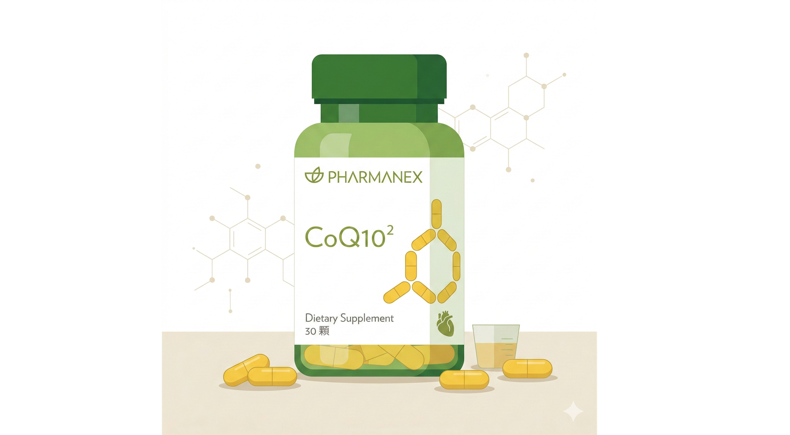

你可能已經知道 CoQ10 很重要。

粒線體的能量轉換需要它，細胞對抗氧化壓力需要它，耳蝸那個24小時全力運轉的「發電廠」也需要它。

但有一件事很多人不知道：

**你買的 CoQ10，有多少真的進到了細胞裡？**

---

## CoQ10 的根本問題：吸收

CoQ10 是脂溶性分子。這意味著它需要有油脂的環境才能溶解、才能被腸道吸收。

問題是：人體的消化環境主要是水性的。

CoQ10 進到胃裡，遇到水性環境——分子聚集、沉澱、大部分直接隨糞便排出。

研究顯示，一般 CoQ10 製劑的口服生物利用率非常低，部分配方只有個位數的百分比真正被吸收。

你吃了100mg，可能只有不到 10mg 到達細胞。

這就是為什麼很多人吃了CoQ10「沒感覺」——不是CoQ10沒用，是大部分根本沒進去。

---

## Ubiquinol vs Ubiquinone：爭論的假議題

市面上有兩種形式的 CoQ10：

**Ubiquinone（氧化型）**：CoQ10的原始形式，穩定、容易製造、價格較低。進入人體後需要先被還原成 ubiquinol，才能在粒線體裡工作。

**Ubiquinol（還原型）**：已經是活化形式，不需要轉換，可以直接使用。部分研究顯示對年長者的吸收率更高，因為身體的轉換能力會隨年齡下降。

這個爭論本身沒有錯。

但它忽略了一件事： **無論哪種形式，如果吸收率本身很低，形式的差別根本沒有意義。**

一個設計良好的 ubiquinone 配方，解決的是更根本的問題。

---

## 環糊精包覆技術解決了什麼？

環糊精（Cyclodextrin）是一種環狀的糖分子結構，內部是疏水性空腔——可以把脂溶性的 CoQ10 分子「包」進去。

這個包覆做了兩件事：

**① 讓脂溶性分子能在水性環境中分散**
被環糊精包覆的 CoQ10，外殼是親水性的，可以在消化液裡均勻分散，大幅增加與腸道吸收面的接觸面積。

**② 保護 CoQ10 分子不被氧化降解**
CoQ10 對光和熱敏感，從製造到你吃進去之前，沒有保護的 CoQ10 已經開始降解。環糊精的包覆提供了物理屏障，讓活性成分維持穩定。

結果是：同樣劑量的 CoQ10，環糊精包覆配方的實際吸收量，顯著高於傳統粉末膠囊。

**這就是為什麼劑型比劑量更重要。**

---

## Nu Skin CoQ10 的配方邏輯

Nu Skin 的 CoQ10 採用環糊精包覆的 ubiquinone 配方，針對的正是吸收率這個根本問題。

Ubiquinone 在環糊精的保護下：
- 在消化環境中維持分散狀態，提升腸道吸收效率
- 分子穩定性更高，從生產到消費者服用的整個過程中活性損失更少
- 進入細胞後經由正常代謝路徑轉換為 ubiquinol，在粒線體中發揮功能

對 40 歲以上、粒線體功能開始下降的人來說，CoQ10 的補充邏輯很清楚：

你的耳蝸、你的心肌、你的神經細胞——這些高能量需求的組織，是最先感受到 CoQ10 不足的地方。

補充有效的 CoQ10，是在直接支援這些組織的能量產出和自由基清除能力。

---

## 想進一步了解或購買？

Nu Skin CoQ10 的使用建議和適合的族群，因每個人的細胞狀態不同而有差異。

**加我 LINE，我根據你的狀況給你具體的建議。**

👉 [加 LINE 諮詢或購買](https://line.me/ti/p/@fer7932k)

---

**延伸閱讀：**
- [聽力損失了30%你才感覺到——從今天的餐桌，到有科學支持的6種補充策略](/blog/intervention-optimization/聽力損失了30％你才感覺到——從今天的餐桌，到有科學支持的6種補充策略/) ← 介入篇

---

## 參考資料

1. Bhagavan HN, Chopra RK, 2006. [Coenzyme Q10: absorption, tissue uptake, metabolism and pharmacokinetics.](https://pubmed.ncbi.nlm.nih.gov/16524932/) *Free Radic Res.* 40(5):445-53.
2. Zmitek J et al., 2008. [Relative bioavailability of two forms of a novel water-soluble coenzyme Q10.](https://pubmed.ncbi.nlm.nih.gov/18373294/) *Ann Nutr Metab.* 52(4):281-7.
3. Agnieszka J. Szczepek, Heidi Olze, 2026. [Coenzyme Q10 in Hearing Disorders: Replacement Therapy in Mitochondrial Deafness and Neuroprotective Use in Acquired Hearing Loss.](https://www.mdpi.com/2504-463X/7/1/8) *J. Otorhinolaryngol. Hear. Balance Med.* 7(1):8.
4. Chisato Fujimoto, Tatsuya Yamasoba, 2019. [Mitochondria-Targeted Antioxidants for Treatment of Hearing Loss: A Systematic Review.](https://pmc.ncbi.nlm.nih.gov/articles/PMC6523236/) *Antioxidants (Basel).* 8(4):109.
