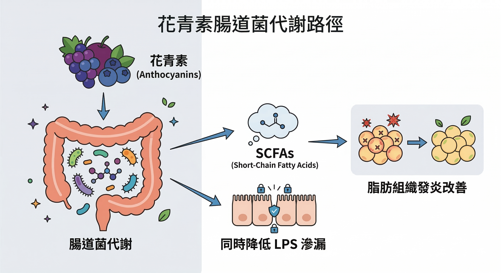

上一篇我們確認了：皮質醇與胰島素如何鎖死你的脂肪細胞。

既然死結打不開，這篇我們要看什麼樣的『生物剪刀（多酚）』可以剪斷這些迴路。

現在要談的是：**什麼東西可以在分子層面干預這些迴路，而且有人體 RCT 數據支持？**

不是「促進新陳代謝」這種含糊說法。是具體到：對哪個酵素、通過什麼訊號路徑、在哪項隨機對照試驗裡被量化確認。

答案是三種多酚類化合物：**花青素（Anthocyanidin）、荔枝綠茶多酚（Oligonol®）、兒茶素（Catechin）**。

它們的作用路徑不重疊，組合使用理論上具有加成效果。

---

## 第一種：花青素——從腸道菌重塑脂肪組織的發炎狀態

### 花青素是什麼？

花青素廣泛存在於深色植物中——藍莓、黑醋栗、紫玉米、山桑子。

它屬於黃酮類（Flavonoids）化合物，顏色隨環境酸鹼度變化，從紅、紫到藍，都是花青素的表現形式。

主要的六種花青素：矢車菊素（Cyanidin）、飛燕草素（Delphinidin）、天竺葵素（Pelargonidin）、芍藥素（Peonidin）、矮牽牛素（Petunidin）、錦葵花素（Malvidin）。

### 花青素如何影響內臟脂肪？路徑是腸道

花青素在小腸的直接吸收率並不高（10–22%），但它的生物效應很大——因為大部分進入大腸的花青素會被腸道菌群代謝轉化。

**雙歧桿菌（Bifidobacterium）、乳酸菌（Lactobacillus）** 會把花青素代謝成酚酸類化合物和 **短鏈脂肪酸（Short-Chain Fatty Acids，SCFAs）**。

SCFAs 通過體循環到達脂肪組織，直接調節脂肪組織的發炎狀態。

當腸道裡充滿壞菌時，這些壞菌會不斷釋放毒素跑到血液裡，讓你的身體一直處在「慢性發炎」的警戒狀態。

只要這個發炎警報響著，身體就會覺得遇到危險，死命地把熱量轉化成內臟脂肪囤積起來。

**臨床數據一：腸道菌相重塑**
2018 年雙盲 RCT（46 名受試者，8 週）：含 215 mg 花青素的多酚配方，顯著提升腸道 **擬桿菌門（Bacteroidetes）**菌叢比例。

體重較輕者的腸道中，擬桿菌門本來就較多——這提示花青素通過菌相調節影響體重管理。

就是你吃完大餐後，肚子不再鼓得像充了氣的皮球，排便也變得更有規律。

**臨床數據二：內臟脂肪直接縮減**
2020 年大型人群研究（618 名受試者，25–83 歲）：攝取較高花青素的族群，擁有顯著較低的 **腹部脂肪量、內臟脂肪／皮下脂肪比值（VAT/SAT ratio）**，同時具有最高的腸道微生物多樣性。

**臨床數據三：LPS 降低，打斷代謝性內毒素血症**
花青素能強化腸道緊密連接蛋白（Tight Junction Proteins）的表達，減少血液中循環的 **細菌脂多糖（LPS）**。

LPS 是驅動代謝性內毒素血症的核心分子，也是慢性低度發炎和胰島素阻抗惡化的重要引火源。⁴

**臨床數據四：系統性回顧**
2021 年統合分析（隨機對照試驗）：每天 ≤ 300 mg 花青素補充劑，持續 4 週以上，可顯著降低 BMI 和體重。

也就是說，它是腸道菌相的『糾察隊』，幫你把會讓你變胖的壞菌趕走。

---

## 第二種：Oligonol®——日美雙專利，CT 確認內臟脂肪縮減

### Oligonol® 是什麼？
花青素腸道菌代謝路徑
Oligonol® 由日本 **阿明諾化學有限公司（Amino Up Chemical Co. Ltd，北海道札幌）** 研發，透過專利小分子化技術，將 **荔枝原花青素（Proanthocyanidins）**——天然分子量大、吸收率低——轉化為以 **單體、雙體、三聚體**為主的小分子寡聚物，再與綠茶多酚結合。

這個分子結構改造的意義：2006 年的研究確認 Oligonol® 具有比原花青素顯著更高的**生物利用率（Bioavailability）**。

**獲獎與認證**：
- 2007：日本多酚暨健康國際會議（ICPH）**最佳產品大獎**
- 2008：美國 Nutracon **NutrAward 新品獎**
- 2009：美國 FDA **GRAS 認證**
- 2009：北海道「Health Do」食品功能性標示制度
- 2011：美國 SupplySide West **科學優秀獎**

### Oligonol® 的三項 RCT 數據

**熱成像研究（2014）**：6 名健康受試者，服用 50 mg Oligonol® 後 30 – 120 分鐘，熱成像顯示體表溫度明顯上升，確認 **產熱效應（Thermogenic Effect）** 增強——即脂肪作為燃料主動燃燒產熱的能力提升。

**腹圍 RCT（2009）**：18 名腹圍 > 85 cm 成年受試者，Oligonol® 組（100 mg/日）vs. 安慰劑，持續 10 週。

**腹部 CT 量化確認：Oligonol® 組的內臟脂肪體積、腹圍、體重均顯著降低。** 這是目前最直接的內臟脂肪 CT 量化 RCT 之一。

**代謝指標 RCT（過重女性）**：補充 Oligonol® 後，體重增加受到抑制，血脂代謝指標改善。

也就是說，這是一種能讓你的微血管重新打開、提升體溫的黑科技多酚。

---

## 第三種：兒茶素——COMT 抑制，讓脂肪動員訊號延長

### 兒茶素的作用機制非常具體

**兒茶素（Catechin）** 是綠茶中最主要的多酚類成分，其中活性最強的是 **表沒食子兒茶素沒食子酸酯（EGCG）**。

它的代謝機制有一個明確的酵素靶點：**兒茶酚-O-甲基轉移酶（COMT）**。

COMT 是負責降解 **正腎上腺素（Norepinephrine，NE）** 的酵素。

正腎上腺素是脂肪動員的關鍵訊號——當你運動，交感神經釋放正腎上腺素，啟動脂肪組織的分解（β-adrenergic 受體路徑）。

但 COMT 會快速清除這個訊號，縮短脂肪動員的時間窗口。

**兒茶素抑制 COMT → 正腎上腺素在脂肪組織中滯留更久 → 脂肪動員效果延長。**

### RCT 數據

2007 年人體研究（有規律運動前提下）：綠茶兒茶素補充組，與對照組相比，額外增加 **17% 的脂肪消耗，腹部脂肪減少 7.4%**。

關鍵字是「有規律運動前提下」——兒茶素的 COMT 抑制效果，在有運動刺激（正腎上腺素有基礎分泌）的情況下才能充分發揮。

**兒茶素是運動效果的放大器，不是運動的替代品。**

---

## 三種多酚的協同效應

| 成分 | 主要作用路徑 | 干預目標 | 關鍵 RCT |
|------|-------------|----------|----------|
| 花青素 | 腸道菌重塑 → SCFAs → 脂肪組織發炎↓；LPS↓；VAT/SAT↓ | 內臟脂肪發炎迴路、腸道屏障 | 618 人群研究；46 人雙盲 RCT |
| Oligonol® | 產熱效應↑；CT 確認內臟脂肪體積↓ | 內臟脂肪直接縮減 | 腹部 CT RCT；熱成像研究 |
| 兒茶素 | COMT 抑制 → 正腎上腺素延長 → 脂肪動員↑17% | 脂肪動員訊號效率 | 人體 RCT（搭配運動） |

三條路徑：腸道菌相 × 產熱代謝 × 脂肪動員，作用節點不重疊，組合使用具有理論上的加成潛力。

但這裡有一個關鍵前提需要說清楚：**單獨補充其中一種，效果會打折扣。**

花青素需要健康的腸道菌相作為基礎；Oligonol® 的產熱效應在皮質醇偏高時會被部分拮抗；兒茶素的 COMT 抑制沒有運動刺激配合就缺少足夠的正腎上腺素可以延長。

「這三種多酚分別處理了腸道、產熱與脂肪動員。但對你來說，最難的不是理解科學，而是如何同時補齊這三個缺口，並且達到臨床有效的劑量。」——這也是下一篇要說的核心問題。

---

## 下一步：這三種成分，如何在一個配方裡發揮最大效益？

有一款針對代謝設計的產品，已經把這三種成分（紫玉米花青素＋日美雙專利的 Oligonol®）完美整合在同一個配方裡，它叫做 **ageLOC Meta（每代紫）**。

它不是隨機湊合，而是將紫玉米花青素與日美雙專利的 Oligonol® 整合在一起，解決了你『想補卻不知道怎麼挑』的困境。

這就是 ageLOC Meta 每代紫 的設計邏輯。

在下一篇文章裡，我會直接幫你拆解：**到底哪些人適合吃 Meta？該怎麼吃？以及更重要的——你需要搭配什麼，才能讓它在你身上真正發揮效果？**

👉 **系列第四篇**：[ageLOC Meta 每代紫——臨床劑量、使用策略與搭配建議](/blog/intervention-optimization/ageloc-meta-clinical-protocol/)

---

## 誰最適合 ageLOC Meta？

符合以下情況的人，獲益機率最高：

**① 腰圍超標但體重 BMI 正常或微超**
典型的「泡芙型」體型——皮下脂肪不多，但內臟脂肪已累積。這類人往往健檢指標偏移（血糖、三酸甘油酯）但 BMI 看起來還好。

**② 有規律運動但腹部脂肪難消**
符合兒茶素的使用前提——COMT 抑制效果在有運動刺激時才能充分發揮，這類人是最直接的受益族群。

**③ 40 歲以上男性，睪固酮相關症狀初現**
與 article-G（R2 產品）搭配可考慮——R2 處理細胞層面的能量代謝；Meta 處理內臟脂肪的荷爾蒙干擾迴路。

**④ 皮膚開始出現色斑、皺紋增加**
Oligonol® 的皮膚抗老 RCT 數據明確，不需要另外補充。

---

**👉 不確定三條路徑哪一條是你的主要缺口？把你的 TG（三酸甘油酯）跟 HDL（高密度脂蛋白）數字和腰圍傳給我，5 分鐘內告訴你。**

---

## 參考資料

01. Cremonini E, et al. (2019). [Anthocyanins protect the gastrointestinal tract from high fat diet-induced alterations.](https://pubmed.ncbi.nlm.nih.gov/31330482/) *Redox Biol*, 26, 101269.
02. Hester SN, et al. (2018). [Efficacy of an Anthocyanin and Prebiotic Blend on Intestinal Environment in Obese Subjects.](https://pubmed.ncbi.nlm.nih.gov/30302287/) *J Nutr Metab*, 2018:7497260.
03. Jennings A, et al. (2020). [Habitual anthocyanin intake and visceral abdominal fat in population-level analysis.](https://pubmed.ncbi.nlm.nih.gov/31826255/) *Am J Clin Nutr*, 111(2), 340–350.
04. Cremonini E, et al. (2022). [Anthocyanin actions at the gastrointestinal tract.](https://pubmed.ncbi.nlm.nih.gov/36379746/) *Mol Aspects Med*, 101156.
05. Park S, Choi M, Lee M. (2021). [Effects of Anthocyanin Supplementation on Reduction of Obesity Criteria: Systematic Review and Meta-Analysis.](https://pubmed.ncbi.nlm.nih.gov/34205642/) *Nutrients*, 13(6), 2121.
06. Aruoma OI, et al. (2006). [Low molecular proanthocyanidin dietary biofactor Oligonol.](https://pubmed.ncbi.nlm.nih.gov/17012779/) *Biofactors*, 27(1-4), 245–265.
07. Kitadate K, Aoyagi K, Homma K. (2014). [Effect of Lychee Fruit Extract (Oligonol) on Peripheral Circulation.](https://pmc.ncbi.nlm.nih.gov/articles/PMC4903903/) *J Nat Med*, 6(7).
08. Nishihira J, et al. (2009). [Amelioration of abdominal obesity by low-molecular-weight polyphenol (Oligonol) from lychee.](https://www.sciencedirect.com/science/article/pii/S1756464609000565) *J Funct Foods*, 1(4), 341–348.
09. Bahijri SM, et al. (2018). [Supplementation with Oligonol Prevents Weight Gain in Overweight and Obese Saudi Females.](https://pubmed.ncbi.nlm.nih.gov/29853817/) *Curr Nutr Food Sci*, 14(2), 164–170.
10. Nagao T, Hase T, Tokimitsu I. (2007). [A green tea extract high in catechins reduces body fat and cardiovascular risks.](https://pubmed.ncbi.nlm.nih.gov/17557985/) *Obesity*, 15(6), 1473–1483.

> *免責聲明：本文所提供之資訊與文獻探討，皆為日常健康促進與保養參考，不具備醫療診斷、治療、減輕或預防任何疾病之功效。若有明確醫療需求，請務必尋求專業醫師協助。*
