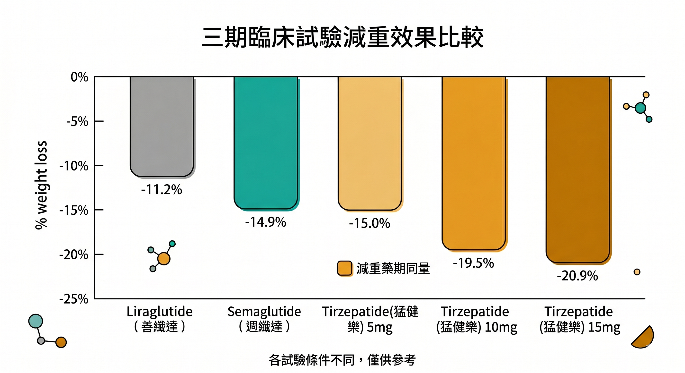
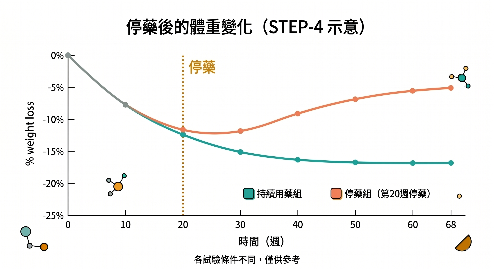

你已經決定要認真考慮 GLP-1 藥物了。

或者你身邊有人在打，你想搞清楚到底有哪些選擇、差異在哪裡、停藥後會怎樣。

這篇文章不說機制，不說為什麼它有抗老效果。這篇只說一件事：**如果你打算用，你需要先知道什麼。**

---

## 目前台灣可以取得的主要選項

台灣 TFDA 目前核准用於體重控制的 GLP-1 相關藥物有三個：

| 藥物 | 學名 | 廠商 | 使用方式 | TFDA 核准（減重） |
|---|---|---|---|---|
| 善纖達 Saxenda | Liraglutide | Novo Nordisk | 每日注射 | 2020 年 8 月 |
| 週纖達 Wegovy | Semaglutide | Novo Nordisk | 每週注射 | 2025 年 4 月 |
| 猛健樂 Zepbound | Tirzepatide | Eli Lilly | 每週注射 | 2025 年 6 月 |
| Foundayo | Orforglipron | Eli Lilly | 每日口服（無飲食限制） | 申請中（美國 2026/4/1 核准）|

**Liraglutide（善纖達）**是最早的一代，每天注射一次，半衰期 13 小時，效果相對保守，現在市場上已逐漸被 Semaglutide 取代。

**Semaglutide（週纖達）**是目前最主流的選擇，每週一針，半衰期 165 小時，也就是說藥物濃度在一週內維持更穩定。

**Tirzepatide（猛健樂）**是雙重受體促效劑，同時作用於 GLP-1R 和 GIP 受體，目前減重效果最強，也是 2026 年討論最熱的選項。

---

## 三個藥的減重效果實際差多少

這不是行銷說法，是各藥物核心三期臨床試驗的數字：

**Semaglutide（STEP-1，68 週）**
非糖尿病肥胖成人，每週 2.4 mg，搭配生活介入：
平均體重減少 **14.9%**，安慰劑組 2.4%。

**Tirzepatide（SURMOUNT-1，72 週）**
非糖尿病肥胖成人，最高劑量 15 mg，三組劑量：
平均體重減少 **15.0%、19.5%、20.9%**，安慰劑組 3.1%。

**SURMOUNT-5（直接頭對頭比較，72 週）**
Tirzepatide 組平均減重 **20.2%**，Semaglutide 組 **14.7%**。

簡單說：**兩個都有效，猛健樂效果更強，但也更貴、副作用特性略有不同。**

---

## 常見副作用：你需要心理準備的事

兩個藥物最常見的副作用都是腸胃相關：噁心、腹瀉、便秘、嘔吐。

這些反應通常在前幾週最明顯，隨著身體適應逐漸緩解。從低劑量開始、慢慢加量，是降低副作用的標準做法。

噁心嘔吐的實用補充：生薑

2026 年 4 月 《Medscape》 報導了第一個專門針對 GLP-1 副作用的生薑隨機雙盲試驗（Balaban MD et al.，78 位受試者，14 天）。

結果：主要終點（整體噁心嚴重度）生薑組下降 3.7 分 vs 安慰劑 3.0 分，差距未達統計顯著（P=0.286）。

但次要指標上，生薑組有 96.2% 的人噁心感有所減輕，安慰劑組為 87.9%，這個差異統計上顯著。改善輕中度噁心的比例生薑組也明顯優於安慰劑。兩組都沒有出現額外不良反應。

為什麼生薑對噁心有效？生薑的活性成分薑酚（Gingerols）和薑烯酚（Shogaols）具有天然的 5-HT3 受體拮抗作用——這和臨床止吐藥（如 Ondansetron）的作用機轉相同。

同時，生薑還能促進胃蠕動，對抗 GLP-1 讓胃排空變慢的副作用。

怎麼用：研究使用的是標準化生薑咀嚼片（Advanced Herbals，原本是暈車用途），不是生薑茶或薑糖。有噁心感時服用 2 粒，一天最多 4 粒。藥局或網路均可取得，費用極低，安全性高。

特別值得注意的族群：如果你帶有 GIPR 基因變異（rs1800437），使用猛健樂時噁心嘔吐的風險本來就偏高——這是因為 GIP 受體的天然「緩衝」機制在這類人身上效果較弱。

生薑透過 5-HT3 拮抗路徑發揮作用，和 GIPR 缺陷是不同的迴路，理論上可以提供額外補償。

關於基因如何影響你對 GLP-1 的反應，可以參考：[打了瘦瘦針沒效？或副作用特別嚴重？答案可能在你的基因裡](/blog/body-signals/glp1-genetics-response-variation/)
需要注意：這是 pilot trial，樣本數不大，主要終點未達統計顯著。

但副作用風險幾乎為零，願意嘗試的話沒有太大理由反對。

幾個特別要注意的禁忌症，使用前務必和醫師確認：

- 本人或家族有**髓質甲狀腺癌**或**多發性內分泌腫瘤症候群（MEN2）**
- 對成分有過敏反應
- 第一型糖尿病
- 嚴重腸胃疾病史
- 重度腎功能不全

另外，如果你在使用猛健樂（tirzepatide）、副作用特別嚴重，2026 年 4 月的 Nature 遺傳研究指出，**GIPR 基因變異可能是原因之一**——這個基因變異會削弱 GIP 受體對噁心的緩衝效果，讓部分人的嘔吐風險顯著上升。

這不是你「體質差」，而是受體遺傳結構的差異。

---

## 停藥後怎麼辦：復胖是真的

這是最多人迴避的話題，但必須說清楚。

STEP-4 試驗觀察了「打了 20 週後停藥」會怎樣：停藥後 52 週，實驗組體重平均反彈回 2/3 左右的減重成果，而持續用藥的人則繼續往下。

SURMOUNT-4 的 tirzepatide 也有類似觀察：停藥後體重顯著回升。

這告訴你幾件事：

**GLP-1 藥物不是一次性的解決方案。** 它是一個讓你在用藥期間建立健康飲食習慣、調整代謝基線的工具。停藥後能不能維持，取決於這段時間你有沒有同步做到：

1. **真的重新調整了飲食結構**，而不只是靠藥物壓食慾
2. **建立了阻力訓練的習慣**，保住肌肉量和代謝率
3. **用藥期間處理了其他導致肥胖的根本因素**（壓力、睡眠、慢性發炎）

如果這三件事沒有到位，停藥後復胖的機率非常高。

---

## 口服版：現在美國已經有兩個了

口服 GLP-1 目前有三條線，差異很大，要分清楚：

**瑞倍適（Rybelsus）**——口服 Semaglutide，台灣 2021 年核准，主適應症是第二型糖尿病，不是減重。含 SNAC，服藥後 30 分鐘內不能進食或喝水，生物利用度約 1%，使用繁瑣。

**Wegovy pill（口服週纖達）**——同樣是 Semaglutide，劑量 25 mg，2025 年 12 月 22 日 FDA 核准，是第一個以「減重」為主適應症的口服 GLP-1。同樣含 SNAC，服藥後需等 30 分鐘再進食。OASIS 4 試驗（64 週）：完整療程平均減重 **16.6%**，與注射版 Wegovy 效果相近。美國售價起約 $149/月。

**Foundayo（orforglipron）**——禮來的小分子非胜肽設計，2026 年 4 月 1 日 FDA 核准，每日一次，**完全不限進食時間或飲水**，這是目前三個口服選項中唯一不需空腹的。ATTAIN-1 試驗（72 週）：最高劑量組平均減重 **12.4%**。美國售價起約 $149/月。FDA 核准後隨即要求補交心臟和肝臟安全性數據，長期安全性仍在積累中。

**三者一眼看清楚：**

| 口服選項 | 成分 | 飲食限制 | 三期試驗減重 | 主適應症 | 台灣狀態 |
|---|---|---|---|---|---|
| 瑞倍適 | Semaglutide | 空腹、30分鐘禁食水 | — | 第二型糖尿病 | 已核准（糖尿病） |
| Wegovy pill | Semaglutide | 需空腹、等30分鐘 | **-16.6%**（64週） | 減重 | 申請中 |
| Foundayo | Orforglipron | **無限制** | **-12.4%**（72週） | 減重 | 申請中 |

效果最強的口服選項是 Wegovy pill，使用最方便的是 Foundayo。台灣 TFDA 核准進度請持續關注。

---

## 費用：這不是便宜的選擇

週纖達（Semaglutide）：每支約 **7,000–9,000 元**（最小劑量起），每週一針。
猛健樂（Tirzepatide）：每支約 **10,000–12,000 元**（最小劑量起），每週一針。

療程通常 3–12 個月以上，視目標和醫師評估而定。這是需要長期規劃的財務決定。

目前健保不給付減重適應症，需自費。

---

## 這類藥物不是萬能的——也不是洪水猛獸

打了就會瘦？不一定。不搭配飲食調整，效果會大打折扣。

打了一定會復胖？不一定。用藥期間建立的習慣，才是長期維持的關鍵。

副作用嚴重就要停藥？不一定要完全放棄，可以和醫師調整劑量、換藥，或找出是否有遺傳體質的因素。

GLP-1 藥物是一個工具。工具本身沒有問題，問題是你用它來做什麼、配合了什麼、停止之後打算怎麼辦。

---

## 在進診間之前，先搞清楚自己現在的狀態

GLP-1 藥物的效果，依賴你的代謝基礎、身體組成、發炎程度、粒線體狀態。這些是它能不能充分發揮的前提條件。

如果你還沒有一個清楚的身體健康基準線，先從這裡開始：

👉 **[填寫身體警報訊號自我評估清單，了解你現在的細胞健康狀態](https://line.me/ti/p/@fer7932k)**

---

## 延伸閱讀

- [瘦瘦針不只讓你瘦——它正在改變你體內的老化基因](/blog/chronic-inflammation/glp1-gene-aging-reversal/)
- [打了瘦瘦針沒效？或副作用特別嚴重？答案可能在你的基因裡](/blog/body-signals/glp1-genetics-response-variation/)
- [抑制 IGF-1 還不夠——壽命的關鍵，藏在你的粒線體 DNA 裡](/blog/chronic-inflammation/igf1-mitochondria-dna-longevity/)

---

## 參考資料

01. Wilding JPH et al. （STEP-1）, 2021, [Once-Weekly Semaglutide in Adults with Overweight or Obesity](https://pubmed.ncbi.nlm.nih.gov/33567185/) *N Engl J Med* 384(11):989-1002.
02. Jastreboff AM et al.（SURMOUNT-1）, 2022, [Tirzepatide Once Weekly for the Treatment of Obesity](https://pubmed.ncbi.nlm.nih.gov/35658024/) *N Engl J Med* 387(3):205-216.
03. Rubino DM et al.（STEP-4）, 2021, [Effect of Continued Weekly Subcutaneous Semaglutide vs Placebo on Weight Loss Maintenance in Adults With Overweight or Obesity: The STEP 4 Randomized Clinical Trial](https://pubmed.ncbi.nlm.nih.gov/33755728/) *JAMA* 325(14):1414-1425.
04. Aronne LJ et al.（SURMOUNT-4）, 2024, [Continued Treatment With Tirzepatide for Maintenance of Weight Reduction in Adults With Obesity: The SURMOUNT-4 Randomized Clinical Trial](https://pubmed.ncbi.nlm.nih.gov/38078870/) *JAMA* 331(1):38-48.
05. Aronne LJ et al.（SURMOUNT-5）, 2025, [Tirzepatide as Compared with Semaglutide for the Treatment of Obesity](https://pubmed.ncbi.nlm.nih.gov/40353578/) *N Engl J Med* 393(1):26-36.
06. Rosenstock J et al.（Orforglipron Phase 3）, 2025, [Orforglipron, an oral small-molecule GLP-1 receptor agonist, in early type 2 diabetes](https://pubmed.ncbi.nlm.nih.gov/40544435/) *N Engl J Med* 393(11):1065-1076.
07. Eli Lilly, 2026-04-01, [FDA approves Lilly's Foundayo (orforglipron), the only GLP-1 pill for weight loss that can be taken any time of day without food or water restrictions](https://investor.lilly.com/news-releases/news-release-details/fda-approves-lillys-foundayotm-orforglipron-only-glp-1-pill) *Eli Lilly Press Release*
08. FDA, 2026, [FDA approves first new molecular entity under National Priority Voucher Program](https://www.fda.gov/news-events/press-announcements/fda-approves-first-new-molecular-entity-under-national-priority-voucher-program) *FDA.gov*
09. Novo Nordisk, 2025-12-22, [Wegovy pill approved in the US as first oral GLP-1 for weight management](https://www.novonordisk.com/content/nncorp/global/en/news-and-media/news-and-ir-materials/news-details.html?id=916472) *Novo Nordisk Press Release*
10. Wharton S et al.（OASIS 4）, 2025, [Oral Semaglutide at a Dose of 25 mg in Adults with Overweight or Obesity](https://pubmed.ncbi.nlm.nih.gov/40934115/) *N Engl J Med* 393(11):1077-1087.
11. Su QJ et al., 2026, [Genetic predictors of GLP1 receptor agonist weight loss and side effects](https://www.nature.com/articles/s41586-026-10330-z) *Nature*
12. Neeland IJ et al., 2024, [Changes in lean body mass with glucagon-like peptide-1-based therapies and mitigation strategies](https://pubmed.ncbi.nlm.nih.gov/38937282/) *Diabetes, Obes Metab.* Suppl 4:16-27.
13. Balaban DH et al., 2026, [Ginger dietary supplement may ease GLP-1-related nausea](https://www.medscape.com/viewarticle/ginger-dietary-supplement-may-ease-glp-1-related-nausea2026a1000bk9icd=login_success_email_match_fpf&fbclid=IwY2xjawRPo5FleHRuA2FlbQIxMABicmlkETFjbTA0Tzk3UHNtZnF3NnMwc3J0YwZhcHBfaWQQMjIyMDM5MTc4ODIwMDg5MgABHlIrn1nNXyHwBGqWJHNdN42zSnjaTccMltusRe_ovaimFLH5FPi0wAezLz6o_aem_eJpcYh1s-QFllzbYnt-XBw&form=fpf](https://www.medscape.com/viewarticle/ginger-dietary-supplement-may-ease-glp-1-related-nausea-2026a1000bk9icd=login_success_email_match_fpf&fbclid=IwY2xjawRPo5FleHRuA2FlbQIxMABicmlkETFjbTA0Tzk3UHNtZnF3NnMwc3J0YwZhcHBfaWQQMjIyMDM5MTc4ODIwMDg5MgABHlIrn1nNXyHwBGqWJHNdN42zSnjaTccMltusRe_ovaimFLH5FPi0wAezLz6o_aem_eJpcYh1s-QFllzbYnt-XBw&form=fpf)](https://www.medscape.com/viewarticle/ginger-dietary-supplement-may-ease-glp-1-related-nausea-2026a1000bk9?icd=login_success_email_match_fpf&fbclid=IwY2xjawRPo5FleHRuA2FlbQIxMABicmlkETFjbTA0Tzk3UHNtZnF3NnMwc3J0YwZhcHBfaWQQMjIyMDM5MTc4ODIwMDg5MgABHlIrn1nNXyHwBGqWJHNdN42zSnjaTccMltusRe_ovaimFLH5FPi0wAezLz6o_aem_eJpcYh1s-QFllzbYnt-XBw&form=fpf)) *Medscape Medical News*

