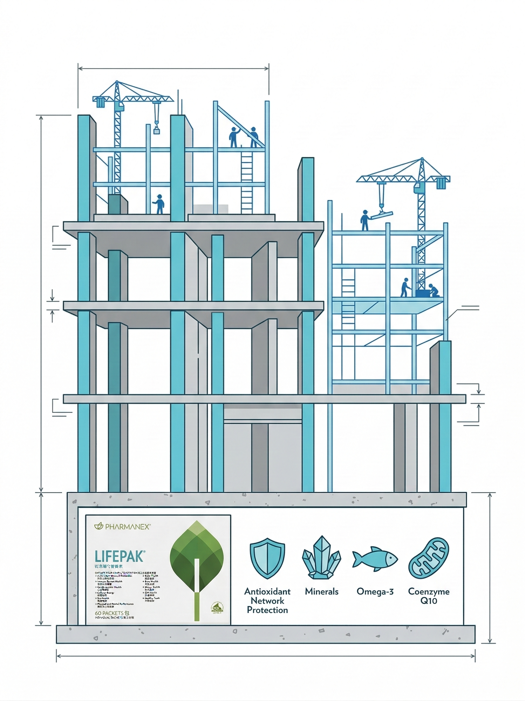
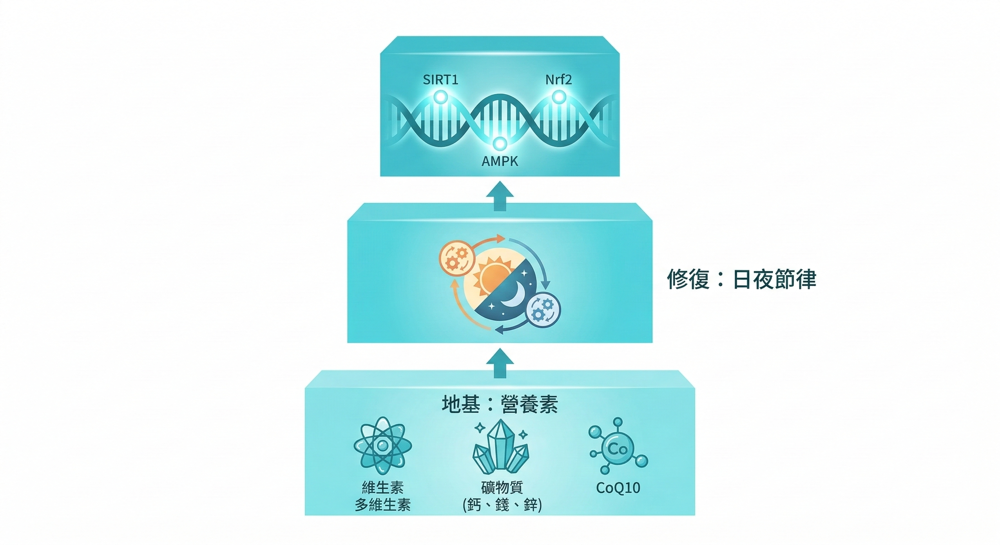
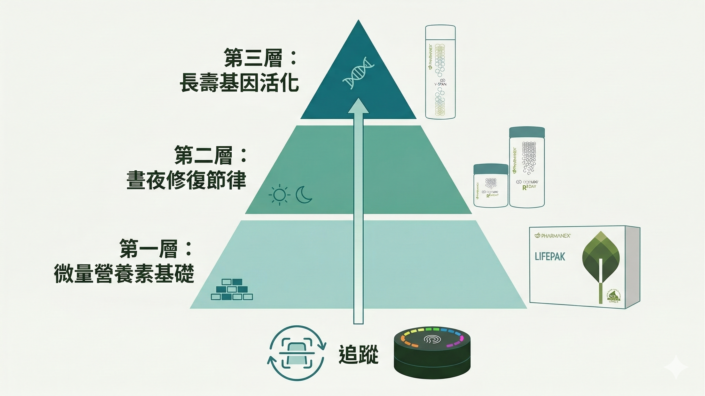

如果你今天來找我，說你想認真處理慢性發炎，我不會直接給你一張產品清單。

我會問你幾個問題。

- 你有多久沒有睡醒就精神好？

- 你的小毛病是新出現的，還是已經斷斷續續好幾年了？

- 你上次認真運動是什麼時候？

- 你有在吃任何保健品嗎，吃了多久？

這些問題的答案，決定了我建議的起點不一樣。

但如果我要給一個通用的邏輯——針對一個 30 - 50 歲、工作壓力大、身體開始出現各種小狀況的人——我的建議順序是這樣的。

---

## 第一層：地基

**在你做任何其他事之前，你的細胞需要有足夠的原料。**

很多人在還沒有打好基礎的情況下，就直接跳去吃針對特定機制的補充品。這就像在地基沒打好的房子上裝修——外表看起來沒問題，但下面是空的。

這個階段，你需要的是一個 **完整的微量營養素基礎**：抗氧化維生素、礦物質、Omega-3、輔酶Q10……你每天製造能量、修復細胞、對抗氧化壓力，全部都需要這些原料。

大多數人在這一層就已經不夠了。不是因為吃得差，而是因為現代食物的營養密度下降、加工食品的比例太高、外食的蔬菜來源不穩定。

LifePak 的角色是在這一層。它不是讓你感覺「立刻有效」的東西。它是讓你的細胞有足夠的原料可以工作。

建議的方式：至少先打3個月的地基，讓基礎微量營養素達到穩定水準，再往上疊加其他介入。



---

## 第二層：日夜修復節律

人體的修復不是隨機發生的。它有節律。

白天，你的細胞需要應對氧化壓力、維持能量代謝、對抗環境壓力。晚上，你進入深度睡眠時，細胞自噬啟動，受損蛋白質被清除，粒線體進行修復。

問題是，在慢性發炎的狀態下，這個節律被打亂了。白天的保護不夠，晚上的修復也不夠。

ageLOC R2 的設計邏輯對應了這一點：白天的 Day 配方支援細胞保護和能量代謝，夜晚的 Night 配方強化細胞自噬和深層修復。這不是行銷話術，這是對應了粒線體生物學裡「白天應對/夜晚修復」的基本機制。

如果你在地基已經打好的情況下，加入 R2，你在給細胞修復提供方向和效率。


---

## 第三層：基因層面的調校

前兩層處理的是「讓細胞正常運作」。第三層處理的是「讓細胞以更年輕的模式運作」。

這是 ageLOC YouthSpan 進入的位置。

YouthSpan 的設計框架是 **CRM（Caloric Restriction Mimetics，熱量限制模擬物）**。

研究顯示，適度減少熱量攝取可以延長多種生物的壽命，機制是啟動 SIRT1、AMPK 等長壽基因通路。CRM 的概念就是：用白藜蘆醇、槲皮素、蝦青素等植化素，在不挨餓的情況下模擬這個細胞信號——讓長壽基因的開關重新打開。

這一層不是「讓你今天感覺更好」。它是讓你的細胞老化速度慢下來的長期投資，至少需要 3-6 個月才能評估效果。

**為什麼放第三層？** 因為 SIRT1 和 AMPK 的啟動需要特定的輔因子，如果地基（第一層）還沒建好，這些通路就算被激活了，效率也會大打折扣。先把環境建好，長壽基因才有地方發揮。

> 如果你對老化的生物機制有興趣，我在另一篇深入說明了55%基因、45%可介入的科學邏輯：[為什麼有人40歲看起來35，有人40歲看起來50](/blog/biological-age-gap-youthspan)



---

## 整個邏輯的順序圖

```
第一層（地基）：LifePak
細胞有足夠的原料可以運作
        ↓
第二層（修復效率）：ageLOC R2
白天保護 + 夜晚自噬修復
        ↓
第三層（基因調校）：ageLOC YouthSpan
啟動長壽基因，模擬熱量限制效果
        ↓
監測工具：Prysm iO 類胡蘿蔔素掃描
確認你的氧化壓力狀態，追蹤是否在正確方向
```



---

## 幾個常見問題

**「我可以直接跳到第三層嗎？」**

可以，但效果會打折。如果你的基礎微量營養素嚴重不足，SIRT1 和 AMPK 的啟動效率就會受限，因為它們需要特定的輔因子。先把地基建好，再蓋樓。

**「這樣一個月要花多少錢？」**

這取決於你目前在哪一層，以及你身體的狀況。我不推薦「三層同時上」，除非你已經評估過自己的基準狀態。最省的方式，是先做掃描、先填清單，讓我了解你的起點，再討論哪一層對你現在最有意義。

**「要吃多久才有感覺？」**

地基層：1-3個月開始有感；修復層：4-8週睡眠品質通常會有改變；基因層：這是長期工程，3-6個月。

---

你不需要全部同時開始。你只需要知道你現在在哪裡，然後做第一步。

💬 [加LINE讓我了解你的狀況，一起決定你的起點](https://line.me/ti/p/@fer7932k)
