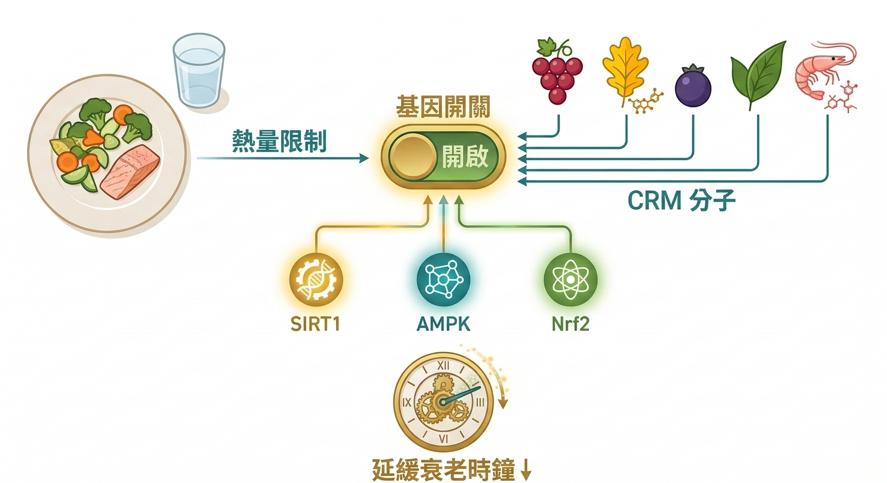
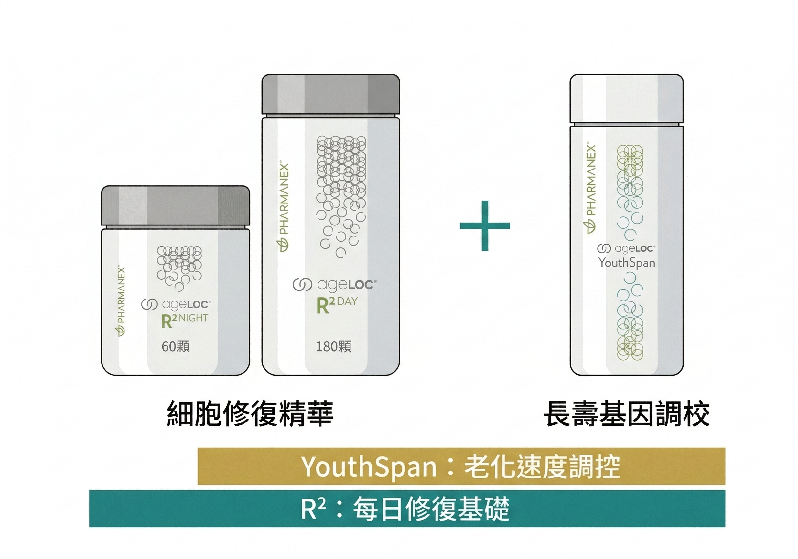

你一定有這個經驗。

同學會上，有人看起來和學生時代差不了多少，有人卻像老了15歲。

同樣的年紀，同樣在高壓環境下工作，但老化的速度明顯不同。

你說：「那是基因差異吧。」

部分正確。但只有部分。

---

## 55%基因，45%你能決定

2024年發表在《Science》的一項大型研究，追蹤了近3000名受試者，用蛋白質組學（proteomics）測量了數千個生物標記，試圖回答：人的老化速度，有多少是命中注定的？

結論是：**壽命和老化速度約有55%由遺傳決定，45%由非遺傳因素決定。**

55% 的基因你沒辦法改。但 45% 的空間，是你每天的選擇在填寫的。

更關鍵的發現是：老化不是線性的。研究顯示老化有兩個「加速期」——34 歲前後和 60 歲前後。

在這兩個時間點，身體的多個生物標記會同時快速惡化。

如果你現在 30 - 50 歲，你可能正好落在第一個加速期之後，或者還在窗口裡。

**這個窗口，是你介入最有效的時期。**

---

## 什麼在決定你的「生理年齡」

你的出生年齡是固定的。你的生理年齡是浮動的。

生理年齡（biological age）由多個維度決定，包括：

**端粒長度**：染色體末端的保護帽。每次細胞分裂，端粒就縮短一點。端粒短的人，細胞複製能力下降，老化加速。壓力、睡眠不足、慢性發炎，都會加速端粒消耗。

**粒線體效率**：你的細胞發電廠。粒線體功能下降，能量生產效率降低，細胞修復能力同步下降。這就是為什麼40歲以後的疲勞，和20歲的疲勞在本質上不一樣。

**慢性發炎指數（Inflammaging）**：2000年，義大利老化研究學者 Claudio Franceschi 提出「Inflammaging」概念——老化本身就是一種慢性低度發炎的累積過程。你的 hs-CRP、IL-6、TNF-α 這些發炎標記，和你的生理年齡高度相關。

**表觀遺傳時鐘（Epigenetic Clock）**：你的DNA序列不變，但基因的「表現方式」會因為環境和生活習慣而改變。Horvath 時鐘、GrimAge 時鐘，都是用甲基化模式來估算你的生理年齡。

這四個維度，沒有一個是你完全無法介入的。

---

## 長壽基因的開關：你可以切換它

你體內有一組基因，科學家稱之為「長壽基因」——包括 SIRT1、SIRT3、FOXO、AMPK 通路。

這些基因在年輕時自然活躍，維持細胞修復效率、對抗氧化壓力、管控細胞老化速度。隨著年齡增長，它們的表現量下降，老化就加速了。

但它們不是靜態的。它們有開關。

最有力的天然開關是 **熱量限制（Caloric Restriction）**：從1935年就開始有動物實驗顯示，適度減少熱量攝取可以延長壽命，機制之一就是重新啟動 SIRT1 和 AMPK。

但長期挨餓對現代人來說不現實。

這就是為什麼科學家開始研究 **CRM（Caloric Restriction Mimetics）**——用特定的植化素模擬熱量限制的細胞信號，在不挨餓的情況下激活這些長壽基因通路。

研究最充分的 CRM 成分包括：
- **白藜蘆醇（Resveratrol）**：SIRT1 的直接激活劑，在紅葡萄皮中含量最高，但食物攝取量遠不足以達到研究劑量
- **槲皮素（Quercetin）**：AMPK 激活、同時具有 Senolytic 清除衰老細胞的效果
- **花青素（Cyanidin-3-glucoside）**：Nrf2 通路激活，增強抗氧化酶系統
- **α-硫辛酸（Alpha-lipoic acid）**：同時作用於粒線體保護和 Nrf2 通路
- **蝦青素（Astaxanthin）**：目前已知最強的單分子抗氧化物，穿透力強，能保護粒線體膜

---

## ageLOC YouthSpan 的位置

Nu Skin 研究 ageLOC（anti-aging gene locator）技術超過20年，核心思路是：找出與老化最相關的基因表現模式，再用特定成分組合去影響它。

YouthSpan 的設計框架是 CRM。它的五種主要成分，在獨立研究中都被指向能影響 SIRT1、AMPK、Nrf2 等關鍵長壽通路。

我不會說「吃了就會返老還童」，那不是科學說的。

科學說的是：**這些成分有可能讓你的細胞老化速度放慢，讓「生理年齡」的時鐘走得比出生年齡慢一點。**

那個差距，就是 40 歲看起來 35 歲和看起來 50 歲之間的距離。

---

## YouthSpan + R2：兩個維度，才是完整的介入

很多人問我：YouthSpan 和 R2，要選哪個？

這個問題問錯了。它們不是選擇題，是兩個不同維度的介入。

**R2 的邏輯是日夜節律修復。**

你的身體有兩個主要任務，白天是「戰鬥」——應付壓力、代謝、工作消耗；晚上是「修復」——清除白天產生的氧化廢物、修復受損細胞、補充消耗的輔酶。

這兩件事需要不同的原料支撐。ageLOC R2 的日膠囊和夜膠囊，就是對應這個節律設計的：

- **日配方**：強化粒線體能量產生效率，讓你白天的代謝廢物不要積累過多
- **夜配方**：支援 SIRT3（粒線體長壽蛋白）和 Nrf2 的夜間修復活性，讓你睡著的時候細胞在正常運作

**YouthSpan 的邏輯是長期基因表現調校。**

CRM 機制的核心是透過 SIRT1、AMPK、Nrf2 通路，讓細胞老化速度放慢。但這個機制要發揮效果，有一個前提：**你的細胞必須每天都在正常修復，不能帶著昨天的損傷繼續運作。**

R2 保障的就是這個前提。

它們的關係是這樣的：

> R2 是每晚的細胞清潔工作，YouthSpan 是讓這些細胞的「老化時鐘」走慢一點。
> 少了 R2，YouthSpan 是在一個持續損耗的環境裡運作；少了 YouthSpan，R2 修復的細胞沒有長壽基因的保護，老化速度還是不會改變。

如果你現在只能選一個，根據年齡：**40歲前從 R2 開始打基礎；40歲後，兩個同時進行的效益最完整。**

---

## 一個合理的期待設定

YouthSpan 不是速效補充品。它不會讓你下週突然感覺年輕 10 歲。

它是一個長期投資——至少3個月才開始有感，6 個月才能真正評估是否在往正確方向走。

這也是為什麼我建議用 Prysm iO 建立基準，3 個月後再掃描一次——讓你有數字看到自己的抗氧化狀態是否改變了，而不是憑感覺猜。

最後一個問題值得你思考：

**你現在的生活方式，是在讓你的生理年齡走在出生年齡前面，還是後面？**

如果你不確定，那可能是時候建立一個基準點了。

---

## 既然是長期工程，這樣買才不虧

YouthSpan 需要至少 3 - 6 個月才能看到效果，這是科學機制決定的，沒有捷徑。

但長期吃不代表要長期花冤枉錢。Nu Skin 的 **enJoy 享回購計畫**，正好是為這種長期使用設計的。

**四個核心好處：**

**① 滿 2,000 元免運**（一般訂單要滿 4,000 才免運，enJoy 直接砍半門檻）

**② 6～10% 訂單回饋金，最多折抵訂單金額一半**
- 前 6 筆訂單享 6% 回饋
- 新朋友加碼：首 2 筆再享 6%（等於前兩次共 12%）
- 第 4 筆另有滿額加碼：滿 2,000 加碼 120 元、滿 4,000 加碼 240 元
- 第 7 筆起升金級，每筆享 10% 回饋，上限 NT$2,000

**③ 生日月大加碼**
- 銀級：出貨回饋 12%，最高回饋 2,400 元
- 金級：出貨回饋 20%，最高回饋 4,000 元

**④ 出貨 6 次升銀級 VIP、7 次升金級 VIP，享 VIP 商品最優惠價**

---

試算一個例子：新朋友從第一個月開始訂 YouthSpan，持續 7 個月（含一個生日月）：

- 前 2 筆共回饋約 12%
- 第 3-6 筆各 6%
- 生日月額外 12%
- 第 7 筆升金級，享 VIP 優惠價 + 10% 回饋

7 個月下來，累積回饋金加上 VIP 折扣，**實際等於讓你多拿到至少一個月份的產品費用**。

換句話說：**你選擇長期執行科學建議的補充計畫，Nu Skin 的機制就讓這件事越做越划算。**

想了解 enJOY 的詳細設定步驟，直接看[官方 enJoy 頁面](https://www.nuskin.com.tw/content/getting_started/enjoy-rewards.html)確認最新方案。

---

💬 [加LINE讓我了解你的狀況，我會在48小時內回覆](https://line.me/ti/p/@fer7932k)
