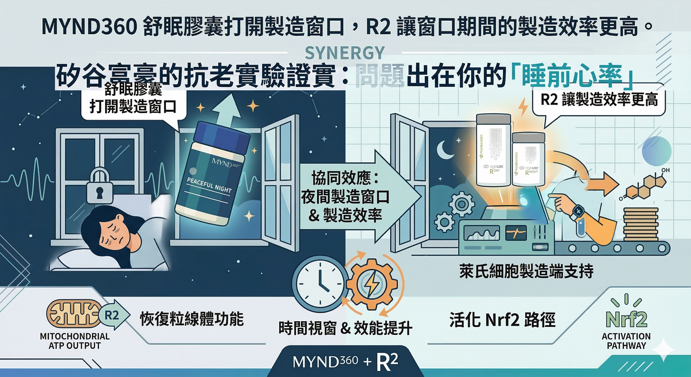

如果你已經讀過前面那篇關於睡眠與睪固酮的文章，你知道問題的結構了：

深眠縮短 → 睪固酮夜間製造窗口消失  
睡眠不足 → 皮質醇偏高 → 睪固酮合成進一步受抑

這篇要說的，是這些節點分別可以怎麼介入。

---

## 為什麼不是直接吃安眠藥就好

大多數安眠藥的邏輯是：強制神經系統安靜下來。

你是睡著了，但這種「睡著」和自然深眠是不同的——藥物誘導的睡眠在腦波結構上，慢波睡眠（深眠）的比例並不會增加，有時甚至會受到壓制。

而睪固酮分泌最集中的，正是深眠階段。

**你要的不是被敲昏，而是真正進入深眠、讓荷爾蒙節律正常運作的睡眠。**

這正是 MYND360 Peaceful Night 舒眠膠囊設計邏輯的出發點：三個成分，作用在入睡前的神經平靜、睡眠節律的自然恢復、以及睡眠期間的荷爾蒙保護三個不同環節。

---

## 那吃褪黑激素也可以

很多人睡不好會去吃褪黑激素，但褪黑激素只是給你『想睡的訊號』，如果你腦袋裡的皮質醇（壓力荷爾蒙）還是很高，你依然進不到製造睪固酮的『慢波睡眠』。

MYND360 Peaceful Night 舒眠膠囊的三個成分，解決的不是『讓你暈』，而是幫高壓的大腦『煞車』。

---

## 成分一：酪蛋白胜肽（Casein Peptide）

**針對的節點：神經系統平靜 × 入睡速度**

酪蛋白胜肽來自牛奶中的 αS1-酪蛋白（αS1-casein）經酵素水解後的產物，其中最具睡眠活性的成分是一個十肽（decapeptide）：**alpha-casozepine（α-CZP）**。

這個胜肽的機制，是透過與大腦中的* *GABA_A受體**結合而發揮作用。

GABA（γ-氨基丁酸）是中樞神經系統最主要的抑制性神經傳導物質——當 GABA_A 受體被活化，神經系統從清醒的高頻激活狀態切換到放鬆狀態，這是進入睡眠的前提條件。

alpha-casozepine 的結構類似苯二氮平類（benzodiazepine）藥物，但作用更溫和，不帶藥物的成癮性和宿醉感。

研究顯示，酪蛋白胜肽（以 Lactium® 商業化）可活化 GABA_A 受體的β1亞型，促進慢波睡眠的腦波活動——這正是深眠對應的腦電圖特徵。

一項針對 48 位有輕中度睡眠困擾韓國成人（平均年齡49歲）的雙盲隨機交叉臨床試驗，連續補充四週酪蛋白水解物，結果顯示入睡潛伏期縮短、睡眠效率提升，同時主觀睡眠品質評分改善——在調整了年齡和性別因素後效果仍然顯著。

一項整合多項人類臨床數據的跨國研究也顯示，補充 Lactium® 後** 80% 的受試者在一個月內對睡眠品質表示滿意**，壓力指數同步下降。

**酪蛋白胜肽的作用，是讓神經系統在睡前自然「鬆開」——不是強制關機，是讓入睡的條件成熟。**

---

## 成分二：番紅花萃取物（Saffron Extract）

**針對的節點：睡眠節律修復 × 萊氏細胞保護**

番紅花（Crocus sativus）的睡眠機制，和直接補充褪黑激素是不同的路徑。

色胺酸（Tryptophan）是褪黑激素合成的原料，但它同時也是皮質醇壓力路徑（犬尿胺酸路徑）競爭的底物。

當系統性發炎或慢性壓力偏高，色胺酸會被優先分流到壓力路徑，導致褪黑激素合成原料不足，睡眠節律失調。

番紅花萃取物的作用是 **抑制色胺酸往犬尿胺酸路徑的轉化**，讓更多色胺酸可用於褪黑激素合成。

這是幫助身體「恢復自然節律」，而不是從外部強制補充一個信號。

一項整合五項隨機對照試驗（379 位受試者）的系統回顧確認，番紅花萃取物對睡眠品質、入睡時間、睡眠持續時間的改善有顯著效果。

對中年男性更關鍵的是番紅花的第二條作用路徑：

2025年發表於《Journal of Ethnopharmacology》的研究顯示，番紅花萃取物透過 **PI3K-Akt-Nrf2信號路徑**，直接保護 **萊氏細胞（Leydig cells）**——睾固酮的製造工廠——對抗氧化壓力和老化誘導的細胞損傷，緩解中老年男性的睪固酮下降。

也就是說：番紅花同時在修復睡眠節律、又在保護睪固酮製造端的細胞。

---

## 成分三：山茶葉萃取物（Camellia sinensis Extract）

**針對的節點：焦慮抑制 × 睡前神經放鬆**

山茶葉（Camellia sinensis，即茶樹）萃取物中與睡眠最相關的活性成分，是 **L-茶胺酸（L-theanine）**。

L-茶胺酸是茶葉中獨有的非蛋白質胺基酸，在中樞神經系統的主要作用是：

- **拮抗谷氨酸（glutamate）受體**，降低神經過度興奮
- **促進 GABA 和血清素的合成**，增強抑制性神經傳導
- **增加 alpha 腦波活動**——alpha 波是清醒且放鬆、不焦慮的大腦狀態，是自然入睡前的腦電圖特徵

L-茶胺酸不會讓人昏昏欲睡（不像鎮靜劑），但它讓大腦從「高速運轉、停不下來」的狀態過渡到「放鬆清醒」的狀態，這個過渡是進入自然睡眠的必要條件。

一項包含 50 項隨機對照試驗的系統回顧與統合分析（2025年，*Nutrition Reviews*）確認，L-茶胺酸可改善睡眠品質相關的主觀評分，尤其對壓力相關的睡眠困擾效果更顯著。

在這個配方裡，山茶葉萃取物和酪蛋白胜肽的作用有互補關係：**酪蛋白胜肽作用在 GABA_A 受體端，山茶葉萃取物同時從谷氨酸拮抗和 GABA 促進兩端夾擊神經過度活化**——兩者共同建立入睡前的神經靜默條件。

---

## 臨床數據

如新針對 Peaceful Night 核心成分組合進行了**28天雙盲安慰劑對照臨床試驗**，對象是有自述睡眠困擾的健康成人：

- **89%** 的受試者報告起床時昏沉感減少
- **96%** 的受試者報告睡眠品質改善

這兩個數字的意義：昏沉感減少代表深眠品質提升（不是被強制敲昏，是真正睡好了）；睡眠品質改善代表主觀感受的整體提升，而不只是「睡著的時間」增加。

---

## 搭配 R2：從「環境修復」到「製造端強化」

MYND360 Peaceful Night 舒眠膠囊處理的是 **睡眠環境的修復**——讓夜間的睪固酮製造窗口恢復，讓皮質醇節律重新校準，讓神經系統在睡前有足夠的靜默空間進入深眠。

但如果萊氏細胞本身的功能已經因為年齡、氧化壓力、慢性發炎而衰退，單靠修復環境還不夠——**製造端本身也需要支持**。

這正是 ageLOC R2 介入的位置。

R2 的核心機制在於活化 **Nrf2 路徑**，提升細胞自身的抗氧化防禦能力，同時優化粒線體功能——萊氏細胞是粒線體密度極高的細胞，睪固酮的合成高度依賴粒線體的 ATP 供應。R2 透過清除細胞層級的氧化廢物、恢復粒線體效能，從製造端提升睪固酮的合成能力。

**兩個產品的作用節點不重疊：**

| | MYND360 舒眠膠囊 | ageLOC R2 |
|---|---|---|
| 主要作用 | 睡眠環境修復 | 細胞製造端強化 |
| 機制 | 深眠↑、皮質醇節律↓、睡前神經靜默↑ | Nrf2↑、粒線體效能↑、萊氏細胞功能↑ |
| 時間點 | 睡前1小時（1顆膠囊） | 白天（早晚各一份） |
| 針對問題 | 睡眠不足造成的 T 抑制 | 老化造成的製造端衰退 |

這個組合的邏輯：**舒眠膠囊打開製造窗口，R2 讓窗口期間的製造效率更高。**

---

## 使用方式

**MYND360 Peaceful Night 舒眠膠囊：**  
每日 1 次，每次 1 顆，睡前 1 小時服用（或有需求時）。非習慣性配方，不產生依賴。

**與 R2 搭配：**  
R2 早晨空腹一份（活化 Phase 1），睡前一份（清除 Phase 2）；舒眠膠囊在睡前 R2 之後同時服用即可，兩者不衝突。

---

## 適合考慮這個組合的人

- 40歲以上、睡眠品質明顯不如以往
- 睡了足夠時數但仍感疲倦、起床昏沉
- 睡前思緒無法靜下來、難以放鬆入睡
- 有精力下滑、肌肉恢復變慢、情緒調節變差的狀況
- 已在使用 R2 但希望從睡眠面向進一步優化

---

## 參考資料

01. Dela Peña IJI et al., 2016. [A tryptic hydrolysate from bovine milk αs1-casein enhances pentobarbital-induced sleep in mice via the GABAA receptor.](https://pubmed.ncbi.nlm.nih.gov/27401107/) *Behavioural Brain Research.* 313:184–190.
02. Kim HJ et al., 2019. [A double-blind, randomized, placebo-controlled crossover clinical study of the effects of alpha-s1 casein hydrolysate on sleep disturbance.](https://pmc.ncbi.nlm.nih.gov/articles/PMC6682925/) *Nutrients.* 11(7):1466.
03. Lim SE et al., 2024. [Dietary supplementation with Lactium and L-theanine alleviates sleep disturbance in adults: a double-blind, randomized, placebo-controlled clinical study.](https://www.frontiersin.org/journals/nutrition/articles/10.3389/fnut.2024.1419978/full) *Frontiers in Nutrition.* 11:1419978.
04. Esposito MR et al., 2023. [Effects of supplementation with the standardized extract of saffron (affron®) on the kynurenine pathway and melatonin synthesis in rats.](https://www.mdpi.com/2076-3921/12/8/1619) *Antioxidants.* 12(8):1619.
05. Lv M et al., 2025. [Saffron extract alleviates D-gal-induced late-onset hypogonadism by activating the PI3K-Akt-Nrf2 signaling pathway.](https://pubmed.ncbi.nlm.nih.gov/39710157/) *Journal of Ethnopharmacology.*
06. Payne ER et al., 2025. [Effects of Tea (Camellia sinensis) or its Bioactive Compounds l-Theanine or l-Theanine plus Caffeine on Cognition, Sleep, and Mood in Healthy Participants: A Systematic Review and Meta-Analysis of Randomized Controlled Trials.](https://academic.oup.com/nutritionreviews/article/83/10/1873/8123998) *Nutrition Reviews.* 83(10):1873–1891.
07. Nu Skin Enterprises, 2024. [Nu Skin Introduces MYND360™.](https://www.businesswire.com/news/home/20241015775027/en/) *Business Wire.*
