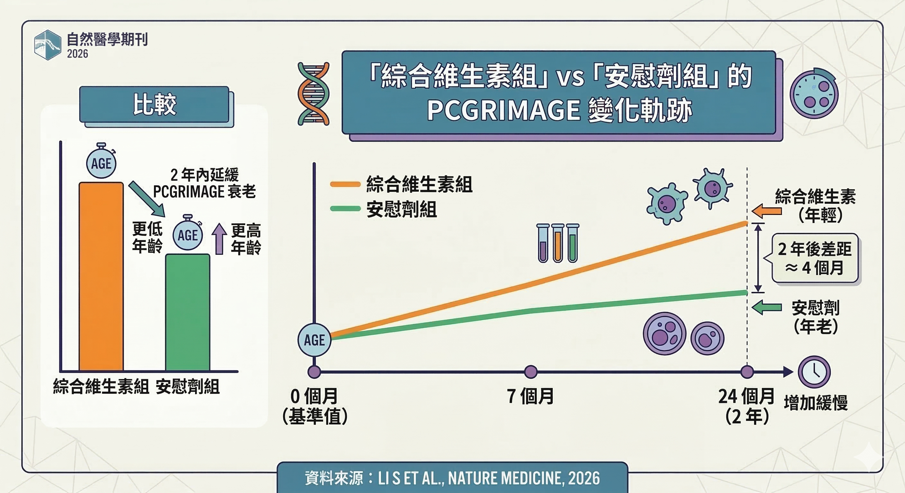
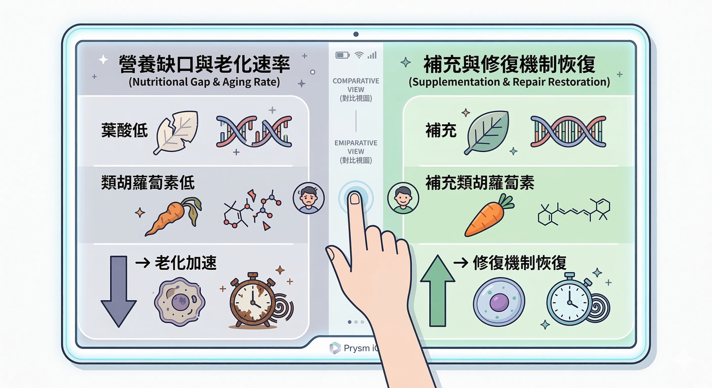

很多人每天吃綜合維生素，心裡其實都有同一個問題：

**這到底只是吃心安，還是真的對身體有幫助？**

2026年3月，刊登在 *Nature Medicine* 的一項研究，給了一個值得認真看待的新答案。

研究發現，對年長者來說，每天補充綜合維生素，可能讓身體的生物老化速度變慢一點。

研究團隊把這個變化換算後，約等於 **2 年內少了 4 個月的生物老化**。

這不是「吃了就回春」。但它告訴我們一件事：

**補充品可能不只是補安心，它對身體內在老化節奏，可能有實質影響。**

---

## 你的身體「幾歲」，不是你出生年份說了算

先解釋一個概念。

你的戶籍年齡記的是你出生了幾年，但你的細胞不讀戶籍。

細胞老化的速度，由 **DNA 甲基化模式（DNA methylation）** 決定。

隨著年齡增長 DNA 上特定位點的甲基化程度會以可預測的方式改變，這些改變可以被測量，換算成一個數字，你的「生物年齡」。

這就是**表觀遺傳老化時鐘（epigenetic aging clock）**。

它的意義不只是好奇心。研究顯示，生物年齡比戶籍年齡更能預測全因死亡率、慢性病風險、和認知功能衰退。

兩個同樣 50 歲的人，表觀遺傳時鐘測出的生物年齡可能差到 10 歲以上。

那個差距才是他們身體真正的狀態。（關於[生物年齡的測量方法](/blog/precision-health-tools/biological-age-measurement/)，這篇有完整說明。）

---

## 這篇研究在做什麼

這是 COSMOS 臨床試驗的延伸分析。COSMOS 是一個超過 21,000 人參與的大規模隨機雙盲安慰劑對照試驗（RCT），由哈佛大學與麻省總醫院主導。

這次的表觀遺傳分析，從中抽取了 **958 名受試者**：

- 男性 60 歲以上、女性 65 歲以上，平均年齡 **70 歲**
- 追蹤 **2 年**，分別在基線、第一年、第二年抽血
- 四組設計：綜合維生素、可可萃取物、兩者皆有、雙安慰劑

研究人員測量了五個表觀遺傳時鐘：

| 時鐘 | 世代 | 訓練目標 |
|---|---|---|
| PCHorvath | 第一代 | 生理年齡 |
| PCHannum | 第一代 | 生理年齡 |
| PCPhenoAge | **第二代** | **死亡率與老化表現型** |
| PCGrimAge | **第二代** | **全因死亡率** |
| DunedinPACE | 第三代 | 老化速率 |

---

## 結果：數字說了什麼

與安慰劑組相比，每日服用綜合維生素組，在兩個第二代時鐘上出現顯著差異：

- **PCGrimAge**：每年少老 0.113 歲（p=0.017）
- **PCPhenoAge**：每年少老 0.214 歲（p=0.032）

2 年累積，相當於生物老化軌跡比安慰劑組慢約 **4 個月**。

三個值得特別注意的細節：

**1. 有效的是第二代時鐘，不是所有時鐘**

第一代（Horvath、Hannum）和第三代（DunedinPACE）沒有達到統計顯著性。

第二代時鐘的意義更重要。它們改變了，代表的不只是「你看起來幾歲」，而是「你的死亡風險曲線正在移動」。

這個選擇有獨立的科學依據。

2025 年 *Nature Communications* 發表了迄今最大規模的老化時鐘比較研究，橫跨 14 種表觀遺傳時鐘、追蹤 174 種疾病結果。

結論顯示：PhenoAge 與 GrimAge 對疾病風險的預測能力全面地優於第一代時鐘。

這也解釋了為什麼 COSMOS 研究裡，變化最清楚的恰好是這兩個，它們離真實的健康結果，比其他時鐘更近。

**2. 基線生物年齡越大，效果越明顯**

基線時生物年齡已超前於實際年齡的受試者，PCGrimAge 的改善效果（−0.236）遠大於生物年齡正常者（−0.013），兩組交互作用達統計顯著（p=0.041）。

如果你的細胞已在透支，補充帶來的修復空間更大。

**3. 可可萃取物完全無效**

每日 500 mg 可可黃烷醇對五個時鐘均無顯著影響。

同一個試驗，兩種介入，結果分岔。說明不是設計問題，是路徑不同。

---

## 不只是老化時鐘：大腦也有數據

COSMOS 試驗不只有表觀遺傳的數據。同一批受試者的認知功能分析也顯示：

- 每日服用綜合維生素的老年人，全腦認知老化速度 **減緩了約 60%**
- 這個保護效果相當於讓大腦的認知狀態比實際年齡 **年輕約 2 歲**
- 對片段記憶（Episodic Memory）的保護效果最為顯著

生物年齡和認知功能，兩個方向的數據方向一致。

---

## 為什麼「那些人」效果特別大？

研究人員在數據裡找到了一個規律：

加速老化的受試者，基線時 **葉酸（folate）、葉黃素（lutein）和類胡蘿蔔素（carotenoids）** 的血中濃度明顯偏低。

服用綜合維生素後這些數值上升，而這群人也是改善最顯著的子群。（[為什麼即使吃蔬菜，細胞拿到的類胡蘿蔔素可能比你以為的少？這篇解釋了原因。](/blog/body-signals/carotenoid-cell-absorption/)）

這提供了一個合理的機制解釋：

不是吃了就變年輕，是 **填補了讓細胞提前老化的營養缺口**。

葉酸、維生素 B₁₂ 等甲基化輔因子，是維持 DNA 甲基化模式穩定的關鍵。

長期輕度缺乏，會讓表觀遺傳的維護出現偏差，加速熵增。

類胡蘿蔔素則構成抗氧化防禦網路，保護 DNA 免於氧化損傷。

當這兩個缺口被填補，細胞的修復機制才能在正常效率下運作。

---

## 不同干預方式的效果對比

| 干預方式 | 主要成分 | 老化指標變化 | 備註 |
|---|---|---|---|
| 基礎綜合維生素 | 藥妝店等級 Centrum Silver | 每年慢老約 0.1–0.2 歲 | 門檻低、適合長期補缺口 |
| Omega-3 + 維生素 D + 運動 | DO-HEALTH 試驗設計 | Omega-3 單獨對新型時鐘有小幅放緩；三者合併效果略有疊加，約等於慢老數個月 | 2025年 *Nature Aging* RCT，777 名老年人，追蹤 3 年 |
| 高階複合配方 | 含 Omega-3、D、C、植萃（LifePak 邏輯）| 高風險群有顯著改善空間 | 更全面的細胞層級支持 |
| 系統性生活干預 | 高營養飲食＋運動＋睡眠＋減壓 | 8週內生物年齡年輕約 3.23 歲 | 效果最強，但執行門檻高 |

---

## LifePak 和這項研究的關係

這裡要先講清楚：

**這篇研究測試的產品不是 LifePak，是 Centrum Silver。**

我不能直接說「研究證明 LifePak 能讓表觀遺傳時鐘放緩」。這樣寫不精準也不負責任。

但這篇研究確實讓以 LifePak 為代表的多營養素配方更值得被認真討論。

原因很簡單：LifePak 的核心邏輯是 **綜合性補充**——多種維生素、礦物質、類胡蘿蔔素複合物（β-胡蘿蔔素、茄紅素、葉黃素）、甲基化葉酸、鋅與硒（DNA 修復酶輔因子）、多酚類。（[LifePak 的配方邏輯詳細說明在這篇。](/blog/intervention-optimization/lifepak-foundation-nutrition/)）

COSMOS 研究的機制指向「類胡蘿蔔素和葉酸缺口是加速老化的關鍵因子」。LifePak 在這兩個面向的覆蓋，超過 Centrum Silver 的基本配方。

從機制推論：如果一個更基礎的配方，可以讓 PCGrimAge 每年慢老 0.113 歲，那麼對於本來就有類胡蘿蔔素缺口的人，覆蓋度更完整的配方，修復空間理論上更大。

這需要直接的臨床試驗驗證。COSMOS 的研究者也這樣說：**這是個開頭，不是結論。**

---

## 這篇研究的限制，你應該知道

**受試者主要是 70 歲以上的美國老年人，89% 為白人。** 還不能直接外推到 40–50 歲的亞洲族群，需要謹慎評估。

**4 個月的差異，臨床意義仍不確定。** 表觀遺傳時鐘改變和實際疾病風險之間的因果關係，還在建立中。

**效果主要出現在有缺口的人身上。** 飲食已很均衡、血中微量營養素正常的人，這篇研究支持的效果有限。

哥倫比亞大學流行病學家、DunedinPACE 時鐘發明者 Daniel Belsky 在同期評論中提到：表觀遺傳時鐘是評估綜合維生素類介入的理想終點，因為這類補充品本來就不是針對單一疾病，是系統性影響多個老化相關路徑。

更值得留意的是，2026 年 *EBioMedicine* 的一篇編輯評論也直接點出：這些老化時鐘雖然前景可期，但距離成為臨床診斷工具仍有一段距離。

科學家還在努力釐清，當時鐘的指針移動時，背後對應的生理變化究竟是什麼。換句話說，時鐘能測，測了能解讀，但測了之後能精準介入，這條路，仍在鋪設中。

補充品的問題從來不是「有沒有效」，是 **對誰、在什麼基礎上、有多大幅度**。

---

## 給你的結論

這篇研究不是告訴你「去買綜合維生素」。

它告訴你的是：**如果你的細胞在提前透支，填補那個缺口有科學依據。而要知道你有沒有缺口，你需要看數據，不是猜。**

COSMOS 研究裡「缺口最大的人效果最好」，指的就是類胡蘿蔔素和葉酸這類數值。

Prysm iO 光學掃描測的正是你皮膚的類胡蘿蔔素儲量，配合健檢報告的血液指標，才能知道你的補充是在填洞，還是在淋雨傘。

**抗老不一定要從複雜開始。先知道自己的缺口在哪裡，才知道從哪裡補。**

--

## 延伸閱讀

這篇文章涉及幾個背景概念，如果你想深入理解，可以從這幾篇繼續：

- [**你的身體幾歲了？——衰老可以測量嗎？2026版**](/blog/precision-health-tools/biological-age-measurement/)
  生物年齡的測量方法全覽，從表觀遺傳時鐘到居家可用的方式，這篇打底。

- [**你每天有夠吃蔬菜嗎？你的細胞拿到的可能比你以為的少很多**](/blog/body-signals/carotenoid-cell-absorption/)
  COSMOS 研究指向「類胡蘿蔔素缺口」是加速老化的關鍵因子。這篇說清楚為什麼吃夠蔬菜跟細胞真正拿到多少是兩回事。

- [**LifePak：在啟動修護基因之前，你需要補地基打底**](/blog/intervention-optimization/lifepak-foundation-nutrition/)
  LifePak 的配方邏輯和這篇研究的機制路徑高度重疊，這篇說清楚它的設計思路。

- [**抗慢性發炎就是在抗老化——這不是廣告詞，這是2000年就確立的科學**](/blog/chronic-inflammation/anti-inflammation-anti-aging/)
  表觀遺傳老化和慢性發炎共享同一條底層機制路徑，這篇是上層概念的連結。

---

## 參考資料

01. Li S, et al., 2026. [Effects of daily multivitamin–multimineral and cocoa extract supplementation on epigenetic aging clocks in the COSMOS randomized clinical trial.](https://pubmed.ncbi.nlm.nih.gov/41803341/) *Nature Medicine.* 32(3):1012-1022.
02. Cami N Christopheret, et al., 2026. [Effects of Randomized Multivitamin Supplementation on Carotenoids and α-Tocopherol in the COcoa Supplement and Multivitamin Outcomes Study.](https://pubmed.ncbi.nlm.nih.gov/41587736/) *J Acad Nutr Diet. *  126(5):156299.
03. Belsky DW, Ryan CP, 2026. [A daily multivitamin slows the ticking of epigenetic clocks.](https://pubmed.ncbi.nlm.nih.gov/41803340/) *Nature Medicine.* 32(3):810-811.
04. Harvard Gazette. [Daily multivitamin may slow biological aging.](https://news.harvard.edu/gazette/story/2026/03/daily-multivitamin-may-slow-biological-aging/) Published March 9, 2026. 
04. Mass General Brigham. [COSMOS Trial Results Show Daily Multivitamin Use May Slow Biological Aging.](https://www.massgeneralbrigham.org/en/about/newsroom/press-releases/daily-multivitamin-use-may-slow-aging) Published March 9, 2026.
05. Bischoff-Ferrari HA, Gängler S, Wieczorek M, et al., 2025. [Individual and additive effects of vitamin D, omega-3 and exercise on DNA methylation clocks of biological aging in older adults from the DO-HEALTH trial.](https://pubmed.ncbi.nlm.nih.gov/39900648/) *Nat Aging.* 5(3):376-385.
06. Mavrommatis C, Belsky DW, Ying K, et al., 2025. [An unbiased comparison of 14 epigenetic clocks in relation to 174 incident disease outcomes.](https://pubmed.ncbi.nlm.nih.gov/41402269/) *Nat Commun.* 16(1):11164.
07. EBioMedicine Editorial, 2026. [Epigenetic clocks: advancing biological age measures towards meaningful clinical use.](https://pubmed.ncbi.nlm.nih.gov/41688162/) *EBioMedicine.* 124:106175.
08. Chirag M Vyas, et al., 2024. [Effect of multivitamin-mineral supplementation versus placebo on cognitive function: results from the clinic subcohort of the COcoa Supplement and Multivitamin Outcomes Study (COSMOS) randomized clinical trial and meta-analysis of 3 cognitive studies within COSMOS.](https://pubmed.ncbi.nlm.nih.gov/38244989/) *Am J Clin Nutr.* 119(3):692-701.
---

