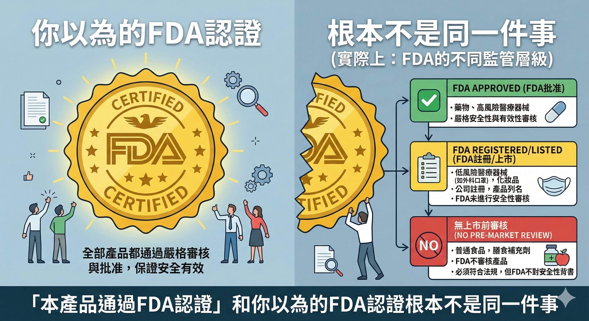
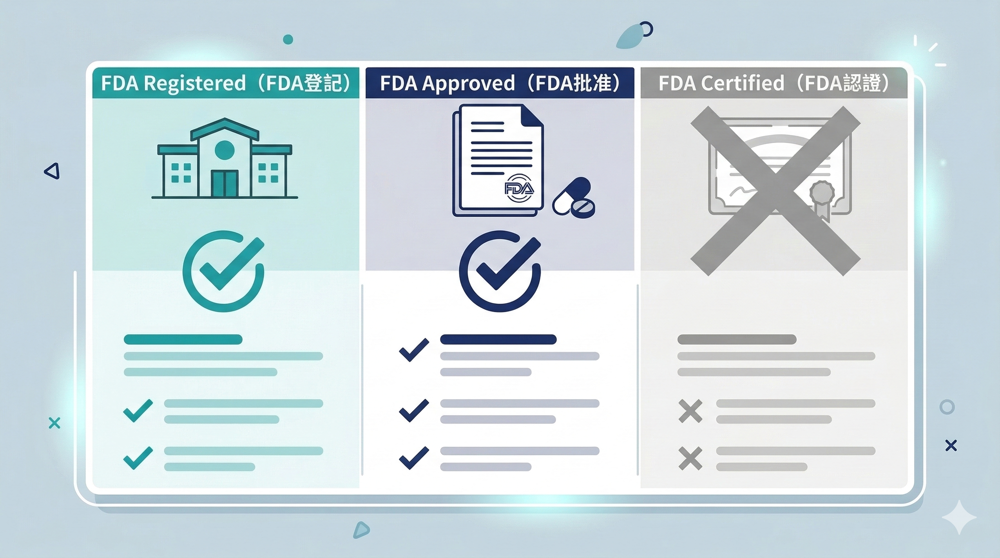

你在選保健品的時候，看到「通過FDA認證」或「FDA Approved」這幾個字，會不會多一點信心？

大多數人會。

問題是：**FDA根本不認證保健品。**

這不是在說廠商造假——有些廠商說的是真話，只是他們說的「FDA認證」和你以為的「FDA認證」，根本不是同一件事。

FDA自己的官網也為此發布過一篇文章：*Is It Really 'FDA Approved?'*——專門糾正這個被反覆誤用的說法。

---

## 1994年的一個法案，改變了一切

美國1994年通過的《膳食補充劑健康與教育法》（DSHEA），把保健品在法律上定義為「食品」的一個子類別，不是藥品。

這個分類的實際意義是：**業者只要符合 GMP 生產條件和 FDA 的標示用語規範，就可以把產品上架販賣。**

廠商不需要在上市前向 FDA 提交有效性證據，在很多情況下甚至不需要通知 FD A就可以開始銷售。

DSHEA同時規定，保健品包裝上必須加註以下兩條免責聲明：

> 「此宣稱未經 FDA 評估通過。」（This statement has not been evaluated by the FDA.）

> 「本產品不得用來診斷、處理、治療或預防任何疾病。」（This product is not intended to diagnose, treat, cure or prevent any disease.）

你有沒有在某些保健品包裝上看過這兩行小字？現在你知道它為什麼存在了。

---

## FDA對保健品實際做了什麼

FDA 對保健品的角色，主要從產品進入市場 **之後**才開始：

定期檢查製造設施是否符合 GMP 規範、審查產品標示是否違規（例如宣稱能治療疾病）、監控不良反應報告，以及在有問題時採取執法行動——包括罰款和強制下架。

換句話說，FDA 扮演的是 **事後監管**的角色，不是事前審查。

這個機制的問題在於效率——歷史上曾有案例顯示，FDA 從發現問題到完成召回，有時需要數年時間。

DSHEA 法案實施至今已超過 30 年，膳食補充劑市場的規模成長遠遠超過當初法規設計的預期。

摻假和假冒產品持續增加，包括標籤上未標明的藥物成分、誤導性健康聲稱和其他安全風險。

2019年，FDA 局長 Scott Gottlieb 發布聲明，表示將頒布強制性膳食補充劑產品清單，加強監管力度——FDA自己也承認現行框架有漏洞。

---

## FDA 有管的一件事：原料的 GRAS 認證

雖然 FDA 不監管保健品的成品，但對各種補充品的 **原料**是有管理的。

FDA針對食品原料建立了GRAS（Generally Recognized As Safe）安全性認證資料庫。

要通過 GRAS 認證，一個原料必須有足夠的人體臨床安全性證明。

通過後，FDA 將該物質加入 GRAS 資料庫，代表這個原料在正常使用條件下被認定為安全。

這是 FDA 在保健品領域裡少數進行實質審查的環節——但GRAS認證說的是「安全」，同樣不是在說「有效」。

---

## FDA Registered、FDA Approved、FDA Certified——三件不同的事

這三個說法在市場上經常被混用，但意思完全不同：

**FDA Registered（FDA登記）**——美國法規要求製造或銷售食品和保健品的設施在FDA官網登記。登記不等於審查，任何符合基本條件的設施都可以登記。這是一個行政程序，不是品質認證。

**FDA Approved（FDA批准）**——這個用語在法律上專屬於 **藥品和生物製劑**的上市核可，是FDA審查完整的安全性和有效性數據後的正式批准。保健品沒有這個。廠商把「FDA Approved」用在保健品上，在法律上是誤導性聲明。

**FDA Certified（FDA認證）**——這個說法根本不存在於 FDA 的官方用語體系。FDA是執法聯邦機構，不是認證服務機構。

所以當你看到保健品聲稱「FDA認證」或「FDA Approved」，這句話要嘛是在誤導你，要嘛說的其實是「我們的工廠完成了FDA登記」——這是兩件完全不同的事。

---

## 台灣的情況：TFDA 與小綠人標章

台灣有自己的食品藥物管理署（TFDA），對保健食品的管理和美國 FDA 有所不同。

台灣的「健康食品認證」（俗稱小綠人標章）是真實存在的產品認證——廠商必須向 TFDA 提交科學證據，證明產品對特定保健功效有實質幫助，通過審查後才能使用這個標章。

如果你在台灣選保健品，**小綠人標章的意義遠比「FDA認證」更明確**——前者是台灣政府實際審查過產品功效的，後者在大多數情況下是一個被誤用的說法。

---

## 那什麼樣的第三方認證真正有意義？

既然 FDA不認證產品，什麼認證值得參考？

**NSF International認證**——非營利的第三方機構，對產品成分、含量準確性、污染物進行獨立檢測，也對製造設施進行GMP審核。NSF的 GMP 認證是保健品製造領域最嚴格的第三方標準之一。

**USP（美國藥典）認證**——確認產品成分在體內能在適當時間溶解吸收、成分含量與標示相符、不含有害污染物。

這兩個認證的共同點：獨立的第三方、對產品本身進行檢測、有明確的審查標準——這才是真正的第三方品質驗證。

---

## 一個快速的辨別方法

下次看到任何保健品聲稱「FDA認證」，問一個問題：

**FDA認證的是什麼——產品？原料？還是工廠登記？**

如果廠商說得清楚，這是有意義的聲明，值得參考。

如果廠商只是籠統地說「通過FDA認證」而無法具體說明，這句話在利用你對FDA的信任感，但沒有任何產品層面的認證意義。

知道怎麼問問題，比相信任何一個標籤更重要。

---

如果你想知道你目前在補的產品通過了哪些有意義的認證——

**加我 LINE，我幫你看。**

👉 [加LINE諮詢](https://line.me/ti/p/@fer7932k)

---

**延伸閱讀：**
- [那些讓你點頭的保健品話術，你聽過哪些？](/blog/precision-health-tools/那些讓你點頭的保健品話術，你聽過哪些？/) ← 話術篇
- [提出 SGS 檢驗報告合格就能代表販售商品有效嗎？](/blog/precision-health-tools/提出-SGS-檢驗報告合格就能代表販售商品有效嗎？/) ← SGS篇
- [為什麼 Nu Skin 敢說他們以製藥的標準來開發營養補充品？](/blog/precision-health-tools/為什麼-Nu-Skin-敢說他們以製藥的標準來開發營養補充品？/) ← Nu Skin標準篇

---

## 參考資料

01. U.S. Food and Drug Administration. [Questions and Answers on Dietary Supplements.](https://www.fda.gov/food/information-consumers-using-dietary-supplements/questions-and-answers-dietary-supplements)
02. U.S. Food and Drug Administration. [FDA 101: Dietary Supplements.](https://www.fda.gov/consumers/consumer-updates/fda-101-dietary-supplements)
03. U.S. Food and Drug Administration. [Is It Really 'FDA Approved?'](https://www.fda.gov/consumers/consumer-updates/it-really-fda-approved)
04. Dietary Supplement Health and Education Act of 1994, Public Law 103-417, 103rd Congress.
05. Pieter A Cohen, 2015. [Too Little, Too Late: Ineffective Regulation of Dietary Supplements in the United States.](https://pmc.ncbi.nlm.nih.gov/articles/PMC4330859/) *JAMA Intern Med.*
