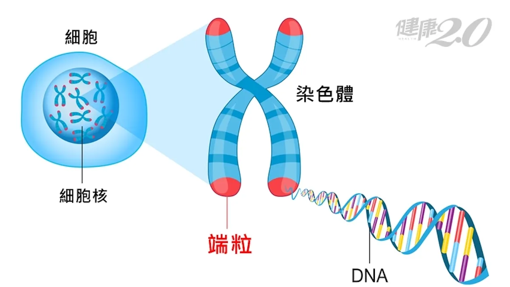
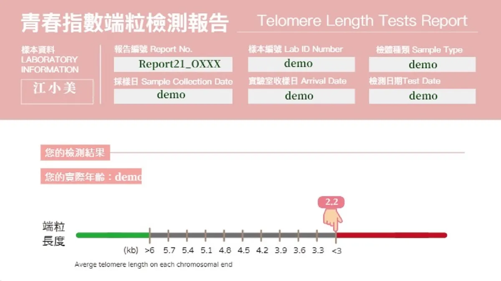
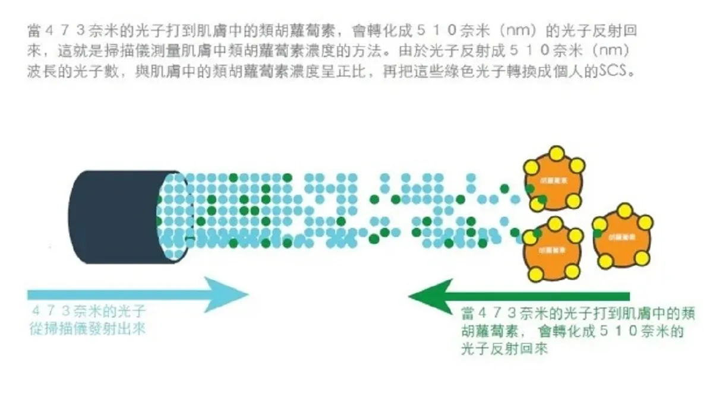
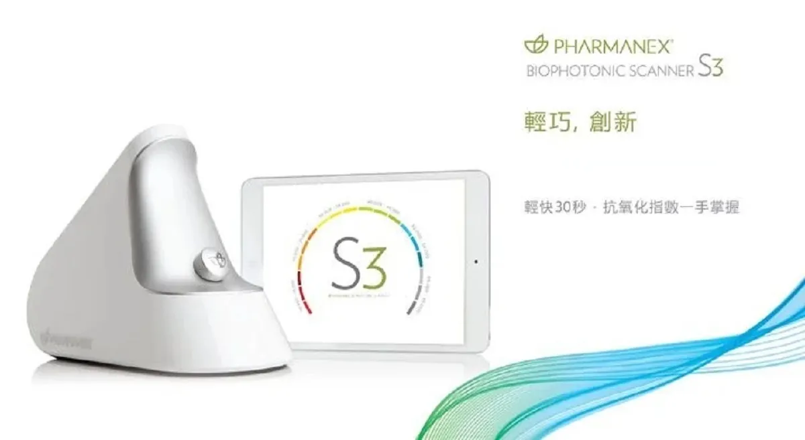
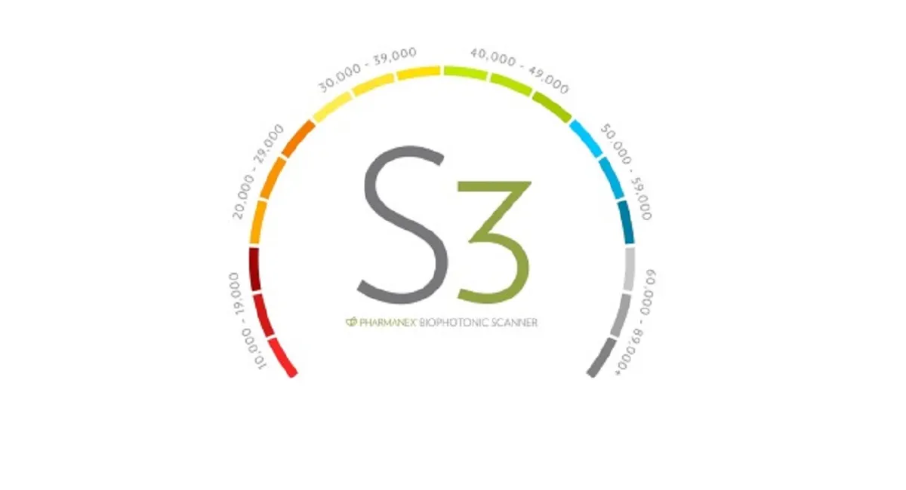

一個人有多老？當然我們可以從對方的**時間年齡** （Chronological Age）知道他「活著」的時間，但是無法知道他身體內部的老化狀況，也就是所謂的**生物年齡** （Biological Age）。

成大醫院老年醫學科主任張家銘醫師表示，一個人從 30 歲以後，身體大部份器官系統的功能，會以每年下降 0.8 ∼ 1 ％的速度衰退，如皮膚變乾、精神變差、失眠淺眠、體力大不如前等等。

我們必須透過身體檢查才可以得知一個生物個體衰老的程度。

不過**測體重有體重計** ，**測血壓也有血壓計** 。

那衰老程度有什麼儀器可測？那又怎麼知道自己現在抗衰老能力如何？

---

##  方法一、端粒指數檢測

二十世紀初法國醫生**亞歷克西．卡雷爾** （Alexis Carrel）在研究細胞的時候發現，只要環境與營養適當，細胞就可以不斷的生長與繁殖，因此推論生命其實是可以無限延伸的；

不過後來科學家**李奧納多．海佛烈克** （Leonard Hayflick）與**保羅．穆爾黑德** （Paul Moorhead）推翻了卡雷爾的假說，實驗證明細胞分裂是有其極限，細胞大約會複製分裂 40 到 60 次然後就會進入休止期，並不會無限延伸。

此研究結果確立了著名的**海佛烈克極限** （Hayflick limit）。對人體細胞而言，人體細胞相當於每 2.5 年更新一代，在適當的培養條件下平均可複製分裂 50 代，每一代相當於 2.5 年， 據此推論人的平均壽命應為 2.5 × 50 = 125 歲。

近年來因為細胞分子生物學的躍進，發現細胞染色體兩端的**端粒** （Telomere）長度決定了細胞可以複製的次數，更進一步解釋了海佛烈克極限的原因。

研究顯示人體染色體末端有一段重複序列（TTAGGG）—稱為端粒與細胞老化息息相關，其主要功能是保護染色體維持細胞的運作。

端粒會隨著時間減短，當短到一個程度的時候細胞就會停止複製，故通過端粒長度的測量就可以來顯示生物年齡。而現在可以診所抽血來使**聚合酶連鎖反應** （Polymerase Chain Reaction，PCR）的方法，去進行端粒長度的計算並推估真實細胞的端粒長度接近哪一個年齡。

這裡以「先見基因科技公司」做例子，檢查完會給一份報告，告訴您現在端粒的狀況，以及可以改進的地方。

---

## 方法二、抗氧化壓力抽血檢驗套組

此外，長期以來科學家也認為高活性的自由基分子會傷害細胞並逐漸破壞組織和器官的功能，進而導致老化。如果你想抗衰老，那第一步就是抗氧化。

目前醫院有一套「抗氧化壓力抽血檢驗套組」可以檢查個人的抗氧化能力，套組內每個檢查方法與原理如下：

### 血漿總和抗氧化能力檢驗（Plasma Total Anti-oxidative Capacity，TAC）

採用的是**鐵離子還原／ 抗氧化力分析法** （Ferric Reducing Ability of Plasma 或稱 Ferric ion Reducing Antioxidant Power ， FRAP ）。

原理是在低 pH 條件下利用含氮雜環螯合劑 TPTZ（2,4,6-Tris（2-pyridyl）-_s_ -triazine）與三價鐵離子（Fe3+）形成黃色的錯合物（Fe3+-TPTZ），在抗氧化劑存在下，將快速還原成藍紫色的二價鐵離子（Fe2+）錯合物（Fe2+-TPTZ），並可於波長 593 nm 偵測吸光度。

同時提供了抗氧化物 Trolox （6-Hydroxy-2,5,7,8-tetramethylchromane-2-carboxylic acid）作為對照組。 Trolox 是一種維生素 E 的類似物，水溶性較好，抗氧化能力和維生素 E 相近。

測量**血漿中非酵素類抗氧化物總體** 還原三價鐵離子的抗氧化能力，這比單獨測量某一抗氧化物更能反應全身抗氧化的能力。**檢驗值越高表示總體的抗氧化能力越好。**

### 血液麩胱甘肽過氧化酵素檢驗（Blood Glutathione Peroxidase，GPx）

**麩胱甘肽** （Glutathione，GSH）是由 3 種氨基酸—**麩胺酸** （Glutamine）、**半胱胺酸** （Cysteine）及**甘胺酸** （Glycine）所組成的小分子蛋白質，具有抗氧化之作用，可幫助人體細胞對抗自由基。

利用**氧化氫** （H2O2）為**受質** （Substrate），還原態**麩胱甘肽** 經由**麩胱甘肽過氧化酶** （Glutathione Peroxidase，GSH-Px 或 GPx）之催化下可將過氧化氫還原，而還原態的麩胱甘肽則變成氧化態的麩胱甘肽，然後氧化態的麩胱甘肽則利用**麩胱甘肽還原酶** （Glutathione Reductase，GRx）與**菸鹼醯胺腺嘌呤二核苷酸磷酸** （Nicotinamide Adenine Dinucleotide Phosphate， NADPH）將其還原回還原態的麩胱甘肽，並可於波長 340 nm 偵測吸光度。

透過計算 NADPH 減少的速率，間接求出麩胱甘肽過氧化酶的活性，檢驗值越高表示抗氧化保護能力越好。

### DNA損傷指數

**8-氫氧基2′-去氧鳥糞嘌呤核糖** （8-Hydroxy-2-deoxyguanosine，8-OHdG）是**鳥糞嘌呤** （Guanine）受到氫氧自由基攻擊的產物，透過**液相層析質譜儀** （Liquid Chromatography–Mass Spectrometry，LC-MS）來檢測尿液中或者是血液中的 8-OHdG 含量可以評定人體DNA受到氧化壓力的程度，檢驗值越高表示體內DNA被氧化傷害越嚴重，檢驗值越低越好。

### 血漿骨髓過氧化酵素檢驗（Plasma MPO Test）

**骨髓過氧化酶** （Myeloperoxidase，MPO）主要儲存在嗜中性球的第一級顆粒（Primary Granules）中，也有少量存在於單核球中及一些組織的**巨噬細胞** （Macrophage）中，是負責免疫防禦的第一線。

當有細菌侵犯人體時，嗜中性球會吞噬細菌，將細菌包入**吞噬體** （Phagosome）中，並進行活化及去顆粒，此時 MPO 會由第一級顆粒釋放至吞噬體及細胞外，MPO 主要可催化產生**次氯酸** （HOCl）、**酪胺酸自由基** （Tyrosyl radical）及活性的氧化劑（Reactive Oxidant），這些氧化劑可以殺死細菌，因此傳統上測量 MPO 的量可代表白血球的活化程度。

透過**酵素結合免疫吸附分析法** （Enzyme-Linked Immunosorbent Assay， ELISA）來作定量偵測。**檢驗值越高表示體內氧化壓力的程度越高，檢驗值越低越好** 。

除了做上述抗氧化壓力抽血檢驗外也還可以加做：

### 丙二醛過氧化脂質檢驗（Urinary Malondialdehyde，MDA）

大量的自由基會若攻擊脂質（例如細胞膜或其它胞器），會造成脂質的過氧化作用。利用脂質過氧化作用的終產物之一 **丙二醛** （Malondialdehyde）可作為測量脂質過氧化的指標。

體內丙二醛的形成主要來源是**多元不飽和脂肪酸** （Polyunsaturated Fatty Acids，PFA）的過氧化作用，另外具備多種生物功能的各種**前列腺素** （Prostaglandins，PG）合成過程也會有少量的丙二醛產生。

測量方式是利用尿液中的丙二醛與**硫代巴比妥酸** 反應 （ 2-Thiobarbituric Acid Reacting Substances Test, TBARS assay ）。丙二醛與**硫代巴比妥酸** （Thiobarbituric acid，TBA）會產生有色化合物，測定波長 530 nm 下之吸光值，檢驗值越高表示體內脂質被氧化傷害越嚴重，檢驗值越低越好。

也會收到一份像這樣的報告：

### 抗氧化維生素分析 （Antioxidant/Vitamin Analysis）

透過此檢測評估體內抗氧化維生素平衡狀態，檢驗項目包含維生素 A、茄紅素、 β -胡蘿蔔素、 α -胡蘿蔔素、葉黃素、三種維生素 E 、輔酶 Q10 及維生素 C 等等。依照檢驗結果，可提供個人日常飲食或營養補充品有效攝取建議。

以上這些方法都是需要醫事人員操作。此外，我還想跟大家推薦另外一種方便快速，而且也不用抽血驗尿就能知道自己的抗氧化能力檢驗方法：

那就是一**生物光子掃描儀** （Biophotonic Scanner）

---

## 方法三、生物光子掃描儀

這台生物光子掃描儀由美國**猶他大學** （University of Utah）的**葛衛納．蓋勒曼** （Werner Gellermann）教授設計，原本與**羅伯特．麥克萊** （Robert McClane）等多位醫學院及物理系博士是用來研究「自由基與視網膜黃斑症」的相關實驗。

這台儀器可以發射雷射光到眼睛的後方，再反射到一個偵測器上，運用以諾貝爾獎得主**錢德拉賽卡拉．拉曼** 爵士（Sir Chandrasekhara Venkata Raman）所發現的「**拉曼共振光譜法** 」（Resonance Raman Spectroscopy），藉以測量視網膜中的類胡蘿蔔素含量。

以此為理論基礎的**非侵入性檢測眼睛類胡蘿蔔素抗氧化劑量** 的雷射裝置，進而發展出運用此儀器掃描手掌中的類胡蘿蔔素，在許多科學研究中指出，類胡蘿蔔素是身體內健康防護網最重要指標之一。

受試者把手放在儀器上，它會測量受試者皮膚 0.1 平方公分大小**角質層** 內的類胡蘿蔔素含量。

儀器發出雷射光，而皮膚內的類胡蘿蔔素會將儀器所發出的藍色雷射光吸收轉換成綠色光（波長原本由 473 nm 變成 510 nm），反射回儀器後方的偵測器，最後以數值顯示類胡蘿蔔素含量。

這樣跟血液裡測到的類胡蘿蔔素有沒有一致性呢？根據研究，掃瞄儀所測得的皮膚類葫蘿素含量與血液透過 HPLC 分析所測得的類胡蘿蔔素含量，二者間具高度正相關性（r=0.78-0.82）。

現在已經更新到第三代了，號稱 30 秒內就可以知道檢測的結果。

而分數是告訴你皮膚類葫蘿素含量，根據萬人統計結果，大部分的人分數落在 10000 – 50000 之間。

> **紅色數字表示防護力不夠，藍色以上代表良好。**

  <iframe 
    style="position: absolute; top: 0; left: 0; width: 100%; height: 100%; border-radius: 8px;"
    src="https://www.youtube.com/embed/NAkz9Vh7ew0" 
    title="Stop Guessing" 
    frameborder="0" 
    allow="accelerometer; autoplay; clipboard-write; encrypted-media; gyroscope; picture-in-picture" 
    allowfullscreen>
  </iframe>

透過「端粒長度檢測」、「抗氧化壓力抽血檢驗」與「生物光子掃描儀掃描」一起搭配檢查就能完整的了解你的抗衰老能力，並且知道現在你的飲食、生活方式、身體狀況是否擁有足夠的能力來對抗衰老，也才知道從何改善。

如果你上面這些都沒有測過，非常建議你去做一次檢測。

2026 年現在有第四代生物光子掃描儀 Prysm iO，號稱 15 秒內就可以知道檢測的結果。

如果是第一次想了解，那「生物光子掃描儀」掃描檢測是最適合新手，如果有興趣的朋友，都非常歡迎與我聯繫取得優惠檢測喔！

---

👇👇👇👇

[「菁英 」的高效能恢復配方](https://lin.ee/jgugMvX)

---

## 參考資料

01. 每日頭條/[「測量」衰老](https://kknews.cc/zh-tw/science/nv489vg.html)  
02. 健康2.0/[老人最怕衰弱症！台大醫師一張圖5指標 教你快速自我檢測](https://health.tvbs.com.tw/review/322417)  
03. udn部落格/Swordman 的部落格/[生命的長度](http://blog.udn.com/jnwu/18049746)  
04. 晴天醫事檢驗所/[端粒指數檢測](https://www.sunnyday-lab.com/%E7%AB%AF%E7%B2%92%E6%8C%87%E6%95%B8%E6%AA%A2%E6%B8%AC/)  
05. 王復蘇/不生病的慢老生活－越活越年輕的養生祕訣  
06. 永越健康管理中心/[抗老化的關鍵秘密－清除自由基](https://www.eonway.com/%E6%8A%97%E8%80%81%E5%8C%96%E7%9A%84%E9%97%9C%E9%8D%B5%E7%A7%98%E5%AF%86%EF%BC%8D%E6%B8%85%E9%99%A4%E8%87%AA%E7%94%B1%E5%9F%BA/)  
07. 藥師公會全聯會/[抗氧化劑及常見之抗氧化活性評估方法](https://www.taiwan-pharma.org.tw/magazine/103/132-137.pdf)  
08. 長庚醫院/[血漿總和抗氧化能力檢驗](https://www1.cgmh.org.tw/intr/intr2/c3920/INFOR/01/CP011_%E8%A1%80%E6%BC%BF%E7%B8%BD%E5%90%88%E6%8A%97%E6%B0%A7%E5%8C%96%E8%83%BD%E5%8A%9B.pdf)  
09. I F Benzie, J J Strain,1996.[__ The Ferric Reducing Ability of Plasma ( FRAP ) as a Measure of “Antioxidant Power : The FRAP Assay _._](https://pubmed.ncbi.nlm.nih.gov/?term=Benzie+IF&cauthor_id=8660627)_Analytical Biochemistry._[__](https://pubmed.ncbi.nlm.nih.gov/?term=Benzie+IF&cauthor_id=8660627)239(1): 70–76.   
10. 長庚醫院/[血液麩胱甘肰過氧化酵素檢驗](https://www1.cgmh.org.tw/intr/intr2/c3920/INFOR/01/CP012_%E8%A1%80%E6%B6%B2GPX.pdf)  
11. R A Lawrence, R F Burk, 1976. [Glutathione peroxidase activity in selenium-deficient rat liver.](https://pubmed.ncbi.nlm.nih.gov/?term=Lawrence+RA&cauthor_id=971321) _Biohem Biophys Res Commun._ 71(4) : 952-958.  
12.聯安預防醫學機構/[氧化壓力分析](https://liansin.lianan.com.tw/material/files/20181011_6_7_1_2391AC52A7AB4393ADD4DB7D6E6CBD48.pdf)  
13. 長庚醫院/[血漿骨髓過氧化酵素檢驗](https://www1.cgmh.org.tw/intr/intr2/c3920/INFOR/01/CP014_MPO.pdf)  
14. 長庚醫院/[尿液中脂質過氧化指標檢驗](https://www1.cgmh.org.tw/intr/intr2/c3920/INFOR/01/CP024_MDA.pdf)  
15. 健和診所/[抗氧化維生素分析](http://www.kd3388.com/fm20.html)  
16. 科學Online/**林宣鳴** /[拉曼 Chandrasekhara Venkata Raman](https://highscope.ch.ntu.edu.tw/wordpress/?p=38743)  
17. 痞客邦/只剩一張嘴的中年男子/[基礎篇-簡介生物光子掃描儀(biophotonic-Scanner)](https://connect.pixnet.net/blog/post/24140762)  
18. Gellermann Wet al.. Carotenoids and Retinoids – Molecular Aspects and Health Issues. Champaign, IL: AOCS Press, 2005; Ch. 6, 86‑114.  
19. Tissa R.Hata et al., 2000. [“Non-Invasive Raman Spectroscopic Detection of Carotenoids in Human Skin”.](https://www.sciencedirect.com/science/article/pii/S0022202X15409923)_J. Invest. Dermatol._ 115(3): 441-448.

