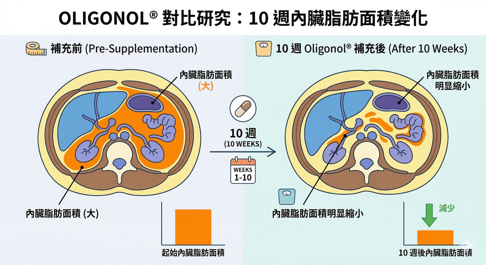
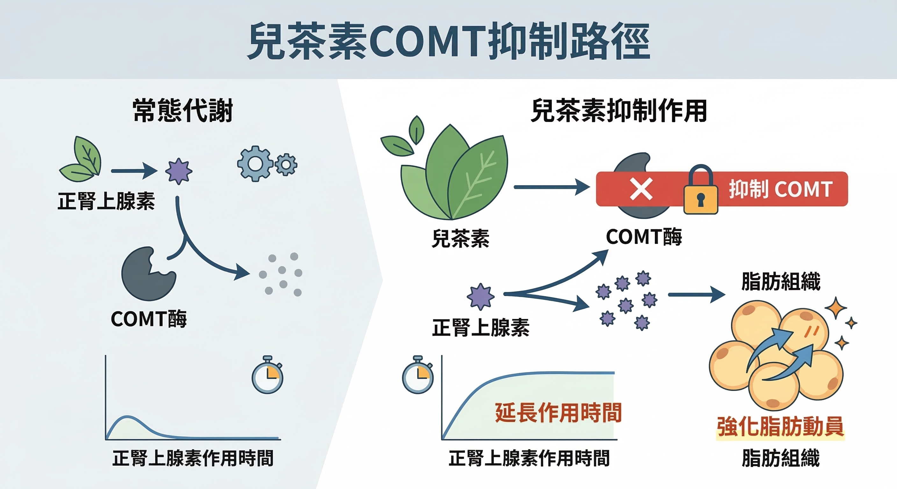

# 別再用最低效的餓肚子對付腰部脂肪，要靠這三種多酚

上一篇我們確認了：皮質醇與胰島素如何鎖死你的脂肪細胞。

既然死結打不開，這篇我們要看什麼樣的「生物剪刀（多酚）」可以剪斷這些迴路。

現在要談的是：什麼東西可以在分子層面干預這些迴路，而且有人體 RCT 數據支持？

不是「促進新陳代謝」這種含糊說法。是具體到：對哪個酵素、通過什麼訊號路徑、在哪項隨機對照試驗裡被量化確認。

如果你對多酚還停留在「抗氧化＝清自由基」的印象，先看這篇：[多酚不是在「清自由基」：它真正做的，更像幫細胞做一場重訓](/blog/chronic-inflammation/polyphenol-nrf2-antioxidant-myth/)。

答案是三種多酚類化合物：花青素（Anthocyanidin）、荔枝綠茶多酚（Oligonol®）、兒茶素（Catechin）。

它們的作用路徑不重疊，組合使用理論上具有加成效果。

---

## 第一種：花青素——從腸道菌重塑脂肪組織的發炎狀態

### 花青素是什麼？

花青素廣泛存在於深色植物中——藍莓、黑醋栗、紫玉米、山桑子。

它屬於黃酮類（Flavonoids）化合物，顏色隨環境酸鹼度變化，從紅、紫到藍，都是花青素的表現形式。

主要的六種花青素：矢車菊素（Cyanidin）、飛燕草素（Delphinidin）、天竺葵素（Pelargonidin）、芍藥素（Peonidin）、矮牽牛素（Petunidin）、錦葵花素（Malvidin）。

### 花青素如何影響內臟脂肪？路徑是腸道

花青素在小腸的直接吸收率並不高（10–22%），但它的生物效應很大——因為大部分進入大腸的花青素會被腸道菌群代謝轉化。

雙歧桿菌（Bifidobacterium）、乳酸菌（Lactobacillus）會把花青素代謝成酚酸類化合物和短鏈脂肪酸（Short-Chain Fatty Acids，SCFAs）。

SCFAs 通過體循環到達脂肪組織，直接調節脂肪組織的發炎狀態。

當腸道裡充滿壞菌時，這些壞菌會不斷釋放毒素跑到血液裡，讓你的身體一直處在「慢性發炎」的警戒狀態。

只要這個發炎警報響著，身體就會覺得遇到危險，死命地把熱量轉化成內臟脂肪囤積起來。

臨床數據一：腸道菌相重塑。2018 年雙盲 RCT（46 名受試者，8 週）：含 215 mg 花青素的多酚配方，顯著提升腸道 **擬桿菌門（Bacteroidetes）** 菌叢比例。

體重較輕者的腸道中，擬桿菌門本來就較多——這提示花青素通過菌相調節影響體重管理。

就是你吃完大餐後，肚子不再鼓得像充了氣的皮球，排便也變得更有規律。

臨床數據二：內臟脂肪直接縮減。2020 年大型人群研究（618 名受試者，25–83 歲）：攝取較高花青素的族群，擁有顯著較低的腹部脂肪量、內臟脂肪／皮下脂肪比值（VAT/SAT ratio），同時具有最高的腸道微生物多樣性。

臨床數據三：LPS 降低，打斷代謝性內毒素血症。花青素能強化腸道緊密連接蛋白（Tight Junction Proteins）的表達，減少血液中循環的細菌脂多糖（LPS）。

LPS 是驅動代謝性內毒素血症的核心分子，也是慢性低度發炎和胰島素阻抗惡化的重要引火源。⁴

臨床數據四：系統性回顧。2021 年統合分析（隨機對照試驗）指出，每天 ≤ 300 mg 花青素補充劑，持續 4 週以上，可顯著降低 BMI 和體重。

也就是說，它是腸道菌相的「糾察隊」，幫你把會讓你變胖的壞菌趕走。

---

## 第二種：Oligonol®——日美雙專利，CT 確認內臟脂肪縮減

### Oligonol® 是什麼？

Oligonol® 由日本阿明諾化學有限公司（Amino Up Chemical Co. Ltd，北海道札幌）研發，透過專利小分子化技術，將荔枝原花青素（Proanthocyanidins）——天然分子量大、吸收率低——轉化為以單體、雙體、三聚體為主的小分子寡聚物，再與綠茶多酚結合。

這個分子結構改造的意義在於：2006 年研究確認，Oligonol® 具有比原花青素顯著更高的生物利用率（Bioavailability）。

獲獎與認證：

- 2007：日本多酚暨健康國際會議（ICPH）最佳產品大獎
- 2008：美國 Nutracon NutrAward 新品獎
- 2009：美國 FDA GRAS 認證
- 2009：北海道「Health Do」食品功能性標示制度
- 2011：美國 SupplySide West 科學優秀獎

### Oligonol® 的三項 RCT 數據

熱成像研究（2014）：6 名健康受試者，服用 50 mg Oligonol® 後 30–120 分鐘，熱成像顯示體表溫度明顯上升，確認產熱效應（Thermogenic Effect）增強——即脂肪作為燃料主動燃燒產熱的能力提升。

腹圍 RCT（2009）：18 名腹圍 > 85 cm 成年受試者，Oligonol® 組（100 mg/日）對比安慰劑，持續 10 週。

腹部 CT 量化確認：Oligonol® 組的內臟脂肪體積、腹圍、體重均顯著降低。這是目前最直接的內臟脂肪 CT 量化 RCT 之一。

代謝指標 RCT（過重女性）：補充 Oligonol® 後，體重增加受到抑制，血脂代謝指標改善。

也就是說，這是一種能讓你的微血管重新打開、提升體溫的黑科技多酚。

---

## 第三種：兒茶素——COMT 抑制，讓脂肪動員訊號延長

### 兒茶素的作用機制非常具體

兒茶素（Catechin）是綠茶中最主要的多酚類成分，其中活性最強的是表沒食子兒茶素沒食子酸酯（EGCG）。

它的代謝機制有一個明確的酵素靶點：兒茶酚-O-甲基轉移酶（COMT）。

COMT 是負責降解正腎上腺素（Norepinephrine，NE）的酵素。

正腎上腺素是脂肪動員的關鍵訊號——當你運動，交感神經釋放正腎上腺素，啟動脂肪組織的分解（β-adrenergic 受體路徑）。

但 COMT 會快速清除這個訊號，縮短脂肪動員的時間窗口。

兒茶素抑制 COMT → 正腎上腺素在脂肪組織中滯留更久 → 脂肪動員效果延長。

### RCT 數據

2007 年人體研究（有規律運動前提下）：綠茶兒茶素補充組，與對照組相比，額外增加 17% 的脂肪消耗，腹部脂肪減少 7.4%。

關鍵字是「有規律運動前提下」——兒茶素的 COMT 抑制效果，在有運動刺激（正腎上腺素有基礎分泌）的情況下才能充分發揮。

兒茶素是運動效果的放大器，不是運動的替代品。

---

## 三種多酚的協同效應

| 成分 | 主要作用路徑 | 干預目標 | 關鍵研究 |
|---|---|---|---|
| 花青素 | 腸道菌重塑 → SCFAs → 脂肪組織發炎下降；LPS 下降；VAT/SAT 比值下降 | 內臟脂肪發炎迴路、腸道屏障 | 618 人群研究；46 人雙盲 RCT |
| Oligonol® | 產熱效應上升；CT 確認內臟脂肪體積下降 | 內臟脂肪直接縮減 | 腹部 CT RCT；熱成像研究 |
| 兒茶素 | COMT 抑制 → 正腎上腺素延長 → 脂肪動員增加 17% | 脂肪動員訊號效率 | 人體 RCT（搭配運動） |

三條路徑：腸道菌相 × 產熱代謝 × 脂肪動員，作用節點不重疊，組合使用具有理論上的加成潛力。

但這裡有一個關鍵前提需要說清楚：單獨補充其中一種，效果會打折扣。

花青素需要健康的腸道菌相作為基礎；Oligonol® 的產熱效應在皮質醇偏高時會被部分拮抗；兒茶素的 COMT 抑制如果沒有運動刺激配合，就缺少足夠的正腎上腺素可以延長。

到這裡，你應該已經看清楚一件事：

內臟脂肪不是單一問題，所以也很難靠單一方法解決。

有些人主要卡在 **腸道菌相與低度發炎**，明明吃得不算多，肚子卻總是鼓著；
有些人卡在 **產熱效率與微循環偏低**，活動量差不多，腰圍卻比以前更難下來；
也有人是 **脂肪動員訊號太短**，身體不是沒有燃脂，而是剛打開又很快關掉。

這也是為什麼，很多人補充單一成分時，不是真的完全沒效，
而是只碰到其中一個缺口，另外兩個還留在原地。

**花青素**處理的是腸道與發炎背景，
**Oligonol®**處理的是低循環、低產熱的狀態，
**兒茶素**則更像是在幫你把脂肪動員的訊號拉長一點。

它們不是互相取代，而是各自處理不同的卡點。

真正困難的，從來不是「知道哪一種成分有效」，
而是現實中很少有人能自己把這三條路徑同時補齊，
還能兼顧劑量、吸收率、搭配方式與持續性。

---

## 下一步：這三種成分，如何在一個配方裡發揮最大效益？

所以下一個問題其實不是：

**「我要不要再找第四種更厲害的成分？」**

而是：

**「有沒有一個設計完整、證據清楚，而且真的能把這三條路徑整合起來的方案？」**

這也正是下一篇要回答的事。

我們不再停留在「多酚很重要」這個層次，
而是直接進到更實際的問題：

- 為什麼有些配方吃了沒感覺？
- 怎樣的組合，才不會把好成分吃成低效補充？
- 如果你是腰圍先上升、體重不一定很高的人，到底適不適合這種策略？

下一篇，我會直接拆解一個代表性的整合方案：
**ageLOC Meta 每代紫，為什麼它不是把熱門成分湊在一起，而是試圖同時補上腸道、產熱與脂肪動員這三個缺口。**

如果前面三篇是在幫你看懂「為什麼肚子瘦不下來」，
那下一篇，就是要回答：

**當你終於知道問題出在哪裡，接下來到底該怎麼做。**

系列第四篇：[ageLOC Meta：不是亂補多酚，而是把三條代謝路徑一次補齊](/blog/precision-health-tools/ageloc-meta-clinical-protocol/)

---

## 下一步

### 不要再盲測，先把現有數據整理起來

如果你手上已經有健檢數據或穿戴裝置數據，下一步比繼續看文章更有效的是先把資料整理起來。

完成後我會協助你先整理目前最值得優先處理的項目與順序。

---

## 參考資料

1. Cremonini E, et al. (2019). [Anthocyanins protect the gastrointestinal tract from high fat diet-induced alterations.](https://pubmed.ncbi.nlm.nih.gov/31357033/) *Redox Biol*, 26, 101269.
2. Hester SN, et al. (2018). [Efficacy of an Anthocyanin and Prebiotic Blend on Intestinal Environment in Obese Subjects.](https://pubmed.ncbi.nlm.nih.gov/30364007/) *J Nutr Metab*, 2018:7497260.
3. Jennings A, et al. (2020). [Habitual anthocyanin intake and visceral abdominal fat in population-level analysis.](https://pubmed.ncbi.nlm.nih.gov/31841169/) *Am J Clin Nutr*, 111(2), 340–350.
4. Cremonini E, et al. (2022). [Anthocyanin actions at the gastrointestinal tract.](https://pubmed.ncbi.nlm.nih.gov/35500745/) *Mol Aspects Med*, 101156.
5. Park S, Choi M, Lee M. (2021). [Effects of Anthocyanin Supplementation on Reduction of Obesity Criteria: Systematic Review and Meta-Analysis.](https://pubmed.ncbi.nlm.nih.gov/34071008/) *Nutrients*, 13(6), 2121.
6. Aruoma OI, et al. (2006). [Low molecular proanthocyanidin dietary biofactor Oligonol.](https://pubmed.ncbi.nlm.nih.gov/16910764/) *Biofactors*, 27(1-4), 245–265.
7. Kitadate K, Aoyagi K, Homma K. [Effect of Lychee Fruit Extract (Oligonol) on Peripheral Circulation.](https://pmc.ncbi.nlm.nih.gov/articles/PMC4397678/) *J Nat Med*, 6(7).
8. Nishihira J, et al. (2009). [Amelioration of abdominal obesity by low-molecular-weight polyphenol (Oligonol) from lychee.](https://www.sciencedirect.com/science/article/abs/pii/S1756464609000391) *J Funct Foods*, 1(4), 341–348.
9. Bahijri SM, et al. (2018). [Supplementation with Oligonol Prevents Weight Gain in Overweight and Obese Saudi Females.](https://pubmed.ncbi.nlm.nih.gov/29534631/) *Curr Nutr Food Sci*, 14(2), 164–170.
10. Nagao T, Hase T, Tokimitsu I. (2007). [A green tea extract high in catechins reduces body fat and cardiovascular risks.](https://pubmed.ncbi.nlm.nih.gov/17557985/) *Obesity*, 15(6), 1473–1483.

> 免責聲明：本文所提供之資訊與文獻探討，皆為日常健康促進與保養參考，不具備醫療診斷、治療、減輕或預防任何疾病之功效。若有明確醫療需求，請務必尋求專業醫師協助。
