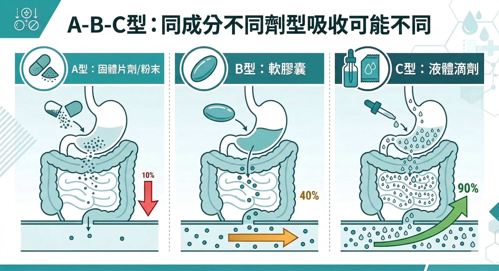
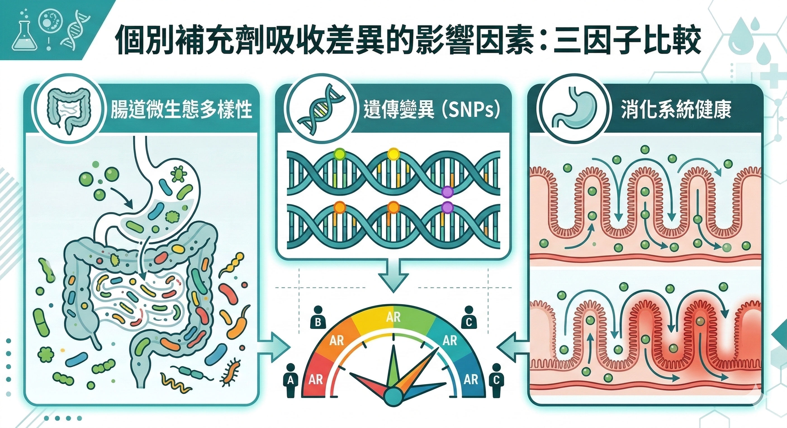

兩個人買了同一罐 CoQ10，同樣的品牌、同樣的劑量、同樣每天吃。

三個月後，一個人血液中的 CoQ10 濃度顯著提升，另一個人幾乎沒有變化。

這不是特例。這是保健品市場裡一個非常普遍、但幾乎沒有人講清楚的現象。

**成分買對了，不代表細胞收到了。**

---

## 什麼是生物利用率？

**生物利用率（Bioavailability）** 是指你吃進去的成分，最終有多少比例真正進入血液循環、抵達目標組織、被細胞利用。

這個數字，才是一個保健品真正效果的決定性指標，不是成分清單上的毫克數，不是產地，不是天然或合成。

一個成分的生物利用率，受到以下幾個因素的影響：

**劑型**、**配方設計**、**服用時機**、**個人的腸道狀態**。

每一個因素，都可以讓吸收率出現數倍甚至數十倍的差距。

---

## 劑型：同樣的成分，不同的包裝方式，吸收率差距巨大

**CoQ10** 是最典型的例子。

CoQ10 是脂溶性成分，在一般粉末膠囊劑型中，吸收率極低，脂溶性物質需要脂肪幫助溶解才能被腸道吸收，乾粉直接吞進去，大部分直接排出體外。

同樣的 CoQ10，改成軟膠囊（溶解在油脂中）後，吸收率大幅提升。再進一步改成奈米乳化劑型（Nano-emulsified），吸收率可以再提高數倍。

這三種劑型的 CoQ10，在成分標示上看起來一模一樣，都是「CoQ10 100mg」。但你的細胞實際收到的量，可以差到十倍以上。

**薑黃素（Curcumin）** 是另一個極端案例。

薑黃素在研究上有大量的抗發炎數據，但它有一個嚴重的問題：標準劑型的薑黃素生物利用率極低，而且在腸道和肝臟中會被快速代謝掉，還沒進入血液就已經被分解。

這就是為什麼你吃了很多薑黃粉或普通薑黃膠囊，可能幾乎沒有效果，不是薑黃素沒用，是它根本沒有進到你的血液裡。

改良劑型（如磷脂複合物、黑胡椒素增強、奈米顆粒）可以讓薑黃素的生物利用率提升 20 - 200 倍之多。

這個差距，完全改變了「薑黃素有沒有效」這個問題的答案。

---

## 配方設計：成分之間的相互影響

保健品不是單獨服用就能發揮最大效果的，成分之間的交互作用，可以讓吸收率大幅提升或嚴重下降。

**協同增強的例子：**

黑胡椒萃取物（Piperine）能抑制腸道和肝臟的代謝酶，讓多種成分在被分解之前有更多時間被吸收。

研究顯示，加入黑胡椒素可以讓薑黃素的生物利用率提升約 20 倍。

維生素 D 和維生素 K2 是另一個協同例子，維生素 D 促進鈣的吸收，維生素 K2 負責把鈣導引到骨骼而非血管壁。

兩者搭配，才能讓鈣的補充真正發揮作用。

**互相干擾的例子：**

鈣和鐵同時服用，會互相競爭腸道的吸收路徑，兩者的吸收率都會下降。正確做法是分開時段服用。

鋅和銅之間也有類似的競爭關係，高劑量補鋅，可能導致銅缺乏。

脂溶性維生素（A、D、E、K）之間在高劑量時也存在競爭，它們都需要脂肪幫助吸收，同時服用可能互相稀釋吸收效率。

**這就是為什麼「成分越多越好」這個邏輯是錯的。**

真正好的配方，是確認每個成分之間不互相干擾、甚至能互相增強，這需要配方層面的科學研究，不是把成分清單加長。

---

## 服用時機：你什麼時候吃，決定了細胞收到多少

脂溶性成分（CoQ10、維生素D、維生素E、蝦青素、薑黃素）需要搭配含脂肪的餐點服用，沒有脂肪，這些成分無法被腸道有效吸收。

空腹吃脂溶性保健品，大部分的成分會直接排出。餐後吃，吸收率可以提升數倍。

水溶性成分（維生素C、B群）則相對不受餐點影響，但有些在空腹時吸收更快，有些在餐後服用腸胃較不不適。

達峰時間也很重要。不同成分在血漿中的濃度達到高峰的時間不同，有些是2小時，有些是6到8小時。

如果你希望某個成分在特定時段發揮作用（例如睡前的修復機制），服用時間的設計很重要。

這就是為什麼好的補充方案，不只是「每天吃什麼」，還包括「什麼時候吃、和什麼一起吃」。

---

## 個人差異：同樣的劑型，你和他的吸收率可能差十倍

即使劑型、配方、服用時機都一樣，不同人對同一個成分的吸收率，仍然可以有巨大的差異。

主要原因有三個：

**腸道菌相。**
前幾篇提到的尿石素（Urolithin A）是最典型的例子，它需要特定的腸道細菌才能從石榴多酚轉化而來。

只有約 30% - 40% 的人有足夠的菌種，其餘的人就算吃了大量石榴，尿石素的產生量也很低。

同樣的道理適用於其他需要腸道代謝轉化的成分，你的腸道菌相組成，決定了你能從某些植物成分裡獲得多少實際效益。

**基因多型性。**
某些基因變體會影響特定維生素的代謝效率。例如，MTHFR 基因變體會影響葉酸的代謝，帶有這個變體的人需要補充已經轉化好的活性形式（甲基葉酸），而不是一般的葉酸。

**消化系統狀態。**
胃酸分泌不足（常見於中年以後）會影響礦物質的吸收。

腸道發炎會降低整體吸收效率。肝臟功能影響脂溶性成分的代謝。

這些個人差異，解釋了為什麼同樣的產品、同樣的劑量，有人明顯有效，有人完全沒感覺。

---

## 那你應該怎麼看一個產品的吸收設計？

選保健品的時候，值得問這幾個問題：

**劑型是什麼？** 脂溶性成分有沒有在油脂載體中？有沒有特殊的吸收增強設計（磷脂複合、奈米乳化、腸溶衣等）？

**有沒有考慮協同配方？** 關鍵成分旁邊有沒有增強吸收的搭配成分（如黑胡椒素、維生素K2）？成分之間有沒有已知的拮抗關係？

**服用指示是否考慮了時機？** 說明書上有沒有指定隨餐或空腹、早上或晚上？這個指示有沒有科學依據？

**有沒有人體吸收率的臨床數據？** 最好的產品會直接提供血漿濃度曲線或生物利用率的測量數據，而不只是說「採用天然萃取」。

如果這四個問題都沒有答案，你買的可能是標示上的毫克數，不是細胞實際收到的量。

---

**延伸閱讀：**
- [那些讓你點頭的保健品話術，你聽過哪些？](/blog/precision-health-tools/supplement-marketing-tactics/) 
- [廠商那張SGS合格報告和你吃進去有沒有用，是兩件事](/blog/precision-health-tools/sgs-report-vs-efficacy/ ) 
- [不節食也能啟動長壽基因？CRM的概念和DNA微陣列技術](/blog/chronic-inflammation/caloric-restriction-mimetics-science/)

---

你現在在補的東西，有沒有進到細胞？

這個問題，可以從你的身體訊號開始觀察，也可以透過可量化的指標來追蹤。

---

## 參考資料

01. Prasad S et al., 2014. [Curcumin and its analogues: a potential natural compound against HIV infection and AIDS.](https://pubmed.ncbi.nlm.nih.gov/25233534/) *Food Funct.* 5(9):1992-2003.
02. Shaikh J et al., 2009. [Nanoparticle encapsulation improves oral bioavailability of curcumin by at least 9-fold when compared to curcumin administered with piperine as absorption enhancer.](https://pubmed.ncbi.nlm.nih.gov/19768725/) *Eur J Pharm Sci.* 37(3-4):223-30.
03. Shils ME, Olson JA, Shike M, Ross AC, 1999. Modern Nutrition in Health and Disease. 9th ed. Lippincott Williams & Wilkins.
04. Pénélope A Andreux et al., 2019. [The mitophagy activator urolithin A is safe and induces a molecular signature of improved mitochondrial and cellular health in humans.](https://pubmed.ncbi.nlm.nih.gov/31226288/) *Nat Metab.* 1(6):595-603.
