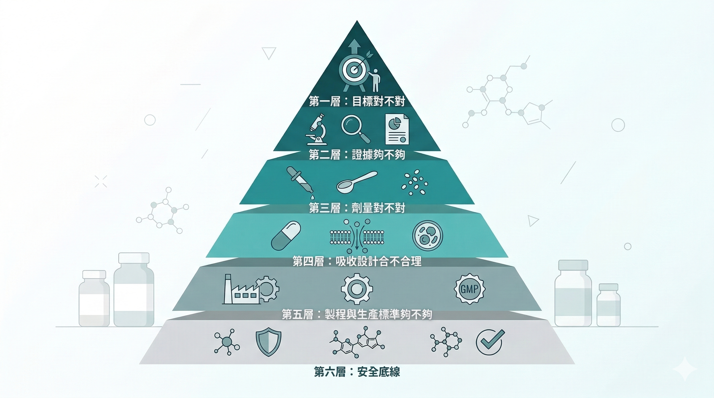

台灣人買保健品的規模，比你以為的大得多。

根據 Kantar 凱度消費者指數 2023 年的研究，台灣每兩位消費者就有一位在過去一年購買過保健食品，普及率達 56%。

每人年均消費金額達 8700 元，較疫情前增加 54%。

台灣保健食品市場品牌數從疫情前的 914 個成長至 2023 年逾 1500 個，成長幅度超過六成。

根據市調機構資料，2024 至 2025 年台灣保健食品市場年產值已突破新台幣 1500 億元，並持續以每年 5 - 7% 穩定成長。

熱門購買原因依 2023 年第三季數據，依序是腸胃道保健、補充體力與消除疲勞、關節保健，全都和現代生活型態的累積損耗有關。

品牌多了、市場大了，但問題也跟著變大：1500個品牌裡，有多少是真的做到科學標準？消費者面對的選擇障礙比以前更複雜，不是更簡單。

你需要一個可以快速篩選的判斷框架，而不是更多廣告。

這篇的目的是給你一個可以直接用的判斷框架。

---

## 先問自己：我的目標是什麼？

選保健品最常見的錯誤，是從「這個成分有哪些好處」開始，看到某個成分的功效清單，然後決定要不要買。

正確的起點是：**你想解決什麼問題、改善什麼狀態？**

體力下滑？睡眠修復差？抗氧化防禦能力降低？粒線體效率下降？慢性發炎？

目標不同，需要的成分和機制方向完全不同。

沒有目標就選成分，等於不知道要去哪裡就上車，你可能買了一堆東西，但沒有一樣是針對你真正需要的方向。

---

## 最關鍵的一件事：人體臨床試驗

如果你只能看一件事，看這個。

**這個產品，有沒有針對它宣稱的效果，在人體上做過雙盲隨機對照試驗？**

不是動物實驗。不是體外細胞實驗。不是「成分A的研究顯示可能有效」。

是針對這個產品本身、這個配方、在真實人體上測試過的數據。

這個標準聽起來基本，但大多數市面上的保健品達不到它。

很多產品引用的是個別成分的研究，而不是配方整體的人體試驗，成分之間的交互作用、劑量的設計、吸收率的差異，都會影響最終效果。

還有一個需要特別注意的：那種吃了馬上就有感的保健品反而要擔心，保健食品是食品不是藥品，作用是緩慢累積的，通常需要 1 - 3 個月搭配正常飲食和生活習慣才能看到效果。

效果快得不尋常，很可能代表裡面添加了 **未標示的西藥成分或禁用物質。**

---

## 完整的選品檢查框架

人體臨床試驗是最關鍵的一件事，但完整的判斷還需要幾個配套問題：

**第一層：目標對不對**
- 這個產品宣稱的效果，是不是我想解決的問題？
- 它作用的機制方向（AMPK、mTOR、Nrf2、粒線體自噬…），和我的目標一致嗎？

**第二層：證據夠不夠**
- 有沒有人體雙盲隨機對照試驗？
- 試驗是否在同行評審期刊上發表？
- 試驗的樣本數是否足夠（通常至少30人以上才有基本參考價值）？
- 有沒有多個獨立研究機構重複驗證？

**第三層：劑量對不對**
- 配方裡關鍵成分的實際劑量，是否和臨床試驗中使用的劑量相符？
- 還是只加了象徵性的微量，讓成分出現在標示上？
- 注意：廠商有時候標示的是**原料**裡的成分含量，不是**成品**的實際含量，兩者可以差很多。

**第四層：吸收設計合不合理**
- 脂溶性成分有沒有在適合的載體中？
- 有沒有考慮成分之間的吸收競爭和協同效果？
- 劑型是否針對生物利用率做過優化？

**第五層：製程與生產標準夠不夠**
- 生產設施有沒有通過第三方GMP認證？是食品等級還是製藥等級？
- 製程是否能去除有害成分、保留有效成分？
- 舉一個具體例子：紅麴在發酵過程中可能產生橘黴素（Citrinin），這是一種具有輕微肝腎毒性的真菌毒素，必須在濃縮過程中去除，優質廠商會主動檢驗並公開這項數據，劣質廠商不會提。
- 又例如含有酵素的產品，酵素是蛋白質，高溫會破壞其活性，製程溫度控制直接影響成品的有效性。

**第六層：安全底線**
- 有沒有SGS或同等第三方的成品安全檢驗（重金屬、農藥殘留、微生物、塑化劑）？
- 原料來源有沒有水源汙染、土地農藥殘留、重金屬污染的風險控管？

---

## 台灣消費者可以用的額外保障：認證標章

在上面六層框架的基礎上，台灣有幾個本地認證值得了解：

**健康食品認證（小綠人標章）**：這是台灣衛福部實際審查過的認證，廠商必須提交科學實證的臨床試驗才能通過，是六層框架裡「證據夠不夠」這一層在台灣法規層面的落實。

目前衛福部核准可宣稱的保健功效共 13 項，包括：護肝、抗疲勞、調節血脂、調節血糖、免疫調節、骨質保健、牙齒保健、延緩衰老、促進鐵吸收、胃腸功能改善、輔助調節血壓、不易形成體脂肪、輔助調整過敏體質。

產品如果宣稱上述任何一項功效，但包裝上沒有小綠人標章，就代表這個宣稱沒有通過台灣政府審查。

**SNQ 國家品質標章**：由國家生技醫療產業策進會主辦，評核產品的安全性與有效性，是另一個有第三方審查意義的台灣認證。

**NSF / USP**：國際第三方認證，適用於評估進口或外資品牌的生產標準，意義在前幾篇已有詳細說明。

---

## 一個快速的現實測試

拿起你現在在補的任何一罐保健品，問三個問題：

**這個配方有沒有人體雙盲試驗？**
廠商網站找不到，搜尋「產品名稱 clinical trial」或「成分組合 randomized controlled trial」。找不到，答案就是「沒有」。

**劑量夠嗎？**
搜尋主要成分名稱加「effective dose」或「clinical dose」，看研究裡用的劑量和你的產品標示是否在同一個數量級。

**CP值怎麼算？**
不要看總價，要計算 **有效成分的單位成本**：把產品的關鍵有效成分含量和服用天數換算成「每天吃到多少有效成分、花多少錢」，才能真正比較不同產品的CP 值。大包裝但每次要吃很多顆，算起來不見得划算。

三個問題都有答案，這罐值得繼續吃。都沒有答案，不代表有害，但代表你不知道它有沒有用。

---

**這個系列的完整閱讀順序：**
- [那些讓你點頭的保健品話術，你聽過哪些？](/blog/precision-health-tools/supplement-marketing-tactics/) 
- [平平都花一樣的錢，為什麼他有感但你沒感覺？](/blog/precision-health-tools/supplement-bioavailability-gap/) 
- [廠商那張SGS合格報告和你吃進去有沒有用，是兩件事](/blog/precision-health-tools/sgs-report-vs-efficacy/) 
- [「本產品通過FDA認證」和你以為的FDA認證根本不一樣](/blog/precision-health-tools/fda-certification-myth/) 
- [為什麼 Nu Skin 敢說他們以製藥的標準來開發營養補充品？](/blog/precision-health-tools/nuskin-pharmaceutical-standard/) 
- 我篩選保健品只看一件事，其他都是行銷 ← 本篇（總結）

想了解如何挑選國外品牌保健品？→ [怎麼挑選國外保健食品：NSF查詢、Amazon真偽辨別與台灣法規](/blog/precision-health-tools/supplement-import-guide/)

---

## 選品之前還有一件更重要的事

選到對的產品，是第二步。

第一步是：**知道你的身體現在的狀態在哪裡。**

在不清楚自己的基準值之前選產品，等於不知道目的地就出發，你可能往對的方向走，也可能往錯的方向走，而且無法判斷走了多久之後有沒有抵達。

如果你想從你的狀況出發，可以選一個來做：
