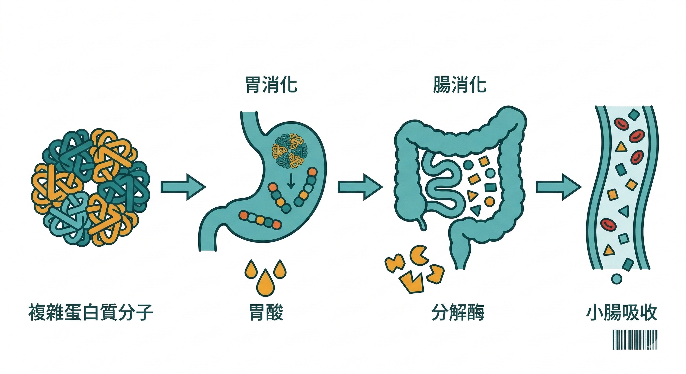
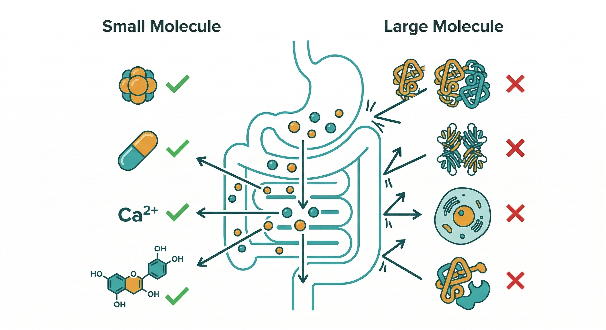

「以形補形」是一個非常直觀的邏輯：

吃膠原蛋白→皮膚補到膠原蛋白。

吃胎盤素→補到胎盤裡的生長因子。

吃端粒酶促進劑→端粒得到修復。

吃幹細胞飲品→身體多了幹細胞。

這個邏輯聽起來合理。但它有一個根本性的問題，**它完全忽略了消化系統的存在。**

---

## 你吃進去的東西，在到達細胞之前要過五道關

食物進入口腔之後，就開始了一段分解之旅：

**口腔**：唾液中的澱粉酶開始分解碳水化合物。蛋白質在這個階段幾乎不被處理。

**胃**：強酸環境（pH 1.5–3.5），胃蛋白酶在這裡把蛋白質切成較短的多肽鏈。任何蛋白質，不管它的來源有多珍貴，在胃裡都只剩下「一段一段的胺基酸鏈」。

**小腸**：胰蛋白酶繼續把多肽鏈切成更短的胜肽，最終分解為**單一胺基酸**。只有這個尺寸的分子，才能通過絨毛被吸收進血液。

這代表什麼？

**你吃進去的胎盤、端粒酶、膠原蛋白，它們到達血液的時候，已經不是原來的樣子了。**

它們全部變成了胺基酸。

胺基酸本身對身體有益，這沒有問題。

但「胺基酸」和「胎盤裡的生長因子」是完全不同的東西。

前者是蛋白質的基本建材，後者是有特定功能的複雜蛋白質分子，而複雜蛋白質分子，在消化系統這一關就已經被拆解完畢了。

---

## 案例一：胎盤素

胎盤素（無論是人類、羊還是鹿）的行銷重點通常是：生長因子、荷爾蒙、幹細胞活性物質。

問題是：

**生長因子是蛋白質。** 進入消化系統，走完上面那條路，變成胺基酸。

它再也不是「生長因子」了，只是一堆普通的胺基酸，和你吃一顆雞蛋能得到的沒有本質差別。

**荷爾蒙的部分比較麻煩。** 少部分脂溶性荷爾蒙（如雌激素）確實可能部分通過消化系統進入血液。

這不是好消息，不明來源的外來荷爾蒙進入人體，輕則干擾內分泌系統，重則誘發荷爾蒙相關癌症。「感覺有效」很可能是荷爾蒙效應，不是抗老化效應。

**「幹細胞活性」更是完全站不住腳。** 幹細胞是活的細胞，直徑約 10–20 微米。

腸道絨毛的吸收孔徑遠小於這個尺寸，細胞這個大小的東西不可能完整通過腸道進入血液。更何況，動物性細胞進入人體，免疫系統會立即啟動排斥反應。

此外，動物性胎盤的病毒和細菌污染風險也無法完全排除，加工過程（煮熟、烘乾、磨粉）能降低風險但同時也破壞了你花大錢購買的「活性成分」。

---

## 案例二：端粒酶促進劑

端粒是染色體末端的保護序列，每次細胞分裂都會縮短一點，這是細胞老化機制中最清楚的指標之一。

端粒越短，細胞越接近凋亡。

2009 年，發現端粒酶的 Elizabeth Blackburn、Carol Greider 和 Jack Szostak 三位科學家因此獲得諾貝爾生理醫學獎。

科學是真實的。但從「端粒很重要」到「吃端粒酶促進劑有效」，中間隔著非常遠的距離。

**第一個問題：一樣過不了消化這一關。** 端粒酶是蛋白質。吃進去，胃酸先處理，胰蛋白酶後處理，到血液的時候是胺基酸，不是端粒酶。

**第二個問題：就算能到達細胞，這是一把雙面刃。** 1998 年研究確認激活端粒酶可以延長細胞壽命；但 1999 年的後續研究發現，端粒酶過度活化加上致癌基因，會直接誘發癌變。

人體中端粒酶濃度最高的細胞，除了幹細胞和生殖細胞之外，就是 **癌細胞**：癌細胞正是靠著端粒酶維持無限分裂能力的。

市場上存在的端粒酶促進劑，臨床數據非常有限。

TA Sciences 在 2011 年的 9 人試驗中，端粒長度沒有顯著增加；2015 年 117 人的雙盲試驗中，高劑量組在統計上仍然沒有顯著差異。

你不只是在為效果存疑的產品付費，你也在承擔我們目前還不完全理解的風險。

---

## 那什麼樣的成分，可以真的通過消化系統這一關？

不是所有保健品都有這個問題。問題的關鍵在於**分子特性**，不是來源。

**可以有效吸收的成分類型：**

**脂溶性小分子**：類胡蘿蔔素（茄紅素、葉黃素、蝦青素）、維生素 A/D/E/K、CoQ10、白藜蘆醇。

這些分子小，脂溶性讓它們可以溶解在脂肪微粒中穿過腸道絨毛膜，直接進入血液。這就是為什麼搭配油脂服用很重要。

**水溶性維生素**：維生素 C、B 群。分子小，水溶性，直接被絨毛吸收。

劑量和吸收率的關係需要注意，超過腸道每次的吸收上限，多餘的直接排出。

**礦物質**：鈣、鎂、鋅、硒等。以離子形式被吸收，但不同礦物質的吸收形式（氧化物 vs 螯合物）差異極大。

**植化素**：槲皮素、花青素等類黃酮素。這類分子可以部分直接吸收，部分需要腸道菌相代謝後才有活性，個人差異大。

**不能靠口服有效補充的成分類型：任何分子量大的蛋白質或活細胞**，包括膠原蛋白原型、生長因子、端粒酶、幹細胞、胎盤活性物質。

它們在消化系統的分解是不可避免的。

---

## 選保健品之前，要問的那個問題

不是「這個成分對身體有什麼好處？」

而是：**「這個成分，吃進去之後能不能完整抵達它應該去的地方？」**

這個問題的答案，取決於分子量、脂溶性或水溶性、劑型設計、服用時機，以及你的腸道環境。

成分名稱是行銷的起點。

吸收率，才是保健品有沒有在為你工作的真正判斷標準。

---

**延伸閱讀：**
- [平平都花一樣的錢，為什麼他有感但你沒感覺？](/blog/precision-health-tools/supplement-bioavailability-gap/) 
- [那些讓你點頭的保健品話術，你聽過哪些？](/blog/precision-health-tools/supplement-marketing-tactics/) 
- [為什麼 Nu Skin 敢說他們以製藥的標準來開發營養補充品？](/blog/precision-health-tools/nuskin-pharmaceutical-standard/) 
- [Prysm iO 掃完之後，第一步先做這件事](/blog/intervention-optimization/lifepak-foundation-nutrition/) 

---

## 參考資料

01. A G Bodnar et al., 1998. [Extension of life-span by introduction of telomerase into normal human cells.](https://pubmed.ncbi.nlm.nih.gov/9454332/) *Science.* 279(5349):349-52.
02. W C Hahn et al., 1999. [Creation of human tumour cells with defined genetic elements.](https://pubmed.ncbi.nlm.nih.gov/10440377/) *Nature.* 400(6743):464-8.
03. Laura Salvador et al., 2016. [A Natural Product Telomerase Activator Lengthens Telomeres in Humans: A Randomized, Double Blind, and Placebo Controlled Study.](https://pubmed.ncbi.nlm.nih.gov/26950204/) *Rejuvenation Research.* 19(6):478-484.
04. Richard M Cawthon et al., 2003. [Association between telomere length in blood and mortality in people aged 60 years or older.](https://pubmed.ncbi.nlm.nih.gov/12573379/) *Lancet.* 361(9355):393-5.
05. Brenda M Roe et al., 2000. [Carotenoid bioavailability is higher from salads ingested with full-fat than with fat-reduced salad dressings.](https://pubmed.ncbi.nlm.nih.gov/15735074/) *Am J Clin Nutr.* 80(2):396-403.
06. 康寧醫院婦產科, 2019. [胎盤素的迷思！](http://www.knh.org.tw/sub/women-children/113/119)
