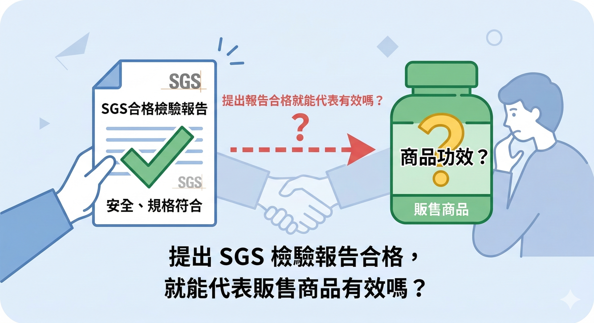
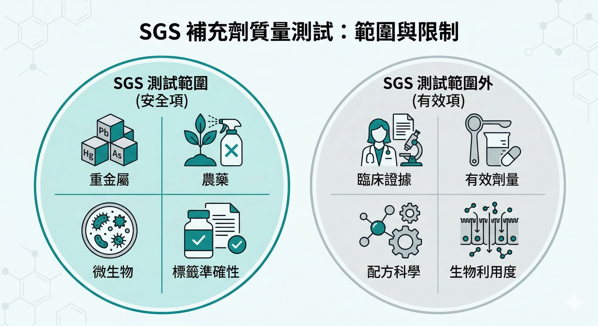

你在選保健品的時候，看到「SGS檢驗合格」這幾個字，會不會放心一點？

大多數人會。

這不是你的問題——SGS是全球知名的第三方檢測機構，它出具的報告是真實的、有公信力的。

廠商花錢去做 SGS 檢驗，不是在造假。

問題在於：**你放心的那個理由，和SGS報告實際測的東西，不是同一件事。**

---

## SGS報告測的是什麼

SGS的保健品檢驗，主要涵蓋以下幾個項目：

**重金屬檢測**——鉛、汞、砷、鎘等有害金屬的含量是否在安全範圍內。

**農藥殘留**——原料在種植過程中使用的農藥是否殘留超標。

**微生物污染**——產品是否有大腸桿菌、沙門氏菌等有害微生物的污染。

**塑化劑**——部分台灣廠商會額外加驗塑化劑，確認無污染。

**標示符合性**——包裝上標示的成分和含量，是否和實際檢測結果相符。

這些項目，測的是一件事：**這個產品吃了不會讓你中毒，而且裡面有你以為有的東西。**

這是一個非常重要的底線，它排除了劣質原料、污染問題和標示不實的風險。

但「不會讓你中毒、成分標示正確」和「對你有用」，是兩件完全不同的事。

---

## SGS報告測不了什麼

**有效劑量。**

SGS 報告確認了一個成分「存在」於產品中，但它不判斷這個劑量是否足夠產生生理效果。

一顆維生素 D 膠囊裡放100 IU，SGS 報告會說「維生素D：檢出，符合標示」。但臨床研究顯示，維生素 D 缺乏的成人要提升血液濃度，通常需要每日2000到5000 IU。

100 IU 的維生素 D 完全無害，SGS 報告完全合格，但它對你的身體幾乎沒有作用。

**臨床有效性。**

SGS 不評估這個成分是否有人體臨床試驗支持、試驗設計是否嚴格、效果是否在人體上被重複驗證過。

一個從未經過任何人體臨床試驗的成分，可以有一份完整的 SGS 合格報告。

**配方科學性。**

SGS不評估配方裡的成分之間是否有吸收競爭、是否有拮抗關係、劑型設計是否考慮了生物利用率。

如前篇所說，成分之間的交互作用可以讓吸收率差到數十倍。這些問題，SGS報告完全不涉及。

**生產製程的科學標準。**

SGS是對成品做檢測，不是對整個生產流程做評估。

成品合格，不代表生產過程符合製藥等級的品管標準——原料的篩選邏輯、配方的研發過程、批次間的一致性控制，這些都不在SGS的範疇內。

---

## SGS有分等級——你看到的是哪一種？

這是很多人不知道的事：SGS的服務有很大的差異，「SGS合格」可能代表非常不同的事情。

**基本安全檢驗**——重金屬、農藥、微生物、標示符合性。這是最常見的「SGS報告」，也是最多廠商拿來宣傳的那種。

**完整批次檢驗**——部分廠商做到逐批檢測，涵蓋重金屬、塑化劑、農藥殘留、微生物、西藥成分等數百個安全與品質項目，並公開每批次的檢測結果。這是更高標準的使用方式，但仍屬安全範疇。

**健康食品功效評估**——SGS台灣有提供健康食品查驗登記的委託服務，包括保健功效評估試驗和安全性試驗，協助廠商申請台灣衛福部的小綠人標章。這才涉及「功效」的科學評估，但這是申請小綠人認證的服務，和一般「SGS檢驗報告合格」是完全不同的兩件事。

所以當廠商說「通過SGS檢驗」，你需要問：**是哪一種SGS檢驗？檢的是什麼項目？**

---

## 為什麼廠商喜歡強調 SGS

不是因為廠商在欺騙你，而是因為SGS報告是一個容易取得、容易展示、容易讓消費者理解的信任符號。

取得 SGS 報告的成本相對不高，流程也相對標準化。

對一個想要建立基本可信度的廠商來說，它是最低門檻的品質證明。

問題在於它被過度詮釋了——廠商說「通過SGS檢驗」，消費者以為聽到的是「這個產品有效且安全」，但廠商說的只是「這個產品安全」。

這中間的落差，不一定是刻意的誤導，但它確實是一個系統性的認知錯位。

---

## 那真正有意義的品質標準是什麼

**配方依據是否來自基因或分子層面的篩選研究？**

最嚴格的保健品開發流程，是從大量候選成分中，用基因表達分析（如DNA微陣列）篩選出對特定生理目標有實際影響的成分組合——而不是根據「這個成分聽說對XX有益」來決定配方。

**是否有人體雙盲隨機對照試驗？**

動物實驗是起點，但真正的有效性證據需要人體試驗。試驗設計需要有對照組、有盲法、有足夠的樣本數、在同行評審期刊上發表。

**生產標準是否達到製藥等級？**

製藥等級（GMP，Good Manufacturing Practice）的生產標準，要求原料的來源追溯、配方一致性的批次控制、生產環境的潔淨度、以及成品的穩定性測試——這比通過SGS成品檢測要嚴格得多。

**有效成分的劑量是否與臨床試驗相符？**

真正嚴格的產品，會確保配方中每個關鍵成分的劑量，和臨床試驗中顯示有效的劑量範圍一致。

---

## SGS 是必要條件，不是充分條件

說清楚這件事的目的，不是要你忽略 SGS 報告——安全性是基本門檻，一個連SGS都沒有通過的產品，直接排除。

但 SGS 合格，只代表這個產品通過了最基本的安全篩選。

在這個基礎上，你還需要問：

- 配方設計有沒有科學依據？

- 有效劑量是否足夠？

- 有沒有人體臨床試驗支持？

- 生產標準是否達到製藥等級？

只有這四個問題都有答案，你才是在做一個完整的品質判斷。

---

你現在在補的東西，通過的是哪一層的品質標準？

如果你想把手上的產品拿出來對照這四個標準——

**加我 LINE，告訴我你在用什麼，我給你具體的看法。**

👉 [加LINE諮詢](https://line.me/ti/p/@fer7932k)

---

**延伸閱讀：**
- [那些讓你點頭的保健品話術，你聽過哪些？](/blog/precision-health-tools/那些讓你點頭的保健品話術，你聽過哪些？/) ← 話術篇
- [同樣的成分，有人吸收80%，有人吸收5%——差在哪裡](/blog/precision-health-tools/同樣的成分，有人吸收80%，有人吸收5%——差在哪裡/) ← 吸收率篇
- [為什麼 Nu Skin 敢說他們以製藥的標準來開發營養補充品？](/blog/precision-health-tools/為什麼 Nu Skin 敢說他們以製藥的標準來開發營養補充品？/) ← 第6篇