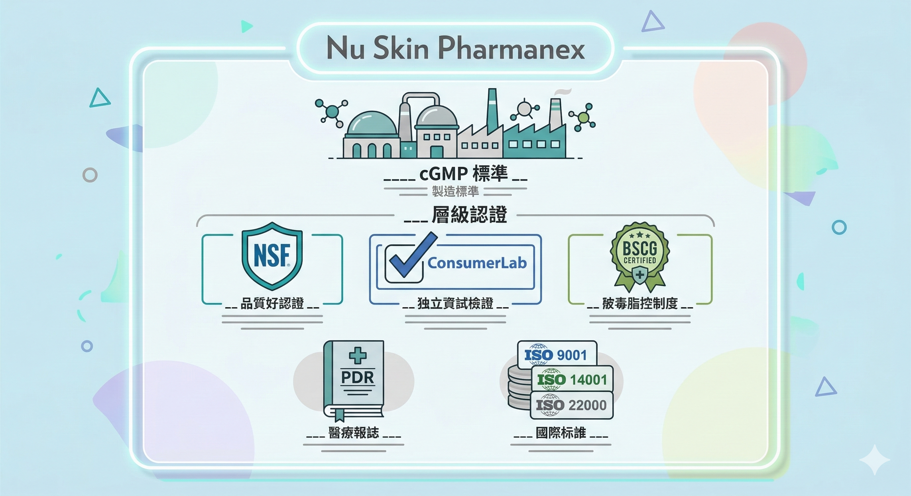

Nu Skin 說他們的營養補充品是以製藥的標準來開發——第一次聽到這句話，很多人的反應是：每家公司都這樣說，不就是老王賣瓜？

但如果你去參觀過他們在中國湖州的大中華創新園區，或是美國猶他州的總部實驗室，聽完工作人員說明之後，你會開始理解為什麼他們敢說這句話。

這篇先說清楚食品製造標準和製藥製造標準的差距，再逐一對照 Nu Skin 實際達到了哪些具體標準。

---

## 食品 GMP 和製藥 GMP：不是同一件事

很多人以為 GMP 只有一種，事實上保健品業和製藥業的 GMP 標準有很大的差距。

**製藥 GMP 的起源**

美國於1963年率先公布藥品優良製造作業規範（GMP），確保藥品製造過程的品質與安全。

世界衛生組織（WHO）於 1969 年頒布自己的 GMP 版本，英國 1971 年、日本 1974 年、台灣 1982 年陸續跟進。

台灣在 1995 年進一步實施更高標準的cGMP（Current Good Manufacturing Practices，現行藥品生產管理規範），要求製藥設備、製程和分析方法全程確效。

2007 年再升級為 PIC/S GMP（Pharmaceutical Inspection Convention and Co-operation Scheme），與歐盟GMP標準等同——這是目前國際最嚴格的藥品生產管理標準之一，要求從產品開發初期就啟動品管，全面且週期性的環境監控與風險評估。

**食品 GMP 的現實**

台灣的食品製造管理有「食品 GMP」標章（俗稱微笑標章）。

但食品 GMP 的功能並非驗證產品有效性，也非針對保健功效設計——它單純是一種生產管理機制。

2011 年起的塑化劑、食用油、餿水油等食安風波，都有 GMP 認證業者牽涉其中，顯示食品GMP的把關力度有其限制。

後來雖改組為台灣食品優良協會（TQF），但整體標準仍和製藥 GMP 有相當大的距離。

**關鍵差距在哪裡**

保健品在法律上屬於食品，基本上符合食品級規範即可上市——就像市售飲料餅乾一樣。

這意味著：一家廠商可以完全合法地在食品等級工廠裡生產保健品，然後宣稱「通過 SGS 合格」、「通過 FDA 登記」，完全不需要達到製藥等級的生產標準。

Nu Skin 選擇了另一條路。

---

## Nu Skin 的製造標準：具體認證清單

Nu Skin 的 Pharmanex 營養補充品，已取得以下具體認證：

**湖州保健品生產基地工廠認證歷程：**
- 2005年：通過GMP認證
- 2009年：通過ISO 9001品質管理系統認證
- 2015年：通過ISO 14001環境管理、ISO 18001職業健康安全認證
- 2017年：通過ISO 22000食品安全管理系統認證

整個廠區由德國 Pharma Consult 公司設計，廠房佈局、設施與設備符合 GB50073-2001 潔淨廠房規範，人流物流獨立佈局，從源頭避免交叉污染。

目前 Nu Skin 的營養補充品生產標準，至少達到 cGMP 等級以上。

** NSF 認證**

Pharmanex 的 LifePak 通過了 NSF 的配方和毒理學全面審查，符合 FDA cGMP、NSF、ANSI 合規標準——NSF 是全球保健品製造領域最嚴格的第三方認證機構之一，NSF 認證提供業界領先的 GMP 審核，包含明確的審核流程、嚴重性分級系統，以及零售商和製造商要求的卓越行業規範。

**三重第三方認證（LifePak）**

Pharmanex LifePak是全球第一個同時通過 NSF、ConsumerLab 及 BSCG 三項認證的綜合維生素產品：

NSF——配方與毒理學全面審查、cGMP合規  
ConsumerLab——成分獨立驗證，LifePak在六個類別中通過評估  
BSCG——確認不含IOC、WADA、USADA、NFL、NCAA等機構列管的80種以上禁藥

**PDR收錄（醫師桌上參考手冊）**

Pharmanex是少數在PDR（Physician's Desk Reference，醫師桌上參考手冊）中收錄產品的保健品公司，目前有 7 款產品列入，包括ageLOC R2——PDR 雖不要求 FDA 批准，但收錄的補充品必須通過品質篩選，且廠商必須能夠用科學數據佐證其訴求。

PDR 是醫師在臨床用藥決策時參考的專業資料庫，一個保健品品牌在這個資料庫裡出現，代表它的研究品質達到了可以被醫療專業人員參考的水準。

---

## 6S品質流程：製藥思維在保健品的實踐

Pharmanex的核心品管機制是 **6S品質流程**，六個英文 S 代表六個階段：

**Selection（篩選）**——由植物化學家和科學家組成的團隊，從全球文獻和傳統使用記錄中篩選具有健康促進潛力的植物原料，只有通過真實性、有效性和安全性測試的原料才進入下一階段。

**Sourcing（原料來源）**——確認後針對每個原料尋找最優質的供應來源，Nu Skin在中國和智利設有自己的原料種植基地，對每個來源的樣品進行全面的成分分析，依據有效成分濃度選定供應商。

**Structure（結構分析）**——使用先進的分析技術，結合與各大學和實驗室的合作，對選定植物原料的化學結構進行分析，分離並純化標準化萃取物中的特定化學結構——這一步確認了活性成分的分子身份。

**Standardization（標準化）**——透過嚴格的製程標準化，確保每顆膠囊中每個活性成分的含量完全一致。一般保健品原料（尤其是植物萃取）各批次的有效成分濃度可能差異很大，標準化流程解決這個問題。

**Safety（安全性）**——收集並審查原料歷史使用記錄和安全數據，確認使用的有效成分濃度基於臨床研究確認有效的劑量，並根據已發表的數據設定安全上限。

**Substantiation（科學佐證）**——Pharmanex只發布有已記錄的臨床前和臨床研究佐證的產品聲明。現有臨床數據會被系統性審查，必要時Pharmanex會贊助並主導自家產品的臨床試驗，研究結果提交至主要國際期刊接受同行評審。

這六個步驟，就是製藥公司開發新藥的邏輯——從分子鑑定到臨床佐證，形成一套完整的科學證據鏈。

---

## LifeGen 技術：配方篩選的科學基礎

Nu Skin 的 ageLOC 產品系列背後，有一個特別的技術基礎。

Nu Skin在 2011 年收購了 LifeGen Technologies，取得了其核心資產——同類中規模最大的抗老化基因表達數據庫，擁有超過30年的基因表達研究積累。

這個數據庫的用途是：通過基因微陣列分析，找出哪些成分組合能讓與老化相關的基因表達模式往年輕方向移動——讓 ageLOC 配方的篩選從「聽說這個成分對XX有用」，升級為「基因表達層面確認有效」。

---

## 這不是廣告，是標準對照

說清楚這件事的目的，不是要你閉著眼睛相信 Nu Skin 說的每一句話。

而是：現在你有了一套問問題的框架——配方依據、臨床試驗、生產標準、有效劑量——你可以用同樣的四個問題，去問任何一個你考慮購買的保健品品牌。

能回答這四個問題的品牌，不多。

能用具體數據、獨立第三方認證、以及醫師資料庫收錄來回答這四個問題的品牌，更少。

這個稀缺性，才是「製藥標準開發保健品」這句話真正的含義。

---

如果你想知道針對你的狀況，具體應該從哪個產品開始——

**加我 LINE，告訴我你的目標和目前的狀況，我給你具體的建議。**

👉 [加LINE諮詢](https://line.me/ti/p/@fer7932k)

---

**延伸閱讀：**
- [廠商那張SGS合格報告和你吃進去有沒有用，是兩件事](/blog/precision-health-tools/sgs-report-vs-efficacy/) ← SGS篇（本篇前傳）
- [ageLOC Youthspan：可以不節食讓細胞以為你在挨餓，啟動修復基因功能/](/blog/intervention-optimization/ageloc-youthspan-longevity-genes/) ← Youthspan產品篇
- [ageLOC R2：那個40歲看起來像32歲的男人——你老婆也注意到他了](/blog/intervention-optimization/ageloc-r2-cellular-renewal/) ← R2產品篇

---

## 參考資料

01. Pharmanex 6S Quality Process. [Nu Skin official documentation.](https://www.nuskin.com/content/nuskin/en_US/products/pharmanex/science/partnerships.html)
02. Pharmanex LifePak was the first multivitamin product in the world to pass top three safety certification tests: NSF, ConsumerLab, & BSCG.
03. Pharmanex is one of the only supplement companies to have products listed in the Physician's Desk Reference (PDR).
04. Nu Skin Enterprises. LifeGen Technologies Acquisition. PR Newswire, December 14, 2011.
05. C K Lee, R G Klopp, R Weindruch, T A Prolla, 1999. [Gene expression profile of aging and its retardation by caloric restriction.](https://pubmed.ncbi.nlm.nih.gov/10464095/) *Science.* 285(5432):1390–3.
06. Angela Mastaloudis, Steven M Wood, 2012. [Age-related changes in cellular protection, purification, and inflammation-related gene expression: role of dietary phytonutrients.](https://pubmed.ncbi.nlm.nih.gov/22834398/) *Ann N Y Acad Sci.* 1259:112–20.
