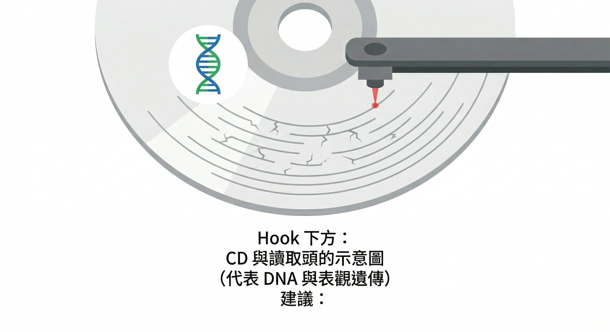
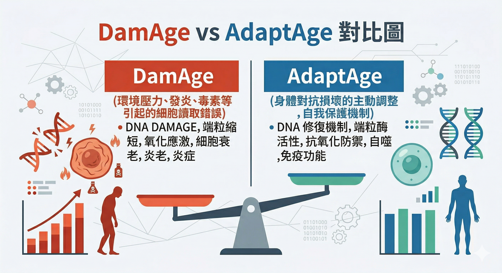
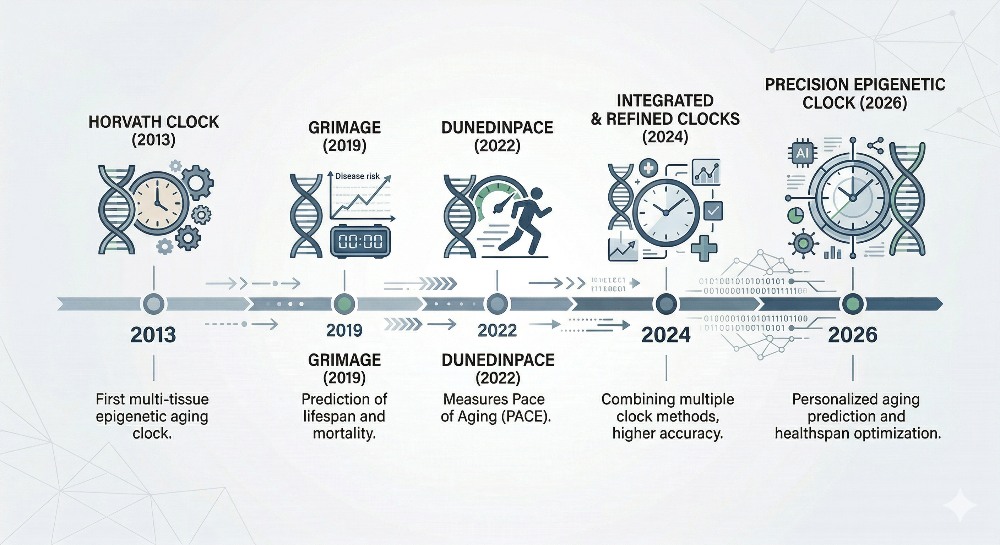
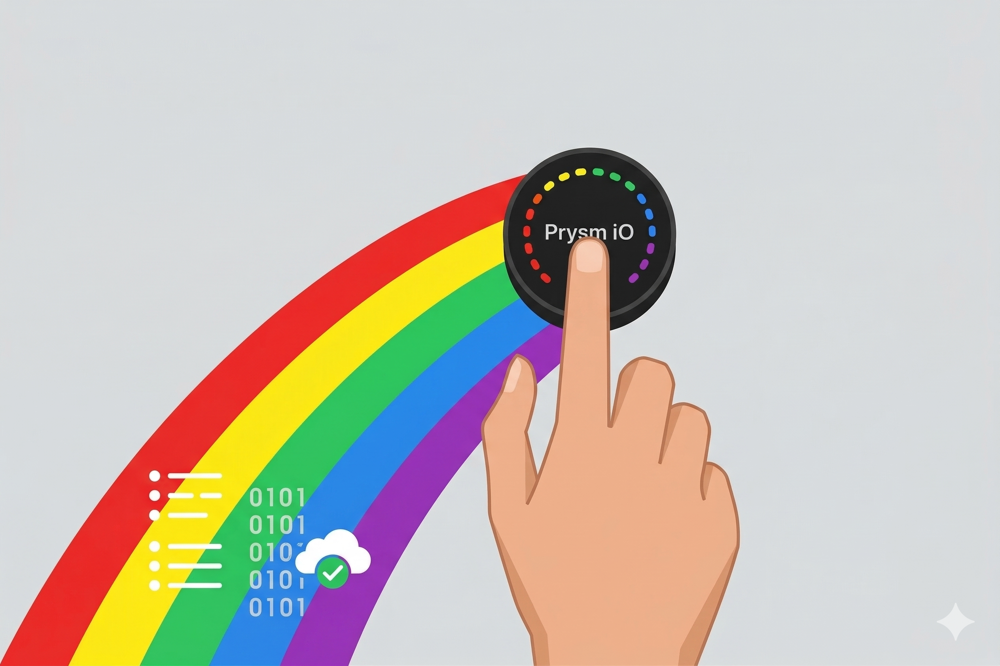

## 你有沒有想過：為什麼是你的同學老得比你快？

同樣四十幾歲，同一個年代長大，為什麼有人皮膚還緊，有人已經開始出現皺紋與白髮？

我們通常把這件事歸給「基因好不好」，但這個答案只對了一半。

科學家現在確認：真正決定你老化速度的，不是你的 DNA 寫了什麼，而是你的身體「讀對了多少」。

---

## 老化的真相：硬體沒壞，讀取頭出問題了

想像一下，你有一張完美錄製的 CD（這張 CD 就是你的 DNA）。

年輕的時候，讀取頭乾淨、穩定，每一個音符都播放得一清二楚——皮膚細胞就是皮膚細胞，免疫細胞就是免疫細胞，每個人各司其職。

但隨著時間累積，這個讀取頭上開始沾染了污漬與刮痕。

不是 CD 本身壞了，是讀取系統開始出錯了。

這就是「表觀遺傳失調」（Epigenetic Dysregulation），也就是說：**控制基因「要不要被讀取」的那層指令系統，開始產生混亂**。

2026 年哈佛大學 Vadim Gladyshev 教授在《Nature Reviews Molecular Cell Biology》的最新綜述中，正式將這個現象定名為老化的核心機制——不是某個器官壞了，而是全身細胞的 **「閱讀系統」** 在系統性地走樣。

---

## 這個發現，為什麼讓你有感？

你可能從沒想過，你今天感覺到的疲憊、皮膚的暗沉、記憶力稍微差了一點——這些不一定是「老化症狀」，而是細胞開始讀不懂自己的任務說明書。

更重要的是：如果問題是「讀錯了」，那有沒有辦法「重新讀一次」？

答案，科學家正在努力給出。

---

## 科學目前走到哪裡了？

### 2023 年：正式確認因果關係

哈佛大學 Yang 等人在 2023 年發表於《Cell》的研究，花費超過 13 年，終於完成了這個關鍵實驗。

研究團隊設計了一種叫做 ICE（可誘導性表觀遺傳變化）的小鼠模型，**在不改變任何 DNA 序列的前提下，單純擾亂表觀遺傳讀取系統，就成功讓小鼠加速老化**。

這是人類首次從實驗室層面確認：**老化的根本原因是表觀遺傳資訊的流失，而不是基因突變**。

更令人振奮的是，他們反過來操作——使用 OSK 重編程技術（也就是山中因子裡的三個關鍵蛋白），成功逆轉了部分生理衰退。

> 白話意思：這不只是在猜測老化可逆，而是在實驗室中真正實現了它。

### 2020 年：眼睛真的「重新看見了」

在此之前，2020 年發表於《Nature》的研究已經展示了最早的人體外概念驗證：

哈佛 David Sinclair 實驗室的研究人員，將 OSK 三個因子注射進患有青光眼的老鼠眼球，受損的視神經細胞竟然「重新讀取」了年輕狀態的 DNA 指令，老鼠的視力部分恢復。

同樣的做法，後來在非人類靈長類動物實驗中也成功複製。

 

### 2024 年：損壞 vs. 補償——不是所有老化都需要對抗

Gladyshev 團隊在 2024 年《Nature Aging》發表的研究，進一步細分了老化過程中的兩種變化：

**DamAge（真正的損壞）**：細胞讀取系統因為環境壓力、發炎、毒素等因素產生的錯誤，是真正需要修復的部分。

**AdaptAge（補償性適應）**：身體為了對抗這些損壞而主動做出的調整，本質上是一種自我保護。

這個區分非常重要：**如果抗老策略只是一味地「壓制老化跡象」，可能會同時干擾身體的自我修復能力**。

真正的精準抗老，是精準定位那些純粹的損壞，而不是全部清除。

### 2026 年：人類史上第一個「逆齡基因療法」進入臨床試驗

2026 年 2 月，Sinclair 在杜拜「世界政府峰會」的演講上說了一件讓現場安靜下來的事：

> 「我們即將在人類史上第一次測試——我們能不能逆轉老化、治癒疾病。」

他的實驗室數據是這樣的：**在動物模型中，使用改良版山中因子（OSK），可以在數週內將受損組織的生理功能逆轉高達 75%**。

更重要的是，他們在小鼠身上把同一雙眼睛的老化逆轉了兩次——小鼠最後是帶著完美視力死去的。

這代表什麼？**逆齡不是一次性的，像打疫苗一樣可以重複使用**。

就在演講前幾天（2026 年 1 月），美國 FDA 正式核准了 Sinclair 共同創辦的生技公司 Life Biosciences 的第一期人體臨床試驗申請。

試驗藥物代號 ER-100，第一階段鎖定兩種視神經疾病：

- **青光眼（Open-angle Glaucoma）**：眼壓導致的視神經損傷
- **眼中風（NAION）**：突發性視力喪失

第一階段目標是確認安全性與初步療效訊號。

下一步，是往腦部與其他器官延伸。

> 為什麼從眼睛開始？眼睛是獨立的小環境，基因注射精準，功能改善也容易量測。

這是一個務實的第一步，不是終點。

---

### 附：一個讓你重新想清楚「為什麼要抗老」的數字

Sinclair 在 WGS 演講中提到了一個讓很多人意外的數據：

**消除所有癌症，平均壽命只能延長 2.5 年**。

因為癌症治好了，心臟病、失智症、腎衰竭還是會來。

個別疾病都只是老化的「輸出結果」，老化本身才是根源。

這就是為什麼精準抗老的邏輯是「往上游走」：**不是等疾病出現再治，而是在細胞讀取系統開始出錯的時候，就知道它在往哪個方向走**。

---

## 「你的細胞記得你做過的每一件事」

這裡有一個讓很多人不舒服的事實。

2024 年，Liang 等人在《Aging and Disease》整理了過去十年「表觀遺傳鐘」（Epigenetic Clocks，也就是可以測量生物年齡的工具）的演進：

**第一代（2013）**：只能猜你的生理年齡，就像看你的外表估幾歲。

**第二代（2019 GrimAge）**：不只猜年齡，還能預測你未來幾年內死亡與罹患心血管疾病的風險。

**第三代（2022 DunedinPACE）**：直接測量你現在老化的「速度」，而不只是「程度」。

最重要的是，這些工具還能讀出一件事：**你過去的吸菸、長期睡眠不足、慢性發炎、高壓力工作，都會在 DNA 上留下「表觀遺傳傷痕」**（Epigenetic Scarring），即使你現在改變了生活方式，這些痕跡仍然看得到。

細胞不會忘記你對它做過什麼。

但這並不是在嚇你，而是在說：**如果你現在開始精準介入，時鐘也能往好的方向移動**。

這正是第二、三代時鐘存在的意義——不是判刑，是給你一個可以採取行動的坐標。

---

## 帶走這一句話

> 老化不是一個不可逆的終點，而是一個可以被讀取、被修正的資訊傳遞誤差。

你的 DNA 沒有壞掉。壞的，是讀取的品質。而讀取品質，是可以被測量的。

---

## 你現在的「老化速度」，你知道嗎？

表觀遺傳鐘現在還沒辦法在你家附近的診所輕鬆做到。

但有一件事可以做：

**從抗氧化狀態入手，了解你的細胞正在承受多少氧化壓力**——這是目前最接近生活實踐、最能反映你真實老化負擔的指標之一。

這不是問卷遊戲，是幫你找到第一個可以採取行動的起點。

---

## 延伸閱讀

- → [你的身體幾歲了？（衰老可以測量嗎？2026版）](/blog/precision-health-tools/biological-age-measurement/)
- → [你上一次知道自己身體真正的狀態，是什麼時候？Prysm-iO-15-秒揭開身體的抗氧化真相](/blog/precision-health-tools/prysm-io-15sec/)

---

## 參考資料

1. Yücel, A. D., & Gladyshev, V. N. (2026). [Systemic epigenetic dysregulation as a driver of ageing and a therapeutic target.](https://pubmed.ncbi.nlm.nih.gov/41896334/) *Nature Reviews Molecular Cell Biology*. — 最新機制綜述
2. Yang, J.-H., et al. (2023). [Loss of Epigenetic Information as a cause of mammalian aging.](https://pubmed.ncbi.nlm.nih.gov/36638792/) *Cell*, 186(2), 305–326. — 因果關係確認的核心論文
3. Lu, Y., et al. (2020). [Reprogramming to recover youthful epigenetic information and restore vision.](https://pubmed.ncbi.nlm.nih.gov/33268865/) *Nature*, 588, 124–129. — OSK 逆轉視力的原始實驗
4. Ying, K., Gladyshev, V. N., et al. (2024). [Causality-enriched epigenetic age uncouples damage and adaptation.](https://pubmed.ncbi.nlm.nih.gov/38243142/) *Nature Aging*. — DamAge vs. AdaptAge 區分框架
5. Liang, R., et al. (2024). [Epigenetic Clocks: Beyond Biological Age, Using the Past to Predict the Present and Future.](https://pubmed.ncbi.nlm.nih.gov/39751861/) *Aging and Disease*, 16(6), 3520–3545. — 表觀遺傳鐘演進與預測能力
6. MIT Technology Review (2026, January 27). [The first human test of a rejuvenation method will begin "shortly".](https://www.technologyreview.com/2026/01/27/1131796/the-first-human-test-of-a-rejuvenation-method-will-begin-shortly/) — Life Biosciences FDA IND 核准報導
7. [WGS 2026 - The Science of Living Longer and Better](https://www.youtube.com/watch?v=BVkcjSqIVzU&t=694s) — 75% 動物模型數據、2.5 年癌症數字、38 兆美元經濟數據來源
