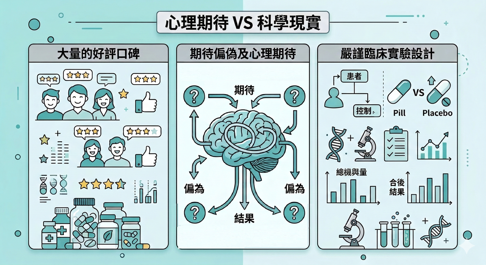

你一定聽過類似這樣的話：

「我告訴你，我家那個吃了這罐，本來站都站不起來，你看現在生龍活虎的，都不用看醫生了！」

「這個幹細胞產品塗在眼皮上，三十分鐘吸收後視力會變好！」

你聽到這些話的時候，理智上知道有問題。

但你還是會有一瞬間——半信半疑。

這不是你不夠聰明。這是因為這些話術在利用一個你對保健品根本性的錯誤期待。

---

## 問題從這裡開始：你希望它像藥

保健品在法規上的定義很清楚： **不以治療疾病為目的，不能宣稱對疾病有治療或預防作用。**

它是食品，不是藥。

但你在買保健品的時候，心裡期待的往往是藥的效果——吞下去之後問題很快消失、有可以感受到的明確改變、有吃有差、沒吃沒差。

這個期待，從一開始就設錯了。

話術利用的正是這個落差——它用「站都站不起來，現在生龍活虎」的描述，讓你的大腦把保健品和「立即、明顯、戲劇性的改變」連結在一起。你知道這說法誇張，但它觸碰到了你希望這是真的那個部分。

所以你還是半信半疑。

---

## 六種常見話術，和它們在做什麼

**話術一：「我親眼看到的」**

「我家那個」「我朋友」「我自己」——用第一人稱的見證建立真實感。

問題：個案不是數據。一個人的改善，可能來自科學上所說的「安慰劑效應」。

在嚴格設計的雙盲隨機對照試驗中，安慰劑組有時候會回報 30% - 40% 的主觀改善——他們不是在說謊，他們真的感覺更好了，但改善來自「相信自己在被治療」的心理效應。

這麼嚴格的實驗會有可能 **甚麼都沒打進身體就有效了**，一個人的改善可能來自同期間其他的生活改變、本來就會自然恢復。

沒有對照組，你無法判斷是產品的功效還是時間的功效。

「大家都說有效」和「有人體臨床試驗支持有效」是完全不同的兩件事。

**話術二：「天然萃取，所以更好吸收、更安全」**

這個說法把兩件事混在一起了： **來源**和 **效果**。

> **天然來源不等於高吸收率。**

維生素C的天然來源（如針葉櫻桃萃取）和人工合成的抗壞血酸，在人體吸收率上幾乎沒有差異——多項研究反覆確認了這件事。

> **天然來源也不等於安全。**

馬錢子鹼（Strychnine）、烏頭鹼（Aconitine）都是天然的，但都有毒性。

真正決定一個成分效果的，是它的 **生物利用率（Bioavailability）**——吃進去之後，有多少比例實際進入血液並抵達目標組織。

這個數字和「天然」或「人工合成」的關係，遠不如劑型、配方、服用時機來得重要。

**話術三：「有 SGS 檢驗報告，品質有保障」**

SGS 是全球知名的第三方檢測機構，它的報告是真實的——這裡沒有造假的問題。

問題在於： **SGS 報告只能告訴你「裡面有什麼、有沒有污染」，不能告訴你「這個東西對你有沒有效」。**

SGS 檢驗的是重金屬含量、農藥殘留、標示成分是否與實際相符。

它無法告訴你：這個劑量是否足夠產生生理效果、這個成分是否有人體臨床試驗支持、這個配方的成分之間是否有協同或拮抗關係。

一個重金屬不超標、農藥不殘留的產品，可以同時是一個完全沒有科學效果的產品。

真正的品質問題不在檢驗報告，在 **配方設計的科學依據**。

→ SGS報告的完整分析看這篇：[提出 SGS 檢驗報告合格就能代表販售商品有效嗎？](/blog/precision-health-tools/sgs-report-vs-efficacy/)

**話術四：「成分越多，效果越全面」**

把十幾種成分列出來，每一種旁邊都標注功效——消費者覺得「一瓶搞定所有問題」。

但成分堆疊有幾個真實的問題：**吸收競爭**（多種脂溶性成分在腸道競爭吸收載體，鈣和鐵同時服用會互相抑制吸收）、**達峰時間不同**（有些2小時、有些8小時，一起吃的協同窗口可能非常短）、**劑量稀釋**（十種成分塞進兩顆膠囊，每種的實際劑量可能遠低於臨床有效劑量）。

有效的複方配方，設計邏輯是**協同作用**——確認成分之間能互相加成、吸收不互相干擾、達峰時間能對齊。這需要大量配方研究，不是把成分清單加長就能做到的。

**話術五：「研究顯示有效」**

「研究顯示」是保健品行銷裡最被濫用的四個字。

引用一篇研究之前，有幾個問題值得問：

- 是動物實驗還是人體試驗（小鼠有效的成分，人體試驗失敗的比例非常高）？

- 樣本數是多少（10 人和 1000 人的說服力完全不同）？

- 是相關性還是因果性（「吃X的人比較健康」不代表「吃X讓人更健康」）？

- 有沒有被多個獨立實驗室重複驗證？

好的成分應該有：多個獨立研究機構的人體臨床試驗、有對照組和盲法設計、在同行評審期刊發表、劑量和你實際補充的相符。

**話術六：「醫生都說好」**

借用醫療權威的光環——「某某博士認證」「連醫生都推薦」。

問題：

- 哪一個醫生？

- 在什麼情況下說的？

- 基於哪個研究？

一個人的頭銜不等於他說的話有臨床依據。個人意見和系統性的科學證據，是兩件不同的事。

**話術七：「本產品通過 FDA 認證」**

FDA根本不認證保健品，也不在產品上市前審查或檢驗保健品。

保健品在美國法規下是「食品」，廠商不需要FDA批准就可以上市。

FDA 扮演的是事後監管的角色——有問題才介入、罰款、下架。

「通過 FDA 認證」這句話在台灣被嚴重濫用，你以為的意思和廠商說的意思，往往不是同一件事。

→ 完整解析看這篇：[「本產品通過FDA認證」和你以為的FDA認證根本不一樣](/blog/precision-health-tools/fda-certification-myth/)

---

##上面這些話術，有多普遍？一個數字說明

上面七種話術，可能讓你覺得「這些是邊緣廠商才會做的事」。不是的。

ChromaDex 公司在 2021 年對 Amazon 上銷量最高的 22 個 NMN 品牌進行成分檢測：

* 僅 14% 的產品 NMN 含量符合或超過標籤標示
* 23% 的產品含量略低於標示（標示量的 88–99%）
* 64% 的產品 NMN 含量低於檢測下限——也就是幾乎不含 NMN

NMN 是近年來研究最活躍、市場最熱門的抗衰老成分之一，在全球最大的電商平台上，賣最好的品牌裡有三分之二的產品幾乎不含它標榜的成分。

這不是一個邊緣問題。這是行業現況。

「有賣、有標示、有包裝」和「裡面真的有那個成分、劑量夠、能被吸收」——這之間的距離，比大多數人以為的要大得多。

---

## 「它那麼小顆，但你的問題跟山一樣大」

保健品是食品，它的作用機制是 **持續、累積、緩慢的**。

它不是在「治療」你的問題，而是在支援你的細胞維持正常運作，讓你的身體有更好的基礎去執行它本來就有能力做的修復工作。

用愚公移山的邏輯來想：你的細胞問題是一座山，保健品是一把鏟子。

但很多人的期待是：吃了保健品就坐著等山自己垮。

然後山沒有垮，就說鏟子沒用，問題不在鏟子。

> **問題在你以為鏟子能代替你去挖穿整座山。**

---

## 那什麼樣的改善，是真實的信號？

既然改善是緩慢累積的，你怎麼知道有沒有效？ **主觀感受不可靠**——因為有安慰劑效應，因為你的期待會影響你的感受。

> **可量化的指標才是依據。**

- 睡眠品質可以量——入睡時間、夜間清醒次數、早上的清醒感，這些可以用固定問卷或穿戴裝置追蹤。

- 抗氧化狀態可以量——Prysm iO 掃描的皮膚類胡蘿蔔素分數，是目前消費者可以取得的少數非侵入性細胞健康指標之一。

- 體力恢復速度可以量——同樣的運動量，幾天恢復到正常狀態，這是可以記錄的數字。

有基準值、有追蹤、有比較，你才能判斷一個東西有沒有在做事。

只是「感覺好像有差」或「感覺好像沒差」——這個判斷沒有意義。

---

## 你需要的不是更多選擇，是更好的問題

大多數人在選保健品的時候，問的是「這個有沒有效？」

而不是 **「這個成分有沒有人體雙盲試驗？劑量夠不夠？配方設計有沒有考慮協同效應和吸收競爭？」**

前一個問題，話術可以回答。

後一個問題，話術無法回答。

學會問後一個問題，是讓你的保健品投資開始產生真實效果的第一步。

---

你現在在補的東西，問題問對了嗎？

如果你想把目前的補充清單拿出來檢視——哪些有依據、哪些可以停、哪些可以調整——

**加我 LINE，告訴我你在補什麼，我給你具體的看法。**

👉 [加LINE諮詢](https://line.me/ti/p/@fer7932k)

---

**延伸閱讀：**
- [同樣的成分，有人吸收80%，有人吸收5%——差在哪裡](/blog/precision-health-tools/supplement-bioavailability-gap/) ← 第4篇
- [提出 SGS 檢驗報告合格就能代表販售商品的品質嗎？](/blog/precision-health-tools/sgs-report-vs-efficacy/) ← 第5篇
- [不節食也能啟動長壽基因？CRM 的概念和 DNA 微陣列技術](/blog/chronic-inflammation/caloric-restriction-mimetics-science/) ← C篇
